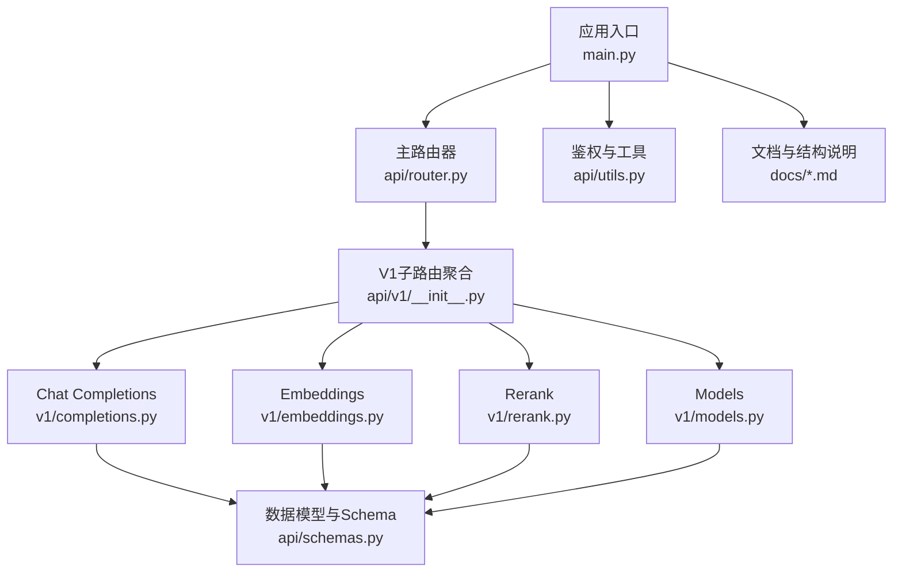
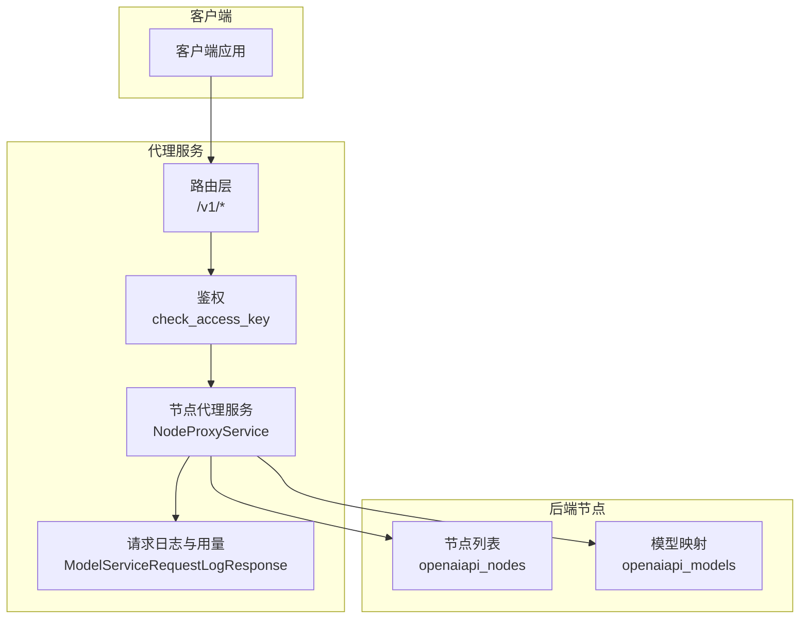
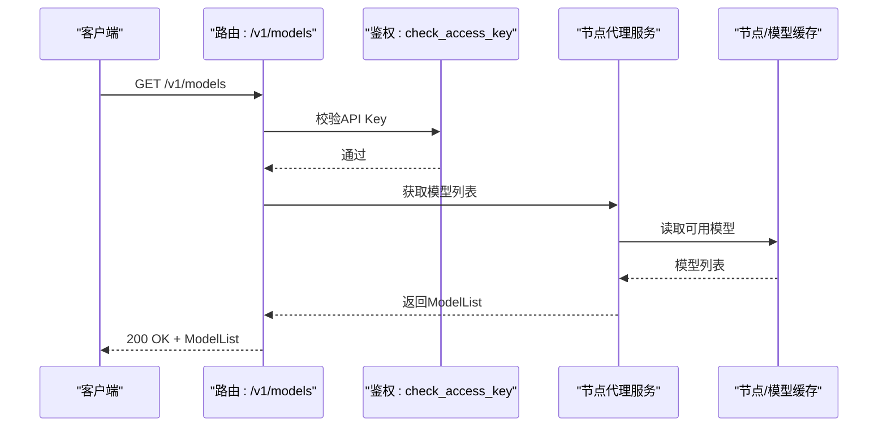
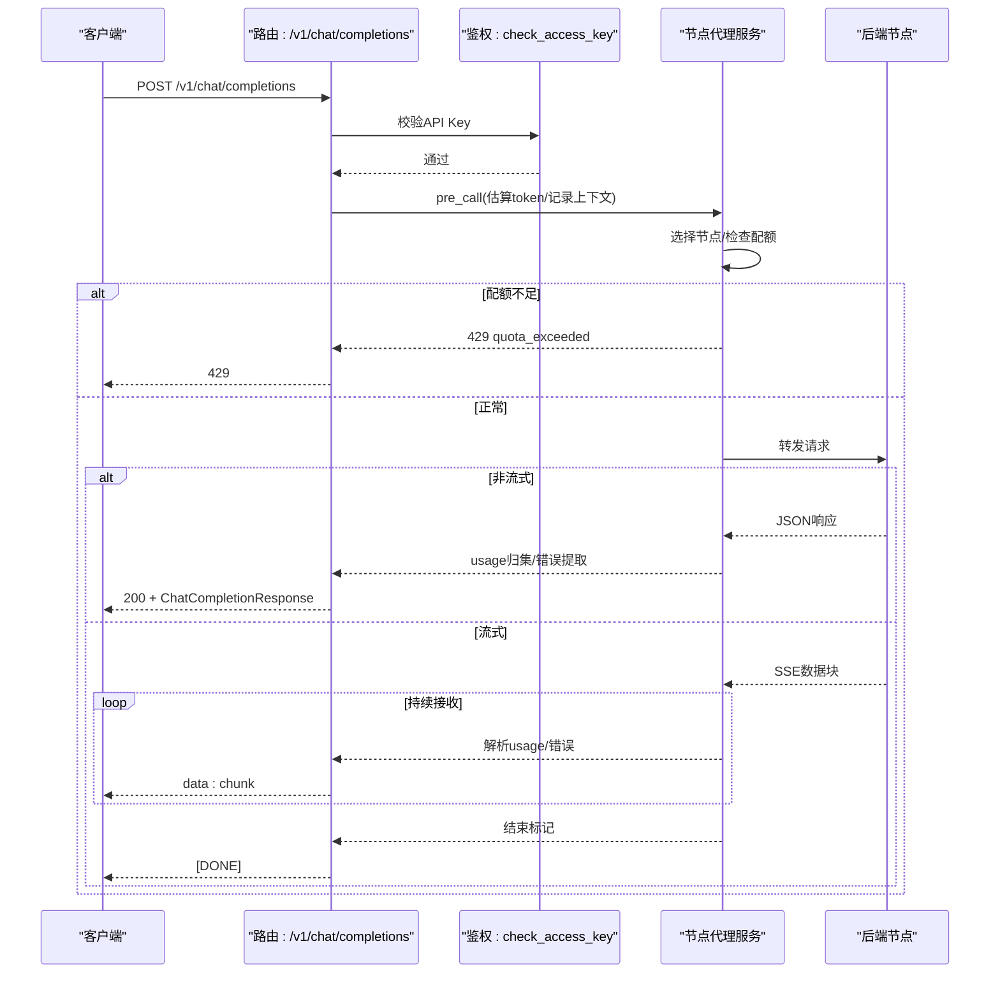
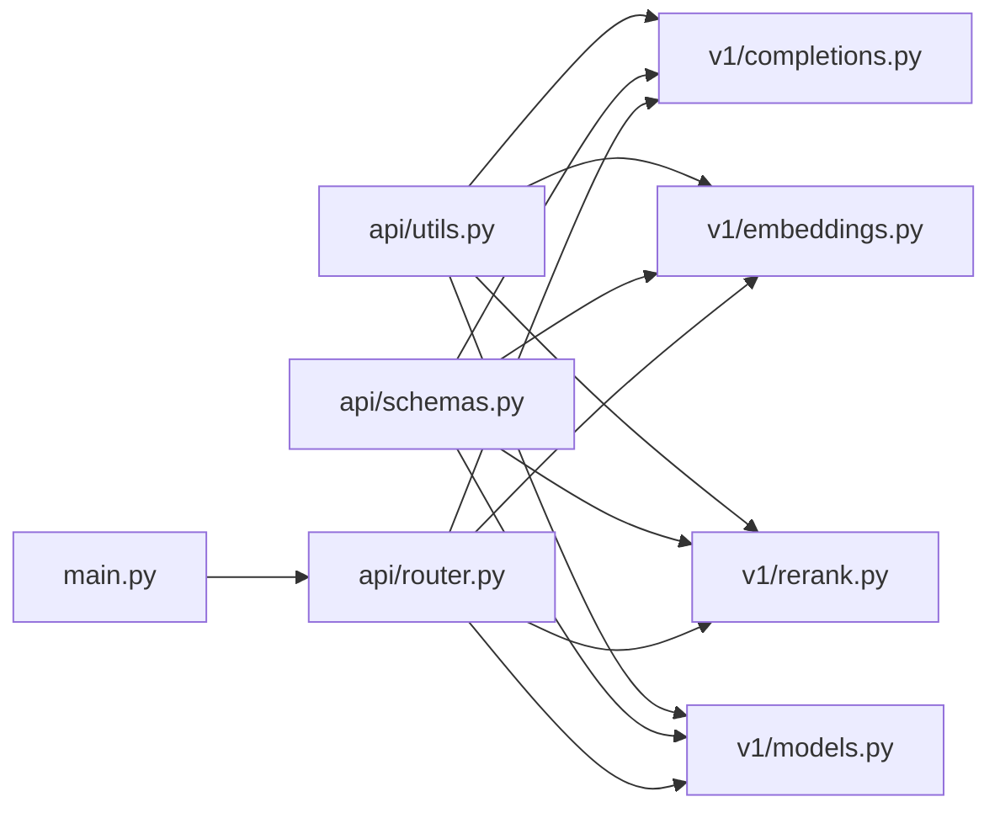

# API参考文档

<cite>
**本文档引用的文件**
- [src/apiproxy/openaiproxy/main.py](file://src/apiproxy/openaiproxy/main.py)
- [src/apiproxy/openaiproxy/api/router.py](file://src/apiproxy/openaiproxy/api/router.py)
- [src/apiproxy/openaiproxy/api/v1/__init__.py](file://src/apiproxy/openaiproxy/api/v1/__init__.py)
- [src/apiproxy/openaiproxy/api/v1/completions.py](file://src/apiproxy/openaiproxy/api/v1/completions.py)
- [src/apiproxy/openaiproxy/api/v1/embeddings.py](file://src/apiproxy/openaiproxy/api/v1/embeddings.py)
- [src/apiproxy/openaiproxy/api/v1/rerank.py](file://src/apiproxy/openaiproxy/api/v1/rerank.py)
- [src/apiproxy/openaiproxy/api/v1/models.py](file://src/apiproxy/openaiproxy/api/v1/models.py)
- [src/apiproxy/openaiproxy/api/schemas.py](file://src/apiproxy/openaiproxy/api/schemas.py)
- [src/apiproxy/openaiproxy/api/utils.py](file://src/apiproxy/openaiproxy/api/utils.py)
- [docs/api.md](file://docs/api.md)
- [docs/schemas.md](file://docs/schemas.md)
- [README.md](file://README.md)
</cite>

## 目录
1. [简介](#简介)
2. [项目结构](#项目结构)
3. [核心组件](#核心组件)
4. [架构总览](#架构总览)
5. [详细组件分析](#详细组件分析)
6. [依赖分析](#依赖分析)
7. [性能考虑](#性能考虑)
8. [故障排查指南](#故障排查指南)
9. [结论](#结论)
10. [附录](#附录)

## 简介
本项目是一个OpenAI兼容的大模型接口代理服务，提供统一的API入口以访问多种后端模型服务。系统支持以下公开API端点：
- 模型列表查询：GET /v1/models
- Chat Completions：POST /v1/chat/completions
- Completions（文本补全）：POST /v1/completions
- Embeddings（向量生成）：POST /v1/embeddings
- Rerank（重排序）：POST /v1/rerank

系统采用FastAPI框架构建，具备完善的鉴权机制、配额控制、请求日志与统计、以及可扩展的节点代理能力。

**章节来源**
- [README.md:1-55](file://README.md#L1-L55)
- [docs/api.md:1-112](file://docs/api.md#L1-L112)

## 项目结构
系统主要由以下模块组成：
- 应用入口与生命周期管理：main.py
- 路由聚合：api/router.py、api/v1/__init__.py
- OpenAI兼容API实现：v1/completions.py、v1/embeddings.py、v1/rerank.py、v1/models.py
- 数据模型与请求/响应结构：api/schemas.py
- 鉴权与工具：api/utils.py
- 文档与数据库结构说明：docs/api.md、docs/schemas.md

**图表来源**
- [src/apiproxy/openaiproxy/main.py:128-187](file://src/apiproxy/openaiproxy/main.py#L128-L187)
- [src/apiproxy/openaiproxy/api/router.py:37-45](file://src/apiproxy/openaiproxy/api/router.py#L37-L45)
- [src/apiproxy/openaiproxy/api/v1/__init__.py:27-37](file://src/apiproxy/openaiproxy/api/v1/__init__.py#L27-L37)

**章节来源**
- [src/apiproxy/openaiproxy/main.py:128-187](file://src/apiproxy/openaiproxy/main.py#L128-L187)
- [src/apiproxy/openaiproxy/api/router.py:27-45](file://src/apiproxy/openaiproxy/api/router.py#L27-L45)
- [src/apiproxy/openaiproxy/api/v1/__init__.py:27-37](file://src/apiproxy/openaiproxy/api/v1/__init__.py#L27-L37)

## 核心组件
- 应用入口与生命周期：负责初始化服务、定时任务调度、CORS配置、路由注册与优雅停机。
- 路由器：将/v1子路径下的各端点路由到对应模块。
- API实现模块：封装请求解析、配额检查、节点选择、转发与回写、流式处理与错误映射。
- 数据模型：定义请求/响应结构、权限卡、用量信息、流式选项等。
- 鉴权模块：支持静态管理密钥与动态应用API Key两种鉴权方式。

**章节来源**
- [src/apiproxy/openaiproxy/main.py:57-126](file://src/apiproxy/openaiproxy/main.py#L57-L126)
- [src/apiproxy/openaiproxy/api/router.py:37-45](file://src/apiproxy/openaiproxy/api/router.py#L37-L45)
- [src/apiproxy/openaiproxy/api/schemas.py:157-282](file://src/apiproxy/openaiproxy/api/schemas.py#L157-L282)
- [src/apiproxy/openaiproxy/api/utils.py:82-216](file://src/apiproxy/openaiproxy/api/utils.py#L82-L216)

## 架构总览
系统采用“代理+配额+日志”的架构，客户端通过统一入口访问后端节点，系统根据策略选择最优节点并进行请求转发，同时记录用量与错误信息。

**图表来源**
- [src/apiproxy/openaiproxy/main.py:165-182](file://src/apiproxy/openaiproxy/main.py#L165-L182)
- [src/apiproxy/openaiproxy/api/utils.py:120-216](file://src/apiproxy/openaiproxy/api/utils.py#L120-L216)
- [docs/schemas.md:24-57](file://docs/schemas.md#L24-L57)

## 详细组件分析

### 模型列表查询 /v1/models
- 方法与路径
  - GET /v1/models
- 功能说明
  - 返回当前代理可用的模型列表，每个模型包含ID、拥有者、权限等信息。
- 认证方式
  - 应用API Key：check_access_key
- 请求参数
  - 无
- 响应结构
  - 返回ModelList对象，包含多个ModelCard
- 错误处理
  - 未提供有效API Key时返回401
  - 服务内部异常返回5xx
- 性能与调试
  - 该端点不涉及后端节点调用，仅从内存中聚合模型列表，性能开销极低

**图表来源**
- [src/apiproxy/openaiproxy/api/v1/models.py:38-55](file://src/apiproxy/openaiproxy/api/v1/models.py#L38-L55)
- [src/apiproxy/openaiproxy/api/utils.py:120-216](file://src/apiproxy/openaiproxy/api/utils.py#L120-L216)

**章节来源**
- [src/apiproxy/openaiproxy/api/v1/models.py:38-55](file://src/apiproxy/openaiproxy/api/v1/models.py#L38-L55)
- [docs/api.md:10-16](file://docs/api.md#L10-L16)

### Chat Completions /v1/chat/completions
- 方法与路径
  - POST /v1/chat/completions
- 功能说明
  - 支持聊天对话生成，可选流式输出；支持工具调用、响应格式化、logprobs等。
- 认证方式
  - 应用API Key：check_access_key
- 请求体结构（节选）
  - model: 字符串，目标模型名称
  - messages: 字符串或消息数组（OpenAI格式）
  - temperature: 浮点数，默认0.7
  - top_p: 浮点数，默认1.0
  - tools: 工具列表（函数调用）
  - tool_choice: 工具选择策略
  - logprobs: 是否返回logprobs
  - top_logprobs: 返回的候选数量
  - n: 生成备份数（当前实现仅支持1）
  - max_tokens: 输出最大token数
  - stop: 停止词
  - stream: 是否流式输出
  - stream_options: 流式选项（如include_usage）
  - presence_penalty: 存在惩罚（替换为repetition_penalty）
  - frequency_penalty: 频率惩罚（替换为repetition_penalty）
  - user: 用户标识
  - response_format: 响应格式（text/json_object/json_schema/regex_schema）
  - 其他代理增强参数：repetition_penalty、session_id、ignore_eos、skip_special_tokens、spaces_between_special_tokens、top_k、seed、min_new_tokens、min_p
- 响应结构
  - 非流式：ChatCompletionResponse
  - 流式：ChatCompletionStreamResponse（SSE格式）
- 错误处理
  - 配额不足：429 Too Many Requests（quota_exceeded）
  - 北向配额处理失败：503 Service Unavailable
  - 后端错误映射：根据后端错误码映射为相应HTTP状态码（如504/503）
  - 客户端断开：记录abort=true并清理资源
- 性能与调试
  - 使用tiktoken估算token数，避免超限
  - 流式传输时逐块解析usage并累计token
  - 支持include_usage以在流末尾返回usage信息

**图表来源**
- [src/apiproxy/openaiproxy/api/v1/completions.py:450-691](file://src/apiproxy/openaiproxy/api/v1/completions.py#L450-L691)
- [src/apiproxy/openaiproxy/api/schemas.py:157-282](file://src/apiproxy/openaiproxy/api/schemas.py#L157-L282)

**章节来源**
- [src/apiproxy/openaiproxy/api/v1/completions.py:450-691](file://src/apiproxy/openaiproxy/api/v1/completions.py#L450-L691)
- [src/apiproxy/openaiproxy/api/schemas.py:157-282](file://src/apiproxy/openaiproxy/api/schemas.py#L157-L282)
- [docs/api.md:10-16](file://docs/api.md#L10-L16)

### Completions /v1/completions
- 方法与路径
  - POST /v1/completions
- 功能说明
  - 文本补全接口，支持流式输出与部分增强参数。
- 认证方式
  - 应用API Key：check_access_key
- 请求体结构（节选）
  - model: 目标模型
  - prompt: 输入提示
  - suffix: 附加内容
  - temperature/top_p/n/max_tokens等
  - stop/stream/stream_options
  - presence_penalty/frequency_penalty（替换为repetition_penalty）
  - user
  - 代理增强参数：repetition_penalty、session_id、ignore_eos、skip_special_tokens、spaces_between_special_tokens、top_k、seed
- 响应结构
  - 非流式：CompletionResponse
  - 流式：CompletionStreamResponse（SSE格式）
- 错误处理
  - 与Chat Completions类似，配额不足返回429，北向处理失败返回503

**章节来源**
- [src/apiproxy/openaiproxy/api/v1/completions.py:693-910](file://src/apiproxy/openaiproxy/api/v1/completions.py#L693-L910)
- [src/apiproxy/openaiproxy/api/schemas.py:284-351](file://src/apiproxy/openaiproxy/api/schemas.py#L284-L351)
- [docs/api.md:10-16](file://docs/api.md#L10-L16)

### Embeddings /v1/embeddings
- 方法与路径
  - POST /v1/embeddings
- 功能说明
  - 向量生成接口，支持单个或批量输入。
- 认证方式
  - 应用API Key：check_access_key
- 请求体结构（节选）
  - model: 目标模型
  - input: 字符串或字符串数组
  - user: 用户标识
- 响应结构
  - EmbeddingsResponse，包含对象类型、数据数组、模型名与usage
- 错误处理
  - 配额不足：429；北向处理失败：503；后端响应解析失败：抛出异常并记录错误

**章节来源**
- [src/apiproxy/openaiproxy/api/v1/embeddings.py:274-357](file://src/apiproxy/openaiproxy/api/v1/embeddings.py#L274-L357)
- [src/apiproxy/openaiproxy/api/schemas.py:353-366](file://src/apiproxy/openaiproxy/api/schemas.py#L353-L366)
- [docs/api.md:10-16](file://docs/api.md#L10-L16)

### Rerank /v1/rerank
- 方法与路径
  - POST /v1/rerank
- 功能说明
  - 文档重排序接口，支持查询与文档列表。
- 认证方式
  - 应用API Key：check_access_key
- 请求体结构（节选）
  - model: 目标模型
  - query: 查询字符串或数组
  - documents: 文档数组（可选）
  - user: 用户标识
- 响应结构
  - JSON响应（由后端节点决定），系统记录usage并回传
- 错误处理
  - 与Embeddings类似，包含配额与后端错误处理

**章节来源**
- [src/apiproxy/openaiproxy/api/v1/rerank.py:282-369](file://src/apiproxy/openaiproxy/api/v1/rerank.py#L282-L369)
- [src/apiproxy/openaiproxy/api/schemas.py:368-380](file://src/apiproxy/openaiproxy/api/schemas.py#L368-L380)
- [docs/api.md:10-16](file://docs/api.md#L10-L16)

## 依赖分析
- 组件耦合
  - 路由层对各API模块松耦合，通过include_router聚合
  - API模块依赖NodeProxyService进行节点选择与转发
  - 鉴权模块统一处理应用API Key校验
- 外部依赖
  - FastAPI、SQLModel、APScheduler、tiktoken（可选）
- 潜在循环依赖
  - 当前结构清晰，未发现循环导入

**图表来源**
- [src/apiproxy/openaiproxy/api/router.py:37-45](file://src/apiproxy/openaiproxy/api/router.py#L37-L45)
- [src/apiproxy/openaiproxy/api/v1/__init__.py:27-37](file://src/apiproxy/openaiproxy/api/v1/__init__.py#L27-L37)
- [src/apiproxy/openaiproxy/api/utils.py:120-216](file://src/apiproxy/openaiproxy/api/utils.py#L120-L216)

**章节来源**
- [src/apiproxy/openaiproxy/api/router.py:37-45](file://src/apiproxy/openaiproxy/api/router.py#L37-L45)
- [src/apiproxy/openaiproxy/api/v1/__init__.py:27-37](file://src/apiproxy/openaiproxy/api/v1/__init__.py#L27-L37)

## 性能考虑
- Token估算
  - 使用tiktoken估算prompt与completion token数，若未安装tiktoken则采用启发式估算
- 流式传输
  - 流式输出逐块解析usage并累计，减少首字节延迟影响
- 节点选择
  - 通过代理策略选择最优节点，降低延迟
- 定时任务
  - 定期清理运行时状态、失败日志与过期日志，避免内存泄漏
- 并发与资源
  - 通过环境变量设置workers与端口，合理分配CPU资源

**章节来源**
- [src/apiproxy/openaiproxy/api/v1/completions.py:111-166](file://src/apiproxy/openaiproxy/api/v1/completions.py#L111-L166)
- [src/apiproxy/openaiproxy/main.py:57-126](file://src/apiproxy/openaiproxy/main.py#L57-L126)

## 故障排查指南
- 鉴权相关
  - 401 invalid_api_key：未提供或无效API Key
  - 401 expired_api_key：API Key已过期
  - 503 management_api_key_not_configured：管理接口未配置管理密钥
- 配额相关
  - 429 quota_exceeded：节点/应用/API Key配额不足
  - 503 service_unavailable_error：北向配额处理失败
- 后端错误
  - 504 Gateway Timeout：后端服务超时
  - 503 Service Unavailable：后端服务不可用
- 日志与诊断
  - 请求日志包含start_at、first_response_at、end_at、latency、request_tokens、response_tokens、error、error_message、error_stack等字段，便于定位问题
  - 可通过分页查询请求日志接口获取历史记录

**章节来源**
- [src/apiproxy/openaiproxy/api/utils.py:53-114](file://src/apiproxy/openaiproxy/api/utils.py#L53-L114)
- [src/apiproxy/openaiproxy/api/v1/completions.py:352-361](file://src/apiproxy/openaiproxy/api/v1/completions.py#L352-L361)
- [docs/api.md:57-68](file://docs/api.md#L57-L68)

## 结论
本项目提供了完整的OpenAI兼容API代理能力，覆盖模型查询、聊天生成、文本补全、向量生成与重排序等核心场景。通过统一的鉴权、配额与日志体系，能够满足生产环境的稳定性与可观测性需求。建议在生产环境中结合定时任务与监控告警，持续优化节点策略与资源分配。

## 附录

### 认证方法与环境变量
- 认证方式
  - 管理接口：check_api_key（静态管理密钥）
  - OpenAI兼容接口：check_access_key（应用API Key）
- 环境变量
  - TZ、APIPROXY_PORT、APIPROXY_STRATEGY、APIPROXY_APIKEY、APIPROXY_DATABASE_URL等

**章节来源**
- [docs/api.md:3-7](file://docs/api.md#L3-L7)
- [README.md:25-31](file://README.md#L25-L31)

### 数据模型与Schema要点
- 请求/响应模型
  - ChatCompletionRequest/Response、CompletionRequest/Response、EmbeddingsRequest/Response、RerankRequest
  - UsageInfo、ModelCard、ModelList、StreamOptions、ResponseFormat等
- 日志与配额
  - ModelServiceRequestLogResponse、NodeModelQuotaResponse、ApiKeyQuotaResponse、AppQuotaResponse等

**章节来源**
- [src/apiproxy/openaiproxy/api/schemas.py:157-800](file://src/apiproxy/openaiproxy/api/schemas.py#L157-L800)
- [docs/schemas.md:1-125](file://docs/schemas.md#L1-L125)