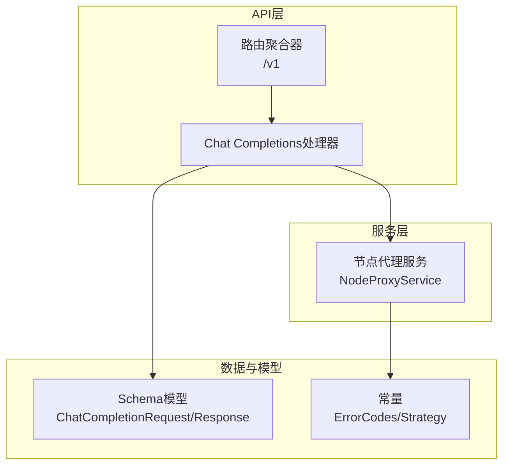
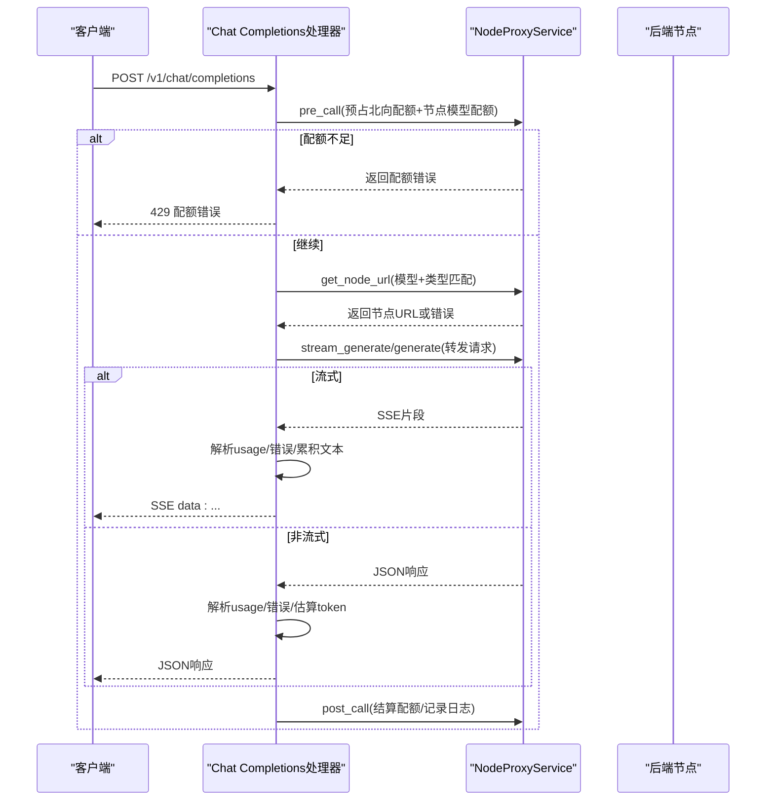
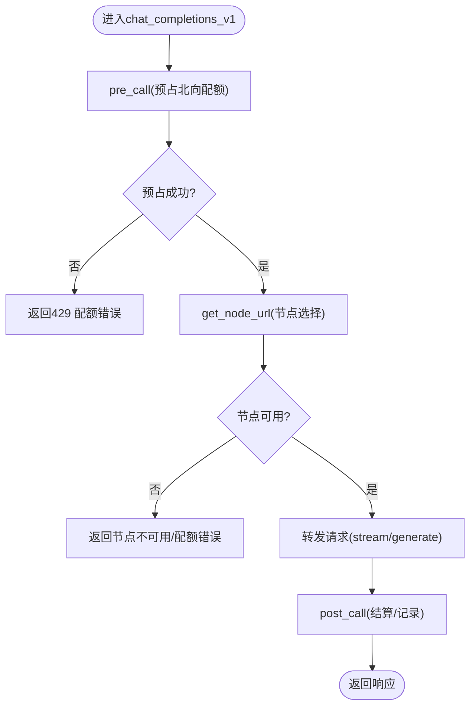
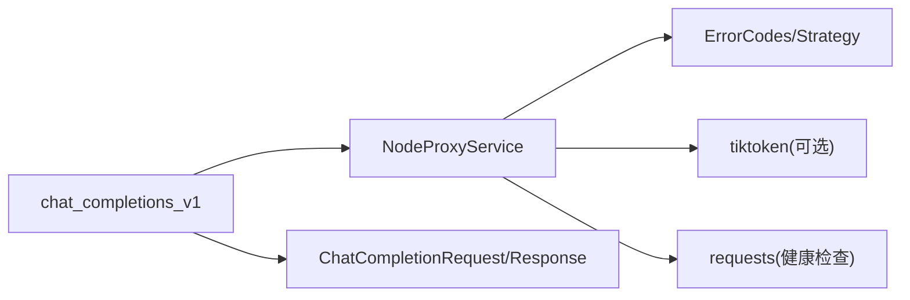

# Chat Completions接口

<cite>
**本文引用的文件**
- [completions.py](file://src/apiproxy/openaiproxy/api/v1/completions.py)
- [schemas.py](file://src/apiproxy/openaiproxy/api/schemas.py)
- [router.py](file://src/apiproxy/openaiproxy/api/router.py)
- [service.py](file://src/apiproxy/openaiproxy/services/nodeproxy/service.py)
- [constants.py](file://src/apiproxy/openaiproxy/services/nodeproxy/constants.py)
- [api.md](file://docs/api.md)
- [test_completions_responses.py](file://src/apiproxy/tests/api/test_completions_responses.py)
</cite>

## 目录
1. [简介](#简介)
2. [项目结构](#项目结构)
3. [核心组件](#核心组件)
4. [架构总览](#架构总览)
5. [详细组件分析](#详细组件分析)
6. [依赖分析](#依赖分析)
7. [性能考量](#性能考量)
8. [故障排查指南](#故障排查指南)
9. [结论](#结论)
10. [附录](#附录)

## 简介
本文件面向Chat Completions接口（POST /v1/chat/completions）提供完整的API规范与实现解析，涵盖请求参数schema、响应格式、OpenAI兼容消息格式、流式与非流式响应、token估算机制、配额检查流程、错误处理策略，并给出curl与Python SDK调用示例及与标准OpenAI API的兼容性与差异点说明。

## 项目结构
该接口位于OpenAI兼容API模块中，路由挂载在/v1前缀下，由FastAPI路由聚合器统一暴露。核心实现位于completions.py，请求与响应的Pydantic模型定义在schemas.py，节点代理服务负责配额校验、节点选择与转发，常量定义在constants.py。

图表来源
- [router.py:37-45](file://src/apiproxy/openaiproxy/api/router.py#L37-L45)
- [completions.py:447-456](file://src/apiproxy/openaiproxy/api/v1/completions.py#L447-L456)
- [schemas.py:157-195](file://src/apiproxy/openaiproxy/api/schemas.py#L157-L195)
- [service.py:214-281](file://src/apiproxy/openaiproxy/services/nodeproxy/service.py#L214-L281)
- [constants.py:55-68](file://src/apiproxy/openaiproxy/services/nodeproxy/constants.py#L55-L68)

章节来源
- [router.py:37-45](file://src/apiproxy/openaiproxy/api/router.py#L37-L45)
- [api.md:8-16](file://docs/api.md#L8-L16)

## 核心组件
- 路由与入口
  - /v1/chat/completions由FastAPI路由注册，使用依赖注入获取NodeProxyService与访问密钥上下文。
- 请求与响应模型
  - ChatCompletionRequest：定义请求参数schema；ChatCompletionResponse/Stream响应模型定义了标准响应字段。
- 节点代理服务
  - 负责模型可用性校验、节点选择、配额预占与结算、请求转发、流式数据拼接与usage统计。
- 错误码与策略
  - 定义了服务不可用、超时等错误码，以及节点调度策略。

章节来源
- [completions.py:447-456](file://src/apiproxy/openaiproxy/api/v1/completions.py#L447-L456)
- [schemas.py:157-282](file://src/apiproxy/openaiproxy/api/schemas.py#L157-L282)
- [service.py:214-281](file://src/apiproxy/openaiproxy/services/nodeproxy/service.py#L214-L281)
- [constants.py:55-68](file://src/apiproxy/openaiproxy/services/nodeproxy/constants.py#L55-L68)

## 架构总览
下图展示从客户端到后端节点的完整链路，包括配额检查、节点选择、请求转发、流式拼接与usage统计。

图表来源
- [completions.py:512-690](file://src/apiproxy/openaiproxy/api/v1/completions.py#L512-L690)
- [service.py:282-368](file://src/apiproxy/openaiproxy/services/nodeproxy/service.py#L282-L368)
- [service.py:988-1076](file://src/apiproxy/openaiproxy/services/nodeproxy/service.py#L988-L1076)

## 详细组件分析

### 请求参数schema（ChatCompletionRequest）
- 关键字段
  - model: 字符串，目标模型名称
  - messages: 字符串或数组，OpenAI兼容的消息格式
  - temperature: 浮点数，默认0.7
  - top_p: 浮点数，默认1.0
  - n: 整数，默认1（当前仅支持1）
  - stream: 布尔，默认false
  - max_tokens: 可选整数
  - stop: 字符串或字符串数组
  - tools: 工具列表（函数描述）
  - tool_choice: 工具选择策略
  - logit_bias: 字典，logits偏置
  - response_format: 响应格式（json_object/json_schema/regex_schema）
  - logprobs/top_logprobs: 是否返回logprob
  - presence_penalty/frequency_penalty: 替代为repetition_penalty
  - 其他扩展参数：repetition_penalty、session_id、ignore_eos、skip_special_tokens、spaces_between_special_tokens、top_k、seed、min_new_tokens、min_p
- OpenAI兼容性
  - 支持OpenAI消息格式（role/content/tool_calls等）
  - 支持工具调用与响应格式化
  - 不支持presence_penalty/frequency_penalty（以repetition_penalty替代）

章节来源
- [schemas.py:157-195](file://src/apiproxy/openaiproxy/api/schemas.py#L157-L195)
- [completions.py:450-510](file://src/apiproxy/openaiproxy/api/v1/completions.py#L450-L510)

### 响应格式
- 非流式响应
  - 对象类型：chat.completion
  - 字段：id、object、created、model、choices、usage
  - choices[i].message包含role/content/tool_calls等
- 流式响应（SSE）
  - 对象类型：chat.completion.chunk
  - 字段：id、object、created、model、choices、usage（可选）
  - choices[i].delta包含content/reasoning_content/tool_calls增量
- usage字段
  - prompt_tokens、completion_tokens、total_tokens
  - 支持prompt_tokens_details/cached_tokens调整

章节来源
- [schemas.py:250-282](file://src/apiproxy/openaiproxy/api/schemas.py#L250-L282)
- [schemas.py:260-282](file://src/apiproxy/openaiproxy/api/schemas.py#L260-L282)
- [schemas.py:99-104](file://src/apiproxy/openaiproxy/api/schemas.py#L99-L104)

### OpenAI兼容的消息格式
- messages数组中的每个元素为对象，包含role与content
- 支持tool_calls/function调用（当启用tools时）
- 支持reasoning_content（若后端支持）

章节来源
- [completions.py:464-466](file://src/apiproxy/openaiproxy/api/v1/completions.py#L464-L466)
- [schemas.py:210-215](file://src/apiproxy/openaiproxy/api/schemas.py#L210-L215)
- [schemas.py:203-208](file://src/apiproxy/openaiproxy/api/schemas.py#L203-L208)

### 流式与非流式响应
- 非流式
  - 直接转发后端JSON响应，解析usage并进行token估算
- 流式
  - 解析SSE data行，累积choices.delta中的content/reasoning_content/tool_calls
  - 支持usage字段透传与最终usage合并
  - 断开连接时标记abort并记录错误

章节来源
- [completions.py:555-657](file://src/apiproxy/openaiproxy/api/v1/completions.py#L555-L657)
- [completions.py:776-876](file://src/apiproxy/openaiproxy/api/v1/completions.py#L776-L876)

### token估算机制
- 文本编码
  - 优先使用tiktoken按模型获取编码器，否则回退至默认编码器
  - 缓存编码器实例，避免重复初始化
- 提示词token估算
  - 将messages内容归一化为文本后估算
- 总token估算
  - prompt_tokens + max_tokens上限
- 实际token统计
  - 流式：累积delta中的content/reasoning_content/tool_calls
  - 非流式：从choices.text/content/tool_calls提取
  - 最终汇总：prompt_tokens、completion_tokens、total_tokens

章节来源
- [completions.py:92-124](file://src/apiproxy/openaiproxy/api/v1/completions.py#L92-L124)
- [completions.py:126-166](file://src/apiproxy/openaiproxy/api/v1/completions.py#L126-L166)
- [completions.py:168-230](file://src/apiproxy/openaiproxy/api/v1/completions.py#L168-L230)

### 配额检查流程
- 北向配额（API Key + 应用）
  - 预占：估算总token，同时预占API Key与应用配额
  - 失败：抛出配额异常，返回429
- 节点模型配额
  - 选择可用节点后，检查节点模型配额是否耗尽
  - 耗尽则标记并返回配额错误
- 结算
  - 成功后post_call完成token结算与日志记录

图表来源
- [completions.py:512-550](file://src/apiproxy/openaiproxy/api/v1/completions.py#L512-L550)
- [service.py:282-368](file://src/apiproxy/openaiproxy/services/nodeproxy/service.py#L282-L368)
- [service.py:988-1076](file://src/apiproxy/openaiproxy/services/nodeproxy/service.py#L988-L1076)

章节来源
- [service.py:1119-1177](file://src/apiproxy/openaiproxy/services/nodeproxy/service.py#L1119-L1177)
- [service.py:1179-1200](file://src/apiproxy/openaiproxy/services/nodeproxy/service.py#L1179-L1200)

### 错误处理
- 后端错误映射
  - error_code映射为HTTP状态：API_TIMEOUT→504，SERVICE_UNAVAILABLE→503
- 客户端断连
  - 流式过程中检测到断连，标记abort并记录错误信息
- 响应体解析失败
  - 记录错误栈并返回服务端错误

章节来源
- [completions.py:342-361](file://src/apiproxy/openaiproxy/api/v1/completions.py#L342-L361)
- [completions.py:627-635](file://src/apiproxy/openaiproxy/api/v1/completions.py#L627-L635)
- [test_completions_responses.py:7-26](file://src/apiproxy/tests/api/test_completions_responses.py#L7-L26)

### 高级功能
- 工具调用（tools/tool_choice）
  - 支持函数描述与调用，tool_choice可为none/auto/required或指定函数
- 响应格式化（response_format）
  - 支持json_object、json_schema、regex_schema
- logit_bias
  - 仅在特定引擎支持
- 其他参数
  - repetition_penalty、top_k、ignore_eos、skip_special_tokens、min_new_tokens、min_p等

章节来源
- [completions.py:478-492](file://src/apiproxy/openaiproxy/api/v1/completions.py#L478-L492)
- [schemas.py:150-155](file://src/apiproxy/openaiproxy/api/schemas.py#L150-L155)
- [schemas.py:106-129](file://src/apiproxy/openaiproxy/api/schemas.py#L106-L129)

### 与标准OpenAI API的兼容性与差异
- 兼容点
  - 端点与消息格式基本一致
  - 支持tools/response_format等高级特性
- 差异点
  - presence_penalty/frequency_penalty不支持，以repetition_penalty替代
  - n仅支持1
  - logprobs/top_logprobs需后端支持

章节来源
- [completions.py:507-510](file://src/apiproxy/openaiproxy/api/v1/completions.py#L507-L510)
- [completions.py:170-171](file://src/apiproxy/openaiproxy/api/v1/completions.py#L170-L171)

## 依赖分析
- 组件耦合
  - Chat Completions处理器依赖NodeProxyService进行配额与转发
  - Schema模型定义了请求/响应契约
  - 常量定义了错误码与调度策略
- 外部依赖
  - tiktoken用于token估算（可选）
  - requests用于节点健康检查

图表来源
- [completions.py:447-456](file://src/apiproxy/openaiproxy/api/v1/completions.py#L447-L456)
- [service.py:214-281](file://src/apiproxy/openaiproxy/services/nodeproxy/service.py#L214-L281)
- [constants.py:55-68](file://src/apiproxy/openaiproxy/services/nodeproxy/constants.py#L55-L68)

章节来源
- [service.py:73-74](file://src/apiproxy/openaiproxy/services/nodeproxy/service.py#L73-L74)

## 性能考量
- token估算
  - 使用tiktoken编码器估算，具备缓存机制，减少重复初始化开销
- 流式处理
  - SSE片段逐行解析，边解析边累积，降低内存峰值
- 节点选择
  - 支持随机、最小预期延迟、最小观测延迟三种策略，可根据场景选择

章节来源
- [completions.py:92-108](file://src/apiproxy/openaiproxy/api/v1/completions.py#L92-L108)
- [service.py:1037-1076](file://src/apiproxy/openaiproxy/services/nodeproxy/service.py#L1037-L1076)

## 故障排查指南
- 429 配额不足
  - 检查API Key与应用配额是否耗尽
  - 查看北向配额预占逻辑与节点模型配额
- 503/504 后端服务异常
  - 检查后端节点健康状态与网络连通性
  - 关注错误码映射与日志
- 流式断连
  - 确认客户端网络稳定性
  - 检查on_disconnect回调与abort标记
- 响应体解析失败
  - 检查后端返回格式与orjson解析路径

章节来源
- [service.py:1119-1177](file://src/apiproxy/openaiproxy/services/nodeproxy/service.py#L1119-L1177)
- [constants.py:55-68](file://src/apiproxy/openaiproxy/services/nodeproxy/constants.py#L55-L68)
- [completions.py:627-635](file://src/apiproxy/openaiproxy/api/v1/completions.py#L627-L635)
- [test_completions_responses.py:7-26](file://src/apiproxy/tests/api/test_completions_responses.py#L7-L26)

## 结论
Chat Completions接口在保持OpenAI兼容的同时，提供了完善的配额控制、节点选择与流式处理能力。通过tiktoken估算与usage统计，能够有效支撑计费与用量监控。建议在生产环境中结合日志与用量统计接口进行持续观察与优化。

## 附录

### API规范摘要
- 端点：POST /v1/chat/completions
- 认证：应用API Key
- 请求参数（节选）
  - model、messages、temperature、top_p、n、stream、max_tokens、stop、tools、tool_choice、logit_bias、response_format、logprobs、top_logprobs、presence_penalty/frequency_penalty（以repetition_penalty替代）、其他扩展参数
- 响应
  - 非流式：chat.completion
  - 流式：chat.completion.chunk（SSE）

章节来源
- [api.md:10-16](file://docs/api.md#L10-L16)
- [schemas.py:157-195](file://src/apiproxy/openaiproxy/api/schemas.py#L157-L195)
- [schemas.py:250-282](file://src/apiproxy/openaiproxy/api/schemas.py#L250-L282)

### curl示例
- 非流式
  - curl -X POST "$BASE_URL/v1/chat/completions" -H "Authorization: Bearer $API_KEY" -H "Content-Type: application/json" -d '{"model":"your-model","messages":[{"role":"user","content":"你好"}],"temperature":0.7,"max_tokens":128}'
- 流式
  - curl -N -X POST "$BASE_URL/v1/chat/completions" -H "Authorization: Bearer $API_KEY" -H "Content-Type: application/json" -d '{"model":"your-model","messages":[{"role":"user","content":"你好"}],"stream":true}'

章节来源
- [api.md:3-6](file://docs/api.md#L3-L6)

### Python SDK调用示例
- 使用openai库（兼容模式）
  - 设置base_url与api_key
  - 调用ChatCompletion.create或ChatCompletion.acreate（异步）
  - 参数与OpenAI一致，支持tools/response_format等

章节来源
- [completions.py:450-510](file://src/apiproxy/openaiproxy/api/v1/completions.py#L450-L510)