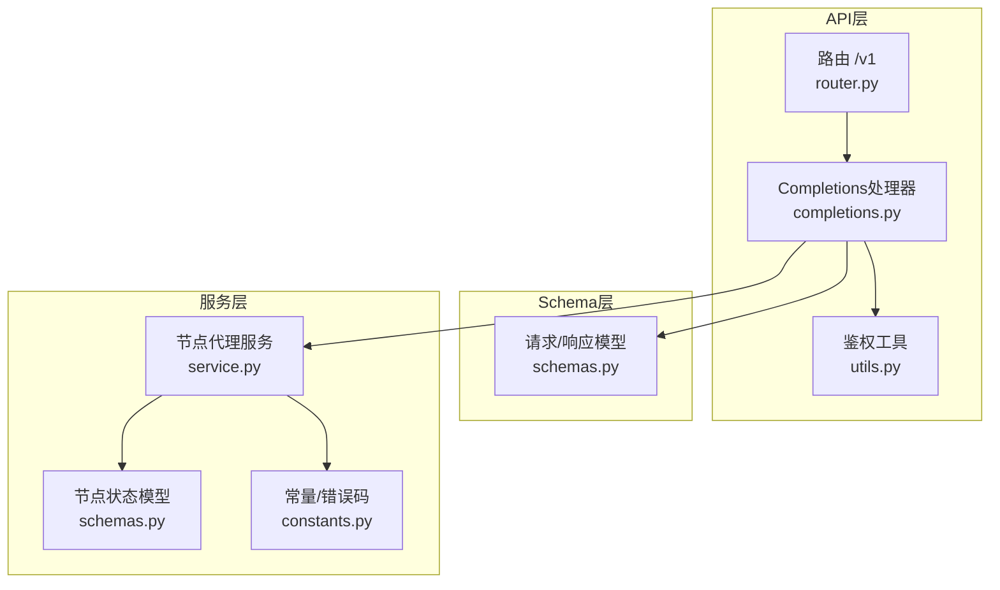
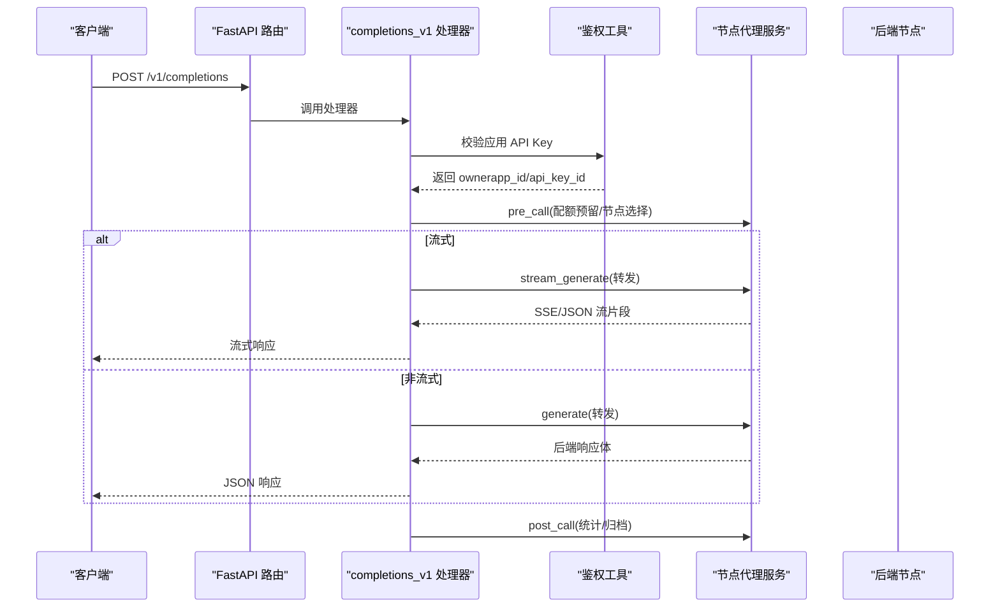
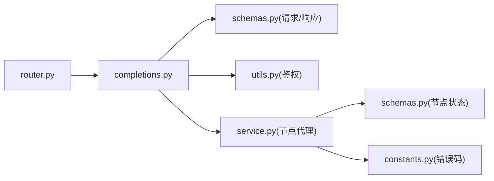

# Completions接口

<cite>
**本文引用的文件**
- [completions.py](file://src/apiproxy/openaiproxy/api/v1/completions.py)
- [schemas.py](file://src/apiproxy/openaiproxy/api/schemas.py)
- [router.py](file://src/apiproxy/openaiproxy/api/router.py)
- [service.py](file://src/apiproxy/openaiproxy/services/nodeproxy/service.py)
- [schemas.py](file://src/apiproxy/openaiproxy/services/nodeproxy/schemas.py)
- [constants.py](file://src/apiproxy/openaiproxy/services/nodeproxy/constants.py)
- [utils.py](file://src/apiproxy/openaiproxy/api/utils.py)
- [api.md](file://docs/api.md)
- [test_completions_responses.py](file://src/apiproxy/tests/api/test_completions_responses.py)
</cite>

## 目录
1. [简介](#简介)
2. [项目结构](#项目结构)
3. [核心组件](#核心组件)
4. [架构总览](#架构总览)
5. [详细组件分析](#详细组件分析)
6. [依赖关系分析](#依赖关系分析)
7. [性能考量](#性能考量)
8. [故障排查指南](#故障排查指南)
9. [结论](#结论)
10. [附录](#附录)

## 简介
本文件为 Completions 接口的详细API文档，覆盖以下内容：
- POST /v1/completions 端点的完整规范，包括请求参数 schema（model、prompt、suffix、max_tokens、temperature 等）与响应格式
- 传统文本补全模式与 Chat Completions 的区别
- 完整的请求/响应示例（含流式与非流式）
- 参数验证规则、默认值设置与错误处理机制
- 实际的 curl 命令示例与多语言 SDK 调用指引
- 与 OpenAI Completions API 的兼容性说明及项目特有增强功能

## 项目结构
Completions 接口位于 OpenAI 兼容接口模块下，采用 FastAPI 路由组织，配合节点代理服务进行后端转发与配额控制。

图表来源
- [router.py:37-45](file://src/apiproxy/openaiproxy/api/router.py#L37-L45)
- [completions.py:447-448](file://src/apiproxy/openaiproxy/api/v1/completions.py#L447-L448)
- [schemas.py:284-315](file://src/apiproxy/openaiproxy/api/schemas.py#L284-L315)
- [service.py:214-281](file://src/apiproxy/openaiproxy/services/nodeproxy/service.py#L214-L281)
- [schemas.py:33-50](file://src/apiproxy/openaiproxy/services/nodeproxy/schemas.py#L33-L50)
- [constants.py:55-69](file://src/apiproxy/openaiproxy/services/nodeproxy/constants.py#L55-L69)

章节来源
- [router.py:37-45](file://src/apiproxy/openaiproxy/api/router.py#L37-L45)
- [api.md:10-16](file://docs/api.md#L10-L16)

## 核心组件
- 路由与处理器
  - /v1/completions 路由注册于 v1 路由器，处理器函数负责接收请求、参数校验、转发至节点代理服务、流式/非流式处理与响应构建。
- Schema 定义
  - 请求模型 CompletionRequest 与响应模型 CompletionResponse/CompletionStreamResponse，定义了字段类型、默认值与可选范围。
- 节点代理服务
  - 负责模型可用性检查、配额预留与释放、节点选择、请求转发、流式数据拼接与统计信息归集。
- 鉴权
  - /v1 接口采用应用 API Key 鉴权，支持静态白名单与数据库存储的 API Key 解析与有效期校验。

章节来源
- [completions.py:693-734](file://src/apiproxy/openaiproxy/api/v1/completions.py#L693-L734)
- [schemas.py:284-351](file://src/apiproxy/openaiproxy/api/schemas.py#L284-L351)
- [service.py:282-368](file://src/apiproxy/openaiproxy/services/nodeproxy/service.py#L282-L368)
- [utils.py:120-216](file://src/apiproxy/openaiproxy/api/utils.py#L120-L216)

## 架构总览
Completions 请求处理流程如下：

图表来源
- [completions.py:693-734](file://src/apiproxy/openaiproxy/api/v1/completions.py#L693-L734)
- [completions.py:754-776](file://src/apiproxy/openaiproxy/api/v1/completions.py#L754-L776)
- [completions.py:776-800](file://src/apiproxy/openaiproxy/api/v1/completions.py#L776-L800)
- [service.py:282-368](file://src/apiproxy/openaiproxy/services/nodeproxy/service.py#L282-L368)

## 详细组件分析

### 请求参数与默认值
- model: 字符串，必填；需来自 /v1/models 可用模型列表
- prompt: 字符串或字符串数组，必填
- suffix: 字符串，可选
- temperature: 浮点数，默认 0.7
- n: 整数，默认 1
- logprobs: 整数，可选
- max_tokens: 整数，默认 16
- stop: 字符串或字符串数组，可选
- stream: 布尔，默认 false
- stream_options: 结构体，可选
- top_p: 浮点数，默认 1.0
- echo: 布尔，默认 false
- presence_penalty: 浮点数，默认 0.0
- frequency_penalty: 浮点数，默认 0.0
- user: 字符串，可选
- 额外增强参数（ApiProxy 特有）:
  - repetition_penalty: 浮点数，默认 1.0
  - session_id: 整数，默认 -1
  - ignore_eos: 布尔，默认 false
  - skip_special_tokens: 布尔，默认 true
  - spaces_between_special_tokens: 布尔，默认 true
  - top_k: 整数，默认 40
  - seed: 整数，可选

章节来源
- [schemas.py:284-315](file://src/apiproxy/openaiproxy/api/schemas.py#L284-L315)
- [completions.py:700-734](file://src/apiproxy/openaiproxy/api/v1/completions.py#L700-L734)

### 响应格式
- 非流式响应
  - 对象: text_completion
  - 字段: id, object, created, model, choices[], usage
  - choices[].index: 整数
  - choices[].text: 字符串
  - choices[].finish_reason: stop 或 length
  - usage: prompt_tokens, total_tokens, completion_tokens
- 流式响应
  - 对象: text_completion
  - 每个片段包含 choices[].text 与可选 usage
  - 支持 stream_options.include_usage 控制是否在流末尾包含 usage

章节来源
- [schemas.py:317-351](file://src/apiproxy/openaiproxy/api/schemas.py#L317-L351)
- [completions.py:776-800](file://src/apiproxy/openaiproxy/api/v1/completions.py#L776-L800)

### 传统文本补全与 Chat Completions 的区别
- 文本补全（/v1/completions）
  - 输入为纯文本 prompt，输出为纯文本补全
  - 支持 echo、suffix 等传统补全特性
- Chat Completions（/v1/chat/completions）
  - 输入为消息数组（messages），支持角色与上下文
  - 输出为消息对象，支持工具调用、logprobs 等高级特性
- 两者均支持流式与非流式，但字段与语义不同

章节来源
- [completions.py:700-734](file://src/apiproxy/openaiproxy/api/v1/completions.py#L700-L734)
- [completions.py:450-511](file://src/apiproxy/openaiproxy/api/v1/completions.py#L450-L511)

### 参数验证与默认值
- Pydantic 模型自动进行类型与默认值校验
- 特殊处理
  - _safe_int: 安全转换数值，过滤 NaN/Inf/非整数字符串
  - _estimate_tokens/_estimate_completion_prompt_tokens: 估算 prompt token 数，用于配额与统计
  - _estimate_completion_total_tokens: 估算总 token 上限（prompt + max_tokens）

章节来源
- [completions.py:363-387](file://src/apiproxy/openaiproxy/api/v1/completions.py#L363-L387)
- [completions.py:111-158](file://src/apiproxy/openaiproxy/api/v1/completions.py#L111-L158)

### 错误处理与配额控制
- 配额与节点可用性
  - pre_call 中进行北向配额（API Key/App）与节点模型配额预留
  - NodeModelQuotaExceeded、ApiKeyQuotaExceeded、AppQuotaExceeded 触发 429
  - 北向配额处理异常触发 503
- 后端错误提取
  - _extract_backend_error 统一从后端响应中提取 message/stack
  - _build_backend_json_response 根据 error_code 映射 HTTP 状态码（如超时映射为 504）
- 流式断连处理
  - DisconnectHandlerStreamingResponse 监听客户端断开，标记 request_ctx.abort 并合并错误信息

章节来源
- [completions.py:517-555](file://src/apiproxy/openaiproxy/api/v1/completions.py#L517-L555)
- [completions.py:261-324](file://src/apiproxy/openaiproxy/api/v1/completions.py#L261-L324)
- [completions.py:342-361](file://src/apiproxy/openaiproxy/api/v1/completions.py#L342-L361)
- [service.py:137-157](file://src/apiproxy/openaiproxy/services/nodeproxy/service.py#L137-L157)
- [constants.py:55-69](file://src/apiproxy/openaiproxy/services/nodeproxy/constants.py#L55-L69)

### Token 统计与使用量归集
- 非流式：解析后端 payload 的 usage 字段，若缺失则回退到估算
- 流式：逐片段解析 usage，最终汇总到 request_ctx
- 统一应用 _apply_usage_to_context，支持 prompt_tokens_details/cached_tokens 调整

章节来源
- [completions.py:389-445](file://src/apiproxy/openaiproxy/api/v1/completions.py#L389-L445)
- [completions.py:616-625](file://src/apiproxy/openaiproxy/api/v1/completions.py#L616-L625)

### 与 OpenAI Completions API 的兼容性
- 兼容字段与行为
  - model、prompt、suffix、max_tokens、temperature、top_p、n、stop、user、echo 等
  - stream 与 stream_options 支持
- 不支持/替换项
  - logprobs：当前未实现
  - presence_penalty/frequency_penalty：以 repetition_penalty 替代
- 项目特有增强
  - repetition_penalty、session_id、ignore_eos、skip_special_tokens、spaces_between_special_tokens、top_k、seed 等

章节来源
- [completions.py:700-734](file://src/apiproxy/openaiproxy/api/v1/completions.py#L700-L734)
- [schemas.py:284-315](file://src/apiproxy/openaiproxy/api/schemas.py#L284-L315)

### 请求/响应示例与调用方式

- 非流式示例（curl）
  - 请求
    - curl -X POST http://<host>/v1/completions -H "Authorization: Bearer <应用API Key>" -H "Content-Type: application/json" -d '{...}'
  - 响应
    - JSON 对象，包含 choices[].text 与 usage

- 流式示例（curl）
  - 请求
    - curl -N -X POST http://<host>/v1/completions -H "Authorization: Bearer <应用API Key>" -H "Content-Type: application/json" -d '{"model":"<model>","prompt":"<prompt>","stream":true}'
  - 响应
    - 多个 data: 前缀的 JSON 片段，最后以 [DONE] 结束；可选 usage

- 多语言 SDK 调用指引
  - Python（requests）
    - 发送 POST /v1/completions，设置 headers Authorization: Bearer <应用API Key>
    - 非流式：直接解析 JSON；流式：逐行读取 data: 行并解析 JSON
  - JavaScript（fetch）
    - 设置 headers Authorization 与 Content-Type
    - 流式：使用 ReadableStream 逐块解析
  - Java（OkHttp）
    - POST 请求，设置 Authorization 与 Content-Type
    - 流式：逐行解析 SSE 数据行
  - Go（net/http）
    - POST 请求，解析响应体；流式：bufio.Scanner 逐行读取

说明
- 示例中的 <host>、<应用API Key>、<model>、<prompt> 需替换为实际值
- 流式响应遵循 SSE 协议，以 data: 开头的行承载 JSON 片段

章节来源
- [completions.py:776-800](file://src/apiproxy/openaiproxy/api/v1/completions.py#L776-L800)
- [api.md:10-16](file://docs/api.md#L10-L16)

## 依赖关系分析

图表来源
- [completions.py:37-54](file://src/apiproxy/openaiproxy/api/v1/completions.py#L37-L54)
- [router.py:30-41](file://src/apiproxy/openaiproxy/api/router.py#L30-L41)
- [service.py:103-111](file://src/apiproxy/openaiproxy/services/nodeproxy/service.py#L103-L111)
- [constants.py:55-69](file://src/apiproxy/openaiproxy/services/nodeproxy/constants.py#L55-L69)

章节来源
- [completions.py:37-54](file://src/apiproxy/openaiproxy/api/v1/completions.py#L37-L54)
- [router.py:30-41](file://src/apiproxy/openaiproxy/api/router.py#L30-L41)

## 性能考量
- Token 估算
  - 使用 tiktoken 编码器估算 prompt 与总 token，作为配额与统计依据
  - 降级策略：tiktoken 不可用时采用启发式估算
- 流式处理
  - SSE/JSON 片段拼接，避免一次性缓冲大响应
  - 断连检测与资源回收，防止泄漏
- 节点调度
  - 基于节点健康状态与延迟样本的策略，提升吞吐与稳定性

章节来源
- [completions.py:92-124](file://src/apiproxy/openaiproxy/api/v1/completions.py#L92-L124)
- [service.py:370-422](file://src/apiproxy/openaiproxy/services/nodeproxy/service.py#L370-L422)

## 故障排查指南
- 常见错误与处理
  - 401 无效 API Key：确认 Authorization 头与应用 API Key 是否正确
  - 404 模型不存在：检查 /v1/models 获取可用模型
  - 429 配额不足：检查 API Key/App/节点模型配额使用情况
  - 503 北向配额处理失败：重试或检查配额服务
  - 504 后端超时：调整请求参数或后端节点
- 日志与追踪
  - request-logs 接口可查询 action=completions 的请求记录，包含 error/abort/usage 等字段
- 单元测试参考
  - 后端 JSON 响应状态映射测试，验证超时与服务不可用场景

章节来源
- [test_completions_responses.py:7-37](file://src/apiproxy/tests/api/test_completions_responses.py#L7-L37)
- [api.md:57-85](file://docs/api.md#L57-L85)

## 结论
Completions 接口在保持与 OpenAI Completions API 高度兼容的同时，提供了更丰富的参数与稳健的错误处理、配额控制与流式能力。通过清晰的请求/响应 schema、完善的默认值与验证逻辑，以及对 tiktoken 的估算与回退策略，确保在不同场景下的稳定与高效。

## 附录

### 请求参数与默认值对照表
- model: 字符串，必填
- prompt: 字符串或数组，必填
- suffix: 字符串，可选
- temperature: 浮点数，0.7
- n: 整数，1
- logprobs: 整数，可选
- max_tokens: 整数，16
- stop: 字符串或数组，可选
- stream: 布尔，false
- stream_options: 结构体，可选
- top_p: 浮点数，1.0
- echo: 布尔，false
- presence_penalty: 浮点数，0.0（以 repetition_penalty 替代）
- frequency_penalty: 浮点数，0.0（以 repetition_penalty 替代）
- user: 字符串，可选
- ApiProxy 增强参数:
  - repetition_penalty: 1.0
  - session_id: -1
  - ignore_eos: false
  - skip_special_tokens: true
  - spaces_between_special_tokens: true
  - top_k: 40
  - seed: 可选

章节来源
- [schemas.py:284-315](file://src/apiproxy/openaiproxy/api/schemas.py#L284-L315)
- [completions.py:700-734](file://src/apiproxy/openaiproxy/api/v1/completions.py#L700-L734)