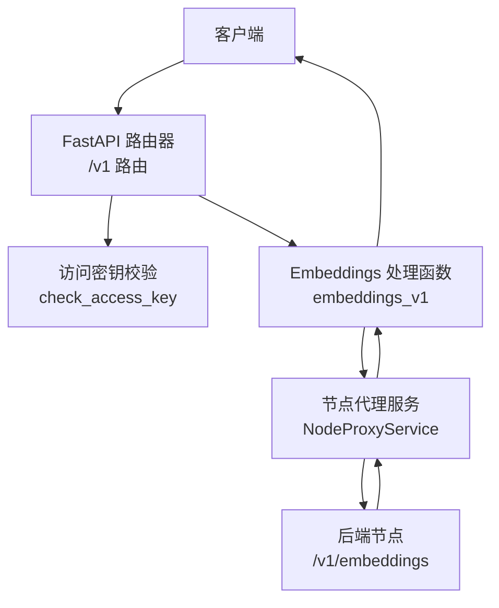
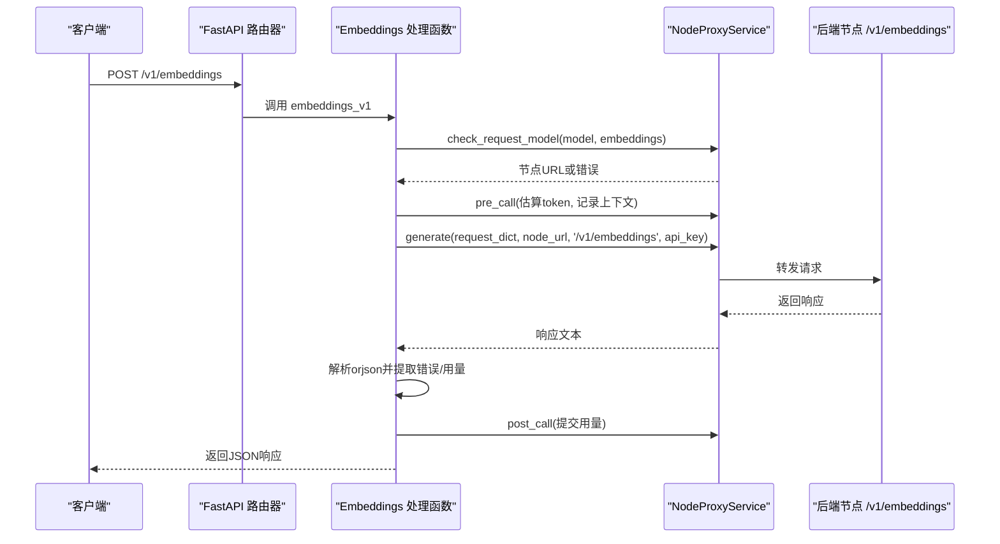
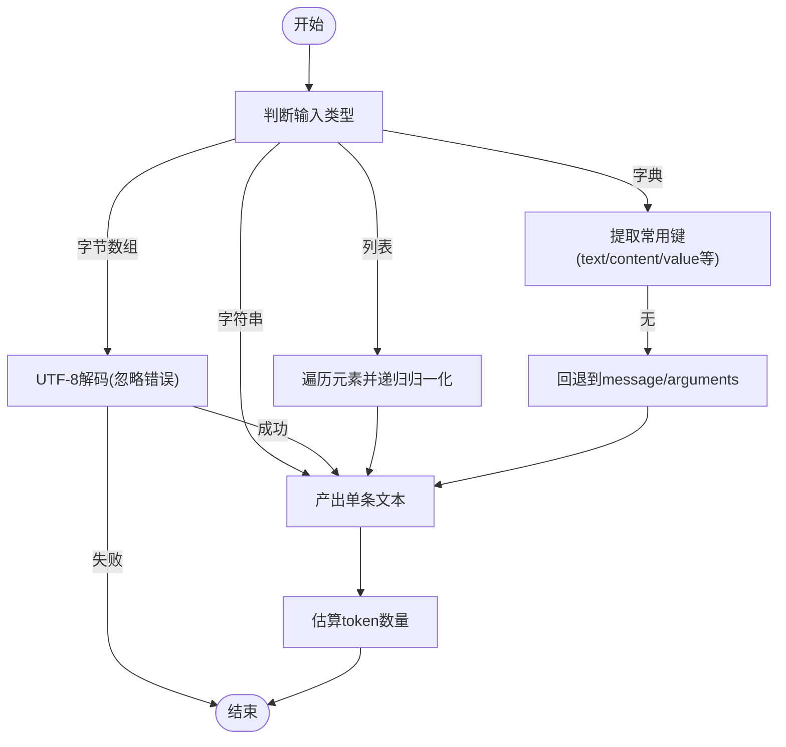
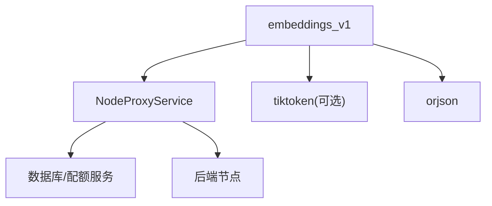

# Embeddings接口

<cite>
**本文引用的文件**
- [embeddings.py](file://src/apiproxy/openaiproxy/api/v1/embeddings.py)
- [schemas.py](file://src/apiproxy/openaiproxy/api/schemas.py)
- [router.py](file://src/apiproxy/openaiproxy/api/router.py)
- [service.py](file://src/apiproxy/openaiproxy/services/nodeproxy/service.py)
- [schemas.py](file://src/apiproxy/openaiproxy/services/nodeproxy/schemas.py)
- [utils.py](file://src/apiproxy/openaiproxy/api/utils.py)
- [main.py](file://src/apiproxy/openaiproxy/main.py)
- [api.md](file://docs/api.md)
</cite>

## 目录
1. [简介](#简介)
2. [项目结构](#项目结构)
3. [核心组件](#核心组件)
4. [架构总览](#架构总览)
5. [详细组件分析](#详细组件分析)
6. [依赖分析](#依赖分析)
7. [性能考虑](#性能考虑)
8. [故障排查指南](#故障排查指南)
9. [结论](#结论)
10. [附录](#附录)

## 简介
本文件为 Embeddings 接口的详细API文档，覆盖以下内容：
- POST /v1/embeddings 的完整规范：请求参数 schema（model、input、user 等）与响应格式
- 向量嵌入的概念与常见应用场景
- 输入格式处理：字符串、字符串数组、字节/字节数组、对象/列表的归一化与扁平化
- 编码格式与输出向量维度说明（兼容性与实现细节）
- 请求/响应示例与实际使用场景
- 批量处理、错误处理与性能优化建议
- 与 OpenAI Embeddings API 的兼容性说明与项目特定实现差异

## 项目结构
该接口位于 OpenAI 兼容 API v1 路由下，通过 FastAPI 路由器挂载，请求经访问密钥校验后，转发至后端节点服务进行处理。

图表来源
- [router.py:37-45](file://src/apiproxy/openaiproxy/api/router.py#L37-L45)
- [embeddings.py:274-355](file://src/apiproxy/openaiproxy/api/v1/embeddings.py#L274-L355)
- [service.py:214-368](file://src/apiproxy/openaiproxy/services/nodeproxy/service.py#L214-L368)

章节来源
- [router.py:37-45](file://src/apiproxy/openaiproxy/api/router.py#L37-L45)
- [main.py:166](file://src/apiproxy/openaiproxy/main.py#L166)

## 核心组件
- 路由与处理器
  - 路由器：/v1 路由包含 embeddings 路由
  - 处理器：embeddings_v1，负责模型可用性检查、配额预占、请求转发、响应解析与用量归并
- 数据模型
  - 请求模型：EmbeddingsRequest（包含 model、input、user）
  - 响应模型：EmbeddingsResponse（包含 object、data、model、usage）
  - 通用用量模型：UsageInfo（prompt_tokens、total_tokens、completion_tokens）
- 节点代理服务
  - NodeProxyService：封装节点选择、健康检查、配额控制、请求生命周期管理（pre_call/post_call）、错误透传
- 访问密钥校验
  - check_access_key：校验并解析 API Key，注入 ownerapp_id 与 api_key_id

章节来源
- [embeddings.py:274-355](file://src/apiproxy/openaiproxy/api/v1/embeddings.py#L274-L355)
- [schemas.py:353-366](file://src/apiproxy/openaiproxy/api/schemas.py#L353-L366)
- [schemas.py:99-104](file://src/apiproxy/openaiproxy/api/schemas.py#L99-L104)
- [service.py:214-368](file://src/apiproxy/openaiproxy/services/nodeproxy/service.py#L214-L368)
- [utils.py:120-216](file://src/apiproxy/openaiproxy/api/utils.py#L120-L216)

## 架构总览
Embeddings 请求在进入业务处理前，会完成如下关键步骤：
- 模型类型校验与可用节点选择
- 北向配额与节点模型配额预占
- 请求数据序列化与客户端 IP 提取
- 转发至后端节点 /v1/embeddings 并解析响应
- 错误提取与用量归并（prompt_tokens、total_tokens、completion_tokens）
- 返回最终 JSON 响应

图表来源
- [embeddings.py:274-355](file://src/apiproxy/openaiproxy/api/v1/embeddings.py#L274-L355)
- [service.py:282-368](file://src/apiproxy/openaiproxy/services/nodeproxy/service.py#L282-L368)

## 详细组件分析

### 请求参数与响应格式
- 请求体（EmbeddingsRequest）
  - model: 字符串，目标模型标识
  - input: 字符串或字符串数组，待嵌入的文本
  - user: 可选字符串，用户标识
- 响应体（EmbeddingsResponse）
  - object: 固定为 "list"
  - data: 数组，元素为包含嵌入结果的对象（具体字段由后端节点决定）
  - model: 使用的模型标识
  - usage: UsageInfo，包含 prompt_tokens、total_tokens、completion_tokens

章节来源
- [schemas.py:353-366](file://src/apiproxy/openaiproxy/api/schemas.py#L353-L366)
- [schemas.py:99-104](file://src/apiproxy/openaiproxy/api/schemas.py#L99-L104)

### 输入格式处理与归一化
- 支持的输入类型
  - 字符串：直接作为单条文本
  - 字符串数组：逐项处理
  - 字节/字节数组：尝试 UTF-8 解码，失败则忽略
  - 对象/列表：递归提取常用键（如 text/content/value/message/arguments），拼接为文本
- 归一化策略
  - 任何非字符串输入都会被转换为字符串
  - 列表输入会被扁平化为字符串序列
  - 字典输入优先提取 text/content/value 等键；若无则回退到 message/arguments；否则为空字符串
- 令牌估算
  - 使用 tiktoken 进行编码估算；若不可用则采用启发式估算（字符长度/单词数）

图表来源
- [embeddings.py:118-139](file://src/apiproxy/openaiproxy/api/v1/embeddings.py#L118-L139)
- [embeddings.py:57-81](file://src/apiproxy/openaiproxy/api/v1/embeddings.py#L57-L81)
- [embeddings.py:103-115](file://src/apiproxy/openaiproxy/api/v1/embeddings.py#L103-L115)

章节来源
- [embeddings.py:57-81](file://src/apiproxy/openaiproxy/api/v1/embeddings.py#L57-L81)
- [embeddings.py:118-139](file://src/apiproxy/openaiproxy/api/v1/embeddings.py#L118-L139)
- [embeddings.py:103-115](file://src/apiproxy/openaiproxy/api/v1/embeddings.py#L103-L115)

### 编码格式与输出向量维度
- 编码格式
  - 本实现不强制对输出向量进行编码（如 float/base64）；响应由后端节点决定
  - 若需 base64 输出，请在后端节点侧实现或通过上游转换
- 维度
  - 输出向量维度由后端节点所选模型决定；本代理不修改或裁剪维度
- 兼容性
  - 与 OpenAI Embeddings API 的兼容点：请求体字段与响应结构基本一致（object、data、model、usage）
  - 不兼容点：本实现未内置对 encoding_format 的支持；如需 base64，需在后端节点实现

章节来源
- [embeddings.py:274-355](file://src/apiproxy/openaiproxy/api/v1/embeddings.py#L274-L355)
- [schemas.py:353-366](file://src/apiproxy/openaiproxy/api/schemas.py#L353-L366)

### 批量处理与令牌估算
- 批量处理
  - input 为字符串数组时，视为多条输入；每条输入独立估算 token 并累加
- 令牌估算
  - 优先使用 tiktoken（按 model 选择编码器），失败则回退到默认编码器
  - 若仍不可用，则采用启发式估算（字符长度/单词数）
- 用量归并
  - 若后端响应包含 usage 字段，优先使用；否则以估算值填充
  - 计算 completion_tokens = total_tokens - prompt_tokens 或 total_tokens

章节来源
- [embeddings.py:135-139](file://src/apiproxy/openaiproxy/api/v1/embeddings.py#L135-L139)
- [embeddings.py:84-115](file://src/apiproxy/openaiproxy/api/v1/embeddings.py#L84-L115)
- [embeddings.py:142-174](file://src/apiproxy/openaiproxy/api/v1/embeddings.py#L142-L174)

### 错误处理与配额控制
- 访问密钥
  - 未提供或无效密钥将返回 401；过期密钥同样返回 401
- 模型可用性
  - 未找到可用节点或模型不可用时，返回相应错误
- 配额控制
  - 北向配额（API Key/App）与节点模型配额预占；不足时返回 429（quota_exceeded）
- 后端错误透传
  - 解析后端响应时若失败，记录错误信息与堆栈；并将错误信息提取到请求上下文中
- 用量记录
  - 通过 pre_call/post_call 记录请求/响应 token 与错误状态

章节来源
- [utils.py:120-216](file://src/apiproxy/openaiproxy/api/utils.py#L120-L216)
- [embeddings.py:287-324](file://src/apiproxy/openaiproxy/api/v1/embeddings.py#L287-L324)
- [embeddings.py:206-258](file://src/apiproxy/openaiproxy/api/v1/embeddings.py#L206-L258)
- [service.py:282-368](file://src/apiproxy/openaiproxy/services/nodeproxy/service.py#L282-L368)

### 实际使用场景
- 文档检索增强（RAG）
  - 将文档切分为段落，调用 /v1/embeddings 生成向量，存入向量库（如 FAISS、Pinecone）
- 语义相似度计算
  - 对查询与候选文本分别生成向量，计算余弦相似度
- 文本聚类/去重
  - 基于向量距离进行聚类或去重
- 多语言/多模态适配
  - 通过指定 model 参数切换不同编码器与维度

（本节为概念性说明，不直接分析具体源码文件）

## 依赖分析
- 组件耦合
  - embeddings_v1 依赖 NodeProxyService 完成节点选择、配额与用量管理
  - 使用 orjson 进行高性能 JSON 解析与序列化
  - 可选依赖 tiktoken 用于 token 估算
- 外部集成
  - 后端节点需实现 /v1/embeddings 接口，返回符合 EmbeddingsResponse 结构的 JSON
- 可能的循环依赖
  - 当前模块间为单向依赖（路由 -> 处理器 -> 服务），无循环

图表来源
- [embeddings.py:274-355](file://src/apiproxy/openaiproxy/api/v1/embeddings.py#L274-L355)
- [service.py:214-368](file://src/apiproxy/openaiproxy/services/nodeproxy/service.py#L214-L368)

章节来源
- [embeddings.py:274-355](file://src/apiproxy/openaiproxy/api/v1/embeddings.py#L274-L355)
- [service.py:214-368](file://src/apiproxy/openaiproxy/services/nodeproxy/service.py#L214-L368)

## 性能考虑
- token 估算缓存
  - tiktoken 编码器按 model 缓存，避免重复初始化
- 流水线优化
  - 使用 orjson 替代标准 json，提升序列化/反序列化性能
- 批量输入
  - input 为数组时，建议合并为更长的文本批次以减少请求次数
- 配额与限流
  - 合理设置北向与节点模型配额，避免频繁触发 429
- 日志与可观测性
  - 通过 request_ctx 记录 error_message/stack，便于定位问题

章节来源
- [embeddings.py:54-100](file://src/apiproxy/openaiproxy/api/v1/embeddings.py#L54-L100)
- [embeddings.py:337-344](file://src/apiproxy/openaiproxy/api/v1/embeddings.py#L337-L344)

## 故障排查指南
- 常见错误
  - 401 无效或过期 API Key
  - 404/422 模型不可用或请求体不合法
  - 429 配额不足（北向或节点模型）
  - 5xx 后端节点异常或响应解析失败
- 定位方法
  - 查看响应中的错误类型与消息
  - 检查 request_ctx 中的 error_message 与 error_stack
  - 确认后端节点 /v1/embeddings 是否返回标准 JSON
- 建议
  - 在后端节点侧增加日志与监控
  - 对输入进行预处理，确保为字符串或可归一化的结构

章节来源
- [embeddings.py:206-258](file://src/apiproxy/openaiproxy/api/v1/embeddings.py#L206-L258)
- [embeddings.py:337-344](file://src/apiproxy/openaiproxy/api/v1/embeddings.py#L337-L344)
- [service.py:282-368](file://src/apiproxy/openaiproxy/services/nodeproxy/service.py#L282-L368)

## 结论
- 本实现严格遵循 OpenAI 兼容接口的请求/响应结构，但未内置 encoding_format 的处理逻辑
- 输入格式具备强大的归一化能力，适合多种前端数据形态
- 通过 NodeProxyService 提供了完善的配额、用量与错误处理机制
- 如需 base64 输出或自定义编码格式，应在后端节点侧实现

（本节为总结性内容，不直接分析具体源码文件）

## 附录

### API 规范摘要
- 端点：POST /v1/embeddings
- 鉴权：应用 API Key（check_access_key）
- 请求体字段
  - model: 字符串，目标模型标识
  - input: 字符串或字符串数组
  - user: 可选字符串
- 响应体字段
  - object: 固定为 "list"
  - data: 嵌入结果数组（由后端节点决定具体结构）
  - model: 使用的模型标识
  - usage: UsageInfo（prompt_tokens、total_tokens、completion_tokens）

章节来源
- [api.md:15](file://docs/api.md#L15)
- [schemas.py:353-366](file://src/apiproxy/openaiproxy/api/schemas.py#L353-L366)
- [schemas.py:99-104](file://src/apiproxy/openaiproxy/api/schemas.py#L99-L104)

### 请求/响应示例（路径指引）
- 请求示例
  - 字符串输入：[embeddings.py:274-355](file://src/apiproxy/openaiproxy/api/v1/embeddings.py#L274-L355)
  - 字符串数组输入：同上
- 响应示例
  - 后端节点返回的 JSON（结构参考 EmbeddingsResponse）：[schemas.py:353-366](file://src/apiproxy/openaiproxy/api/schemas.py#L353-L366)

### 与 OpenAI Embeddings API 的兼容性
- 兼容点
  - 请求体字段与响应结构基本一致
  - usage 字段支持 prompt_tokens/total_tokens
- 不兼容点
  - 未内置 encoding_format（如 float/base64）处理
  - 未内置 user 字段的业务约束

章节来源
- [embeddings.py:274-355](file://src/apiproxy/openaiproxy/api/v1/embeddings.py#L274-L355)
- [schemas.py:353-366](file://src/apiproxy/openaiproxy/api/schemas.py#L353-L366)