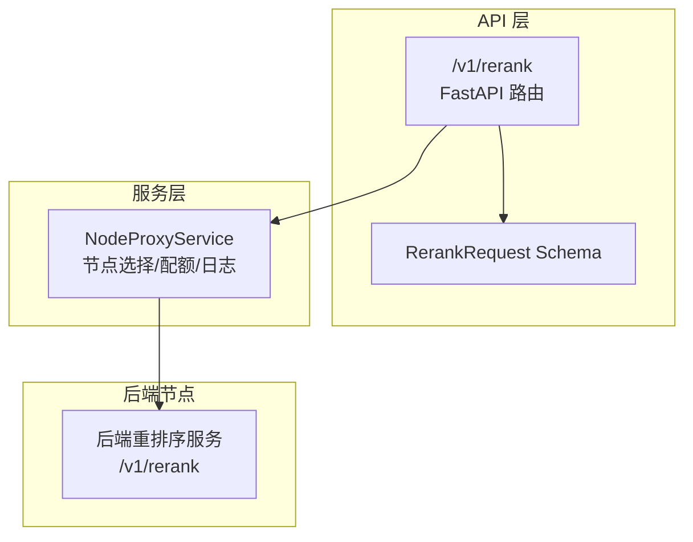
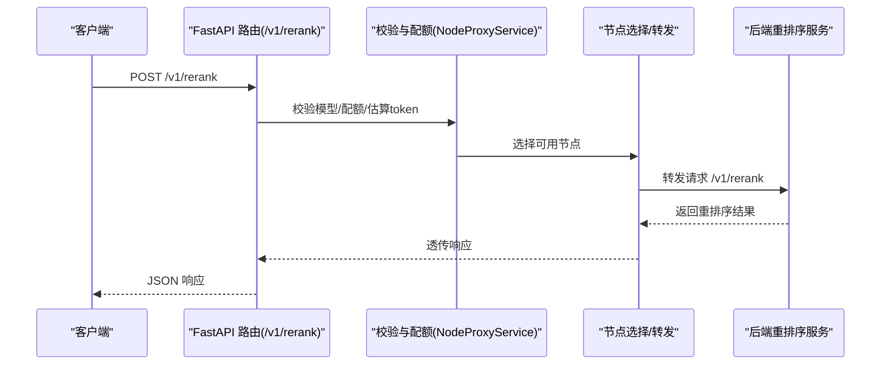
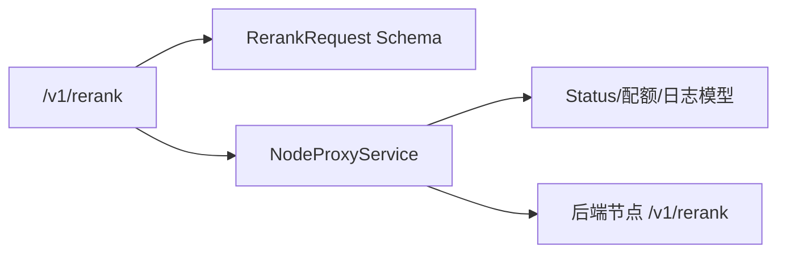

# Rerank接口

<cite>
**本文引用的文件**
- [rerank.py](file://src/apiproxy/openaiproxy/api/v1/rerank.py)
- [schemas.py](file://src/apiproxy/openaiproxy/api/schemas.py)
- [router.py](file://src/apiproxy/openaiproxy/api/router.py)
- [service.py](file://src/apiproxy/openaiproxy/services/nodeproxy/service.py)
- [schemas.py](file://src/apiproxy/openaiproxy/services/nodeproxy/schemas.py)
- [api.md](file://docs/api.md)
- [schemas.md](file://docs/schemas.md)
</cite>

## 目录
1. [简介](#简介)
2. [项目结构](#项目结构)
3. [核心组件](#核心组件)
4. [架构总览](#架构总览)
5. [详细组件分析](#详细组件分析)
6. [依赖分析](#依赖分析)
7. [性能考量](#性能考量)
8. [故障排查指南](#故障排查指南)
9. [结论](#结论)
10. [附录](#附录)

## 简介
本文件为 Rerank 接口的完整 API 文档，覆盖以下要点：
- 端点定义：POST /v1/rerank
- 请求参数 Schema（query、documents、user 等）
- 响应格式与错误处理
- 重排序算法工作原理与应用场景
- 单文档与多文档重排序示例
- 相关性分数计算、排序逻辑与结果过滤机制
- curl 示例与多语言 SDK 调用指引
- 与主流重排序服务的对比及项目特色优化
- 性能考虑与最佳实践

## 项目结构
Rerank 接口位于 OpenAI 兼容路由下，采用轻量 Schema 定义，并通过 NodeProxyService 转发至后端节点执行。

图示来源
- [router.py:30-44](file://src/apiproxy/openaiproxy/api/router.py#L30-L44)
- [rerank.py:279-367](file://src/apiproxy/openaiproxy/api/v1/rerank.py#L279-L367)
- [schemas.py:368-379](file://src/apiproxy/openaiproxy/api/schemas.py#L368-L379)
- [service.py:988-1077](file://src/apiproxy/openaiproxy/services/nodeproxy/service.py#L988-L1077)

章节来源
- [router.py:30-44](file://src/apiproxy/openaiproxy/api/router.py#L30-L44)
- [api.md:10-16](file://docs/api.md#L10-L16)

## 核心组件
- 路由与端点
  - 路由：/v1/rerank（POST）
  - 标签：OpenAI兼容接口
- 请求 Schema：RerankRequest
  - 字段：model、query、documents、user
- 响应：直接透传后端节点的 /v1/rerank 响应
- 鉴权：应用 API Key（check_access_key）

章节来源
- [rerank.py:279-288](file://src/apiproxy/openaiproxy/api/v1/rerank.py#L279-L288)
- [schemas.py:368-379](file://src/apiproxy/openaiproxy/api/schemas.py#L368-L379)
- [api.md:3-6](file://docs/api.md#L3-L6)

## 架构总览
Rerank 请求的典型流程如下：

图示来源
- [rerank.py:282-367](file://src/apiproxy/openaiproxy/api/v1/rerank.py#L282-L367)
- [service.py:988-1077](file://src/apiproxy/openaiproxy/services/nodeproxy/service.py#L988-L1077)

## 详细组件分析

### 请求参数 Schema（RerankRequest）
- model: 字符串，目标重排序模型标识
- query: 字符串或数组，查询文本
- documents: 可选数组，待重排序的文档集合
- user: 可选字符串，用户标识（透传）

章节来源
- [schemas.py:368-379](file://src/apiproxy/openaiproxy/api/schemas.py#L368-L379)

### 响应格式
- 直接透传后端节点的 /v1/rerank 响应体
- 若后端响应可解析为 JSON，则原样返回
- 若后端响应无法解析，将记录错误并抛出异常

章节来源
- [rerank.py:349-367](file://src/apiproxy/openaiproxy/api/v1/rerank.py#L349-L367)

### 重排序算法工作原理与应用场景
- 工作原理
  - 该接口为“兼容层”，不直接实现重排序算法，而是将请求转发给后端节点的 /v1/rerank 实际实现。
  - 项目侧对请求进行模型可用性校验、配额预占、节点选择与日志记录。
- 应用场景
  - 检索增强生成（RAG）中的相关性重排
  - 多候选文档排序与精排
  - 结合检索系统进行二次排序

章节来源
- [rerank.py:289-293](file://src/apiproxy/openaiproxy/api/v1/rerank.py#L289-L293)
- [service.py:988-1077](file://src/apiproxy/openaiproxy/services/nodeproxy/service.py#L988-L1077)

### 单文档与多文档重排序示例
- 单文档示例
  - 请求体包含 query 与 documents（仅一个元素）
  - 后端根据 query 与该文档的相关性进行打分与排序
- 多文档示例
  - documents 为多个条目，后端对每个文档计算相关性分数并整体排序
- 注意
  - 本项目不直接实现排序逻辑，具体排序行为取决于后端节点的实现

章节来源
- [schemas.py:368-379](file://src/apiproxy/openaiproxy/api/schemas.py#L368-L379)

### 相关性分数计算、排序逻辑与结果过滤机制
- 分数与排序
  - 由后端节点的 /v1/rerank 实现决定，项目侧不干预排序细节
- 结果过滤
  - 项目侧未提供 top_n 参数；若需限制输出数量，应在上游调用侧或后端节点侧实现
- token 估算
  - 项目会估算 query 与 documents 的 token 数量，用于配额与日志记录

章节来源
- [rerank.py:136-147](file://src/apiproxy/openaiproxy/api/v1/rerank.py#L136-L147)
- [rerank.py:150-183](file://src/apiproxy/openaiproxy/api/v1/rerank.py#L150-L183)

### curl 示例
- 基本格式
  - curl -X POST http://<host>/v1/rerank -H "Authorization: Bearer <应用API Key>" -H "Content-Type: application/json" -d '{...}'
- 单文档示例
  - 将 documents 设置为仅包含一个条目的数组
- 多文档示例
  - documents 设置为多个条目数组
- 注意
  - 请将 <host> 与 <应用API Key> 替换为实际值

章节来源
- [api.md:3-6](file://docs/api.md#L3-L6)

### 多语言 SDK 调用示例
- Python（requests/httpx）
  - 构造 JSON 请求体（包含 model、query、documents、user）
  - 设置 Authorization: Bearer <应用API Key>
  - 发送 POST /v1/rerank
- JavaScript（fetch/XMLHttpRequest）
  - 同上，设置正确的请求头与 body
- Java/C#
  - 使用对应 HTTP 客户端发送相同请求
- 注意
  - 以上为通用调用方式，具体字段与行为以后端 /v1/rerank 的实际实现为准

章节来源
- [api.md:3-6](file://docs/api.md#L3-L6)

### 与主流重排序服务的对比与项目特色优化
- 对比
  - 与 OpenAI 兼容的 rerank 服务相比，本项目提供统一的接入与配额体系、节点健康检查与负载策略
- 项目特色
  - 统一的模型可用性校验与节点选择（随机/最小预期延迟/最小观测延迟）
  - 北向配额（API Key + 应用）与节点模型配额双重控制
  - 请求日志与指标采集，便于审计与性能分析
  - 错误提取与回退处理，提升稳定性

章节来源
- [service.py:214-281](file://src/apiproxy/openaiproxy/services/nodeproxy/service.py#L214-L281)
- [service.py:988-1077](file://src/apiproxy/openaiproxy/services/nodeproxy/service.py#L988-L1077)
- [schemas.py:33-50](file://src/apiproxy/openaiproxy/services/nodeproxy/schemas.py#L33-L50)

## 依赖分析
- 组件耦合
  - /v1/rerank 路由依赖 RerankRequest Schema 与 NodeProxyService
  - NodeProxyService 负责模型可用性校验、节点选择、配额与日志
- 外部依赖
  - 后端节点的 /v1/rerank 实现
  - tiktoken（可选）用于 token 估算

图示来源
- [rerank.py:279-367](file://src/apiproxy/openaiproxy/api/v1/rerank.py#L279-L367)
- [schemas.py:368-379](file://src/apiproxy/openaiproxy/api/schemas.py#L368-L379)
- [service.py:988-1077](file://src/apiproxy/openaiproxy/services/nodeproxy/service.py#L988-L1077)
- [schemas.py:33-50](file://src/apiproxy/openaiproxy/services/nodeproxy/schemas.py#L33-L50)

章节来源
- [rerank.py:279-367](file://src/apiproxy/openaiproxy/api/v1/rerank.py#L279-L367)
- [service.py:988-1077](file://src/apiproxy/openaiproxy/services/nodeproxy/service.py#L988-L1077)

## 性能考量
- 节点选择策略
  - 支持随机、最小预期延迟、最小观测延迟三种策略，可根据业务需求调整
- 配额与限流
  - 北向配额与节点模型配额双重保护，避免过载
- token 估算
  - 估算 query 与 documents 的 token，辅助成本控制与容量规划
- 健康检查与日志
  - 定期健康检查与请求日志，有助于定位性能瓶颈

章节来源
- [service.py:232-241](file://src/apiproxy/openaiproxy/services/nodeproxy/service.py#L232-L241)
- [service.py:988-1077](file://src/apiproxy/openaiproxy/services/nodeproxy/service.py#L988-L1077)
- [rerank.py:136-147](file://src/apiproxy/openaiproxy/api/v1/rerank.py#L136-L147)

## 故障排查指南
- 常见错误类型
  - 模型不存在：返回 NOT_FOUND
  - 配额不足：返回 quota_exceeded
  - 北向配额处理失败：返回 service_unavailable_error
  - 后端响应解析失败：记录错误并抛出异常
- 排查步骤
  - 确认应用 API Key 有效且未过期
  - 检查模型是否在节点上启用且类型为 rerank
  - 查看请求日志与节点状态，确认健康检查与配额使用情况
  - 如后端响应异常，检查后端服务日志

章节来源
- [rerank.py:295-335](file://src/apiproxy/openaiproxy/api/v1/rerank.py#L295-L335)
- [rerank.py:349-367](file://src/apiproxy/openaiproxy/api/v1/rerank.py#L349-L367)
- [service.py:1881-1906](file://src/apiproxy/openaiproxy/services/nodeproxy/service.py#L1881-L1906)
- [schemas.md:91-121](file://docs/schemas.md#L91-L121)

## 结论
Rerank 接口作为 OpenAI 兼容层，提供统一的接入、配额与可观测能力，将请求转发至后端节点完成实际的重排序任务。其优势在于：
- 与主流重排序服务保持接口一致性
- 内置节点选择、配额与日志能力
- 易于扩展与运维

## 附录

### API 规范摘要
- 方法：POST
- 路径：/v1/rerank
- 鉴权：Authorization: Bearer <应用API Key>
- 请求体字段：model、query、documents、user
- 响应：后端 /v1/rerank 原样透传

章节来源
- [api.md:10-16](file://docs/api.md#L10-L16)
- [rerank.py:279-288](file://src/apiproxy/openaiproxy/api/v1/rerank.py#L279-L288)
- [schemas.py:368-379](file://src/apiproxy/openaiproxy/api/schemas.py#L368-L379)