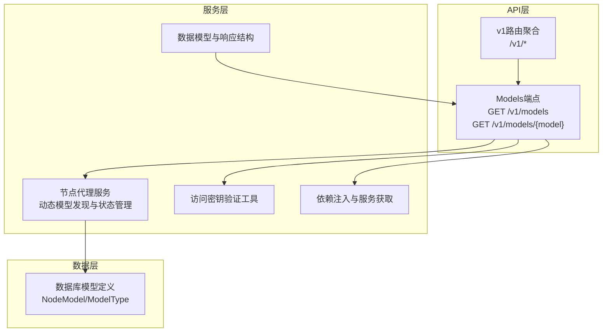
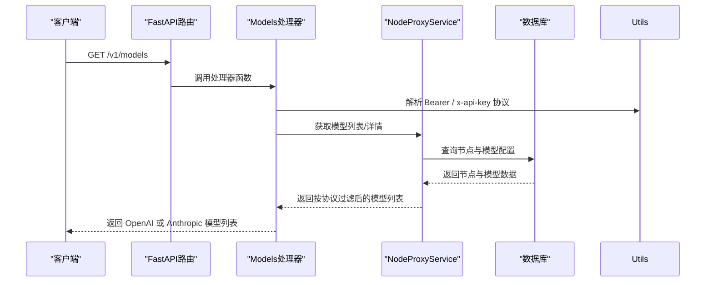
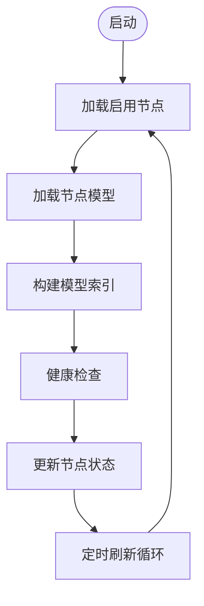
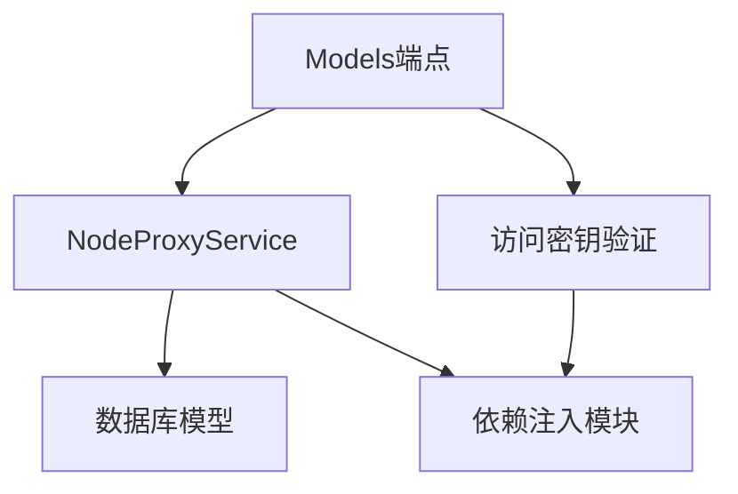

# Models查询接口

<cite>
**本文档引用的文件**
- [models.py](file://src/apiproxy/openaiproxy/api/v1/models.py)
- [router.py](file://src/apiproxy/openaiproxy/api/router.py)
- [schemas.py](file://src/apiproxy/openaiproxy/api/schemas.py)
- [service.py](file://src/apiproxy/openaiproxy/services/nodeproxy/service.py)
- [deps.py](file://src/apiproxy/openaiproxy/services/deps.py)
- [utils.py](file://src/apiproxy/openaiproxy/api/utils.py)
- [model.py](file://src/apiproxy/openaiproxy/services/database/models/node/model.py)
- [main.py](file://src/apiproxy/openaiproxy/main.py)
</cite>

## 目录

1. [简介](#简介)
2. [项目结构](#项目结构)
3. [核心组件](#核心组件)
4. [架构概览](#架构概览)
5. [详细组件分析](#详细组件分析)
6. [依赖分析](#依赖分析)
7. [性能考虑](#性能考虑)
8. [故障排除指南](#故障排除指南)
9. [结论](#结论)
10. [附录](#附录)

## 简介

本文件为 Models 查询接口的详细 API 文档，涵盖以下内容：

- 完整的 GET /v1/models 端点规范
- OpenAI 与 Anthropic 两种响应格式的可用模型列表说明
- 模型分类（chat、embeddings、rerank等）与模型属性
- 模型元数据的完整说明（功能支持、限制条件、性能特征）
- 动态模型发现机制与模型状态管理
- 协议识别与模型列表分发规则
- 模型可用性检查、版本管理与兼容性信息
- 根据应用需求选择合适模型的指导

## 项目结构

Models 查询接口位于统一的 `/v1` 路由下，通过请求协议感知返回 OpenAI 或 Anthropic 兼容格式。核心文件组织如下：

- API路由与端点：src/apiproxy/openaiproxy/api/v1/models.py
- v1路由聚合：src/apiproxy/openaiproxy/api/router.py
- 数据模型与响应结构：src/apiproxy/openaiproxy/api/schemas.py
- 节点代理服务（动态模型发现与状态管理）：src/apiproxy/openaiproxy/services/nodeproxy/service.py
- 依赖注入与服务获取：src/apiproxy/openaiproxy/services/deps.py
- 访问密钥验证工具与协议识别：src/apiproxy/openaiproxy/api/utils.py
- 数据库模型定义（模型类型枚举）：src/apiproxy/openaiproxy/services/database/models/node/model.py
- 应用入口与路由挂载：src/apiproxy/openaiproxy/main.py



**图表来源**

- [router.py:30-44](file://src/apiproxy/openaiproxy/api/router.py#L30-L44)
- [models.py:36-55](file://src/apiproxy/openaiproxy/api/v1/models.py#L36-L55)
- [service.py:464-748](file://src/apiproxy/openaiproxy/services/nodeproxy/service.py#L464-L748)
- [schemas.py:82-97](file://src/apiproxy/openaiproxy/api/schemas.py#L82-L97)
- [utils.py:120-216](file://src/apiproxy/openaiproxy/api/utils.py#L120-L216)
- [deps.py:93-102](file://src/apiproxy/openaiproxy/services/deps.py#L93-L102)
- [model.py:48-56](file://src/apiproxy/openaiproxy/services/database/models/node/model.py#L48-L56)

**章节来源**

- [router.py:30-44](file://src/apiproxy/openaiproxy/api/router.py#L30-L44)
- [models.py:36-55](file://src/apiproxy/openaiproxy/api/v1/models.py#L36-L55)
- [main.py:165-182](file://src/apiproxy/openaiproxy/main.py#L165-L182)

## 核心组件

- Models端点控制器：提供协议感知的可用模型列表查询
- 节点代理服务：负责从数据库加载节点与模型配置，维护节点健康状态，实现动态模型发现
- 数据模型：定义 OpenAI 兼容的 ModelCard/ModelList，以及 Anthropic 兼容模型列表结构
- 访问密钥验证：确保 API 调用的安全性与权限控制，并解析请求协议
- 依赖注入：通过服务管理器获取NodeProxyService实例

**章节来源**

- [models.py:38-55](file://src/apiproxy/openaiproxy/api/v1/models.py#L38-L55)
- [service.py:464-748](file://src/apiproxy/openaiproxy/services/nodeproxy/service.py#L464-L748)
- [schemas.py:66-97](file://src/apiproxy/openaiproxy/api/schemas.py#L66-L97)
- [utils.py:120-216](file://src/apiproxy/openaiproxy/api/utils.py#L120-L216)
- [deps.py:93-102](file://src/apiproxy/openaiproxy/services/deps.py#L93-L102)

## 架构概览

Models 查询接口的调用流程如下：

1. 客户端发起 HTTP 请求至 /v1/models
2. FastAPI路由解析请求并调用对应的处理器函数
3. 鉴权层根据路径与请求头解析北向协议类型
4. 处理器函数通过依赖注入获取 NodeProxyService 实例
5. NodeProxyService 根据协议筛选可用模型并允许跨协议兜底
6. OpenAI 请求返回 ModelList；Anthropic 请求返回 `data/first_id/last_id/has_more` 结构



**图表来源**

- [models.py:38-55](file://src/apiproxy/openaiproxy/api/v1/models.py#L38-L55)
- [service.py:464-748](file://src/apiproxy/openaiproxy/services/nodeproxy/service.py#L464-L748)
- [deps.py:93-102](file://src/apiproxy/openaiproxy/services/deps.py#L93-L102)

## 详细组件分析

### Models端点规范

#### GET /v1/models

- 功能：返回当前可用的模型列表
- 认证：需要有效的API密钥
- 响应：根据请求协议返回 OpenAI 或 Anthropic 兼容结构
- 错误处理：无效密钥返回401；内部错误返回500

协议识别规则：

- 默认按 OpenAI 协议处理
- 当请求带有 `x-api-key` 时，按 Anthropic 协议返回

OpenAI 响应结构说明：

- object: 固定为 `list`
- data: ModelCard 数组，每个元素代表一个可用模型

ModelCard字段：

- id: 模型唯一标识符
- object: 固定为"model"
- created: 创建时间戳
- owned_by: 所有者标识，默认为"apiproxy"
- root: 根模型标识（当模型为派生模型时）
- parent: 父模型标识（当模型为派生模型时）
- permission: 权限列表，包含ModelPermission对象

ModelPermission字段：

- id: 权限唯一标识符
- object: 固定为"model_permission"
- created: 权限创建时间戳
- allow_create_engine: 是否允许创建引擎
- allow_sampling: 是否允许采样
- allow_logprobs: 是否允许日志概率
- allow_search_indices: 是否允许搜索索引
- allow_view: 是否允许查看
- allow_fine_tuning: 是否允许微调
- organization: 组织标识
- group: 组别
- is_blocking: 是否阻塞

Anthropic 响应结构说明：

- data: 模型数组
- first_id: 第一个模型 ID，无数据时为 null
- last_id: 最后一个模型 ID，无数据时为 null
- has_more: 当前固定为 false

Anthropic Model 字段：

- type: 固定为 `model`
- id: 模型唯一标识符
- display_name: 模型展示名，当前与 id 相同
- created_at: 固定占位时间 `1970-01-01T00:00:00Z`

**章节来源**

- [models.py:38-55](file://src/apiproxy/openaiproxy/api/v1/models.py#L38-L55)
- [schemas.py:66-97](file://src/apiproxy/openaiproxy/api/schemas.py#L66-L97)
- [schemas.py:82-91](file://src/apiproxy/openaiproxy/api/schemas.py#L82-L91)
- [schemas.py:93-97](file://src/apiproxy/openaiproxy/api/schemas.py#L93-L97)

注意：当前实现只提供 `GET /v1/models`，并未提供 `GET /v1/models/{model}` 的实际处理器。

**章节来源**

- [router.py:30-44](file://src/apiproxy/openaiproxy/api/router.py#L30-L44)
- [models.py:36-55](file://src/apiproxy/openaiproxy/api/v1/models.py#L36-L55)

### 动态模型发现机制与状态管理

#### 节点与模型配置加载

NodeProxyService从数据库加载节点与模型配置，构建内存中的节点状态表：

- 从数据库查询启用且未过期的节点
- 加载每个节点关联的模型及其类型
- 维护模型配额状态与可用性标志
- 计算节点延迟样本与平均速度

关键流程：

1. 初始化时加载所有启用节点
2. 后台定时任务定期刷新节点配置
3. 健康检查线程周期性探测节点可用性
4. 维护模型配额耗尽标记与过期清理



**图表来源**

- [service.py:464-748](file://src/apiproxy/openaiproxy/services/nodeproxy/service.py#L464-L748)
- [service.py:759-806](file://src/apiproxy/openaiproxy/services/nodeproxy/service.py#L759-L806)

#### 模型类型与分类

支持的模型类型枚举：

- chat：对话/聊天模型
- embeddings：嵌入向量模型
- rerank：重排序模型

这些类型直接影响模型的用途与功能特性。

**章节来源**

- [model.py:48-56](file://src/apiproxy/openaiproxy/services/database/models/node/model.py#L48-L56)

### 模型元数据与属性

#### 模型卡片属性

- id：模型名称
- object：固定为"model"
- created：创建时间戳
- owned_by：所有者标识
- root：根模型名称（当模型为派生模型时）
- parent：父模型名称（当模型为派生模型时）
- permission：权限列表

#### 权限控制

- allow_sampling：允许采样生成
- allow_logprobs：允许返回词元概率
- allow_search_indices：允许搜索索引
- allow_view：允许查看模型详情
- allow_fine_tuning：允许微调（当前为False）

这些权限控制了模型在代理服务中的可用功能范围。

**章节来源**

- [schemas.py:66-97](file://src/apiproxy/openaiproxy/api/schemas.py#L66-L97)
- [schemas.py:82-91](file://src/apiproxy/openaiproxy/api/schemas.py#L82-L91)

### 访问密钥验证与安全

- 支持静态访问密钥列表与动态API Key两种方式
- 验证通过后将ownerapp_id注入到请求上下文中
- 过期API Key会被拒绝访问
- 支持管理密钥的严格模式验证

**章节来源**

- [utils.py:120-216](file://src/apiproxy/openaiproxy/api/utils.py#L120-L216)

### curl命令示例

- 获取可用模型列表：
  curl -H "Authorization: Bearer YOUR_API_KEY" https://your-domain.com/v1/models
- 获取特定模型详情：
  curl -H "Authorization: Bearer YOUR_API_KEY" https://your-domain.com/v1/models/gpt-3.5

注意：请将YOUR_API_KEY替换为实际的API密钥，将your-domain.com替换为实际域名。

### SDK调用示例

以下为常见的SDK调用模式（以Python requests为例）：

```python
import requests

# 设置基础URL和API密钥
BASE_URL = "https://your-domain.com/v1"
API_KEY = "YOUR_API_KEY"

# 设置请求头
headers = {"Authorization": f"Bearer {API_KEY}"}

# 获取可用模型列表
response = requests.get(f"{BASE_URL}/models", headers=headers)
models = response.json()

# 获取特定模型详情
model_name = "gpt-3.5"
response = requests.get(f"{BASE_URL}/models/{model_name}", headers=headers)
model_detail = response.json()
```

## 依赖分析

Models查询接口的依赖关系如下：

- API层依赖于FastAPI路由系统
- 处理器函数依赖于NodeProxyService进行模型数据获取
- NodeProxyService依赖于数据库模型定义与CRUD操作
- 访问密钥验证工具提供安全认证
- 依赖注入模块负责服务实例的获取与管理



**图表来源**

- [models.py:38-55](file://src/apiproxy/openaiproxy/api/v1/models.py#L38-L55)
- [service.py:464-748](file://src/apiproxy/openaiproxy/services/nodeproxy/service.py#L464-L748)
- [utils.py:120-216](file://src/apiproxy/openaiproxy/api/utils.py#L120-L216)
- [deps.py:93-102](file://src/apiproxy/openaiproxy/services/deps.py#L93-L102)

**章节来源**

- [models.py:38-55](file://src/apiproxy/openaiproxy/api/v1/models.py#L38-L55)
- [service.py:464-748](file://src/apiproxy/openaiproxy/services/nodeproxy/service.py#L464-L748)
- [utils.py:120-216](file://src/apiproxy/openaiproxy/api/utils.py#L120-L216)
- [deps.py:93-102](file://src/apiproxy/openaiproxy/services/deps.py#L93-L102)

## 性能考虑

- 动态模型发现采用后台定时任务刷新，避免频繁数据库查询
- 节点健康检查使用独立线程，降低对主业务的影响
- 模型配额状态缓存减少重复计算
- 节点延迟样本队列限制内存占用

## 故障排除指南

常见问题与解决方案：

- 401 无效API密钥：检查API密钥格式与有效期
- 404 模型不存在：确认模型名称拼写与大小写
- 500 内部服务器错误：检查服务日志与数据库连接
- 模型列表为空：确认节点配置与模型启用状态

**章节来源**

- [utils.py:120-216](file://src/apiproxy/openaiproxy/api/utils.py#L120-L216)
- [service.py:759-806](file://src/apiproxy/openaiproxy/services/nodeproxy/service.py#L759-L806)

## 结论

Models查询接口提供了简洁高效的模型发现与状态管理能力，结合动态模型发现机制与严格的权限控制，能够满足多节点、多模型场景下的统一管理需求。通过清晰的API规范与完善的错误处理，为上层应用提供了稳定可靠的模型信息服务。

## 附录

### API端点对照表

- GET /v1/models：获取可用模型列表
- GET /v1/models/{model}：获取指定模型详情

### 模型类型对照表

- chat：对话/聊天模型
- embeddings：嵌入向量模型
- rerank：重排序模型

### 响应字段说明

- ModelList：包含object与data字段
- ModelCard：包含id、object、created、owned_by、root、parent、permission等字段
- ModelPermission：包含权限控制相关字段
