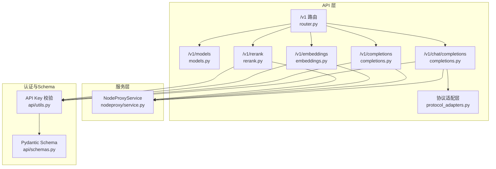
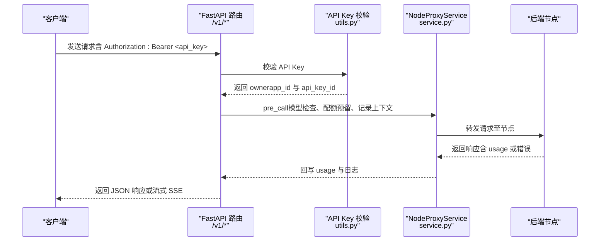
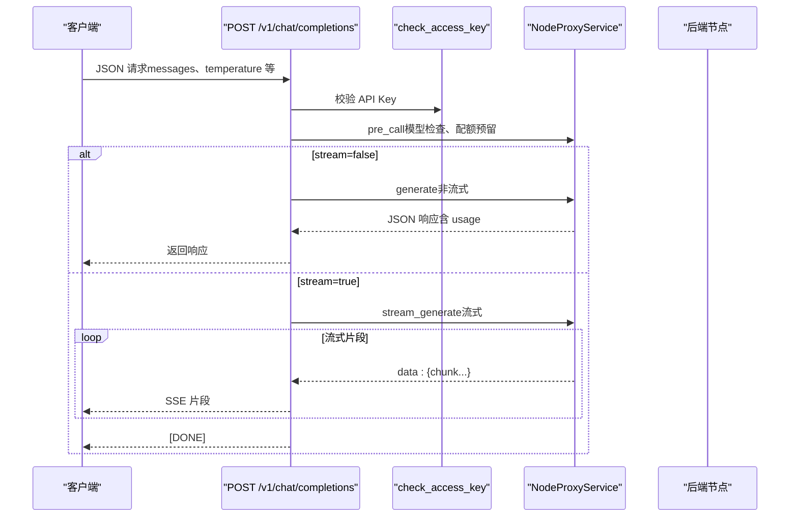
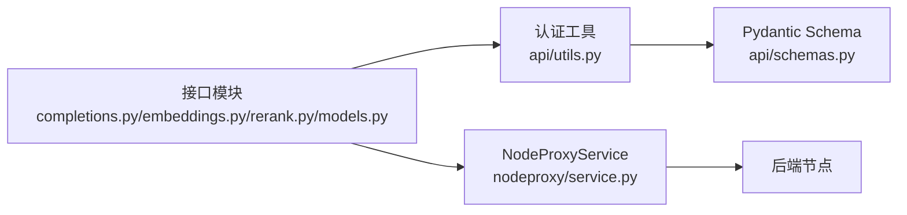
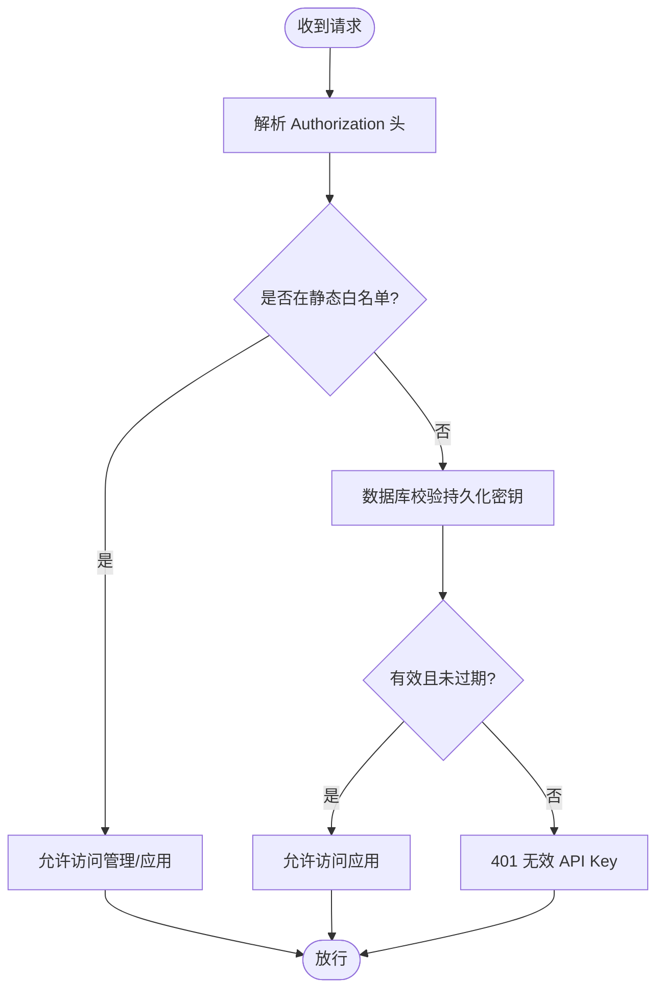

# OpenAI兼容API

<cite>
**本文引用的文件**
- [src/apiproxy/openaiproxy/api/v1/completions.py](file://src/apiproxy/openaiproxy/api/v1/completions.py)
- [src/apiproxy/openaiproxy/api/v1/anthropic.py](file://src/apiproxy/openaiproxy/api/v1/anthropic.py)
- [src/apiproxy/openaiproxy/api/v1/embeddings.py](file://src/apiproxy/openaiproxy/api/v1/embeddings.py)
- [src/apiproxy/openaiproxy/api/v1/rerank.py](file://src/apiproxy/openaiproxy/api/v1/rerank.py)
- [src/apiproxy/openaiproxy/api/v1/models.py](file://src/apiproxy/openaiproxy/api/v1/models.py)
- [src/apiproxy/openaiproxy/api/v1/protocol_adapters.py](file://src/apiproxy/openaiproxy/api/v1/protocol_adapters.py)
- [src/apiproxy/openaiproxy/api/schemas.py](file://src/apiproxy/openaiproxy/api/schemas.py)
- [src/apiproxy/openaiproxy/api/router.py](file://src/apiproxy/openaiproxy/api/router.py)
- [src/apiproxy/openaiproxy/api/utils.py](file://src/apiproxy/openaiproxy/api/utils.py)
- [src/apiproxy/openaiproxy/services/nodeproxy/service.py](file://src/apiproxy/openaiproxy/services/nodeproxy/service.py)
- [src/apiproxy/openaiproxy/services/nodeproxy/schemas.py](file://src/apiproxy/openaiproxy/services/nodeproxy/schemas.py)
- [docs/api.md](file://docs/api.md)
- [docs/schemas.md](file://docs/schemas.md)
- [src/apiproxy/tests/api/test_completions_responses.py](file://src/apiproxy/tests/api/test_completions_responses.py)
</cite>

## 目录

1. [简介](#简介)
2. [项目结构](#项目结构)
3. [核心组件](#核心组件)
4. [架构总览](#架构总览)
5. [详细组件分析](#详细组件分析)
6. [依赖分析](#依赖分析)
7. [性能考虑](#性能考虑)
8. [故障排查指南](#故障排查指南)
9. [结论](#结论)
10. [附录](#附录)

## 简介

本文件为 OpenAI 兼容 API 的参考文档，覆盖以下核心接口：

- Chat Completions（/v1/chat/completions）
- Completions（/v1/completions）
- Embeddings（/v1/embeddings）
- Rerank（/v1/rerank）
- Models（/v1/models）

说明：当前项目已同时提供 Anthropic 兼容接口，Anthropic 相关说明见同目录新增页面 `Anthropic兼容API.md`。其中 `/v1/models` 已经变为协议感知接口，会根据请求协议返回 OpenAI 或 Anthropic 兼容结构。

文档内容包括：

- 完整的 HTTP 方法、URL 路径、请求体 Schema 与响应 Schema
- 参数字段的数据类型、必填性、默认值与取值范围
- 认证方式（API Key）与授权流程
- 错误响应格式、状态码含义与异常处理
- 性能优化建议、并发处理与最佳实践
- 流式响应处理、批量请求与重试策略
- curl 示例与 SDK 调用指引（以路径形式给出，避免直接粘贴代码）

## 项目结构

OpenAI 兼容接口位于 v1 路由下，采用 FastAPI 构建，核心文件组织如下：

- 路由聚合：/v1 路由挂载四个子路由模块
- 接口实现：各接口在独立模块中定义，统一通过依赖注入的服务进行节点代理与配额控制
- 数据模型：请求/响应 Schema 使用 Pydantic 定义，确保类型安全与自动文档生成
- 认证工具：基于 HTTP Bearer Token 的 API Key 校验，支持静态白名单与数据库持久化密钥
- 协议适配层：当北向或南向协议不一致时，负责与 Anthropic 接口做双向转换

图表来源

- [src/apiproxy/openaiproxy/api/router.py:37-45](file://src/apiproxy/openaiproxy/api/router.py#L37-L45)
- [src/apiproxy/openaiproxy/api/v1/models.py:38-55](file://src/apiproxy/openaiproxy/api/v1/models.py#L38-L55)
- [src/apiproxy/openaiproxy/api/v1/completions.py:447-691](file://src/apiproxy/openaiproxy/api/v1/completions.py#L447-L691)
- [src/apiproxy/openaiproxy/api/v1/embeddings.py:271-356](file://src/apiproxy/openaiproxy/api/v1/embeddings.py#L271-L356)
- [src/apiproxy/openaiproxy/api/v1/rerank.py:279-368](file://src/apiproxy/openaiproxy/api/v1/rerank.py#L279-L368)
- [src/apiproxy/openaiproxy/api/utils.py:120-216](file://src/apiproxy/openaiproxy/api/utils.py#L120-L216)
- [src/apiproxy/openaiproxy/services/nodeproxy/service.py:137-156](file://src/apiproxy/openaiproxy/services/nodeproxy/service.py#L137-L156)

章节来源

- [src/apiproxy/openaiproxy/api/router.py:37-45](file://src/apiproxy/openaiproxy/api/router.py#L37-L45)
- [docs/api.md:8-16](file://docs/api.md#L8-L16)

## 核心组件

- 认证与授权
  - /v1 接口使用 Bearer Token API Key 校验，支持静态白名单与数据库持久化密钥
  - 管理接口使用独立的管理密钥校验
- 协议兼容
  - OpenAI 入口保持原有行为不变
  - 当目标节点仅支持 Anthropic 协议时，由协议适配层负责请求与响应转换
- 节点代理服务
  - NodeProxyService 负责模型可用性检查、节点选择、配额预留与结算、请求转发与回写日志
- Schema 定义
  - ChatCompletionRequest/Response、CompletionRequest/Response、EmbeddingsRequest/Response、RerankRequest 等
- 错误响应
  - 统一的 ErrorResponse 结构，包含 message、type、code、param、object

章节来源

- [src/apiproxy/openaiproxy/api/utils.py:120-216](file://src/apiproxy/openaiproxy/api/utils.py#L120-L216)
- [src/apiproxy/openaiproxy/services/nodeproxy/schemas.py:57-64](file://src/apiproxy/openaiproxy/services/nodeproxy/schemas.py#L57-L64)
- [src/apiproxy/openaiproxy/api/schemas.py:157-381](file://src/apiproxy/openaiproxy/api/schemas.py#L157-L381)

## 架构总览

OpenAI 兼容接口的典型调用链路如下：

图表来源

- [src/apiproxy/openaiproxy/api/v1/completions.py:533-690](file://src/apiproxy/openaiproxy/api/v1/completions.py#L533-L690)
- [src/apiproxy/openaiproxy/api/v1/embeddings.py:303-355](file://src/apiproxy/openaiproxy/api/v1/embeddings.py#L303-L355)
- [src/apiproxy/openaiproxy/api/v1/rerank.py:315-367](file://src/apiproxy/openaiproxy/api/v1/rerank.py#L315-L367)
- [src/apiproxy/openaiproxy/api/utils.py:120-216](file://src/apiproxy/openaiproxy/api/utils.py#L120-L216)
- [src/apiproxy/openaiproxy/services/nodeproxy/service.py:137-156](file://src/apiproxy/openaiproxy/services/nodeproxy/service.py#L137-L156)

## 详细组件分析

### Chat Completions（/v1/chat/completions）

- HTTP 方法与路径
  - POST /v1/chat/completions
- 认证
  - Bearer Token API Key（应用级），支持静态白名单与数据库持久化密钥
- 请求体 Schema（节选关键字段）
  - model: string（必填）
  - messages: string | array（必填，元素为对象，包含 role 与 content）
  - temperature: float（0.0~2.0，可选，默认 0.7）
  - top_p: float（0.0~1.0，可选，默认 1.0）
  - n: int（可选，默认 1）
  - max_tokens: int（可选）
  - stop: string | array（可选）
  - stream: bool（可选，默认 false）
  - stream_options: object（可选，包含 include_usage）
  - presence_penalty/frequency_penalty: float（可选，内部映射为 repetition_penalty）
  - tools: array（可选，函数工具定义）
  - tool_choice: string | object（可选）
  - response_format: object（可选，支持 text/json_object/json_schema/regex_schema）
  - 其他扩展参数：repetition_penalty、top_k、ignore_eos、skip_special_tokens、min_new_tokens、min_p 等
- 响应 Schema（非流式）
  - id: string
  - object: "chat.completion"
  - created: int（时间戳）
  - model: string
  - choices: array（元素为包含 message、finish_reason 的对象）
  - usage: object（prompt_tokens、total_tokens、completion_tokens）
- 响应 Schema（流式）
  - 对象类型为 "chat.completion.chunk"
  - choices: array（元素为包含 delta、finish_reason 的对象）
  - usage: 可选（当 include_usage=true 时）
- 错误响应
  - 401 无效或过期 API Key
  - 429 配额耗尽（quota_exceeded）
  - 503 北向配额处理失败（service_unavailable_error）
  - 404 模型不可用
  - 408/504 后端超时映射为 408/503
- curl 示例
  - 非流式：[curl 示例路径:1-112](file://docs/api.md#L1-L112)
  - 流式：[curl 示例路径:1-112](file://docs/api.md#L1-L112)
- SDK 调用示例
  - Python requests：[示例路径:555-657](file://src/apiproxy/openaiproxy/api/v1/completions.py#L555-L657)
  - 其他语言：参考请求体 Schema 与响应 Schema 自行封装

图表来源

- [src/apiproxy/openaiproxy/api/v1/completions.py:450-691](file://src/apiproxy/openaiproxy/api/v1/completions.py#L450-L691)
- [src/apiproxy/openaiproxy/api/utils.py:120-216](file://src/apiproxy/openaiproxy/api/utils.py#L120-L216)
- [src/apiproxy/openaiproxy/services/nodeproxy/service.py:137-156](file://src/apiproxy/openaiproxy/services/nodeproxy/service.py#L137-L156)

章节来源

- [src/apiproxy/openaiproxy/api/v1/completions.py:450-691](file://src/apiproxy/openaiproxy/api/v1/completions.py#L450-L691)
- [src/apiproxy/openaiproxy/api/schemas.py:157-282](file://src/apiproxy/openaiproxy/api/schemas.py#L157-L282)
- [src/apiproxy/tests/api/test_completions_responses.py:7-37](file://src/apiproxy/tests/api/test_completions_responses.py#L7-L37)

### Completions（/v1/completions）

- HTTP 方法与路径
  - POST /v1/completions
- 认证
  - Bearer Token API Key（应用级）
- 请求体 Schema（节选关键字段）
  - model: string（必填）
  - prompt: string | array（必填）
  - temperature/top_p/n: 同 Chat Completions
  - max_tokens: int（可选，默认 16）
  - stop: string | array（可选）
  - stream: bool（可选，默认 false）
  - presence_penalty/frequency_penalty: float（可选，内部映射为 repetition_penalty）
  - 其他扩展参数：repetition_penalty、top_k、ignore_eos、skip_special_tokens 等
- 响应 Schema（非流式）
  - object: "text_completion"
  - choices: array（元素为包含 text、finish_reason 的对象）
  - usage: object（prompt_tokens、total_tokens、completion_tokens）
- 响应 Schema（流式）
  - 对象类型为 "text_completion"
  - choices: array（元素为包含 text、finish_reason 的对象）
  - usage: 可选
- 错误响应
  - 同 Chat Completions
- curl 示例与 SDK 调用
  - 参考 Chat Completions 的示例路径与实现

章节来源

- [src/apiproxy/openaiproxy/api/v1/completions.py:693-858](file://src/apiproxy/openaiproxy/api/v1/completions.py#L693-L858)
- [src/apiproxy/openaiproxy/api/schemas.py:284-351](file://src/apiproxy/openaiproxy/api/schemas.py#L284-L351)

### Embeddings（/v1/embeddings）

- HTTP 方法与路径
  - POST /v1/embeddings
- 认证
  - Bearer Token API Key（应用级）
- 请求体 Schema（节选关键字段）
  - model: string（必填）
  - input: string | array（必填，单个或多个文本）
  - user: string（可选）
- 响应 Schema
  - object: "list"
  - data: array（元素为包含 embedding、index、object 的对象）
  - model: string
  - usage: object（prompt_tokens、total_tokens、completion_tokens）
- 错误响应
  - 同 Chat Completions
- curl 示例与 SDK 调用
  - 参考 Chat Completions 的示例路径与实现

章节来源

- [src/apiproxy/openaiproxy/api/v1/embeddings.py:274-356](file://src/apiproxy/openaiproxy/api/v1/embeddings.py#L274-L356)
- [src/apiproxy/openaiproxy/api/schemas.py:353-366](file://src/apiproxy/openaiproxy/api/schemas.py#L353-L366)

### Rerank（/v1/rerank）

- HTTP 方法与路径
  - POST /v1/rerank
- 认证
  - Bearer Token API Key（应用级）
- 请求体 Schema（节选关键字段）
  - model: string（必填）
  - query: string | array（必填）
  - documents: array（可选）
  - user: string（可选）
- 响应 Schema
  - 文档排序后的结果列表（具体结构取决于后端节点实现）
  - usage: object（prompt_tokens、total_tokens、completion_tokens）
- 错误响应
  - 同 Chat Completions
- curl 示例与 SDK 调用
  - 参考 Chat Completions 的示例路径与实现

章节来源

- [src/apiproxy/openaiproxy/api/v1/rerank.py:282-368](file://src/apiproxy/openaiproxy/api/v1/rerank.py#L282-L368)
- [src/apiproxy/openaiproxy/api/schemas.py:368-379](file://src/apiproxy/openaiproxy/api/schemas.py#L368-L379)

### Models（/v1/models）

- HTTP 方法与路径
  - GET /v1/models
- 认证
  - Bearer Token API Key（应用级）
- 响应 Schema
  - object: "list"
  - data: array（元素为 ModelCard，包含 id、root、permission）
- curl 示例与 SDK 调用
  - 参考示例路径与实现

章节来源

- [src/apiproxy/openaiproxy/api/v1/models.py:38-55](file://src/apiproxy/openaiproxy/api/v1/models.py#L38-L55)
- [src/apiproxy/openaiproxy/api/schemas.py:82-97](file://src/apiproxy/openaiproxy/api/schemas.py#L82-L97)

## 依赖分析

- 组件耦合
  - 接口层仅负责参数解析与转发，业务逻辑集中在 NodeProxyService
  - 认证工具与 Schema 解耦于接口实现，便于复用与测试
- 外部依赖
  - FastAPI（路由与依赖注入）
  - orjson（高性能 JSON 编解码）
  - requests（HTTP 转发）
  - Pydantic（Schema 校验与序列化）
- 潜在循环依赖
  - 当前模块间为单向依赖（路由→服务→节点），未发现循环

图表来源

- [src/apiproxy/openaiproxy/api/v1/completions.py:447-456](file://src/apiproxy/openaiproxy/api/v1/completions.py#L447-L456)
- [src/apiproxy/openaiproxy/api/v1/embeddings.py:271-279](file://src/apiproxy/openaiproxy/api/v1/embeddings.py#L271-L279)
- [src/apiproxy/openaiproxy/api/v1/rerank.py:279-287](file://src/apiproxy/openaiproxy/api/v1/rerank.py#L279-L287)
- [src/apiproxy/openaiproxy/api/v1/models.py:36-42](file://src/apiproxy/openaiproxy/api/v1/models.py#L36-L42)
- [src/apiproxy/openaiproxy/api/utils.py:120-216](file://src/apiproxy/openaiproxy/api/utils.py#L120-L216)
- [src/apiproxy/openaiproxy/services/nodeproxy/service.py:137-156](file://src/apiproxy/openaiproxy/services/nodeproxy/service.py#L137-L156)
- [src/apiproxy/openaiproxy/api/schemas.py:157-381](file://src/apiproxy/openaiproxy/api/schemas.py#L157-L381)

## 性能考虑

- 流式响应
  - 优先使用 stream=true 获取实时增量输出，降低首字节延迟
  - 流式模式下自动记录首次响应时间与累计 token 数
- Token 估算
  - 内置基于 tiktoken 的 token 估算，用于配额预留与 usage 记录
  - 若未安装 tiktoken，退化为启发式估算
- 并发与背压
  - NodeProxyService 支持节点健康检查与配额控制，避免过载
  - 客户端断开连接时及时标记 abort 并清理资源
- 批量请求
  - Embeddings/Rerank 支持数组输入，建议合并请求以减少网络开销
- 超时与重试
  - 后端超时映射为 408/504，建议客户端实现指数退避重试
  - 配额耗尽（429）时可等待配额恢复或切换节点

[本节为通用指导，不直接分析具体文件]

## 故障排查指南

- 常见错误与状态码
  - 401 无效或过期 API Key（invalid_api_key/expired_api_key）
  - 404 模型不可用（handle_unavailable_model）
  - 429 配额耗尽（quota_exceeded）
  - 503 北向配额处理失败（service_unavailable_error）
  - 408/504 后端超时（API_TIMEOUT/SERVICE_UNAVAILABLE 映射）
- 错误响应格式
  - 统一结构：{ message, type, code, param, object }
- 定位步骤
  - 检查 Authorization 头是否正确传递
  - 查看 /v1/models 确认模型可用
  - 关注 usage 字段与日志表（openaiapi_nodelogs）定位问题
- 单元测试参考
  - 后端 JSON 响应状态码映射测试

章节来源

- [src/apiproxy/openaiproxy/services/nodeproxy/schemas.py:57-64](file://src/apiproxy/openaiproxy/services/nodeproxy/schemas.py#L57-L64)
- [src/apiproxy/openaiproxy/api/v1/completions.py:342-360](file://src/apiproxy/openaiproxy/api/v1/completions.py#L342-L360)
- [src/apiproxy/tests/api/test_completions_responses.py:7-37](file://src/apiproxy/tests/api/test_completions_responses.py#L7-L37)

## 结论

本项目以清晰的模块划分与强类型的 Schema 定义，实现了对 OpenAI 兼容接口的完整覆盖。通过 NodeProxyService 提供的配额与日志能力，能够稳定支撑生产环境的高并发与高可用需求。建议在生产中结合流式响应、批量请求与合理的重试策略，进一步提升用户体验与系统吞吐。

[本节为总结性内容，不直接分析具体文件]

## 附录

### 认证与授权流程

- 应用 API Key 校验
  - 从 Authorization 头提取 Bearer Token
  - 支持静态白名单与数据库持久化密钥
  - 校验通过后在请求上下文中注入 ownerapp_id 与 api_key_id
- 管理接口
  - 使用独立的管理密钥校验，未配置时返回 503

图表来源

- [src/apiproxy/openaiproxy/api/utils.py:120-216](file://src/apiproxy/openaiproxy/api/utils.py#L120-L216)

章节来源

- [src/apiproxy/openaiproxy/api/utils.py:82-216](file://src/apiproxy/openaiproxy/api/utils.py#L82-L216)
- [docs/api.md:3-7](file://docs/api.md#L3-L7)

### 数据模型与表结构（简要）

- 接口访问密钥（openaiapi_apikeys）
  - 字段：id、name、description、key、ownerapp_id、created_at、enabled、expires_at
- 节点与模型（openaiapi_nodes、openaiapi_models）
  - 节点：url 唯一、name、description、api_key、health_check、enabled
  - 模型：node_id、model_name、model_type（chat/embeddings/rerank）、enabled
- 代理运行实例与状态（openaiapi_proxy、openaiapi_status）
  - 记录实例与节点状态（latency、speed、available）
- 节点请求日志（openaiapi_nodelogs）
  - 记录每次请求的 token 使用、错误信息、响应数据等

章节来源

- [docs/schemas.md:5-125](file://docs/schemas.md#L5-L125)
