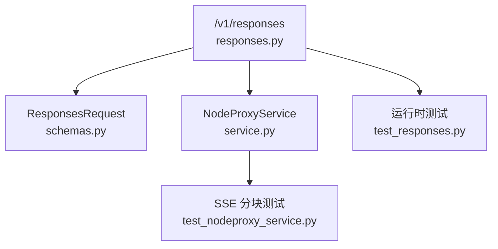
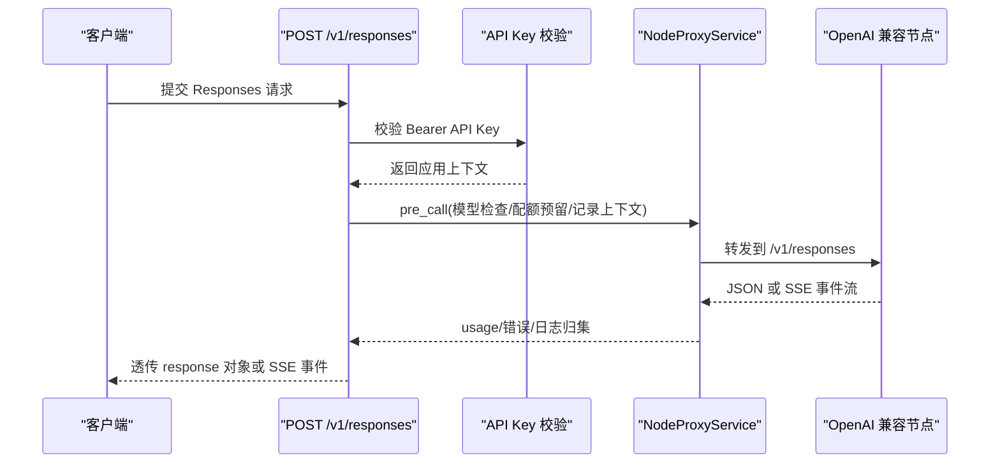

# Responses接口

<cite>
**本文引用的文件**
- [responses.py](file://src/apiproxy/openaiproxy/api/v1/responses.py)
- [schemas.py](file://src/apiproxy/openaiproxy/api/schemas.py)
- [router.py](file://src/apiproxy/openaiproxy/api/router.py)
- [service.py](file://src/apiproxy/openaiproxy/services/nodeproxy/service.py)
- [test_responses.py](file://src/apiproxy/tests/api/test_responses.py)
- [test_nodeproxy_service.py](file://src/apiproxy/tests/services/test_nodeproxy_service.py)
</cite>

## 目录
1. [简介](#简介)
2. [项目结构](#项目结构)
3. [核心组件](#核心组件)
4. [架构总览](#架构总览)
5. [详细组件分析](#详细组件分析)
6. [依赖分析](#依赖分析)
7. [性能考虑](#性能考虑)
8. [故障排查指南](#故障排查指南)
9. [结论](#结论)

## 简介
本文件描述 OpenAI Responses 接口（POST /v1/responses）的当前实现。该接口面向已迁移到新 OpenAI SDK 的客户端，支持最小可用的 JSON 与 SSE 代理能力，复用现有配额、节点选择、错误映射与请求日志链路。

当前实现边界：
- 仅代理到 OpenAI 兼容后端节点
- 支持非流式 JSON 响应与 typed SSE 流式事件
- 不做 Anthropic 协议转换
- 不包含 Realtime WebSocket API

## 项目结构
Responses 接口位于 OpenAI 兼容 API 模块下，核心链路由路由层、请求 schema、节点代理服务与测试文件组成。

图表来源
- [responses.py](file://src/apiproxy/openaiproxy/api/v1/responses.py)
- [test_responses.py](file://src/apiproxy/tests/api/test_responses.py)

## 核心组件
- 请求 schema
  - `ResponsesRequest` 仅显式声明 `model`、`input`、`instructions`、`max_output_tokens`、`stream`、`user` 等最小字段，同时保留额外扩展字段透传
- token 估算
  - 使用 `input` 与 `instructions` 估算 prompt token，并结合 `max_output_tokens` 推导总量上限
- 流式代理
  - 保留完整 SSE `event`/`data` 事件块，避免 `response.created`、`response.output_text.delta` 等事件头丢失
- 可观测性
  - 请求日志动作使用 `responses`，支持在日志查询中与 `completions` 分开过滤

## 架构总览

图表来源
- [responses.py](file://src/apiproxy/openaiproxy/api/v1/responses.py)

## 详细组件分析

### 请求体
- 必填字段
  - `model`
- 常用字段
  - `input`
  - `instructions`
  - `max_output_tokens`
  - `stream`
- 透传字段
  - `reasoning`、`metadata`、`tools`、Omni 音频相关扩展字段等

### 非流式响应
- 直接透传后端返回的 `response` 对象
- 若后端返回 `usage`，会同步回填到请求上下文，用于配额结算与请求日志

### 流式响应
- 保留完整 typed SSE 事件块
- 支持从 `usage` 或 `response.usage` 提取 token 统计
- 支持累积 `response.output_text.delta` 文本，作为流式日志与 token 回填依据

### 兼容性边界
- 仅使用 `ModelType.chat` 的 OpenAI 兼容节点
- 不尝试将 Responses 请求转换为 Anthropic Messages 请求
- 不提供 Realtime WebSocket 代理

### 测试覆盖
- `test_responses.py`
  - 扩展字段透传
  - 非流式代理与 usage 回填
  - 流式 SSE 事件保真
  - 节点模型配额异常
- `test_nodeproxy_service.py`
  - 验证底层 `stream_generate` 会按完整 SSE 事件块产出数据

## 依赖分析
- 路由层依赖 `check_access_key` 提供应用上下文
- 业务层依赖 `NodeProxyService` 提供节点选择、配额处理与请求转发
- 流式行为依赖 `DisconnectHandlerStreamingResponse` 保证断连时正确收尾

## 性能考虑
- token 估算沿用现有轻量启发式与 tiktoken 优化路径
- 流式响应按完整 SSE 事件块转发，减少事件头与数据体拆分带来的兼容性问题

## 故障排查指南
- 返回 404
  - 检查是否存在 OpenAI 兼容的 chat 模型节点
- 返回 429
  - 检查节点模型配额、应用配额或 API Key 配额是否耗尽
- Responses 客户端无法识别流式事件
  - 检查上游是否真的返回 `event`/`data` SSE；当前代理会保留完整事件块，不会主动降级为纯 `data:` 流
- 需要 Realtime API
  - 当前版本未实现 WebSocket 代理，需要单独补充双向会话转发能力

## 结论
`/v1/responses` 已可作为 OpenAI 新 SDK 的最小可用代理入口，适用于常规文本与多模态 Responses 请求；若后续需要更深的工具调用编排或 Realtime 能力，应在此基础上继续扩展。