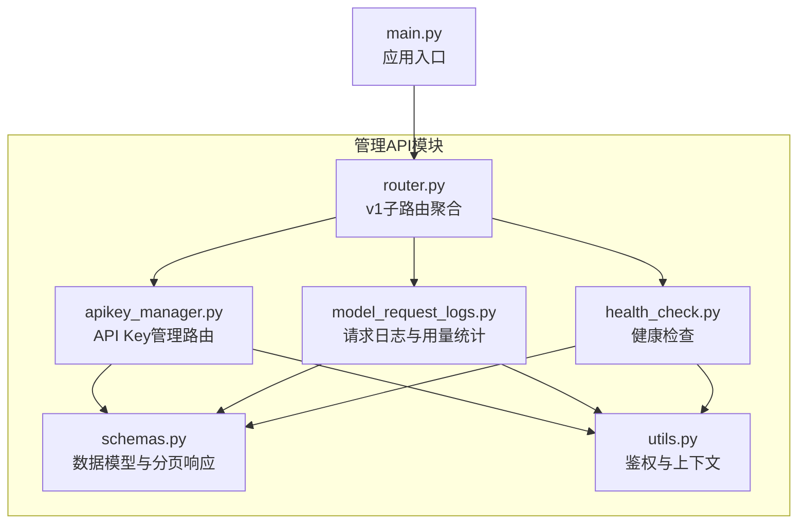
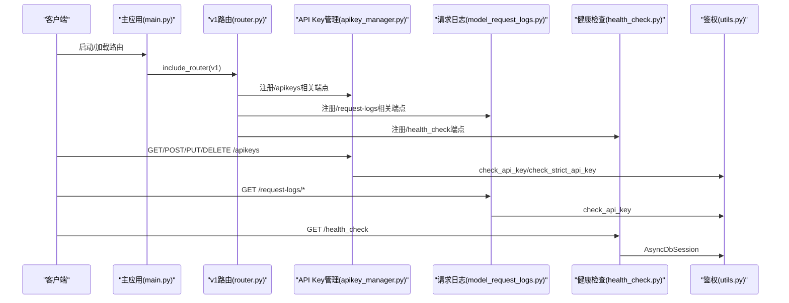
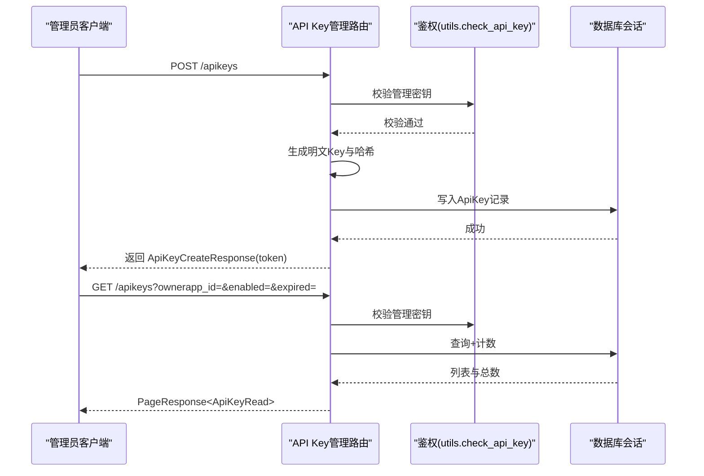
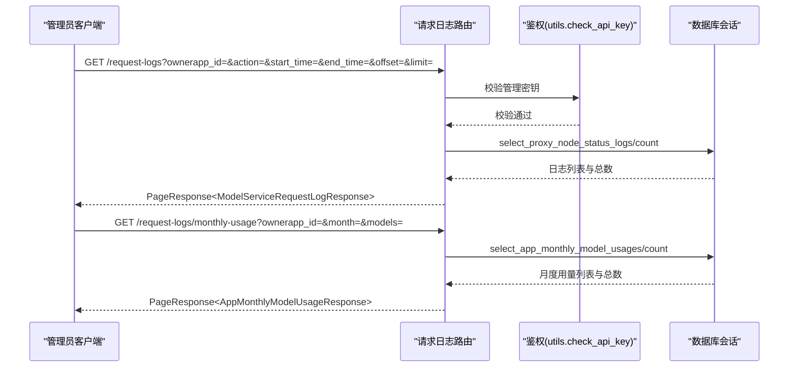
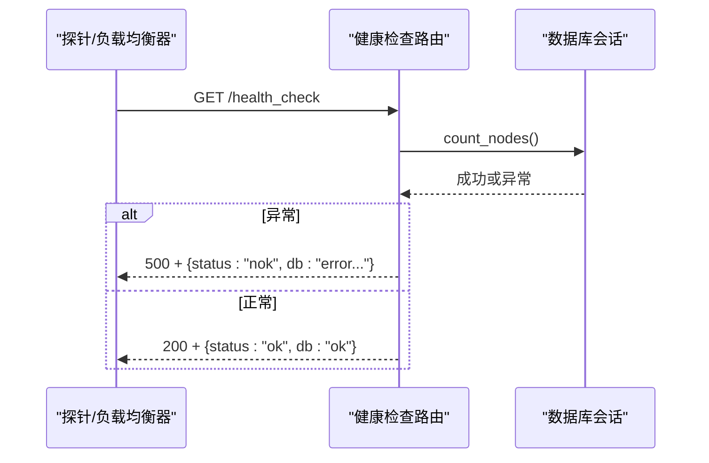
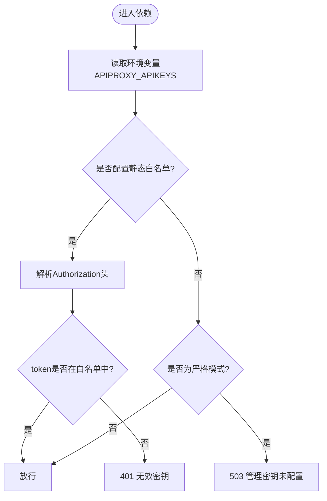
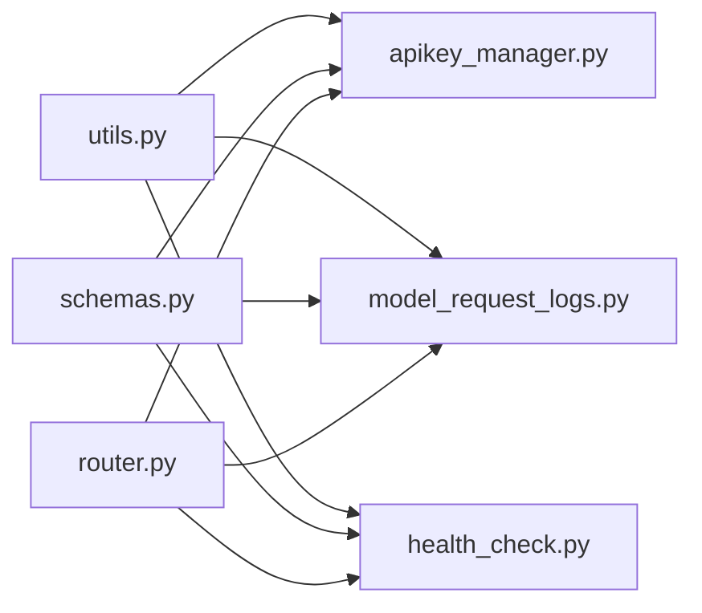

# 管理API

<cite>
**本文引用的文件**
- [src/apiproxy/openaiproxy/api/apikey_manager.py](file://src/apiproxy/openaiproxy/api/apikey_manager.py)
- [src/apiproxy/openaiproxy/api/model_request_logs.py](file://src/apiproxy/openaiproxy/api/model_request_logs.py)
- [src/apiproxy/openaiproxy/api/health_check.py](file://src/apiproxy/openaiproxy/api/health_check.py)
- [src/apiproxy/openaiproxy/api/schemas.py](file://src/apiproxy/openaiproxy/api/schemas.py)
- [src/apiproxy/openaiproxy/api/utils.py](file://src/apiproxy/openaiproxy/api/utils.py)
- [src/apiproxy/openaiproxy/api/router.py](file://src/apiproxy/openaiproxy/api/router.py)
- [src/apiproxy/openaiproxy/main.py](file://src/apiproxy/openaiproxy/main.py)
- [src/apiproxy/openaiproxy/settings.py](file://src/apiproxy/openaiproxy/settings.py)
</cite>

## 目录

1. [简介](#简介)
2. [项目结构](#项目结构)
3. [核心组件](#核心组件)
4. [架构总览](#架构总览)
5. [详细组件分析](#详细组件分析)
6. [依赖分析](#依赖分析)
7. [性能考量](#性能考量)
8. [故障排查指南](#故障排查指南)
9. [结论](#结论)
10. [附录](#附录)

## 简介

本文件为管理API的综合性参考文档，覆盖以下主题：

- API Key管理接口：创建、删除、禁用、查询与详情查看
- 请求日志查询接口：支持多粒度统计、过滤、分页与导出能力
- 健康检查接口：完整规范与状态码说明
- 权限控制与审计：基于访问密钥的鉴权、上下文注入与审计字段
- 安全与访问控制：密钥格式、有效期校验、静态白名单与严格模式
- 最佳实践与常见场景：密钥生命周期管理、配额与用量统计
- 错误处理、限流与监控：错误响应结构、建议的限流与监控集成方式
- 管理界面与CLI：基于现有路由的使用示例与集成思路
- 与监控系统集成：指标采集与告警配置建议

## 项目结构

管理API由FastAPI路由模块、数据模型与工具函数组成，核心位于openaiproxy/api目录下，配合settings与main入口进行启动与路由挂载。

图表来源

- [src/apiproxy/openaiproxy/api/router.py:37-45](file://src/apiproxy/openaiproxy/api/router.py#L37-L45)
- [src/apiproxy/openaiproxy/api/apikey_manager.py:59](file://src/apiproxy/openaiproxy/api/apikey_manager.py#L59)
- [src/apiproxy/openaiproxy/api/model_request_logs.py:39](file://src/apiproxy/openaiproxy/api/model_request_logs.py#L39)
- [src/apiproxy/openaiproxy/api/health_check.py:35](file://src/apiproxy/openaiproxy/api/health_check.py#L35)
- [src/apiproxy/openaiproxy/api/schemas.py:432](file://src/apiproxy/openaiproxy/api/schemas.py#L432)
- [src/apiproxy/openaiproxy/api/utils.py:48](file://src/apiproxy/openaiproxy/api/utils.py#L48)

章节来源

- [src/apiproxy/openaiproxy/api/router.py:37-45](file://src/apiproxy/openaiproxy/api/router.py#L37-L45)
- [src/apiproxy/openaiproxy/api/apikey_manager.py:59](file://src/apiproxy/openaiproxy/api/apikey_manager.py#L59)
- [src/apiproxy/openaiproxy/api/model_request_logs.py:39](file://src/apiproxy/openaiproxy/api/model_request_logs.py#L39)
- [src/apiproxy/openaiproxy/api/health_check.py:35](file://src/apiproxy/openaiproxy/api/health_check.py#L35)
- [src/apiproxy/openaiproxy/api/schemas.py:432](file://src/apiproxy/openaiproxy/api/schemas.py#L432)
- [src/apiproxy/openaiproxy/api/utils.py:48](file://src/apiproxy/openaiproxy/api/utils.py#L48)

## 核心组件

- API Key管理路由：提供分页查询、创建、详情、更新与删除接口；支持按名称、所属应用、启用状态、过期状态等条件过滤
- 请求日志与用量统计：提供请求日志分页查询与多粒度用量统计（日/周/月/年），支持多种过滤条件与分页
- 健康检查：对数据库连通性进行可靠检查，返回标准化健康状态
- 鉴权与上下文：提供通用鉴权依赖、严格模式鉴权、以及将ownerapp_id与api_key_id注入请求上下文的能力
- 数据模型与分页：统一的分页响应结构与各接口的数据模型定义

章节来源

- [src/apiproxy/openaiproxy/api/apikey_manager.py:65-269](file://src/apiproxy/openaiproxy/api/apikey_manager.py#L65-L269)
- [src/apiproxy/openaiproxy/api/model_request_logs.py:128-552](file://src/apiproxy/openaiproxy/api/model_request_logs.py#L128-L552)
- [src/apiproxy/openaiproxy/api/health_check.py:50-76](file://src/apiproxy/openaiproxy/api/health_check.py#L50-L76)
- [src/apiproxy/openaiproxy/api/utils.py:85-216](file://src/apiproxy/openaiproxy/api/utils.py#L85-L216)
- [src/apiproxy/openaiproxy/api/schemas.py:432](file://src/apiproxy/openaiproxy/api/schemas.py#L432)

## 架构总览

管理API通过FastAPI路由组织，统一依赖鉴权中间件，数据层通过异步会话访问数据库。v1子路由聚合了多个业务域的接口，便于版本化管理。

图表来源

- [src/apiproxy/openaiproxy/main.py](file://src/apiproxy/openaiproxy/main.py)
- [src/apiproxy/openaiproxy/api/router.py:37-45](file://src/apiproxy/openaiproxy/api/router.py#L37-L45)
- [src/apiproxy/openaiproxy/api/apikey_manager.py:59](file://src/apiproxy/openaiproxy/api/apikey_manager.py#L59)
- [src/apiproxy/openaiproxy/api/model_request_logs.py:39](file://src/apiproxy/openaiproxy/api/model_request_logs.py#L39)
- [src/apiproxy/openaiproxy/api/health_check.py:35](file://src/apiproxy/openaiproxy/api/health_check.py#L35)
- [src/apiproxy/openaiproxy/api/utils.py:48](file://src/apiproxy/openaiproxy/api/utils.py#L48)

## 详细组件分析

### API Key管理接口

- 路由标签：应用API密钥管理
- 依赖：check_api_key（通用管理密钥校验）
- 主要端点
  - GET /apikeys：分页查询API Key，支持按name、ownerapp_id、enabled、expired过滤，支持orderby、offset、limit
  - POST /apikeys：创建API Key，返回一次性token
  - GET /apikeys/{api_key_id}：获取指定ID的API Key详情
  - POST /apikeys/{api_key_id}：更新API Key（支持部分字段）
  - DELETE /apikeys/{api_key_id}：删除API Key（仅允许删除已禁用的Key）

图表来源

- [src/apiproxy/openaiproxy/api/apikey_manager.py:65-196](file://src/apiproxy/openaiproxy/api/apikey_manager.py#L65-L196)
- [src/apiproxy/openaiproxy/api/apikey_manager.py:197-269](file://src/apiproxy/openaiproxy/api/apikey_manager.py#L197-L269)
- [src/apiproxy/openaiproxy/api/utils.py:85-114](file://src/apiproxy/openaiproxy/api/utils.py#L85-L114)

章节来源

- [src/apiproxy/openaiproxy/api/apikey_manager.py:65-269](file://src/apiproxy/openaiproxy/api/apikey_manager.py#L65-L269)
- [src/apiproxy/openaiproxy/api/schemas.py:451-480](file://src/apiproxy/openaiproxy/api/schemas.py#L451-L480)

### 请求日志查询接口

- 路由标签：模型服务请求记录管理
- 依赖：check_api_key
- 主要端点
  - GET /request-logs：分页查询请求日志，支持log_id、node_id、proxy_id、status_id、ownerapp_id、action、model_name、error、abort、stream、processing、start_time、end_time等过滤
  - GET /request-logs/daily-usage：按日统计用量
  - GET /request-logs/weekly-usage：按周统计用量
  - GET /request-logs/monthly-usage：按月统计用量
  - GET /request-logs/yearly-usage：按年统计用量
  - GET /request-logs/yearly-usage-total：按年统计总量
  - GET /request-logs/monthly-usage-total：按月统计总量

图表来源

- [src/apiproxy/openaiproxy/api/model_request_logs.py:128-552](file://src/apiproxy/openaiproxy/api/model_request_logs.py#L128-L552)
- [src/apiproxy/openaiproxy/api/utils.py:85-114](file://src/apiproxy/openaiproxy/api/utils.py#L85-L114)

章节来源

- [src/apiproxy/openaiproxy/api/model_request_logs.py:128-552](file://src/apiproxy/openaiproxy/api/model_request_logs.py#L128-L552)
- [src/apiproxy/openaiproxy/api/schemas.py:585-696](file://src/apiproxy/openaiproxy/api/schemas.py#L585-L696)

### 健康检查接口

- 路由标签：心跳检查接口
- 端点
  - GET /health：兼容uvicorn默认健康检查（实例未完全启动前可用）
  - GET /health_check：对关键服务进行可靠检查，返回标准化健康状态
- 响应模型：HealthResponse，包含status与db字段；当存在错误时返回500并携带错误详情

图表来源

- [src/apiproxy/openaiproxy/api/health_check.py:50-76](file://src/apiproxy/openaiproxy/api/health_check.py#L50-L76)

章节来源

- [src/apiproxy/openaiproxy/api/health_check.py:50-76](file://src/apiproxy/openaiproxy/api/health_check.py#L50-L76)

### 鉴权与上下文注入

- 通用鉴权：check_api_key
  - 支持通过环境变量APIPROXY_APIKEYS配置静态白名单
  - 未配置时默认放行（allow all）
- 严格模式鉴权：check_strict_api_key
  - 要求必须显式配置管理密钥，否则直接拒绝
- 访问密钥上下文：check_access_key
  - 解析令牌，校验有效性与有效期
  - 将ownerapp_id与api_key_id注入请求上下文，便于审计与追踪

图表来源

- [src/apiproxy/openaiproxy/api/utils.py:85-114](file://src/apiproxy/openaiproxy/api/utils.py#L85-L114)
- [src/apiproxy/openaiproxy/api/utils.py:120-216](file://src/apiproxy/openaiproxy/api/utils.py#L120-L216)

章节来源

- [src/apiproxy/openaiproxy/api/utils.py:85-114](file://src/apiproxy/openaiproxy/api/utils.py#L85-L114)
- [src/apiproxy/openaiproxy/api/utils.py:120-216](file://src/apiproxy/openaiproxy/api/utils.py#L120-L216)

## 依赖分析

- 组件耦合
  - 路由层仅依赖工具层提供的鉴权依赖，降低耦合
  - 数据模型集中在schemas.py，便于复用与约束
- 外部依赖
  - FastAPI、SQLModel异步会话、Pydantic模型
  - 通过settings.py集中管理配置（如数据库连接、密钥等）

图表来源

- [src/apiproxy/openaiproxy/api/utils.py:48](file://src/apiproxy/openaiproxy/api/utils.py#L48)
- [src/apiproxy/openaiproxy/api/apikey_manager.py:59](file://src/apiproxy/openaiproxy/api/apikey_manager.py#L59)
- [src/apiproxy/openaiproxy/api/model_request_logs.py:39](file://src/apiproxy/openaiproxy/api/model_request_logs.py#L39)
- [src/apiproxy/openaiproxy/api/health_check.py:35](file://src/apiproxy/openaiproxy/api/health_check.py#L35)
- [src/apiproxy/openaiproxy/api/schemas.py:432](file://src/apiproxy/openaiproxy/api/schemas.py#L432)
- [src/apiproxy/openaiproxy/api/router.py:37-45](file://src/apiproxy/openaiproxy/api/router.py#L37-L45)

章节来源

- [src/apiproxy/openaiproxy/api/utils.py:48](file://src/apiproxy/openaiproxy/api/utils.py#L48)
- [src/apiproxy/openaiproxy/api/apikey_manager.py:59](file://src/apiproxy/openaiproxy/api/apikey_manager.py#L59)
- [src/apiproxy/openaiproxy/api/model_request_logs.py:39](file://src/apiproxy/openaiproxy/api/model_request_logs.py#L39)
- [src/apiproxy/openaiproxy/api/health_check.py:35](file://src/apiproxy/openaiproxy/api/health_check.py#L35)
- [src/apiproxy/openaiproxy/api/schemas.py:432](file://src/apiproxy/openaiproxy/api/schemas.py#L432)
- [src/apiproxy/openaiproxy/api/router.py:37-45](file://src/apiproxy/openaiproxy/api/router.py#L37-L45)

## 性能考量

- 分页与过滤
  - 所有列表查询均支持offset与limit，建议前端实现分页与懒加载，避免一次性拉取大量数据
  - 过滤参数尽量精确，减少数据库扫描范围
- 数据库访问
  - 使用异步会话减少阻塞；对高频查询建议在数据库侧建立合适索引（如ownerapp_id、时间戳、状态等）
- 响应体大小
  - 请求日志接口可能返回较大JSON，建议结合过滤条件与分页控制单次响应体积
- 并发与资源
  - 对高并发场景建议配合限流策略与缓存热点统计结果

## 故障排查指南

- 常见错误与定位
  - 401 无效密钥：确认Authorization头与APIPROXY_APIKEYS配置一致；检查密钥是否过期
  - 404 API Key不存在：确认api_key_id有效
  - 400 删除失败（仅允许删除已禁用的API Key）：先调用更新接口将enabled置为False
  - 500 健康检查失败：检查数据库连通性与日志输出
- 审计与追踪
  - 通过check_access_key将ownerapp_id与api_key_id注入请求上下文，便于日志与审计系统关联

章节来源

- [src/apiproxy/openaiproxy/api/apikey_manager.py:251-269](file://src/apiproxy/openaiproxy/api/apikey_manager.py#L251-L269)
- [src/apiproxy/openaiproxy/api/health_check.py:60-76](file://src/apiproxy/openaiproxy/api/health_check.py#L60-L76)
- [src/apiproxy/openaiproxy/api/utils.py:120-216](file://src/apiproxy/openaiproxy/api/utils.py#L120-L216)

## 结论

管理API提供了完善的密钥管理、请求日志查询与健康检查能力，配合灵活的鉴权与上下文注入机制，能够满足生产环境下的安全与可观测性需求。建议在部署时明确密钥策略、实施限流与监控，并结合审计日志完善合规与追踪。

## 附录

### 接口规范与状态码

- API Key管理
  - GET /apikeys
    - 查询参数：name、ownerapp_id、enabled、expired、orderby、offset、limit
    - 响应：PageResponse<ApiKeyRead>
    - 状态码：200、401、422、500
  - POST /apikeys
    - 请求体：ApiKeyCreate
    - 响应：ApiKeyCreateResponse（含一次性token）
    - 状态码：201、400、422、500
  - GET /apikeys/{api_key_id}
    - 响应：ApiKeyRead
    - 状态码：200、404
  - POST /apikeys/{api_key_id}
    - 请求体：ApiKeyUpdate
    - 响应：ApiKeyRead
    - 状态码：200、404、422
  - DELETE /apikeys/{api_key_id}
    - 响应：{"code":0,"message":"删除成功"}
    - 状态码：200、400、404

- 请求日志与用量统计
  - GET /request-logs
    - 查询参数：log_id、node_id、proxy_id、status_id、ownerapp_id、action、model_name、error、abort、stream、processing、start_time、end_time、orderby、offset、limit
    - 响应：PageResponse<ModelServiceRequestLogResponse>
    - 状态码：200、422、500
  - GET /request-logs/daily-usage
  - GET /request-logs/weekly-usage
  - GET /request-logs/monthly-usage
  - GET /request-logs/yearly-usage
  - GET /request-logs/yearly-usage-total
  - GET /request-logs/monthly-usage-total
    - 响应：对应用量统计的PageResponse
    - 状态码：200、422、500

- 健康检查
  - GET /health
    - 响应：{"status":"ok"}
    - 状态码：200
  - GET /health_check
    - 响应：HealthResponse
    - 状态码：200、500

章节来源

- [src/apiproxy/openaiproxy/api/apikey_manager.py:65-269](file://src/apiproxy/openaiproxy/api/apikey_manager.py#L65-L269)
- [src/apiproxy/openaiproxy/api/model_request_logs.py:128-552](file://src/apiproxy/openaiproxy/api/model_request_logs.py#L128-L552)
- [src/apiproxy/openaiproxy/api/health_check.py:50-76](file://src/apiproxy/openaiproxy/api/health_check.py#L50-L76)

### 权限控制与审计

- 鉴权策略
  - check_api_key：支持静态白名单；未配置时默认放行
  - check_strict_api_key：强制要求配置管理密钥
  - check_access_key：解析令牌并注入ownerapp_id与api_key_id到请求上下文
- 审计建议
  - 在日志中记录ownerapp_id与api_key_id，便于追踪来源与行为审计

章节来源

- [src/apiproxy/openaiproxy/api/utils.py:85-114](file://src/apiproxy/openaiproxy/api/utils.py#L85-L114)
- [src/apiproxy/openaiproxy/api/utils.py:120-216](file://src/apiproxy/openaiproxy/api/utils.py#L120-L216)

### 安全与访问控制

- 密钥格式与有效期
  - 支持新旧两种令牌格式解析；过期密钥将被拒绝
- 传输安全
  - 建议仅通过HTTPS访问管理端点
- 配置管理
  - 通过环境变量APIPROXY_APIKEYS维护管理密钥白名单

章节来源

- [src/apiproxy/openaiproxy/api/utils.py:120-216](file://src/apiproxy/openaiproxy/api/utils.py#L120-L216)

### 最佳实践与常见场景

- 密钥生命周期
  - 创建时设置合理expires_at；到期前续期或轮换
  - 删除前先禁用，确保无流量后再删除
- 用量与配额
  - 结合请求日志与用量统计接口，定期核对与预警
- 分页与导出
  - 使用分页参数控制单次查询规模；导出可通过定时任务抓取并落盘

章节来源

- [src/apiproxy/openaiproxy/api/apikey_manager.py:116-196](file://src/apiproxy/openaiproxy/api/apikey_manager.py#L116-L196)
- [src/apiproxy/openaiproxy/api/model_request_logs.py:128-552](file://src/apiproxy/openaiproxy/api/model_request_logs.py#L128-L552)

### 错误处理、限流与监控

- 错误处理
  - 统一返回4xx/5xx状态码与清晰的错误信息；健康检查避免泄露敏感信息
- 限流
  - 建议在网关或中间件层对管理端点实施IP/密钥级限流
- 监控
  - 指标：QPS、P95/P99延迟、错误率、数据库连接数
  - 告警：健康检查失败、错误率突增、数据库不可用

章节来源

- [src/apiproxy/openaiproxy/api/health_check.py:60-76](file://src/apiproxy/openaiproxy/api/health_check.py#L60-L76)

### 管理界面与CLI使用示例

- 管理界面
  - 项目包含HTML页面与样式资源，可作为基础UI进行二次开发
- CLI示例
  - 使用curl访问管理端点（需替换实际URL与密钥）
    - curl -H "Authorization: Bearer YOUR_MANAGEMENT_KEY" http://localhost:8000/apikeys
    - curl -H "Authorization: Bearer YOUR_MANAGEMENT_KEY" "http://localhost:8000/request-logs?ownerapp_id=APP1&start_time=2024-01-01&end_time=2024-01-31&limit=20"

章节来源

- [src/apiproxy/openaiproxy/html/index.html](file://src/apiproxy/openaiproxy/html/index.html)
- [src/apiproxy/openaiproxy/html/css/all.min.css](file://src/apiproxy/openaiproxy/html/css/all.min.css)

### 与监控系统集成与告警配置

- 指标采集
  - 通过Prometheus/Grafana采集健康检查端点与关键接口的延迟与错误率
- 告警规则
  - /health_check连续失败触发告警
  - 数据库查询超时阈值告警
- 日志与审计
  - 将ownerapp_id与api_key_id写入日志，便于关联用户与操作

章节来源

- [src/apiproxy/openaiproxy/api/health_check.py:60-76](file://src/apiproxy/openaiproxy/api/health_check.py#L60-L76)
- [src/apiproxy/openaiproxy/api/utils.py:120-216](file://src/apiproxy/openaiproxy/api/utils.py#L120-L216)
