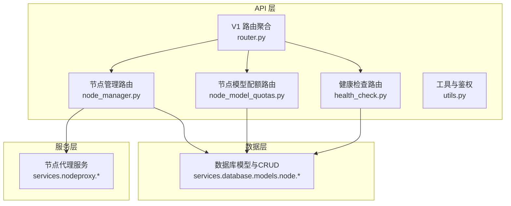
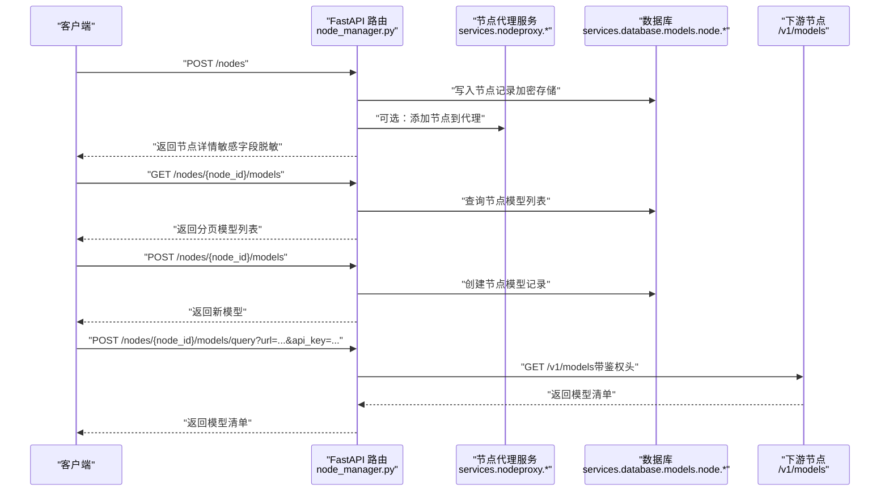
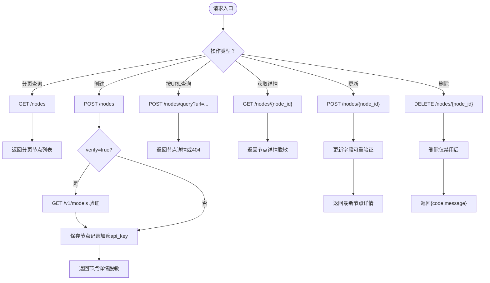
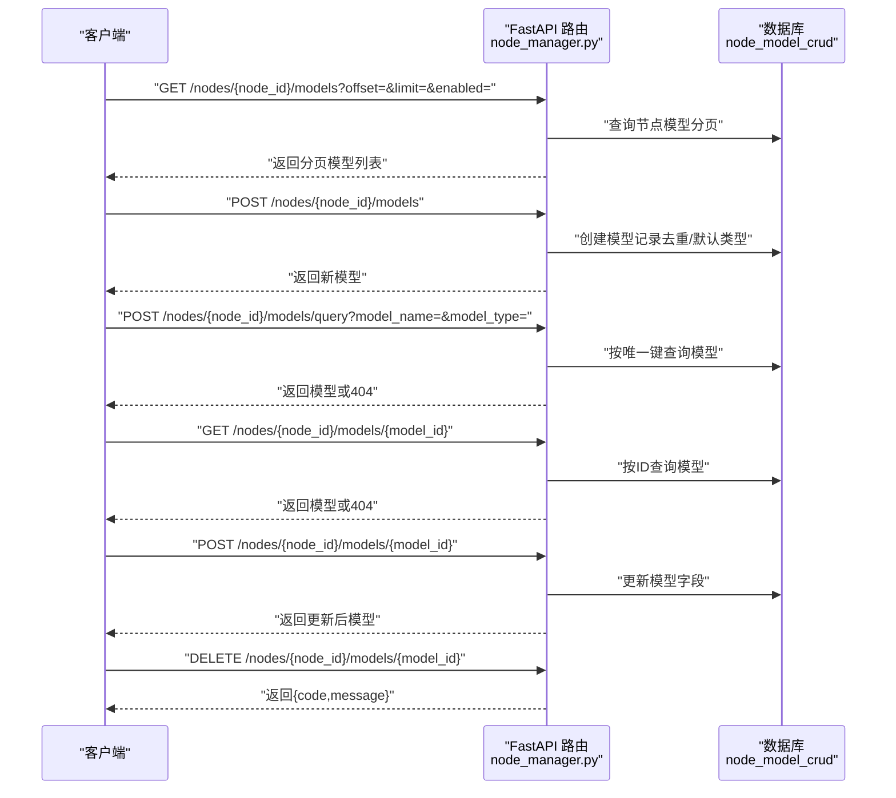
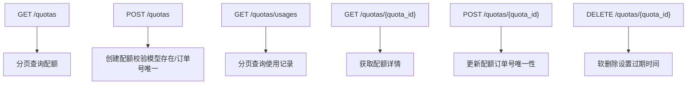
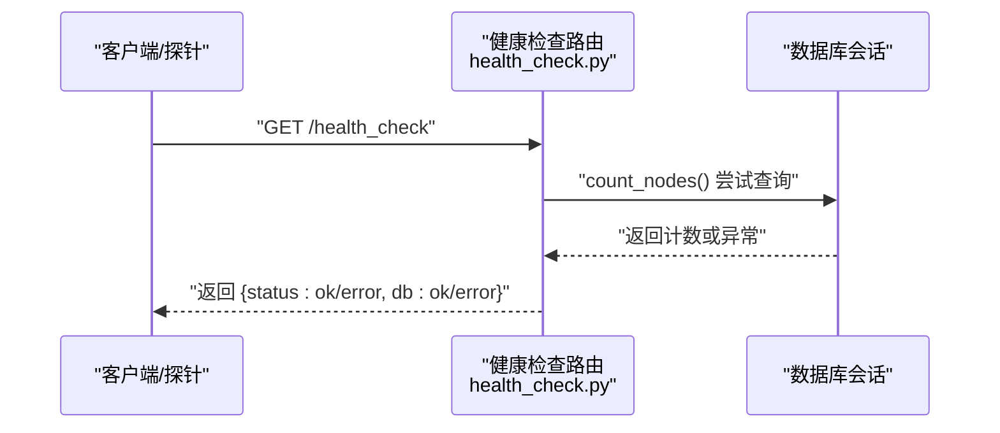
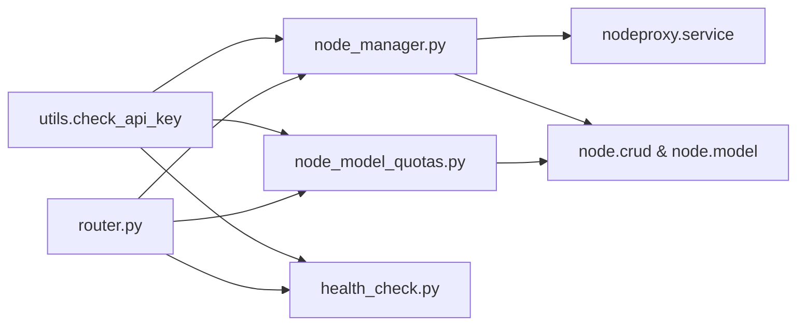

# 节点管理API

<cite>
**本文引用的文件**   
- [src/apiproxy/openaiproxy/api/node_manager.py](file://src/apiproxy/openaiproxy/api/node_manager.py)
- [src/apiproxy/openaiproxy/api/schemas.py](file://src/apiproxy/openaiproxy/api/schemas.py)
- [src/apiproxy/openaiproxy/api/node_model_quotas.py](file://src/apiproxy/openaiproxy/api/node_model_quotas.py)
- [src/apiproxy/openaiproxy/api/health_check.py](file://src/apiproxy/openaiproxy/api/health_check.py)
- [src/apiproxy/openaiproxy/api/utils.py](file://src/apiproxy/openaiproxy/api/utils.py)
- [src/apiproxy/openaiproxy/api/router.py](file://src/apiproxy/openaiproxy/api/router.py)
- [src/apiproxy/tests/api/test_node_manager.py](file://src/apiproxy/tests/api/test_node_manager.py)
</cite>

## 目录
1. [简介](#简介)
2. [项目结构](#项目结构)
3. [核心组件](#核心组件)
4. [架构总览](#架构总览)
5. [详细组件分析](#详细组件分析)
6. [依赖分析](#依赖分析)
7. [性能考量](#性能考量)
8. [故障排查指南](#故障排查指南)
9. [结论](#结论)
10. [附录](#附录)

## 简介
本文件为“节点管理API”的权威参考文档，覆盖以下范围：
- 节点的CRUD接口：新增、删除、更新、查询与分页列表
- 节点模型映射管理：模型绑定、解绑、查询与状态管理
- 健康检查与状态监控接口
- 节点配置参数、数据验证规则与约束
- 最佳实践与常见使用场景
- 与配额系统的集成关系
- 错误处理、权限控制与安全考虑
- 完整请求/响应示例与调试指南

## 项目结构
该模块位于 openaiproxy 子系统中，围绕节点管理的核心路由集中在 node_manager.py；配额相关接口在 node_model_quotas.py；健康检查在 health_check.py；通用校验与鉴权在 utils.py；API v1 路由在 router.py。

图表来源
- [src/apiproxy/openaiproxy/api/node_manager.py:63-810](file://src/apiproxy/openaiproxy/api/node_manager.py#L63-L810)
- [src/apiproxy/openaiproxy/api/node_model_quotas.py:54-341](file://src/apiproxy/openaiproxy/api/node_model_quotas.py#L54-L341)
- [src/apiproxy/openaiproxy/api/health_check.py:35-76](file://src/apiproxy/openaiproxy/api/health_check.py#L35-L76)
- [src/apiproxy/openaiproxy/api/router.py:27-45](file://src/apiproxy/openaiproxy/api/router.py#L27-L45)

章节来源
- [src/apiproxy/openaiproxy/api/node_manager.py:63-810](file://src/apiproxy/openaiproxy/api/node_manager.py#L63-L810)
- [src/apiproxy/openaiproxy/api/node_model_quotas.py:54-341](file://src/apiproxy/openaiproxy/api/node_model_quotas.py#L54-L341)
- [src/apiproxy/openaiproxy/api/health_check.py:35-76](file://src/apiproxy/openaiproxy/api/health_check.py#L35-L76)
- [src/apiproxy/openaiproxy/api/router.py:27-45](file://src/apiproxy/openaiproxy/api/router.py#L27-L45)

## 核心组件
- 节点管理路由：提供节点的增删改查、模型查询、节点模型的增删改查、以及可选的节点可用性验证
- 节点模型配额路由：提供节点模型配额的创建、查询、更新、删除及使用记录查询
- 健康检查路由：对数据库连通性进行可靠检查
- 鉴权与工具：基于 Bearer Token 的 API Key 校验，支持静态白名单与动态 API Key 解析
- V1 路由聚合：将节点管理与配额等接口纳入统一的 v1 前缀

章节来源
- [src/apiproxy/openaiproxy/api/node_manager.py:341-810](file://src/apiproxy/openaiproxy/api/node_manager.py#L341-L810)
- [src/apiproxy/openaiproxy/api/node_model_quotas.py:77-341](file://src/apiproxy/openaiproxy/api/node_model_quotas.py#L77-L341)
- [src/apiproxy/openaiproxy/api/health_check.py:57-76](file://src/apiproxy/openaiproxy/api/health_check.py#L57-L76)
- [src/apiproxy/openaiproxy/api/utils.py:85-216](file://src/apiproxy/openaiproxy/api/utils.py#L85-L216)
- [src/apiproxy/openaiproxy/api/router.py:27-45](file://src/apiproxy/openaiproxy/api/router.py#L27-L45)

## 架构总览
下图展示节点管理API的端到端调用链：客户端请求经鉴权后进入路由，路由调用服务层（节点代理）与数据层（数据库），并在必要时访问下游节点的 /v1/models 接口进行验证。

图表来源
- [src/apiproxy/openaiproxy/api/node_manager.py:386-487](file://src/apiproxy/openaiproxy/api/node_manager.py#L386-L487)
- [src/apiproxy/openaiproxy/api/node_manager.py:577-619](file://src/apiproxy/openaiproxy/api/node_manager.py#L577-L619)
- [src/apiproxy/openaiproxy/api/node_manager.py:626-675](file://src/apiproxy/openaiproxy/api/node_manager.py#L626-L675)
- [src/apiproxy/openaiproxy/api/node_manager.py:119-180](file://src/apiproxy/openaiproxy/api/node_manager.py#L119-L180)

## 详细组件分析

### 节点管理接口
- 路由前缀：/nodes
- 主要能力：
  - 分页查询节点列表
  - 创建节点（可选验证下游 /v1/models）
  - 通过URL精确查询节点
  - 获取单个节点详情
  - 更新节点（可选重新验证）
  - 删除节点（需先禁用）

图表来源
- [src/apiproxy/openaiproxy/api/node_manager.py:341-570](file://src/apiproxy/openaiproxy/api/node_manager.py#L341-L570)
- [src/apiproxy/openaiproxy/api/node_manager.py:119-180](file://src/apiproxy/openaiproxy/api/node_manager.py#L119-L180)

章节来源
- [src/apiproxy/openaiproxy/api/node_manager.py:341-570](file://src/apiproxy/openaiproxy/api/node_manager.py#L341-L570)

### 节点模型管理接口
- 路由前缀：/nodes/{node_id}/models
- 主要能力：
  - 分页查询节点模型
  - 创建节点模型（自动填充 node_id）
  - 通过节点+名称+类型查询模型
  - 获取单个模型详情
  - 更新模型
  - 删除模型（需先禁用）

图表来源
- [src/apiproxy/openaiproxy/api/node_manager.py:577-777](file://src/apiproxy/openaiproxy/api/node_manager.py#L577-L777)

章节来源
- [src/apiproxy/openaiproxy/api/node_manager.py:577-777](file://src/apiproxy/openaiproxy/api/node_manager.py#L577-L777)

### 节点模型配额管理接口
- 路由前缀：/quotas
- 主要能力：
  - 分页查询节点模型配额
  - 创建配额（支持订单号唯一性约束）
  - 查询配额使用记录
  - 获取配额详情
  - 更新配额（含订单号唯一性校验）
  - 删除配额（软删除标记过期时间）

图表来源
- [src/apiproxy/openaiproxy/api/node_model_quotas.py:77-341](file://src/apiproxy/openaiproxy/api/node_model_quotas.py#L77-L341)

章节来源
- [src/apiproxy/openaiproxy/api/node_model_quotas.py:77-341](file://src/apiproxy/openaiproxy/api/node_model_quotas.py#L77-L341)

### 健康检查与状态监控
- 健康检查接口：/health_check 返回数据库连通性状态
- 状态监控接口：/nodes/status（已弃用）用于展示节点代理状态（已清理敏感字段）

图表来源
- [src/apiproxy/openaiproxy/api/health_check.py:57-76](file://src/apiproxy/openaiproxy/api/health_check.py#L57-L76)

章节来源
- [src/apiproxy/openaiproxy/api/health_check.py:57-76](file://src/apiproxy/openaiproxy/api/health_check.py#L57-L76)

### 权限控制与安全
- 鉴权方式：Bearer Token，支持静态白名单与动态 API Key 解析
- 管理接口保护：check_api_key 放行白名单或有效 API Key；严格模式 check_strict_api_key 强制要求配置
- 敏感字段处理：返回节点详情时对 api_key 进行解密显示，但存储始终加密；状态监控接口清理敏感字段
- 数据验证：Pydantic 模型定义字段类型、默认值与约束（如 ge=0）

章节来源
- [src/apiproxy/openaiproxy/api/utils.py:85-216](file://src/apiproxy/openaiproxy/api/utils.py#L85-L216)
- [src/apiproxy/openaiproxy/api/node_manager.py:110-117](file://src/apiproxy/openaiproxy/api/node_manager.py#L110-L117)
- [src/apiproxy/openaiproxy/api/node_manager.py:183-203](file://src/apiproxy/openaiproxy/api/node_manager.py#L183-L203)

## 依赖分析
- 路由依赖：各路由均依赖 check_api_key 进行鉴权
- 服务依赖：节点管理路由依赖节点代理服务与数据库 CRUD
- 数据模型：节点与节点模型的 Pydantic 模型定义了字段与约束
- V1 聚合：router.py 将多个子路由纳入 /v1 前缀

图表来源
- [src/apiproxy/openaiproxy/api/utils.py:85-216](file://src/apiproxy/openaiproxy/api/utils.py#L85-L216)
- [src/apiproxy/openaiproxy/api/node_manager.py:48-51](file://src/apiproxy/openaiproxy/api/node_manager.py#L48-L51)
- [src/apiproxy/openaiproxy/api/node_model_quotas.py:40-49](file://src/apiproxy/openaiproxy/api/node_model_quotas.py#L40-L49)
- [src/apiproxy/openaiproxy/api/router.py:27-45](file://src/apiproxy/openaiproxy/api/router.py#L27-L45)

章节来源
- [src/apiproxy/openaiproxy/api/utils.py:85-216](file://src/apiproxy/openaiproxy/api/utils.py#L85-L216)
- [src/apiproxy/openaiproxy/api/node_manager.py:48-51](file://src/apiproxy/openaiproxy/api/node_manager.py#L48-L51)
- [src/apiproxy/openaiproxy/api/node_model_quotas.py:40-49](file://src/apiproxy/openaiproxy/api/node_model_quotas.py#L40-L49)
- [src/apiproxy/openaiproxy/api/router.py:27-45](file://src/apiproxy/openaiproxy/api/router.py#L27-L45)

## 性能考量
- 异步HTTP客户端：节点模型验证使用异步 httpx 客户端，超时与跟随重定向配置有助于避免阻塞
- 分页查询：列表接口支持 offset/limit，建议前端分页加载以降低单次负载
- 加密成本：api_key 存储采用加密，创建/更新时有加解密开销，建议批量操作时合并请求
- 并发控制：节点代理服务调用通过线程池执行，注意与数据库事务并发冲突

章节来源
- [src/apiproxy/openaiproxy/api/node_manager.py:60-61](file://src/apiproxy/openaiproxy/api/node_manager.py#L60-L61)
- [src/apiproxy/openaiproxy/api/node_manager.py:146-153](file://src/apiproxy/openaiproxy/api/node_manager.py#L146-L153)

## 故障排查指南
- 401 无效API Key：确认 Bearer Token 正确且未过期；若启用静态白名单，确保 Token 在白名单中
- 404 节点/模型不存在：确认 node_id 或 model_id 是否正确；查询模型时需同时提供模型名与类型
- 400 删除失败：节点/模型需先禁用再删除
- 502 获取模型失败：下游节点 /v1/models 返回非200或非JSON；检查节点URL与鉴权头
- 健康检查失败：/health_check 返回db:error，检查数据库连接与权限

章节来源
- [src/apiproxy/openaiproxy/api/node_manager.py:556-569](file://src/apiproxy/openaiproxy/api/node_manager.py#L556-L569)
- [src/apiproxy/openaiproxy/api/node_manager.py:472-487](file://src/apiproxy/openaiproxy/api/node_manager.py#L472-L487)
- [src/apiproxy/openaiproxy/api/health_check.py:67-73](file://src/apiproxy/openaiproxy/api/health_check.py#L67-L73)

## 结论
节点管理API提供了从节点到模型再到配额的全链路管理能力，结合严格的鉴权与数据验证，能够满足生产环境下的节点接入、治理与监控需求。建议在生产中：
- 使用 verify 参数在创建/更新时验证下游节点可用性
- 对敏感字段进行最小化暴露，遵循“只在需要时解密”的原则
- 合理使用分页与过滤参数，避免一次性拉取过多数据
- 将配额与使用记录作为容量规划与计费依据

## 附录

### 请求/响应示例与调试要点
- 创建节点
  - 方法与路径：POST /nodes
  - 关键参数：url、api_key（可选）、verify（默认True）
  - 响应：返回节点详情（敏感字段脱敏）
  - 调试要点：开启 verify 可快速发现URL或鉴权问题
- 查询节点
  - 方法与路径：GET /nodes
  - 参数：enabled、expired、orderby、offset、limit
  - 响应：PageResponse[OpenAINodeReponse]
- 通过URL查询节点
  - 方法与路径：POST /nodes/query?url=...
  - 响应：节点详情或404
- 获取节点详情
  - 方法与路径：GET /nodes/{node_id}
  - 响应：节点详情
- 更新节点
  - 方法与路径：POST /nodes/{node_id}
  - 参数：name、api_key（可选，更新时可触发验证）、enabled、verify
  - 响应：最新节点详情
- 删除节点
  - 方法与路径：DELETE /nodes/{node_id}
  - 约束：需先禁用
  - 响应：{"code":0,"message":"删除成功"}
- 查询节点模型
  - 方法与路径：GET /nodes/{node_id}/models
  - 参数：model_type、enabled、orderby、offset、limit
  - 响应：PageResponse[OpenAINodeModel]
- 创建节点模型
  - 方法与路径：POST /nodes/{node_id}/models
  - 参数：model_name、model_type（默认chat）、enabled
  - 响应：新模型
- 查询节点模型（按唯一键）
  - 方法与路径：POST /nodes/{node_id}/models/query?model_name=&model_type=
  - 响应：模型或404
- 获取节点模型详情
  - 方法与路径：GET /nodes/{node_id}/models/{model_id}
  - 响应：模型或404
- 更新节点模型
  - 方法与路径：POST /nodes/{node_id}/models/{model_id}
  - 参数：enabled
  - 响应：更新后的模型
- 删除节点模型
  - 方法与路径：DELETE /nodes/{node_id}/models/{model_id}
  - 约束：需先禁用
  - 响应：{"code":0,"message":"删除成功"}
- 节点模型配额
  - 分页查询：GET /quotas
  - 创建：POST /quotas
  - 查询使用记录：GET /quotas/usages
  - 获取详情：GET /quotas/{quota_id}
  - 更新：POST /quotas/{quota_id}
  - 删除：DELETE /quotas/{quota_id}

章节来源
- [src/apiproxy/openaiproxy/api/node_manager.py:341-810](file://src/apiproxy/openaiproxy/api/node_manager.py#L341-L810)
- [src/apiproxy/openaiproxy/api/node_model_quotas.py:77-341](file://src/apiproxy/openaiproxy/api/node_model_quotas.py#L77-L341)
- [src/apiproxy/tests/api/test_node_manager.py:109-281](file://src/apiproxy/tests/api/test_node_manager.py#L109-L281)