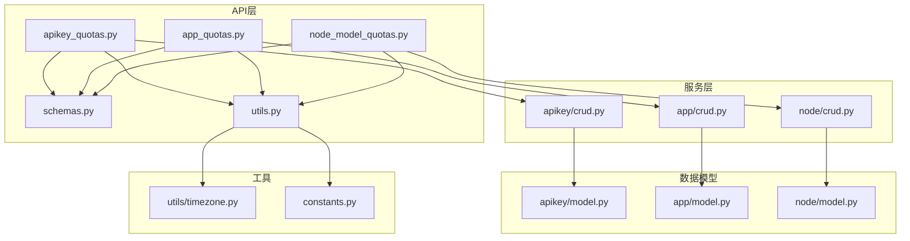
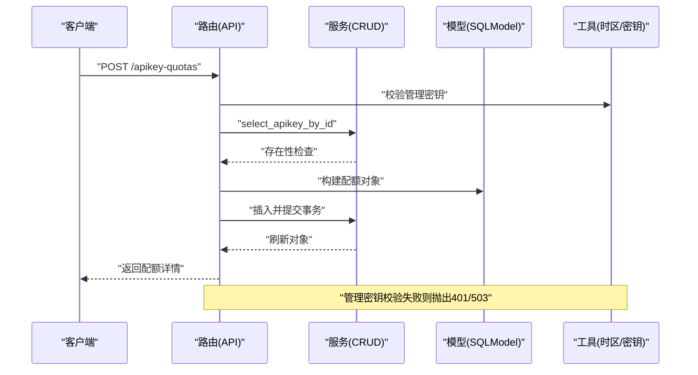
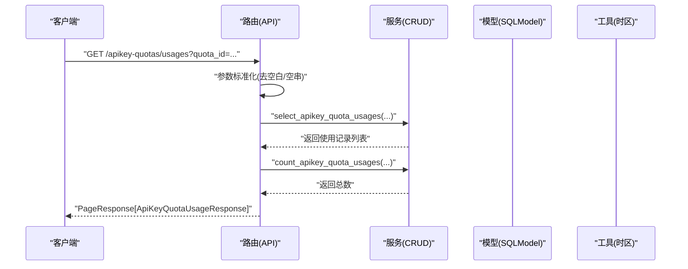
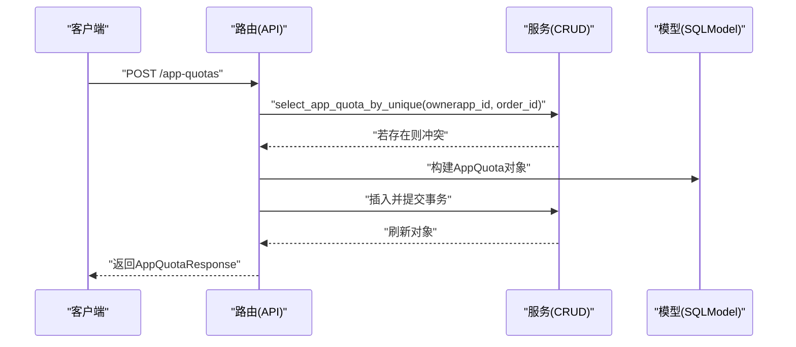
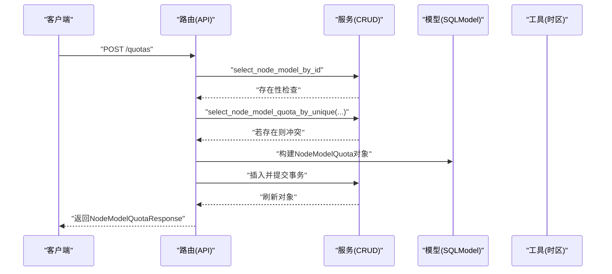
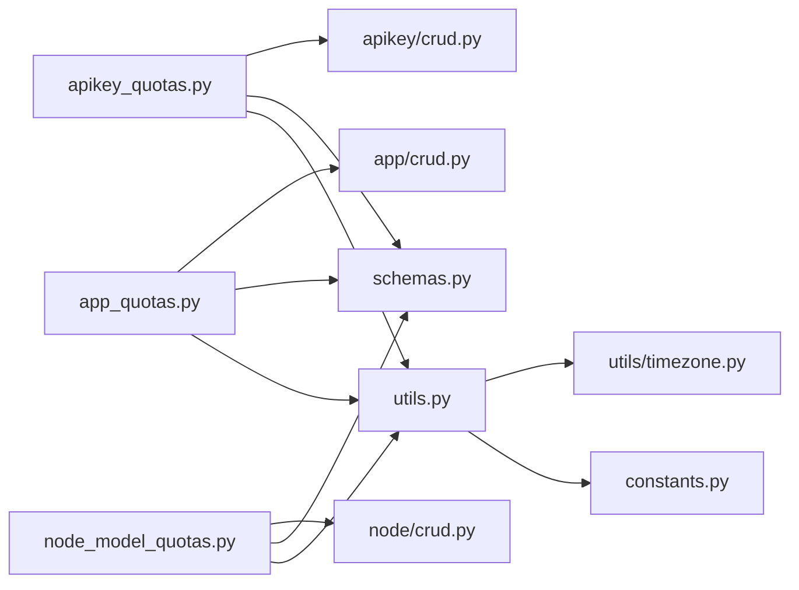

# 配额管理API

<cite>
**本文引用的文件**
- [src/apiproxy/openaiproxy/api/apikey_quotas.py](file://src/apiproxy/openaiproxy/api/apikey_quotas.py)
- [src/apiproxy/openaiproxy/api/app_quotas.py](file://src/apiproxy/openaiproxy/api/app_quotas.py)
- [src/apiproxy/openaiproxy/api/node_model_quotas.py](file://src/apiproxy/openaiproxy/api/node_model_quotas.py)
- [src/apiproxy/openaiproxy/api/schemas.py](file://src/apiproxy/openaiproxy/api/schemas.py)
- [src/apiproxy/openaiproxy/api/utils.py](file://src/apiproxy/openaiproxy/api/utils.py)
- [src/apiproxy/openaiproxy/services/database/models/apikey/crud.py](file://src/apiproxy/openaiproxy/services/database/models/apikey/crud.py)
- [src/apiproxy/openaiproxy/services/database/models/app/crud.py](file://src/apiproxy/openaiproxy/services/database/models/app/crud.py)
- [src/apiproxy/openaiproxy/services/database/models/node/crud.py](file://src/apiproxy/openaiproxy/services/database/models/node/crud.py)
- [src/apiproxy/openaiproxy/services/database/models/apikey/model.py](file://src/apiproxy/openaiproxy/services/database/models/apikey/model.py)
- [src/apiproxy/openaiproxy/services/database/models/app/model.py](file://src/apiproxy/openaiproxy/services/database/models/app/model.py)
- [src/apiproxy/openaiproxy/services/database/models/node/model.py](file://src/apiproxy/openaiproxy/services/database/models/node/model.py)
- [src/apiproxy/openaiproxy/services/database/models/apikey/utils.py](file://src/apiproxy/openaiproxy/services/database/models/apikey/utils.py)
- [src/apiproxy/openaiproxy/services/database/models/app/utils.py](file://src/apiproxy/openaiproxy/services/database/models/app/utils.py)
- [src/apiproxy/openaiproxy/services/database/models/node/utils.py](file://src/apiproxy/openaiproxy/services/database/models/node/utils.py)
- [src/apiproxy/openaiproxy/utils/timezone.py](file://src/apiproxy/openaiproxy/utils/timezone.py)
- [src/apiproxy/openaiproxy/constants.py](file://src/apiproxy/openaiproxy/constants.py)
</cite>

## 目录
1. [简介](#简介)
2. [项目结构](#项目结构)
3. [核心组件](#核心组件)
4. [架构总览](#架构总览)
5. [详细组件分析](#详细组件分析)
6. [依赖关系分析](#依赖关系分析)
7. [性能考量](#性能考量)
8. [故障排查指南](#故障排查指南)
9. [结论](#结论)
10. [附录](#附录)

## 简介
本文件为配额管理API的权威参考文档，覆盖以下能力：
- API Key配额管理：查询、创建、更新、删除、使用记录查询
- 应用配额管理：查询、创建、更新、删除、使用记录查询
- 节点模型配额管理：查询、创建、更新、删除、使用记录查询
- 配额类型与统计：日/周/月维度的用量汇总与总计
- 配额计算规则、扣减时机与过期处理
- 配额预警与通知机制的扩展建议
- 权限验证、安全与最佳实践
- 与节点模型的关系及继承规则
- 完整的接口清单与调用示例路径

## 项目结构
配额管理相关模块位于 openaiproxy/api 下，按“实体”划分路由文件；实体对应的数据库模型与CRUD位于 openaiproxy/services/database/models 下；公共的权限校验与工具位于 openaiproxy/api/utils.py 与 openaiproxy/utils。

图表来源
- [src/apiproxy/openaiproxy/api/apikey_quotas.py:1-326](file://src/apiproxy/openaiproxy/api/apikey_quotas.py#L1-L326)
- [src/apiproxy/openaiproxy/api/app_quotas.py:1-309](file://src/apiproxy/openaiproxy/api/app_quotas.py#L1-L309)
- [src/apiproxy/openaiproxy/api/node_model_quotas.py:1-341](file://src/apiproxy/openaiproxy/api/node_model_quotas.py#L1-L341)
- [src/apiproxy/openaiproxy/api/schemas.py:1-812](file://src/apiproxy/openaiproxy/api/schemas.py#L1-L812)
- [src/apiproxy/openaiproxy/api/utils.py:1-216](file://src/apiproxy/openaiproxy/api/utils.py#L1-L216)
- [src/apiproxy/openaiproxy/services/database/models/apikey/crud.py](file://src/apiproxy/openaiproxy/services/database/models/apikey/crud.py)
- [src/apiproxy/openaiproxy/services/database/models/app/crud.py](file://src/apiproxy/openaiproxy/services/database/models/app/crud.py)
- [src/apiproxy/openaiproxy/services/database/models/node/crud.py](file://src/apiproxy/openaiproxy/services/database/models/node/crud.py)
- [src/apiproxy/openaiproxy/services/database/models/apikey/model.py](file://src/apiproxy/openaiproxy/services/database/models/apikey/model.py)
- [src/apiproxy/openaiproxy/services/database/models/app/model.py](file://src/apiproxy/openaiproxy/services/database/models/app/model.py)
- [src/apiproxy/openaiproxy/services/database/models/node/model.py](file://src/apiproxy/openaiproxy/services/database/models/node/model.py)
- [src/apiproxy/openaiproxy/utils/timezone.py](file://src/apiproxy/openaiproxy/utils/timezone.py)
- [src/apiproxy/openaiproxy/constants.py](file://src/apiproxy/openaiproxy/constants.py)

章节来源
- [src/apiproxy/openaiproxy/api/apikey_quotas.py:1-326](file://src/apiproxy/openaiproxy/api/apikey_quotas.py#L1-L326)
- [src/apiproxy/openaiproxy/api/app_quotas.py:1-309](file://src/apiproxy/openaiproxy/api/app_quotas.py#L1-L309)
- [src/apiproxy/openaiproxy/api/node_model_quotas.py:1-341](file://src/apiproxy/openaiproxy/api/node_model_quotas.py#L1-L341)
- [src/apiproxy/openaiproxy/api/schemas.py:1-812](file://src/apiproxy/openaiproxy/api/schemas.py#L1-L812)
- [src/apiproxy/openaiproxy/api/utils.py:1-216](file://src/apiproxy/openaiproxy/api/utils.py#L1-L216)

## 核心组件
- API Key配额管理路由：提供分页查询、创建、详情、更新、删除、使用记录查询等接口
- 应用配额管理路由：提供分页查询、创建、详情、更新、删除、使用记录查询等接口
- 节点模型配额管理路由：提供分页查询、创建、详情、更新、删除、使用记录查询等接口
- 数据模型与CRUD：分别对应 ApiKeyQuota、AppQuota、NodeModelQuota 的持久化与查询
- 公共权限与工具：统一的API Key校验、会话注入、时区工具、常量等

章节来源
- [src/apiproxy/openaiproxy/api/apikey_quotas.py:78-326](file://src/apiproxy/openaiproxy/api/apikey_quotas.py#L78-L326)
- [src/apiproxy/openaiproxy/api/app_quotas.py:64-309](file://src/apiproxy/openaiproxy/api/app_quotas.py#L64-L309)
- [src/apiproxy/openaiproxy/api/node_model_quotas.py:77-341](file://src/apiproxy/openaiproxy/api/node_model_quotas.py#L77-L341)
- [src/apiproxy/openaiproxy/api/schemas.py:700-812](file://src/apiproxy/openaiproxy/api/schemas.py#L700-L812)
- [src/apiproxy/openaiproxy/api/utils.py:82-216](file://src/apiproxy/openaiproxy/api/utils.py#L82-L216)

## 架构总览
配额管理遵循“路由-服务-模型-工具”的分层设计：
- 路由层：定义REST接口、参数校验、分页与过滤
- 服务层：封装CRUD与聚合查询
- 模型层：SQLModel实体与字段约束
- 工具层：权限校验、时区与时钟、加密/解密

图表来源
- [src/apiproxy/openaiproxy/api/apikey_quotas.py:127-170](file://src/apiproxy/openaiproxy/api/apikey_quotas.py#L127-L170)
- [src/apiproxy/openaiproxy/api/utils.py:82-114](file://src/apiproxy/openaiproxy/api/utils.py#L82-L114)
- [src/apiproxy/openaiproxy/services/database/models/apikey/crud.py](file://src/apiproxy/openaiproxy/services/database/models/apikey/crud.py)

## 详细组件分析

### API Key配额管理
- 接口概览
  - GET /apikey-quotas：分页查询API Key配额，支持按api_key_id、order_id、expired过滤
  - POST /apikey-quotas：创建API Key配额，自动去空格并校验order_id唯一性
  - GET /apikey-quotas/{quota_id}：获取配额详情
  - POST /apikey-quotas/{quota_id}：更新配额，支持部分字段更新与order_id唯一性校验
  - DELETE /apikey-quotas/{quota_id}：逻辑删除（设置expired_at）
  - GET /apikey-quotas/usages：分页查询API Key配额使用记录，支持多维过滤
- 关键行为
  - 订单号(order_id)去首尾空白，空串归为NULL
  - 创建/更新时若提供order_id，需保证同一api_key_id下唯一
  - 更新时非空计数器字段(call_used、total_tokens_used)不允许设为None
  - 删除时若未过期则填充expired_at
- 数据模型字段要点
  - call_limit/call_used：调用次数限额与已用
  - total_tokens_limit/total_tokens_used：总token限额与已用
  - last_reset_at/expired_at：上次重置时间与过期时间
- 使用记录字段
  - call_count、total_tokens、request_action、ownerapp_id等

图表来源
- [src/apiproxy/openaiproxy/api/apikey_quotas.py:172-222](file://src/apiproxy/openaiproxy/api/apikey_quotas.py#L172-L222)
- [src/apiproxy/openaiproxy/services/database/models/apikey/crud.py](file://src/apiproxy/openaiproxy/services/database/models/apikey/crud.py)

章节来源
- [src/apiproxy/openaiproxy/api/apikey_quotas.py:78-326](file://src/apiproxy/openaiproxy/api/apikey_quotas.py#L78-L326)
- [src/apiproxy/openaiproxy/api/schemas.py:700-755](file://src/apiproxy/openaiproxy/api/schemas.py#L700-L755)

### 应用配额管理
- 接口概览
  - GET /app-quotas：分页查询应用配额，支持按ownerapp_id、order_id、expired过滤
  - POST /app-quotas：创建应用配额，校验order_id唯一性
  - GET /app-quotas/{quota_id}：获取配额详情
  - POST /app-quotas/{quota_id}：更新配额，支持ownerapp_id变更与order_id唯一性校验
  - DELETE /app-quotas/{quota_id}：逻辑删除（设置expired_at）
  - GET /app-quotas/usages：分页查询应用配额使用记录，支持多维过滤
- 关键行为
  - order_id去空白，空串归为NULL
  - 更新时非空计数器字段(call_used、total_tokens_used)不允许设为None
  - 删除时若未过期则填充expired_at

图表来源
- [src/apiproxy/openaiproxy/api/app_quotas.py:114-154](file://src/apiproxy/openaiproxy/api/app_quotas.py#L114-L154)
- [src/apiproxy/openaiproxy/services/database/models/app/crud.py](file://src/apiproxy/openaiproxy/services/database/models/app/crud.py)

章节来源
- [src/apiproxy/openaiproxy/api/app_quotas.py:64-309](file://src/apiproxy/openaiproxy/api/app_quotas.py#L64-L309)
- [src/apiproxy/openaiproxy/api/schemas.py:757-794](file://src/apiproxy/openaiproxy/api/schemas.py#L757-L794)

### 节点模型配额管理
- 接口概览
  - GET /quotas：分页查询节点模型配额，支持按node_id、node_model_id、order_id、expired过滤
  - POST /quotas：创建节点模型配额，校验order_id唯一性
  - GET /quotas/{quota_id}：获取配额详情
  - POST /quotas/{quota_id}：更新配额，支持node_model_id变更与order_id唯一性校验
  - DELETE /quotas/{quota_id}：逻辑删除（设置expired_at）
  - GET /quotas/usages：分页查询节点模型配额使用记录，支持多维过滤
- 关键行为
  - order_id去空白，空串归为NULL
  - 更新时非空计数器字段包括call_used、prompt_tokens_used、completion_tokens_used、total_tokens_used
  - 删除时若未过期则填充expired_at
- 数据模型字段要点
  - prompt_tokens_limit/prompt_tokens_used、completion_tokens_limit/completion_tokens_used、total_tokens_limit/total_tokens_used

图表来源
- [src/apiproxy/openaiproxy/api/node_model_quotas.py:129-175](file://src/apiproxy/openaiproxy/api/node_model_quotas.py#L129-L175)
- [src/apiproxy/openaiproxy/services/database/models/node/crud.py](file://src/apiproxy/openaiproxy/services/database/models/node/crud.py)

章节来源
- [src/apiproxy/openaiproxy/api/node_model_quotas.py:77-341](file://src/apiproxy/openaiproxy/api/node_model_quotas.py#L77-L341)
- [src/apiproxy/openaiproxy/api/schemas.py:514-582](file://src/apiproxy/openaiproxy/api/schemas.py#L514-L582)

### 配额类型与统计
- 日/周/月维度用量
  - 应用日度模型用量：AppDailyModelUsageResponse
  - 应用周度模型用量：AppWeeklyModelUsageResponse
  - 应用月度模型用量：AppMonthlyModelUsageResponse
  - 应用年度模型用量：AppYearlyModelUsageResponse
  - 应用月度/年度总计：AppMonthlyUsageTotalResponse、AppYearlyUsageTotalResponse
- 统计字段
  - call_count、request_tokens、response_tokens、total_tokens
  - 时间范围：day_start、week_start、month_start、year
- 用途
  - 用于生成报表、趋势分析与配额预警

章节来源
- [src/apiproxy/openaiproxy/api/schemas.py:613-696](file://src/apiproxy/openaiproxy/api/schemas.py#L613-L696)

### 配额计算规则、扣减时机与过期处理
- 计算规则
  - 非空计数器字段在更新时不可设为None（API Key与应用配额为call_used、total_tokens_used；节点模型配额额外包含prompt_tokens_used、completion_tokens_used、total_tokens_used）
  - order_id去空白后若非空则需在同一作用域内唯一
- 扣减时机
  - 在请求成功返回后进行累计（调用次数与token用量），具体实现位于请求处理流程中（本仓库未直接展示，但接口与模型字段明确支持）
- 过期处理
  - 删除接口将expired_at设为当前时间或保持原值
  - 业务侧可据此判定配额是否生效

章节来源
- [src/apiproxy/openaiproxy/api/apikey_quotas.py:266-270](file://src/apiproxy/openaiproxy/api/apikey_quotas.py#L266-L270)
- [src/apiproxy/openaiproxy/api/app_quotas.py:251-255](file://src/apiproxy/openaiproxy/api/app_quotas.py#L251-L255)
- [src/apiproxy/openaiproxy/api/node_model_quotas.py:275-284](file://src/apiproxy/openaiproxy/api/node_model_quotas.py#L275-L284)
- [src/apiproxy/openaiproxy/api/apikey_quotas.py:317-321](file://src/apiproxy/openaiproxy/api/apikey_quotas.py#L317-L321)
- [src/apiproxy/openaiproxy/api/app_quotas.py:299-303](file://src/apiproxy/openaiproxy/api/app_quotas.py#L299-L303)
- [src/apiproxy/openaiproxy/api/node_model_quotas.py:331-336](file://src/apiproxy/openaiproxy/api/node_model_quotas.py#L331-L336)

### 配额与节点模型的关系与继承规则
- 节点模型配额独立于API Key与应用配额，面向具体“节点+模型”组合
- 当前路由对node_model_id存在性进行检查，确保配额绑定到真实存在的节点模型
- 继承规则：未在代码中直接体现，建议在业务策略中定义“默认配额”或“继承链”，并在创建/更新时进行校验与回退

章节来源
- [src/apiproxy/openaiproxy/api/node_model_quotas.py:139-142](file://src/apiproxy/openaiproxy/api/node_model_quotas.py#L139-L142)
- [src/apiproxy/openaiproxy/api/node_model_quotas.py:286-292](file://src/apiproxy/openaiproxy/api/node_model_quotas.py#L286-L292)

### 权限验证与安全
- 管理接口密钥
  - check_strict_api_key：要求显式配置管理密钥，否则拒绝访问
  - check_api_key：允许静态白名单访问，未配置时放行
- 访问密钥校验
  - check_access_key：解析令牌，支持新旧两种格式；校验启用状态与过期时间
- 会话注入
  - AsyncDbSession：通过依赖注入提供异步数据库会话
- 时区与时钟
  - current_time_in_timezone：统一使用本地时区时间戳

章节来源
- [src/apiproxy/openaiproxy/api/utils.py:82-216](file://src/apiproxy/openaiproxy/api/utils.py#L82-L216)
- [src/apiproxy/openaiproxy/utils/timezone.py](file://src/apiproxy/openaiproxy/utils/timezone.py)

### 配额预警与通知机制
- 当前仓库未提供专门的“预警/通知”接口
- 建议扩展方案
  - 新增“预警阈值”字段（如百分比阈值）
  - 新增“预警事件”表与“通知渠道”配置
  - 在配额更新后触发阈值判断与通知
  - 提供“预警事件查询”接口

（本节为概念性建议，不对应具体源码）

## 依赖关系分析

图表来源
- [src/apiproxy/openaiproxy/api/apikey_quotas.py:1-52](file://src/apiproxy/openaiproxy/api/apikey_quotas.py#L1-L52)
- [src/apiproxy/openaiproxy/api/app_quotas.py:1-51](file://src/apiproxy/openaiproxy/api/app_quotas.py#L1-L51)
- [src/apiproxy/openaiproxy/api/node_model_quotas.py:1-51](file://src/apiproxy/openaiproxy/api/node_model_quotas.py#L1-L51)
- [src/apiproxy/openaiproxy/api/utils.py:1-48](file://src/apiproxy/openaiproxy/api/utils.py#L1-L48)

章节来源
- [src/apiproxy/openaiproxy/api/apikey_quotas.py:1-52](file://src/apiproxy/openaiproxy/api/apikey_quotas.py#L1-L52)
- [src/apiproxy/openaiproxy/api/app_quotas.py:1-51](file://src/apiproxy/openaiproxy/api/app_quotas.py#L1-L51)
- [src/apiproxy/openaiproxy/api/node_model_quotas.py:1-51](file://src/apiproxy/openaiproxy/api/node_model_quotas.py#L1-L51)

## 性能考量
- 分页与过滤
  - 所有查询接口均支持offset/limit与多维过滤，建议合理设置limit并配合索引优化
- 唯一性校验
  - 创建/更新时对order_id进行唯一性检查，避免重复
- 事务与刷新
  - 写入后执行commit与refresh，确保一致性
- 时区与时间
  - 统一时区时间戳，减少跨时区比较成本

（本节为通用指导，不涉及具体文件分析）

## 故障排查指南
- 401 无效API Key
  - 管理接口未配置或令牌不在白名单
  - 访问密钥过期或禁用
- 404 配额不存在
  - 查询/更新/删除时目标配额不存在
- 409 订单ID已存在
  - 同一作用域内order_id重复
- 503 管理API Key未配置
  - 调用严格管理接口且未配置管理密钥

章节来源
- [src/apiproxy/openaiproxy/api/utils.py:53-80](file://src/apiproxy/openaiproxy/api/utils.py#L53-L80)
- [src/apiproxy/openaiproxy/api/apikey_quotas.py:147-150](file://src/apiproxy/openaiproxy/api/apikey_quotas.py#L147-L150)
- [src/apiproxy/openaiproxy/api/app_quotas.py:132-135](file://src/apiproxy/openaiproxy/api/app_quotas.py#L132-L135)
- [src/apiproxy/openaiproxy/api/node_model_quotas.py:149-152](file://src/apiproxy/openaiproxy/api/node_model_quotas.py#L149-L152)

## 结论
本配额管理API提供了完善的“实体级配额”能力，覆盖API Key、应用与节点模型三个维度，并提供使用记录与多维统计支持。通过严格的权限控制、统一时区与时钟以及清晰的唯一性与计数器约束，保障了系统的安全性与一致性。建议结合业务需求扩展“预警与通知”机制，并在高并发场景下关注分页与索引优化。

## 附录

### 接口清单与调用示例路径
- API Key配额
  - GET /apikey-quotas → 示例路径：[src/apiproxy/openaiproxy/api/apikey_quotas.py:78-124](file://src/apiproxy/openaiproxy/api/apikey_quotas.py#L78-L124)
  - POST /apikey-quotas → 示例路径：[src/apiproxy/openaiproxy/api/apikey_quotas.py:127-169](file://src/apiproxy/openaiproxy/api/apikey_quotas.py#L127-L169)
  - GET /apikey-quotas/{quota_id} → 示例路径：[src/apiproxy/openaiproxy/api/apikey_quotas.py:225-241](file://src/apiproxy/openaiproxy/api/apikey_quotas.py#L225-L241)
  - POST /apikey-quotas/{quota_id} → 示例路径：[src/apiproxy/openaiproxy/api/apikey_quotas.py:244-302](file://src/apiproxy/openaiproxy/api/apikey_quotas.py#L244-L302)
  - DELETE /apikey-quotas/{quota_id} → 示例路径：[src/apiproxy/openaiproxy/api/apikey_quotas.py:305-325](file://src/apiproxy/openaiproxy/api/apikey_quotas.py#L305-L325)
  - GET /apikey-quotas/usages → 示例路径：[src/apiproxy/openaiproxy/api/apikey_quotas.py:172-222](file://src/apiproxy/openaiproxy/api/apikey_quotas.py#L172-L222)
- 应用配额
  - GET /app-quotas → 示例路径：[src/apiproxy/openaiproxy/api/app_quotas.py:64-111](file://src/apiproxy/openaiproxy/api/app_quotas.py#L64-L111)
  - POST /app-quotas → 示例路径：[src/apiproxy/openaiproxy/api/app_quotas.py:114-154](file://src/apiproxy/openaiproxy/api/app_quotas.py#L114-L154)
  - GET /app-quotas/{quota_id} → 示例路径：[src/apiproxy/openaiproxy/api/app_quotas.py:210-226](file://src/apiproxy/openaiproxy/api/app_quotas.py#L210-L226)
  - POST /app-quotas/{quota_id} → 示例路径：[src/apiproxy/openaiproxy/api/app_quotas.py:229-285](file://src/apiproxy/openaiproxy/api/app_quotas.py#L229-L285)
  - DELETE /app-quotas/{quota_id} → 示例路径：[src/apiproxy/openaiproxy/api/app_quotas.py:288-308](file://src/apiproxy/openaiproxy/api/app_quotas.py#L288-L308)
  - GET /app-quotas/usages → 示例路径：[src/apiproxy/openaiproxy/api/app_quotas.py:157-207](file://src/apiproxy/openaiproxy/api/app_quotas.py#L157-L207)
- 节点模型配额
  - GET /quotas → 示例路径：[src/apiproxy/openaiproxy/api/node_model_quotas.py:77-126](file://src/apiproxy/openaiproxy/api/node_model_quotas.py#L77-L126)
  - POST /quotas → 示例路径：[src/apiproxy/openaiproxy/api/node_model_quotas.py:129-175](file://src/apiproxy/openaiproxy/api/node_model_quotas.py#L129-L175)
  - GET /quotas/{quota_id} → 示例路径：[src/apiproxy/openaiproxy/api/node_model_quotas.py:234-250](file://src/apiproxy/openaiproxy/api/node_model_quotas.py#L234-L250)
  - POST /quotas/{quota_id} → 示例路径：[src/apiproxy/openaiproxy/api/node_model_quotas.py:253-317](file://src/apiproxy/openaiproxy/api/node_model_quotas.py#L253-L317)
  - DELETE /quotas/{quota_id} → 示例路径：[src/apiproxy/openaiproxy/api/node_model_quotas.py:320-340](file://src/apiproxy/openaiproxy/api/node_model_quotas.py#L320-L340)
  - GET /quotas/usages → 示例路径：[src/apiproxy/openaiproxy/api/node_model_quotas.py:178-231](file://src/apiproxy/openaiproxy/api/node_model_quotas.py#L178-L231)

### 最佳实践与常见配置场景
- 最佳实践
  - 明确order_id语义，避免重复；在创建/更新前先查询唯一性
  - 对非空计数器字段进行幂等更新，避免误设为None
  - 使用分页limit限制单次返回量，配合索引提升查询性能
  - 在删除配额前评估影响范围，必要时先冻结再删除
- 常见场景
  - 临时额度：设置短期expired_at
  - 季度预算：按月统计与告警联动
  - 多租户隔离：以ownerapp_id作为主要过滤条件
  - 节点模型差异化：针对不同模型设置独立配额

（本节为通用指导，不涉及具体文件分析）