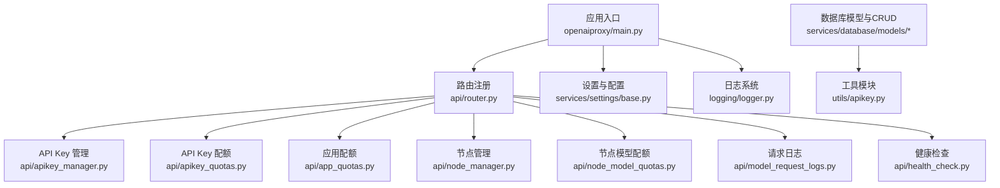
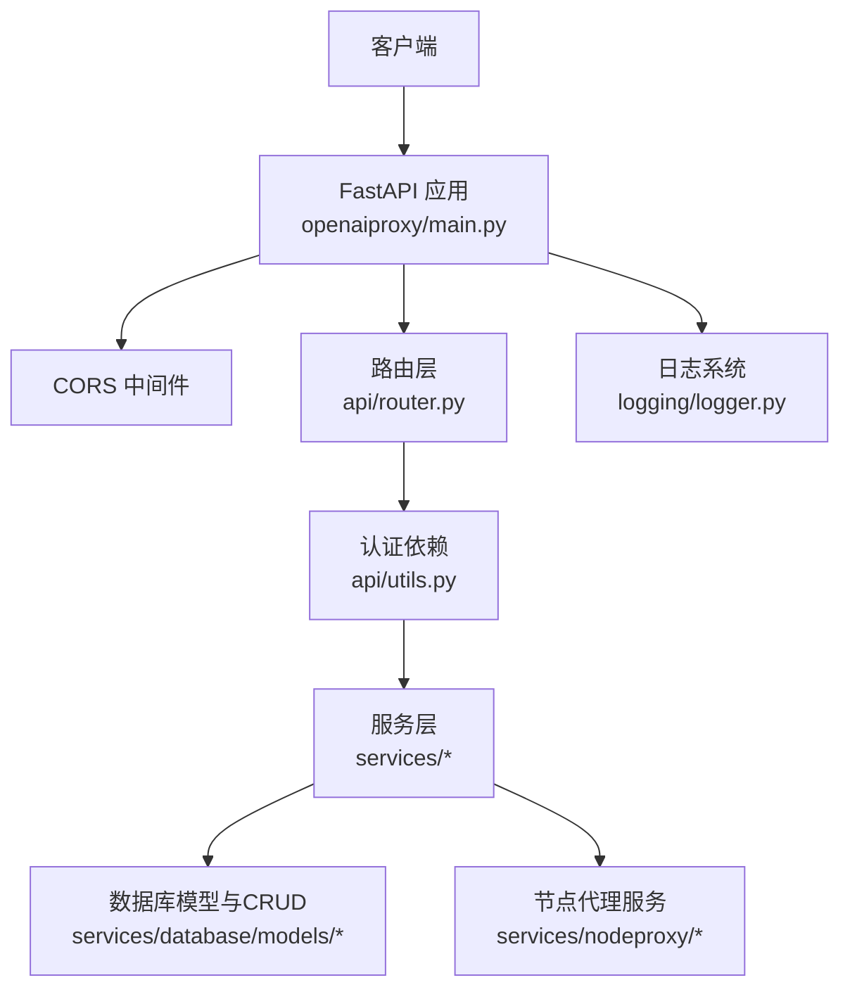
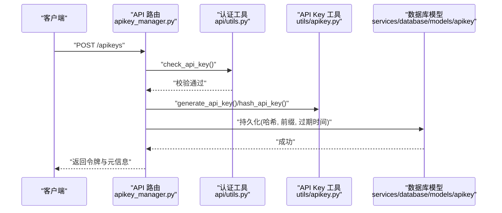
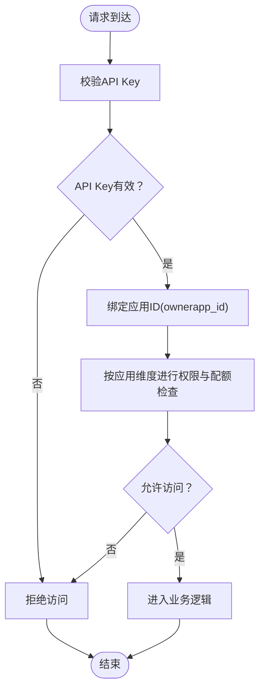
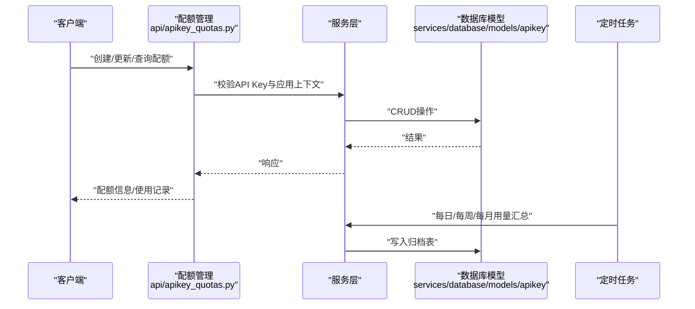
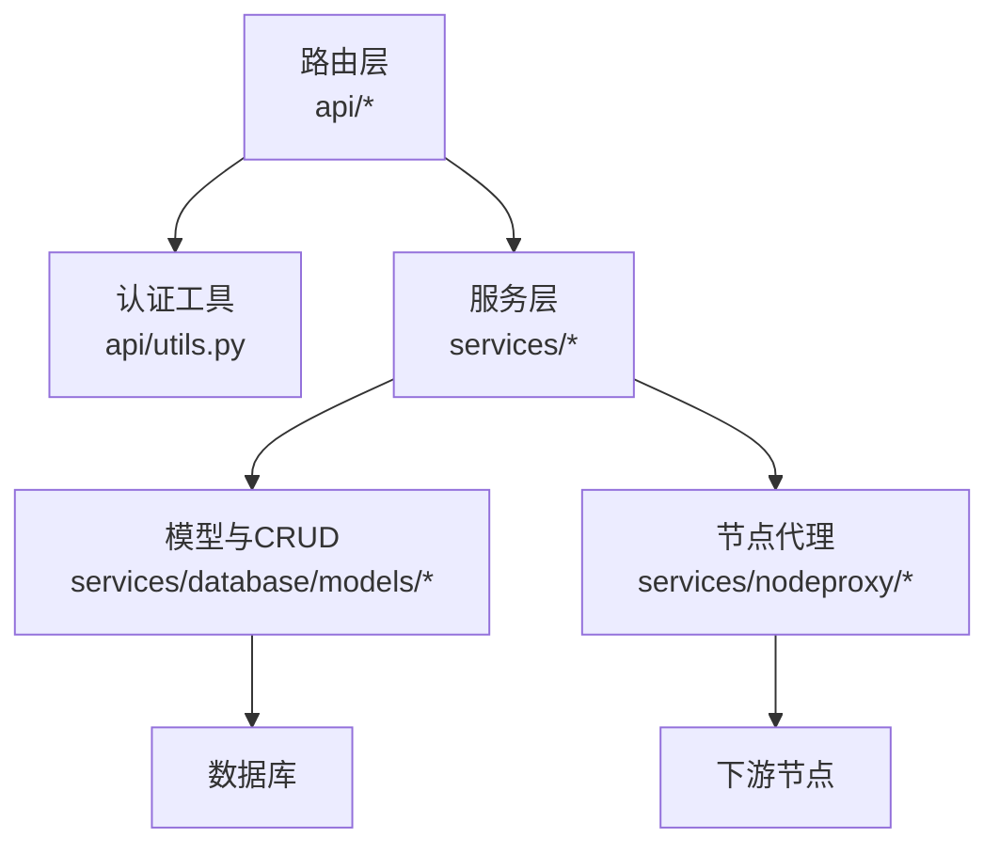

# 安全和认证

<cite>
**本文引用的文件**
- [src/apiproxy/openaiproxy/main.py](file://src/apiproxy/openaiproxy/main.py)
- [src/apiproxy/openaiproxy/settings.py](file://src/apiproxy/openaiproxy/settings.py)
- [src/apiproxy/openaiproxy/api/apikey_manager.py](file://src/apiproxy/openaiproxy/api/apikey_manager.py)
- [src/apiproxy/openaiproxy/api/apikey_quotas.py](file://src/apiproxy/openaiproxy/api/apikey_quotas.py)
- [src/apiproxy/openaiproxy/services/settings/base.py](file://src/apiproxy/openaiproxy/services/settings/base.py)
- [src/apiproxy/openaiproxy/services/database/models/apikey/model.py](file://src/apiproxy/openaiproxy/services/database/models/apikey/model.py)
- [src/apiproxy/openaiproxy/services/database/models/apikey/crud.py](file://src/apiproxy/openaiproxy/services/database/models/apikey/crud.py)
- [src/apiproxy/openaiproxy/utils/apikey.py](file://src/apiproxy/openaiproxy/utils/apikey.py)
- [src/apiproxy/openaiproxy/api/schemas.py](file://src/apiproxy/openaiproxy/api/schemas.py)
- [src/apiproxy/openaiproxy/api/utils.py](file://src/apiproxy/openaiproxy/api/utils.py)
- [src/apiproxy/openaiproxy/services/nodeproxy/service.py](file://src/apiproxy/openaiproxy/services/nodeproxy/service.py)
- [src/apiproxy/openaiproxy/services/nodeproxy/factory.py](file://src/apiproxy/openaiproxy/services/nodeproxy/factory.py)
- [src/apiproxy/openaiproxy/services/nodeproxy/constants.py](file://src/apiproxy/openaiproxy/services/nodeproxy/constants.py)
- [src/apiproxy/openaiproxy/services/nodeproxy/exceptions.py](file://src/apiproxy/openaiproxy/services/nodeproxy/exceptions.py)
- [src/apiproxy/openaiproxy/services/database/models/app/model.py](file://src/apiproxy/openaiproxy/services/database/models/app/model.py)
- [src/apiproxy/openaiproxy/services/database/models/app/crud.py](file://src/apiproxy/openaiproxy/services/database/models/app/crud.py)
- [src/apiproxy/openaiproxy/api/app_quotas.py](file://src/apiproxy/openaiproxy/api/app_quotas.py)
- [src/apiproxy/openaiproxy/api/node_manager.py](file://src/apiproxy/openaiproxy/api/node_manager.py)
- [src/apiproxy/openaiproxy/api/node_model_quotas.py](file://src/apiproxy/openaiproxy/api/node_model_quotas.py)
- [src/apiproxy/openaiproxy/api/model_request_logs.py](file://src/apiproxy/openaiproxy/api/model_request_logs.py)
- [src/apiproxy/openaiproxy/api/health_check.py](file://src/apiproxy/openaiproxy/api/health_check.py)
- [src/apiproxy/openaiproxy/api/router.py](file://src/apiproxy/openaiproxy/api/router.py)
- [src/apiproxy/openaiproxy/api/openai_docs.py](file://src/apiproxy/openaiproxy/api/openai_docs.py)
- [src/apiproxy/openaiproxy/logging/logger.py](file://src/apiproxy/openaiproxy/logging/logger.py)
- [src/apiproxy/openaiproxy/logging/setup.py](file://src/apiproxy/openaiproxy/logging/setup.py)
- [src/apiproxy/openaiproxy/alembic/versions/0e4bdcd25316_add_northbound_apikey_and_app_quotas.py](file://src/apiproxy/openaiproxy/alembic/versions/0e4bdcd25316_add_northbound_apikey_and_app_quotas.py)
- [src/apiproxy/openaiproxy/alembic/versions/c2a5c7e5f3b1_apikey_security_and_monthly_rollup.py](file://src/apiproxy/openaiproxy/alembic/versions/c2a5c7e5f3b1_apikey_security_and_monthly_rollup.py)
- [src/apiproxy/openaiproxy/alembic/versions/bafe420807ac_daily_and_weekly_usage_rollup.py](file://src/apiproxy/openaiproxy/alembic/versions/bafe420807ac_daily_and_weekly_usage_rollup.py)
</cite>

## 目录
1. 引言
2. 项目结构
3. 核心组件
4. 架构总览
5. 详细组件分析
6. 依赖分析
7. 性能考虑
8. 故障排查指南
9. 结论
10. 附录

## 引言
本文件面向大模型接口代理系统的安全与认证，聚焦以下目标：
- 全面解释API Key认证机制、管理员权限控制与数据加密存储策略
- 详述双重认证（API Key + 应用）的工作原理与实现细节
- 描述配额管理中的安全控制与访问限制机制
- 提供安全配置最佳实践与威胁防护建议
- 给出安全审计与合规性检查方法
- 说明数据传输加密、存储加密与会话管理
- 明确安全漏洞预防与应急响应流程
- 提供安全测试与渗透测试指导

## 项目结构
本项目采用分层与功能模块化组织方式：
- 应用入口与生命周期管理：FastAPI应用创建、中间件注册、定时任务调度
- API层：路由与控制器，负责认证校验、配额与日志管理
- 服务层：数据库模型、CRUD、工厂与节点代理服务
- 工具与实用模块：API Key生成与哈希、时区工具、异步辅助等
- 配置与设置：基于Pydantic的环境变量解析与默认值管理
- 日志与审计：统一日志配置与异步落盘

图表来源
- [src/apiproxy/openaiproxy/main.py:128-187](file://src/apiproxy/openaiproxy/main.py#L128-L187)
- [src/apiproxy/openaiproxy/api/router.py](file://src/apiproxy/openaiproxy/api/router.py)
- [src/apiproxy/openaiproxy/services/settings/base.py:79-292](file://src/apiproxy/openaiproxy/services/settings/base.py#L79-L292)
- [src/apiproxy/openaiproxy/logging/logger.py](file://src/apiproxy/openaiproxy/logging/logger.py)

章节来源
- [src/apiproxy/openaiproxy/main.py:128-187](file://src/apiproxy/openaiproxy/main.py#L128-L187)
- [src/apiproxy/openaiproxy/services/settings/base.py:79-292](file://src/apiproxy/openaiproxy/services/settings/base.py#L79-L292)

## 核心组件
- 认证与授权
  - API Key生成、哈希与令牌合成：通过工具模块完成密钥生成与安全存储
  - 双重认证（API Key + 应用）：路由依赖在请求进入业务逻辑前进行API Key校验，并结合应用维度进行访问控制
  - 管理员权限控制：部分路由依赖严格API Key校验，仅允许具备更高权限的调用方操作
- 配额与用量
  - API Key级配额：按调用次数、Token总量、周期重置与到期时间进行控制
  - 应用级配额：按应用维度聚合用量与限额
  - 节点与模型级配额：对下游节点与模型进行细粒度配额控制
- 存储与日志
  - 数据库存储：使用SQLAlchemy ORM模型与CRUD封装，敏感字段不回传明文
  - 定时汇总：按日/周/月对用量进行归档与统计，支撑审计与合规
- 配置与安全设置
  - 基于环境变量的配置加载与默认值管理
  - 开发模式开关与日志级别控制

章节来源
- [src/apiproxy/openaiproxy/api/apikey_manager.py:116-195](file://src/apiproxy/openaiproxy/api/apikey_manager.py#L116-L195)
- [src/apiproxy/openaiproxy/api/apikey_quotas.py:132-169](file://src/apiproxy/openaiproxy/api/apikey_quotas.py#L132-L169)
- [src/apiproxy/openaiproxy/api/app_quotas.py](file://src/apiproxy/openaiproxy/api/app_quotas.py)
- [src/apiproxy/openaiproxy/api/node_model_quotas.py](file://src/apiproxy/openaiproxy/api/node_model_quotas.py)
- [src/apiproxy/openaiproxy/services/settings/base.py:79-292](file://src/apiproxy/openaiproxy/services/settings/base.py#L79-L292)

## 架构总览
下图展示从客户端到数据库与节点代理的整体交互，以及安全控制点：

图表来源
- [src/apiproxy/openaiproxy/main.py:155-182](file://src/apiproxy/openaiproxy/main.py#L155-L182)
- [src/apiproxy/openaiproxy/api/router.py](file://src/apiproxy/openaiproxy/api/router.py)
- [src/apiproxy/openaiproxy/api/utils.py](file://src/apiproxy/openaiproxy/api/utils.py)
- [src/apiproxy/openaiproxy/services/nodeproxy/service.py](file://src/apiproxy/openaiproxy/services/nodeproxy/service.py)
- [src/apiproxy/openaiproxy/logging/logger.py](file://src/apiproxy/openaiproxy/logging/logger.py)

## 详细组件分析

### API Key认证与令牌管理
- 生成与哈希
  - 使用工具模块生成随机API Key，并对“应用ID+密钥”进行哈希，仅存储哈希值与前缀
  - 令牌合成：将应用ID与明文密钥组合为加密令牌，返回给调用方
- 存储策略
  - 数据库模型中仅保存哈希与前缀，不保存完整明文；创建时间、版本号与过期时间一并记录
- 生命周期与删除
  - 删除前要求密钥处于禁用状态，防止误删活跃密钥
- 依赖注入
  - 路由通过依赖函数在进入业务逻辑前完成API Key校验

图表来源
- [src/apiproxy/openaiproxy/api/apikey_manager.py:116-195](file://src/apiproxy/openaiproxy/api/apikey_manager.py#L116-L195)
- [src/apiproxy/openaiproxy/api/utils.py](file://src/apiproxy/openaiproxy/api/utils.py)
- [src/apiproxy/openaiproxy/utils/apikey.py](file://src/apiproxy/openaiproxy/utils/apikey.py)
- [src/apiproxy/openaiproxy/services/database/models/apikey/model.py](file://src/apiproxy/openaiproxy/services/database/models/apikey/model.py)

章节来源
- [src/apiproxy/openaiproxy/api/apikey_manager.py:116-195](file://src/apiproxy/openaiproxy/api/apikey_manager.py#L116-L195)
- [src/apiproxy/openaiproxy/utils/apikey.py](file://src/apiproxy/openaiproxy/utils/apikey.py)
- [src/apiproxy/openaiproxy/services/database/models/apikey/model.py](file://src/apiproxy/openaiproxy/services/database/models/apikey/model.py)

### 双重认证（API Key + 应用）
- API Key校验
  - 所有受保护路由均依赖API Key校验函数，确保请求携带有效令牌
- 应用维度控制
  - 创建API Key时绑定ownerapp_id；后续查询与更新均以该应用ID作为上下文
  - 配额与用量查询支持按ownerapp_id过滤，实现应用级隔离
- 权限差异
  - 普通API Key依赖用于日常调用；严格API Key依赖用于管理类操作（如配额管理）

图表来源
- [src/apiproxy/openaiproxy/api/apikey_manager.py:116-195](file://src/apiproxy/openaiproxy/api/apikey_manager.py#L116-L195)
- [src/apiproxy/openaiproxy/api/apikey_quotas.py:132-169](file://src/apiproxy/openaiproxy/api/apikey_quotas.py#L132-L169)
- [src/apiproxy/openaiproxy/api/utils.py](file://src/apiproxy/openaiproxy/api/utils.py)

章节来源
- [src/apiproxy/openaiproxy/api/apikey_manager.py:116-195](file://src/apiproxy/openaiproxy/api/apikey_manager.py#L116-L195)
- [src/apiproxy/openaiproxy/api/apikey_quotas.py:132-169](file://src/apiproxy/openaiproxy/api/apikey_quotas.py#L132-L169)
- [src/apiproxy/openaiproxy/api/utils.py](file://src/apiproxy/openaiproxy/api/utils.py)

### 配额管理与访问限制
- API Key级配额
  - 字段包括调用次数、Token总量、周期重置时间、到期时间等
  - 支持按订单ID唯一约束，避免重复配置
- 应用级配额
  - 汇总应用维度的用量与限额，便于整体管控
- 节点与模型级配额
  - 对下游节点与具体模型进行细粒度限额，防止热点模型被过度消耗
- 用量统计与归档
  - 定时任务按日/周/月汇总用量，形成可审计的数据

图表来源
- [src/apiproxy/openaiproxy/api/apikey_quotas.py:132-169](file://src/apiproxy/openaiproxy/api/apikey_quotas.py#L132-L169)
- [src/apiproxy/openaiproxy/api/app_quotas.py](file://src/apiproxy/openaiproxy/api/app_quotas.py)
- [src/apiproxy/openaiproxy/api/node_model_quotas.py](file://src/apiproxy/openaiproxy/api/node_model_quotas.py)
- [src/apiproxy/openaiproxy/services/database/models/apikey/crud.py](file://src/apiproxy/openaiproxy/services/database/models/apikey/crud.py)

章节来源
- [src/apiproxy/openaiproxy/api/apikey_quotas.py:132-169](file://src/apiproxy/openaiproxy/api/apikey_quotas.py#L132-L169)
- [src/apiproxy/openaiproxy/api/app_quotas.py](file://src/apiproxy/openaiproxy/api/app_quotas.py)
- [src/apiproxy/openaiproxy/api/node_model_quotas.py](file://src/apiproxy/openaiproxy/api/node_model_quotas.py)
- [src/apiproxy/openaiproxy/services/database/models/apikey/crud.py](file://src/apiproxy/openaiproxy/services/database/models/apikey/crud.py)

### 数据加密存储策略
- API Key存储
  - 仅存储哈希与前缀，不保存完整明文；令牌在创建时返回给调用方
- 敏感字段处理
  - 返回响应中不包含完整密钥明文，避免泄露
- 配置与密钥
  - 数据库连接串等敏感配置通过环境变量注入，避免硬编码

章节来源
- [src/apiproxy/openaiproxy/api/apikey_manager.py:116-195](file://src/apiproxy/openaiproxy/api/apikey_manager.py#L116-L195)
- [src/apiproxy/openaiproxy/services/settings/base.py:190-253](file://src/apiproxy/openaiproxy/services/settings/base.py#L190-L253)

### 会话管理与传输安全
- 传输安全
  - 项目未显式启用HTTPS/TLS中间件；生产部署需通过反向代理或边缘TLS终止
- 会话与Cookie
  - 未使用基于Cookie的会话；认证主要依赖请求头中的API Key
- CORS
  - 默认允许所有来源、方法与头部，生产环境应收紧跨域策略

章节来源
- [src/apiproxy/openaiproxy/main.py:155-163](file://src/apiproxy/openaiproxy/main.py#L155-L163)
- [src/apiproxy/openaiproxy/api/apikey_manager.py:116-195](file://src/apiproxy/openaiproxy/api/apikey_manager.py#L116-L195)

### 审计与合规
- 请求日志
  - 提供模型请求日志管理接口，可用于审计请求行为
- 定时汇总
  - 每日/每周/每月用量归档，满足合规性报告需求
- 配额使用记录
  - 提供配额使用记录查询接口，支持按应用与动作过滤

章节来源
- [src/apiproxy/openaiproxy/api/model_request_logs.py](file://src/apiproxy/openaiproxy/api/model_request_logs.py)
- [src/apiproxy/openaiproxy/api/apikey_quotas.py:177-222](file://src/apiproxy/openaiproxy/api/apikey_quotas.py#L177-L222)
- [src/apiproxy/openaiproxy/services/nodeproxy/service.py](file://src/apiproxy/openaiproxy/services/nodeproxy/service.py)

## 依赖分析
- 组件耦合
  - 路由层依赖认证工具与数据库CRUD；服务层依赖模型与工厂；工具模块独立
- 外部依赖
  - FastAPI、SQLAlchemy、APScheduler、Pydantic Settings等
- 安全相关依赖
  - CORS中间件默认宽松；生产需调整
  - 配置通过环境变量注入，避免硬编码

图表来源
- [src/apiproxy/openaiproxy/api/router.py](file://src/apiproxy/openaiproxy/api/router.py)
- [src/apiproxy/openaiproxy/api/utils.py](file://src/apiproxy/openaiproxy/api/utils.py)
- [src/apiproxy/openaiproxy/services/database/models/apikey/crud.py](file://src/apiproxy/openaiproxy/services/database/models/apikey/crud.py)
- [src/apiproxy/openaiproxy/services/nodeproxy/service.py](file://src/apiproxy/openaiproxy/services/nodeproxy/service.py)

章节来源
- [src/apiproxy/openaiproxy/api/router.py](file://src/apiproxy/openaiproxy/api/router.py)
- [src/apiproxy/openaiproxy/api/utils.py](file://src/apiproxy/openaiproxy/api/utils.py)
- [src/apiproxy/openaiproxy/services/database/models/apikey/crud.py](file://src/apiproxy/openaiproxy/services/database/models/apikey/crud.py)
- [src/apiproxy/openaiproxy/services/nodeproxy/service.py](file://src/apiproxy/openaiproxy/services/nodeproxy/service.py)

## 性能考虑
- 连接池与超时
  - 数据库连接池大小与溢出数量可配置，连接超时可调
- 定时任务
  - 用量汇总任务按日/周/月执行，避免高频写入
- 并发与异步
  - 使用异步数据库会话与异步辅助工具，提升并发性能

章节来源
- [src/apiproxy/openaiproxy/services/settings/base.py:90-98](file://src/apiproxy/openaiproxy/services/settings/base.py#L90-L98)
- [src/apiproxy/openaiproxy/main.py:57-126](file://src/apiproxy/openaiproxy/main.py#L57-L126)

## 故障排查指南
- 认证失败
  - 检查API Key是否正确传递；确认密钥未过期且处于启用状态
- 配额超限
  - 查询配额与使用记录，核对周期重置与到期时间
- 数据库问题
  - 查看配置目录与数据库路径；确认数据库URL与权限
- 日志与审计
  - 检查日志文件与定时任务执行情况

章节来源
- [src/apiproxy/openaiproxy/api/apikey_manager.py:202-213](file://src/apiproxy/openaiproxy/api/apikey_manager.py#L202-L213)
- [src/apiproxy/openaiproxy/api/apikey_quotas.py:230-241](file://src/apiproxy/openaiproxy/api/apikey_quotas.py#L230-L241)
- [src/apiproxy/openaiproxy/services/settings/base.py:190-253](file://src/apiproxy/openaiproxy/services/settings/base.py#L190-L253)
- [src/apiproxy/openaiproxy/logging/logger.py](file://src/apiproxy/openaiproxy/logging/logger.py)

## 结论
本系统通过“API Key + 应用”的双重认证与严格的配额控制，实现了对大模型接口代理的安全访问管理。配合定时用量汇总与日志审计，满足合规与运营需求。生产部署需强化传输加密、跨域策略与密钥管理，以进一步提升安全性。

## 附录

### 安全配置最佳实践
- 传输加密
  - 通过反向代理启用TLS；关闭CORS默认宽松策略
- 密钥管理
  - 仅在环境变量中注入数据库URL等敏感配置；定期轮换API Key
- 日志与监控
  - 启用审计日志与用量归档；设置告警阈值

章节来源
- [src/apiproxy/openaiproxy/main.py:155-163](file://src/apiproxy/openaiproxy/main.py#L155-L163)
- [src/apiproxy/openaiproxy/services/settings/base.py:190-253](file://src/apiproxy/openaiproxy/services/settings/base.py#L190-L253)

### 威胁防护与应急响应
- 威胁识别
  - API Key泄露、暴力破解、越权访问、滥用配额
- 防护措施
  - 强制TLS、最小权限原则、配额与熔断、异常检测
- 应急响应
  - 立即吊销受影响API Key；回滚可疑配置；审查日志与用量

章节来源
- [src/apiproxy/openaiproxy/api/apikey_manager.py:251-268](file://src/apiproxy/openaiproxy/api/apikey_manager.py#L251-L268)
- [src/apiproxy/openaiproxy/api/apikey_quotas.py:305-325](file://src/apiproxy/openaiproxy/api/apikey_quotas.py#L305-L325)

### 安全测试与渗透测试指导
- 测试范围
  - 认证绕过、越权访问、配额逃逸、日志注入、配置泄露
- 方法建议
  - 自动化扫描与人工渗透相结合；模拟高并发与异常流量

章节来源
- [src/apiproxy/openaiproxy/api/apikey_manager.py:116-195](file://src/apiproxy/openaiproxy/api/apikey_manager.py#L116-L195)
- [src/apiproxy/openaiproxy/api/apikey_quotas.py:132-169](file://src/apiproxy/openaiproxy/api/apikey_quotas.py#L132-L169)