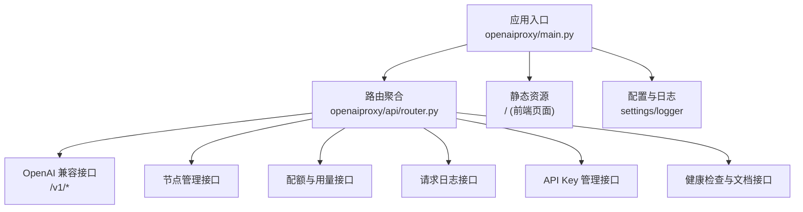
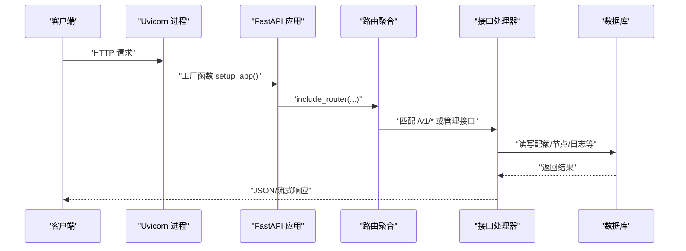
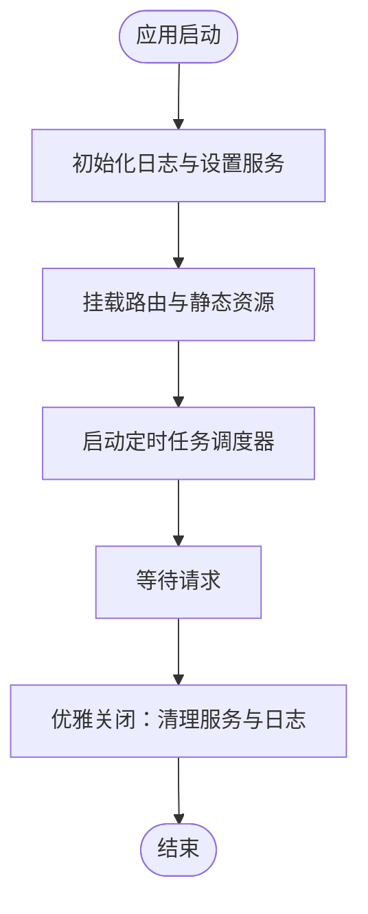
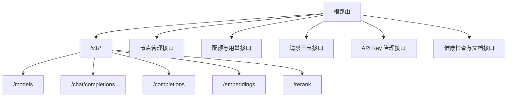
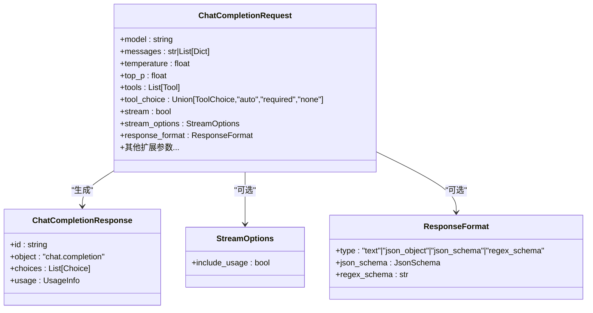

# 快速开始

<cite>
**本文引用的文件**
- [src/apiproxy/pyproject.toml](file://src/apiproxy/pyproject.toml)
- [Dockerfile](file://Dockerfile)
- [scripts/start.sh](file://scripts/start.sh)
- [scripts/init-db.sh](file://scripts/init-db.sh)
- [src/apiproxy/openaiproxy/main.py](file://src/apiproxy/openaiproxy/main.py)
- [src/apiproxy/openaiproxy/api/router.py](file://src/apiproxy/openaiproxy/api/router.py)
- [src/apiproxy/openaiproxy/api/schemas.py](file://src/apiproxy/openaiproxy/api/schemas.py)
- [docs/api.md](file://docs/api.md)
</cite>

## 目录
1. [简介](#简介)
2. [项目结构](#项目结构)
3. [核心组件](#核心组件)
4. [架构总览](#架构总览)
5. [详细组件分析](#详细组件分析)
6. [依赖分析](#依赖分析)
7. [性能考虑](#性能考虑)
8. [故障排查指南](#故障排查指南)
9. [结论](#结论)
10. [附录](#附录)

## 简介
本指南面向初学者与开发者，帮助您在本地或生产环境快速完成大模型接口代理服务的安装、配置与启动。内容涵盖：
- 环境要求与依赖安装
- 数据库初始化
- 本地开发环境搭建
- 生产环境容器化部署（Docker）
- 基本配置项与启动参数
- 简单的 API 调用示例，用于验证服务可用性

## 项目结构
该项目采用 Python 工程与 FastAPI Web 框架实现，核心模块包括：
- 应用入口与生命周期管理：main.py
- API 路由聚合：api/router.py
- 请求/响应数据模型：api/schemas.py
- 文档与接口清单：docs/api.md
- 构建与依赖声明：pyproject.toml
- 容器化与启动脚本：Dockerfile、scripts/start.sh、scripts/init-db.sh

图表来源
- [src/apiproxy/openaiproxy/main.py:128-187](file://src/apiproxy/openaiproxy/main.py#L128-L187)
- [src/apiproxy/openaiproxy/api/router.py:27-45](file://src/apiproxy/openaiproxy/api/router.py#L27-L45)

章节来源
- [src/apiproxy/openaiproxy/main.py:128-187](file://src/apiproxy/openaiproxy/main.py#L128-L187)
- [src/apiproxy/openaiproxy/api/router.py:27-45](file://src/apiproxy/openaiproxy/api/router.py#L27-L45)

## 核心组件
- 应用入口与生命周期
  - 负责创建 FastAPI 应用、注册中间件、挂载路由与静态资源、启动定时任务调度器。
  - 提供工厂函数以供 Uvicorn 通过 --factory 方式启动。
- 路由聚合
  - 将 v1 版本的 OpenAI 兼容接口与其他管理类接口统一挂载。
- 数据模型
  - 定义了聊天补全、文本补全、嵌入、重排序、模型列表等请求/响应模型。
- 文档与接口清单
  - 提供接口路径、鉴权方式与过滤参数说明。

章节来源
- [src/apiproxy/openaiproxy/main.py:128-187](file://src/apiproxy/openaiproxy/main.py#L128-L187)
- [src/apiproxy/openaiproxy/api/router.py:27-45](file://src/apiproxy/openaiproxy/api/router.py#L27-L45)
- [src/apiproxy/openaiproxy/api/schemas.py:157-351](file://src/apiproxy/openaiproxy/api/schemas.py#L157-L351)
- [docs/api.md:1-112](file://docs/api.md#L1-L112)

## 架构总览
下图展示了从客户端到服务端的典型交互流程，以及服务内部的组件关系。

图表来源
- [src/apiproxy/openaiproxy/main.py:208-220](file://src/apiproxy/openaiproxy/main.py#L208-L220)
- [src/apiproxy/openaiproxy/api/router.py:27-45](file://src/apiproxy/openaiproxy/api/router.py#L27-L45)

## 详细组件分析

### 组件一：应用入口与生命周期
- 职责
  - 初始化日志与设置服务
  - 注册 CORS 中间件
  - 挂载全部路由（v1、节点、配额、日志、API Key、健康检查、自定义文档）
  - 启动 APScheduler 定时任务（运行时状态清理、节点状态清理、用量汇总）
  - 提供工厂函数 setup_app，支持通过 --factory 启动
- 关键行为
  - 支持后端仅模式（backend_only），可选择不挂载静态资源
  - 通过环境变量控制主机、端口、工作进程数与日志级别

图表来源
- [src/apiproxy/openaiproxy/main.py:57-126](file://src/apiproxy/openaiproxy/main.py#L57-L126)
- [src/apiproxy/openaiproxy/main.py:208-220](file://src/apiproxy/openaiproxy/main.py#L208-L220)

章节来源
- [src/apiproxy/openaiproxy/main.py:57-126](file://src/apiproxy/openaiproxy/main.py#L57-L126)
- [src/apiproxy/openaiproxy/main.py:208-220](file://src/apiproxy/openaiproxy/main.py#L208-L220)

### 组件二：路由聚合与接口清单
- 路由组织
  - v1 路由前缀 /v1，包含模型列表、聊天补全、文本补全、嵌入、重排序
  - 管理类路由：节点管理、节点模型配额、应用配额、请求日志、API Key 管理、健康检查、自定义文档
- 鉴权说明
  - 管理接口使用管理密钥
  - OpenAI 兼容接口使用应用 API Key

图表来源
- [src/apiproxy/openaiproxy/api/router.py:27-45](file://src/apiproxy/openaiproxy/api/router.py#L27-L45)
- [docs/api.md:8-112](file://docs/api.md#L8-L112)

章节来源
- [src/apiproxy/openaiproxy/api/router.py:27-45](file://src/apiproxy/openaiproxy/api/router.py#L27-L45)
- [docs/api.md:3-7](file://docs/api.md#L3-L7)

### 组件三：数据模型与请求/响应
- 模型类型
  - ChatCompletionRequest/Response、CompletionRequest/Response、Embeddings、Rerank、模型列表等
- 流式响应
  - 支持流式输出，包含 usage 选项
- 扩展字段
  - 针对工具调用、响应格式、会话 ID、重复惩罚等扩展参数

图表来源
- [src/apiproxy/openaiproxy/api/schemas.py:157-282](file://src/apiproxy/openaiproxy/api/schemas.py#L157-L282)
- [src/apiproxy/openaiproxy/api/schemas.py:131-155](file://src/apiproxy/openaiproxy/api/schemas.py#L131-L155)
- [src/apiproxy/openaiproxy/api/schemas.py:150-155](file://src/apiproxy/openaiproxy/api/schemas.py#L150-L155)

章节来源
- [src/apiproxy/openaiproxy/api/schemas.py:157-282](file://src/apiproxy/openaiproxy/api/schemas.py#L157-L282)
- [src/apiproxy/openaiproxy/api/schemas.py:131-155](file://src/apiproxy/openaiproxy/api/schemas.py#L131-L155)
- [src/apiproxy/openaiproxy/api/schemas.py:150-155](file://src/apiproxy/openaiproxy/api/schemas.py#L150-L155)

## 依赖分析
- 运行时依赖
  - Web 框架：FastAPI、Uvicorn
  - HTTP 客户端：httpx[http2]
  - ORM/数据库：SQLModel、SQLAlchemy、Alembic
  - 配置与设置：pydantic-settings、pydantic
  - 日志与可观测性：rich、opentelemetry、prometheus-client、sentry-sdk
  - 并发与调度：APScheduler、cachetools
  - 其他：numpy、bcrypt、shortuuid、requests、orjson、tiktoken 等
- 构建与打包
  - 使用 Hatchling 作为构建后端
  - 使用 uv 作为包管理器与同步工具
  - 项目版本与元信息在 pyproject.toml 中声明

章节来源
- [src/apiproxy/pyproject.toml:20-56](file://src/apiproxy/pyproject.toml#L20-L56)
- [src/apiproxy/pyproject.toml:183-186](file://src/apiproxy/pyproject.toml#L183-L186)

## 性能考虑
- 并发与工作进程
  - 通过环境变量控制工作进程数，默认根据 CPU 核心数自动推断
- 事件循环与异步
  - 使用 asyncio 事件循环，支持流式响应与后台任务
- 定时任务
  - 后台调度器负责定期清理与用量汇总，避免阻塞主请求线程
- 数据库连接
  - 使用 SQLModel/SQLAlchemy 连接 PostgreSQL；建议在生产中配合连接池与只读副本

[本节为通用性能建议，无需特定文件引用]

## 故障排查指南
- 启动失败
  - 检查端口占用与权限（默认端口可通过环境变量修改）
  - 查看日志输出，确认是否抛出迁移异常提示
- 数据库问题
  - 确认数据库地址、端口、用户名、密码正确
  - 如需自动创建数据库，设置相应环境变量并执行初始化脚本
- 接口报错
  - 确认鉴权头是否正确（管理密钥 vs 应用 API Key）
  - 检查请求体字段是否符合数据模型定义

章节来源
- [src/apiproxy/openaiproxy/main.py:222-242](file://src/apiproxy/openaiproxy/main.py#L222-L242)
- [scripts/init-db.sh:3-33](file://scripts/init-db.sh#L3-L33)
- [docs/api.md:3-7](file://docs/api.md#L3-L7)

## 结论
通过本指南，您可以在本地快速完成环境准备、依赖安装、数据库初始化与服务启动，并在生产环境中使用容器化方式部署。若需进一步扩展功能（如接入更多大模型节点、配置配额策略、集成监控告警），可基于现有路由与数据模型进行二次开发。

[本节为总结性内容，无需特定文件引用]

## 附录

### A. 环境要求与安装步骤
- 环境要求
  - Python 版本：3.10 至 3.12（推荐 3.10+）
  - 数据库：PostgreSQL（用于存储节点、配额、日志等）
- 依赖安装
  - 使用 uv 同步依赖（包含开发依赖）
  - 项目根目录下执行依赖同步命令
- 数据库初始化
  - 设置自动创建数据库相关环境变量并执行初始化脚本
  - 若未启用自动创建，需手动创建数据库并执行迁移

章节来源
- [src/apiproxy/pyproject.toml:11](file://src/apiproxy/pyproject.toml#L11)
- [scripts/init-db.sh:3-33](file://scripts/init-db.sh#L3-L33)

### B. 本地开发环境搭建
- 步骤概览
  - 克隆仓库
  - 安装依赖（uv）
  - 准备数据库（自动或手动）
  - 启动服务（Uvicorn）
- 启动参数
  - 主机：通过环境变量设置
  - 端口：通过环境变量设置
  - 工作进程：通过环境变量设置
  - 日志级别：通过环境变量设置

章节来源
- [src/apiproxy/openaiproxy/main.py:222-242](file://src/apiproxy/openaiproxy/main.py#L222-L242)
- [scripts/start.sh:5-8](file://scripts/start.sh#L5-L8)

### C. 生产环境部署（Docker）
- Docker 镜像
  - 使用多阶段构建，包含编译与运行时阶段
  - 运行时镜像内置 PostgreSQL 客户端
- 启动脚本
  - 通过 CMD 执行启动脚本，设置工作进程数与端口
- 建议
  - 将数据库置于独立容器或托管服务
  - 使用反向代理（如 Nginx）暴露服务
  - 配置健康检查与日志采集

章节来源
- [Dockerfile:1-66](file://Dockerfile#L1-L66)
- [scripts/start.sh:5-8](file://scripts/start.sh#L5-L8)

### D. 基本配置示例与启动参数
- 环境变量（示例）
  - APIPROXY_WORKERS：工作进程数
  - APIPROXY_PORT：监听端口
  - APIPROXY_DB_HOST/APIPROXY_DB_PORT/APIPROXY_DB_USER/APIPROXY_DB_NAME/APIPROXY_DB_PASSWORD：数据库连接
  - APIPROXY_AUTOCREATE_DB：是否自动创建数据库
- 启动方式
  - 本地：直接运行入口模块（Uvicorn）
  - 容器：通过启动脚本工厂函数启动

章节来源
- [scripts/start.sh:5-8](file://scripts/start.sh#L5-L8)
- [scripts/init-db.sh:6-28](file://scripts/init-db.sh#L6-L28)
- [src/apiproxy/openaiproxy/main.py:222-242](file://src/apiproxy/openaiproxy/main.py#L222-L242)

### E. 简单 API 调用示例（验证安装）
- 获取模型列表
  - 方法：GET
  - 路径：/v1/models
  - 鉴权：应用 API Key
- 创建聊天补全
  - 方法：POST
  - 路径：/v1/chat/completions
  - 鉴权：应用 API Key
  - 请求体字段参考数据模型定义

章节来源
- [docs/api.md:10-16](file://docs/api.md#L10-L16)
- [src/apiproxy/openaiproxy/api/schemas.py:157-282](file://src/apiproxy/openaiproxy/api/schemas.py#L157-L282)