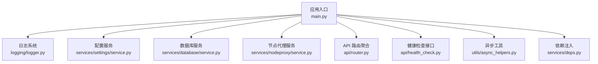
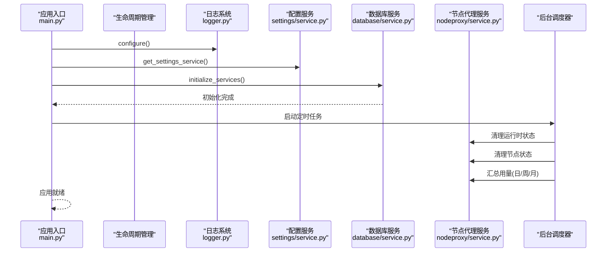
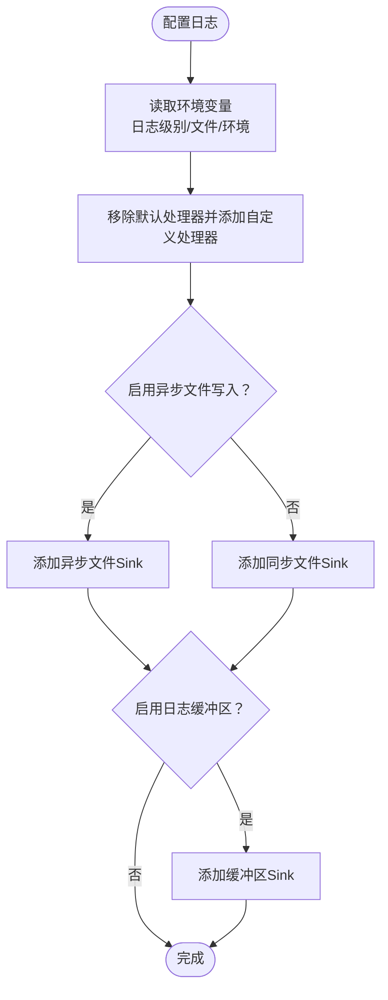
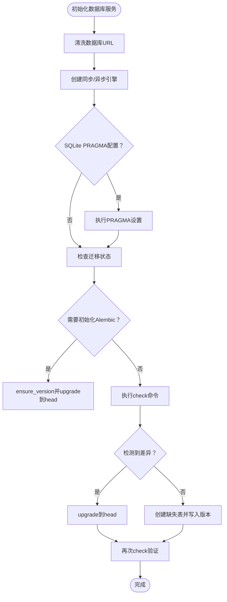
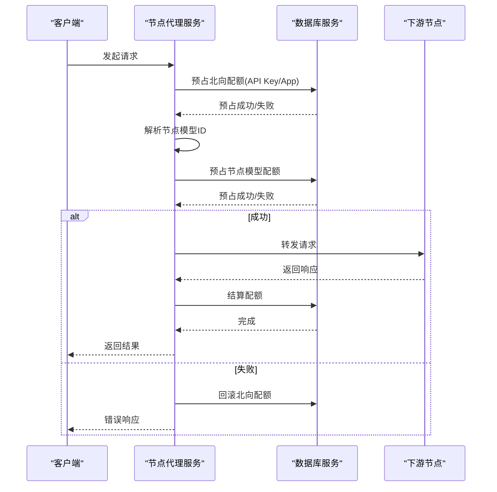
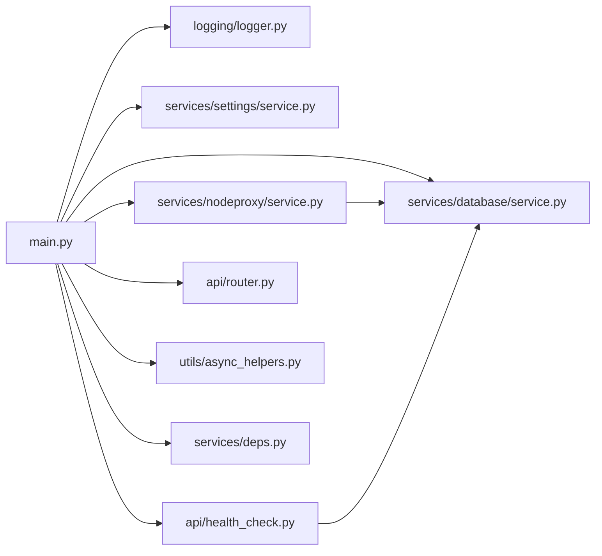

# 故障排除

<cite>
**本文引用的文件**
- [src/apiproxy/openaiproxy/main.py](file://src/apiproxy/openaiproxy/main.py)
- [src/apiproxy/openaiproxy/settings.py](file://src/apiproxy/openaiproxy/settings.py)
- [src/apiproxy/openaiproxy/logging/logger.py](file://src/apiproxy/openaiproxy/logging/logger.py)
- [src/apiproxy/openaiproxy/services/database/service.py](file://src/apiproxy/openaiproxy/services/database/service.py)
- [src/apiproxy/openaiproxy/api/router.py](file://src/apiproxy/openaiproxy/api/router.py)
- [src/apiproxy/openaiproxy/services/nodeproxy/service.py](file://src/apiproxy/openaiproxy/services/nodeproxy/service.py)
- [src/apiproxy/openaiproxy/services/settings/service.py](file://src/apiproxy/openaiproxy/services/settings/service.py)
- [src/apiproxy/openaiproxy/utils/async_helpers.py](file://src/apiproxy/openaiproxy/utils/async_helpers.py)
- [src/apiproxy/openaiproxy/api/health_check.py](file://src/apiproxy/openaiproxy/api/health_check.py)
- [src/apiproxy/openaiproxy/services/deps.py](file://src/apiproxy/openaiproxy/services/deps.py)
</cite>

## 目录
1. [简介](#简介)
2. [项目结构](#项目结构)
3. [核心组件](#核心组件)
4. [架构总览](#架构总览)
5. [详细组件分析](#详细组件分析)
6. [依赖分析](#依赖分析)
7. [性能考虑](#性能考虑)
8. [故障排除指南](#故障排除指南)
9. [结论](#结论)
10. [附录](#附录)

## 简介
本指南面向大模型接口代理系统的运维与开发人员，聚焦于常见问题的诊断与修复流程，覆盖连接失败、性能问题、配置错误、数据库连接与一致性、网络连通性、API 调用失败、监控告警响应与紧急处置、以及系统恢复与数据修复等主题。文档以代码为依据，结合系统日志分析方法与关键错误信息解读，帮助快速定位并解决问题。

## 项目结构
系统采用分层与模块化设计：
- 应用入口与生命周期管理：FastAPI 应用创建、CORS 中间件、静态文件挂载、定时任务调度与优雅停机。
- 日志系统：基于 loguru 的异步文件输出、容器环境格式化、缓冲区回溯查询。
- 配置与设置：集中式 SettingsService，支持运行时键值写入。
- 数据访问：SQLModel + SQLAlchemy 异步引擎，Alembic 迁移与版本控制。
- 节点代理与调度：节点发现、健康检查、配额预留与回滚、延迟采样与负载策略。
- 健康检查：数据库连通性与服务可用性评估。
- 工具与辅助：异步执行辅助、服务依赖注入与上下文管理。

图表来源
- [src/apiproxy/openaiproxy/main.py:128-187](file://src/apiproxy/openaiproxy/main.py#L128-L187)
- [src/apiproxy/openaiproxy/logging/logger.py:194-267](file://src/apiproxy/openaiproxy/logging/logger.py#L194-L267)
- [src/apiproxy/openaiproxy/services/settings/service.py:33-53](file://src/apiproxy/openaiproxy/services/settings/service.py#L33-L53)
- [src/apiproxy/openaiproxy/services/database/service.py:59-132](file://src/apiproxy/openaiproxy/services/database/service.py#L59-L132)
- [src/apiproxy/openaiproxy/services/nodeproxy/service.py:214-281](file://src/apiproxy/openaiproxy/services/nodeproxy/service.py#L214-L281)
- [src/apiproxy/openaiproxy/api/router.py:27-45](file://src/apiproxy/openaiproxy/api/router.py#L27-L45)
- [src/apiproxy/openaiproxy/api/health_check.py:57-76](file://src/apiproxy/openaiproxy/api/health_check.py#L57-L76)
- [src/apiproxy/openaiproxy/utils/async_helpers.py:31-71](file://src/apiproxy/openaiproxy/utils/async_helpers.py#L31-L71)
- [src/apiproxy/openaiproxy/services/deps.py:46-176](file://src/apiproxy/openaiproxy/services/deps.py#L46-L176)

章节来源
- [src/apiproxy/openaiproxy/main.py:128-187](file://src/apiproxy/openaiproxy/main.py#L128-L187)
- [src/apiproxy/openaiproxy/api/router.py:27-45](file://src/apiproxy/openaiproxy/api/router.py#L27-L45)

## 核心组件
- 应用生命周期与调度：启动时初始化服务、注册定时任务（运行时状态清理、节点状态清理、用量汇总）、优雅停机与资源回收。
- 日志系统：统一日志配置、容器化输出、异步文件写入、日志缓冲区与检索接口。
- 数据库服务：引擎创建、SQLite PRAGMA 注入、迁移与版本校验、表结构健康检查、测试辅助。
- 节点代理服务：节点注册与实例标识、配置刷新循环、健康检查、配额预留与回滚、延迟与速度度量。
- 健康检查接口：数据库连通性与服务可用性评估，避免与底层框架默认健康端点混淆。
- 配置服务：集中式 Settings 对象封装，支持运行时键值写入。
- 异步工具：事件循环兼容性与线程内协程执行，CPU 核数计算工作线程数。
- 依赖注入：服务工厂与上下文管理器，简化会话与服务获取。

章节来源
- [src/apiproxy/openaiproxy/main.py:57-126](file://src/apiproxy/openaiproxy/main.py#L57-L126)
- [src/apiproxy/openaiproxy/logging/logger.py:194-302](file://src/apiproxy/openaiproxy/logging/logger.py#L194-L302)
- [src/apiproxy/openaiproxy/services/database/service.py:59-403](file://src/apiproxy/openaiproxy/services/database/service.py#L59-L403)
- [src/apiproxy/openaiproxy/services/nodeproxy/service.py:214-800](file://src/apiproxy/openaiproxy/services/nodeproxy/service.py#L214-L800)
- [src/apiproxy/openaiproxy/api/health_check.py:57-76](file://src/apiproxy/openaiproxy/api/health_check.py#L57-L76)
- [src/apiproxy/openaiproxy/services/settings/service.py:33-53](file://src/apiproxy/openaiproxy/services/settings/service.py#L33-L53)
- [src/apiproxy/openaiproxy/utils/async_helpers.py:31-71](file://src/apiproxy/openaiproxy/utils/async_helpers.py#L31-L71)
- [src/apiproxy/openaiproxy/services/deps.py:46-176](file://src/apiproxy/openaiproxy/services/deps.py#L46-L176)

## 架构总览
下图展示应用启动、路由注册、服务初始化与定时任务的关系，以及日志与数据库的关键交互。

图表来源
- [src/apiproxy/openaiproxy/main.py:57-126](file://src/apiproxy/openaiproxy/main.py#L57-L126)
- [src/apiproxy/openaiproxy/logging/logger.py:194-267](file://src/apiproxy/openaiproxy/logging/logger.py#L194-L267)
- [src/apiproxy/openaiproxy/services/settings/service.py:33-53](file://src/apiproxy/openaiproxy/services/settings/service.py#L33-L53)
- [src/apiproxy/openaiproxy/services/database/service.py:59-132](file://src/apiproxy/openaiproxy/services/database/service.py#L59-L132)
- [src/apiproxy/openaiproxy/services/nodeproxy/service.py:214-281](file://src/apiproxy/openaiproxy/services/nodeproxy/service.py#L214-L281)

## 详细组件分析

### 组件A：应用生命周期与定时任务
- 关键职责
  - 初始化日志、设置服务、数据库服务。
  - 注册定时任务：清理运行时状态、清理失败状态日志、移除过期日志、每日/每周/每月用量汇总。
  - 优雅停机：释放资源、关闭日志、打印停机提示。
- 常见问题
  - 定时任务未启动：检查生命周期函数是否正确返回、调度器是否被创建。
  - 迁移异常导致启动失败：查看日志中关于迁移的异常堆栈，并按提示执行修复。
- 诊断要点
  - 观察启动日志中“退出时清理资源...”字样确认优雅停机路径。
  - 检查环境变量对端口、主机、工作进程数的影响。

章节来源
- [src/apiproxy/openaiproxy/main.py:57-126](file://src/apiproxy/openaiproxy/main.py#L57-L126)
- [src/apiproxy/openaiproxy/main.py:222-243](file://src/apiproxy/openaiproxy/main.py#L222-L243)

### 组件B：日志系统与日志缓冲区
- 关键职责
  - 支持容器化输出、异步文件写入、人类可读与JSON格式。
  - 提供日志缓冲区，支持按时间戳检索最近N条日志。
  - 将 uvicorn/gunicorn 日志桥接到 loguru。
- 常见问题
  - 日志文件未生成或权限不足：检查日志目录与文件权限。
  - 日志级别过低导致关键信息缺失：通过环境变量调整日志级别。
  - 容器化部署日志格式不符合预期：检查容器相关环境变量。
- 诊断要点
  - 使用缓冲区检索接口定位问题发生的时间窗口。
  - 关注容器模式下的序列化输出与CSV格式字段。

图表来源
- [src/apiproxy/openaiproxy/logging/logger.py:194-267](file://src/apiproxy/openaiproxy/logging/logger.py#L194-L267)
- [src/apiproxy/openaiproxy/logging/logger.py:50-148](file://src/apiproxy/openaiproxy/logging/logger.py#L50-L148)

章节来源
- [src/apiproxy/openaiproxy/logging/logger.py:194-302](file://src/apiproxy/openaiproxy/logging/logger.py#L194-L302)

### 组件C：数据库服务与迁移
- 关键职责
  - 创建同步与异步引擎，注入 SQLite PRAGMA，设置连接参数。
  - 健康检查：检查表与列是否存在，识别遗留表。
  - 迁移：初始化 Alembic、自动升级、差异检测与降级再升级尝试。
  - 表结构创建：按模型元数据创建表并写入版本。
- 常见问题
  - 数据库URL无效或方言不匹配：修正URL前缀，确保方言一致。
  - 迁移差异导致启动阻塞：按提示执行修复或降级再升级。
  - 表缺失或字段不全：触发表创建或迁移。
- 诊断要点
  - 查看迁移日志与差异检测输出。
  - 使用健康检查方法验证表与列完整性。

图表来源
- [src/apiproxy/openaiproxy/services/database/service.py:59-132](file://src/apiproxy/openaiproxy/services/database/service.py#L59-L132)
- [src/apiproxy/openaiproxy/services/database/service.py:223-293](file://src/apiproxy/openaiproxy/services/database/service.py#L223-L293)
- [src/apiproxy/openaiproxy/services/database/service.py:340-391](file://src/apiproxy/openaiproxy/services/database/service.py#L340-L391)

章节来源
- [src/apiproxy/openaiproxy/services/database/service.py:59-403](file://src/apiproxy/openaiproxy/services/database/service.py#L59-L403)

### 组件D：节点代理服务与配额
- 关键职责
  - 节点注册与实例标识，健康检查与离线节点维护。
  - 预占北向配额（API Key/App）与节点模型配额，失败回滚。
  - 延迟样本与速度计算，按策略选择节点。
- 常见问题
  - 节点不可用或健康检查失败：检查节点URL、超时与鉴权头。
  - 配额耗尽导致请求失败：检查配额预留与回滚逻辑。
  - 节点模型映射缺失：核对模型名称与类型大小写与索引。
- 诊断要点
  - 观察健康检查结果与延迟队列变化。
  - 检查配额标记与清理机制。

图表来源
- [src/apiproxy/openaiproxy/services/nodeproxy/service.py:282-368](file://src/apiproxy/openaiproxy/services/nodeproxy/service.py#L282-L368)
- [src/apiproxy/openaiproxy/services/nodeproxy/service.py:759-800](file://src/apiproxy/openaiproxy/services/nodeproxy/service.py#L759-L800)

章节来源
- [src/apiproxy/openaiproxy/services/nodeproxy/service.py:214-800](file://src/apiproxy/openaiproxy/services/nodeproxy/service.py#L214-L800)

### 组件E：健康检查接口
- 关键职责
  - 评估数据库连通性与服务可用性，避免与底层框架默认健康端点混淆。
- 常见问题
  - 数据库异常导致健康检查失败：检查数据库连接、迁移状态与权限。
- 诊断要点
  - 当返回非“ok”时，查看服务端异常日志。

章节来源
- [src/apiproxy/openaiproxy/api/health_check.py:57-76](file://src/apiproxy/openaiproxy/api/health_check.py#L57-L76)

### 组件F：配置服务与依赖注入
- 关键职责
  - SettingsService 封装 Settings，支持运行时键值写入；依赖注入提供统一获取方式。
- 常见问题
  - 配置目录未设置：启动时报错，需设置配置目录。
- 诊断要点
  - 检查初始化时的配置目录校验。

章节来源
- [src/apiproxy/openaiproxy/services/settings/service.py:33-53](file://src/apiproxy/openaiproxy/services/settings/service.py#L33-L53)
- [src/apiproxy/openaiproxy/services/deps.py:46-176](file://src/apiproxy/openaiproxy/services/deps.py#L46-L176)

## 依赖分析
- 组件耦合
  - 应用入口依赖日志、设置、数据库与节点代理服务；通过依赖注入获取具体实例。
  - 节点代理服务依赖数据库服务进行配额与状态读写。
  - 健康检查接口依赖数据库服务进行连通性测试。
- 外部依赖
  - FastAPI、SQLAlchemy/SQLModel、Alembic、loguru、requests、apscheduler 等。

图表来源
- [src/apiproxy/openaiproxy/main.py:43-53](file://src/apiproxy/openaiproxy/main.py#L43-L53)
- [src/apiproxy/openaiproxy/services/deps.py:46-103](file://src/apiproxy/openaiproxy/services/deps.py#L46-L103)

章节来源
- [src/apiproxy/openaiproxy/main.py:43-53](file://src/apiproxy/openaiproxy/main.py#L43-L53)
- [src/apiproxy/openaiproxy/services/deps.py:46-103](file://src/apiproxy/openaiproxy/services/deps.py#L46-L103)

## 性能考虑
- 并发与线程
  - 使用异步工具在无事件循环场景创建新事件循环，保证协程执行。
  - CPU 核数计算工作线程数，提升并发吞吐。
- 数据库连接池
  - 通过设置池大小与溢出数量，平衡高并发与资源占用。
  - SQLite 场景设置连接超时，避免长时间阻塞。
- 调度频率
  - 定时任务间隔应与业务负载匹配，避免过度扫描或遗漏清理。
- 日志开销
  - 异步文件写入降低主线程阻塞；容器化输出减少格式化成本。

章节来源
- [src/apiproxy/openaiproxy/utils/async_helpers.py:31-71](file://src/apiproxy/openaiproxy/utils/async_helpers.py#L31-L71)
- [src/apiproxy/openaiproxy/services/database/service.py:104-144](file://src/apiproxy/openaiproxy/services/database/service.py#L104-L144)
- [src/apiproxy/openaiproxy/main.py:68-112](file://src/apiproxy/openaiproxy/main.py#L68-L112)

## 故障排除指南

### 一、连接失败
- 现象
  - 应用无法启动、健康检查失败、API 返回连接错误。
- 诊断步骤
  - 检查数据库URL与方言是否正确，必要时替换为标准前缀。
  - 核对数据库凭据、网络可达性与防火墙规则。
  - 查看迁移日志，确认 Alembic 初始化与升级是否成功。
  - 使用健康检查接口评估数据库连通性。
- 解决方案
  - 修正数据库URL与方言。
  - 执行迁移修复流程（降级再升级）。
  - 修复网络与权限后重试。

章节来源
- [src/apiproxy/openaiproxy/services/database/service.py:96-102](file://src/apiproxy/openaiproxy/services/database/service.py#L96-L102)
- [src/apiproxy/openaiproxy/services/database/service.py:247-293](file://src/apiproxy/openaiproxy/services/database/service.py#L247-L293)
- [src/apiproxy/openaiproxy/api/health_check.py:60-76](file://src/apiproxy/openaiproxy/api/health_check.py#L60-L76)

### 二、性能问题
- 现象
  - 响应延迟升高、吞吐下降、CPU/IO 抖动。
- 诊断步骤
  - 检查节点代理服务的延迟样本与速度计算，定位慢节点。
  - 核对数据库连接池参数与SQLite超时设置。
  - 分析日志中关键路径耗时与异常。
- 优化建议
  - 调整连接池大小与溢出数量。
  - 优化调度频率与批处理策略。
  - 使用异步文件写入与容器化日志格式。

章节来源
- [src/apiproxy/openaiproxy/services/nodeproxy/service.py:600-630](file://src/apiproxy/openaiproxy/services/nodeproxy/service.py#L600-L630)
- [src/apiproxy/openaiproxy/services/database/service.py:104-144](file://src/apiproxy/openaiproxy/services/database/service.py#L104-L144)
- [src/apiproxy/openaiproxy/logging/logger.py:177-192](file://src/apiproxy/openaiproxy/logging/logger.py#L177-L192)

### 三、配置错误
- 现象
  - 启动报错、功能异常、行为不符合预期。
- 诊断步骤
  - 检查配置目录是否设置，SettingsService 初始化是否成功。
  - 校验环境变量对日志级别、日志文件、端口、工作进程数的影响。
- 解决方案
  - 设置正确的配置目录与环境变量。
  - 重启应用使配置生效。

章节来源
- [src/apiproxy/openaiproxy/services/settings/service.py:40-48](file://src/apiproxy/openaiproxy/services/settings/service.py#L40-L48)
- [src/apiproxy/openaiproxy/main.py:222-243](file://src/apiproxy/openaiproxy/main.py#L222-L243)
- [src/apiproxy/openaiproxy/logging/logger.py:204-211](file://src/apiproxy/openaiproxy/logging/logger.py#L204-L211)

### 四、数据库连接问题与数据一致性
- 现象
  - 迁移差异、表缺失、字段不全、连接超时。
- 诊断步骤
  - 使用健康检查方法验证表与列是否存在。
  - 查看迁移日志与差异检测输出。
  - 检查 SQLite PRAGMA 设置与连接超时。
- 解决方案
  - 执行迁移修复（降级再升级）。
  - 手动创建缺失表或字段。
  - 调整连接池与超时参数。

章节来源
- [src/apiproxy/openaiproxy/services/database/service.py:195-222](file://src/apiproxy/openaiproxy/services/database/service.py#L195-L222)
- [src/apiproxy/openaiproxy/services/database/service.py:247-293](file://src/apiproxy/openaiproxy/services/database/service.py#L247-L293)
- [src/apiproxy/openaiproxy/services/database/service.py:146-163](file://src/apiproxy/openaiproxy/services/database/service.py#L146-L163)

### 五、网络连接问题
- 现象
  - 节点健康检查失败、请求超时、鉴权头无效。
- 诊断步骤
  - 检查节点URL、超时设置与鉴权头。
  - 使用健康检查接口验证连通性。
- 解决方案
  - 修正节点URL与超时。
  - 修复鉴权头或密钥配置。

章节来源
- [src/apiproxy/openaiproxy/services/nodeproxy/service.py:759-800](file://src/apiproxy/openaiproxy/services/nodeproxy/service.py#L759-L800)

### 六、API 调用失败
- 现象
  - 请求被拒绝、配额耗尽、节点不可用。
- 诊断步骤
  - 检查配额预留与回滚逻辑，确认是否因配额不足导致。
  - 核对节点模型映射与类型大小写。
  - 查看错误响应与日志堆栈。
- 解决方案
  - 为API Key/App增加配额或清理过期配额。
  - 修复模型名称与类型映射。
  - 重试或切换可用节点。

章节来源
- [src/apiproxy/openaiproxy/services/nodeproxy/service.py:282-368](file://src/apiproxy/openaiproxy/services/nodeproxy/service.py#L282-L368)

### 七、监控告警响应与紧急处理
- 流程
  - 告警触发 → 快速确认影响面 → 检查日志与健康检查 → 临时降级或切流 → 修复后回归。
- 建议
  - 使用日志缓冲区检索近实时日志。
  - 优先处理数据库与网络类故障。
  - 保持与下游节点的沟通渠道畅通。

章节来源
- [src/apiproxy/openaiproxy/logging/logger.py:50-148](file://src/apiproxy/openaiproxy/logging/logger.py#L50-L148)
- [src/apiproxy/openaiproxy/api/health_check.py:57-76](file://src/apiproxy/openaiproxy/api/health_check.py#L57-L76)

### 八、系统恢复与数据修复
- 步骤
  - 停止服务 → 修复配置/数据库/网络 → 启动服务 → 健康检查 → 观察日志 → 回归测试。
- 数据修复
  - 执行迁移修复（降级再升级）。
  - 手动创建缺失表或字段。
  - 清理过期日志与失败状态，恢复运行时状态。

章节来源
- [src/apiproxy/openaiproxy/main.py:114-125](file://src/apiproxy/openaiproxy/main.py#L114-L125)
- [src/apiproxy/openaiproxy/services/database/service.py:294-308](file://src/apiproxy/openaiproxy/services/database/service.py#L294-L308)
- [src/apiproxy/openaiproxy/services/database/service.py:340-391](file://src/apiproxy/openaiproxy/services/database/service.py#L340-L391)

## 结论
本指南基于系统实际实现，提供了从日志分析、数据库一致性、网络连通性到API调用失败与性能优化的完整排障路径。建议在生产环境中：
- 明确日志级别与输出格式，启用异步文件写入；
- 定期检查数据库迁移与表结构健康；
- 通过健康检查接口与节点代理服务指标监控系统状态；
- 制定标准化的告警响应与紧急处置流程。

## 附录
- 关键环境变量
  - 日志级别：APIPROXY_LOG_LEVEL
  - 日志文件：APIPROXY_LOG_FILE
  - 日志目录：APIPROXY_LOG_DIR
  - 日志环境：APIPROXY_LOG_ENV
  - 日志缓冲区大小：APIPROXY_LOG_RETRIEVER_BUFFER_SIZE
  - 主机与端口：APIPROXY_HOST、APIPROXY_PORT
  - 工作进程数：APIPROXY_WORKERS
- 常用端点
  - 健康检查：GET /health_check
  - 文档：自定义接口文档路由（由应用注册）

章节来源
- [src/apiproxy/openaiproxy/logging/logger.py:204-211](file://src/apiproxy/openaiproxy/logging/logger.py#L204-L211)
- [src/apiproxy/openaiproxy/main.py:222-243](file://src/apiproxy/openaiproxy/main.py#L222-L243)
- [src/apiproxy/openaiproxy/api/router.py:27-45](file://src/apiproxy/openaiproxy/api/router.py#L27-L45)