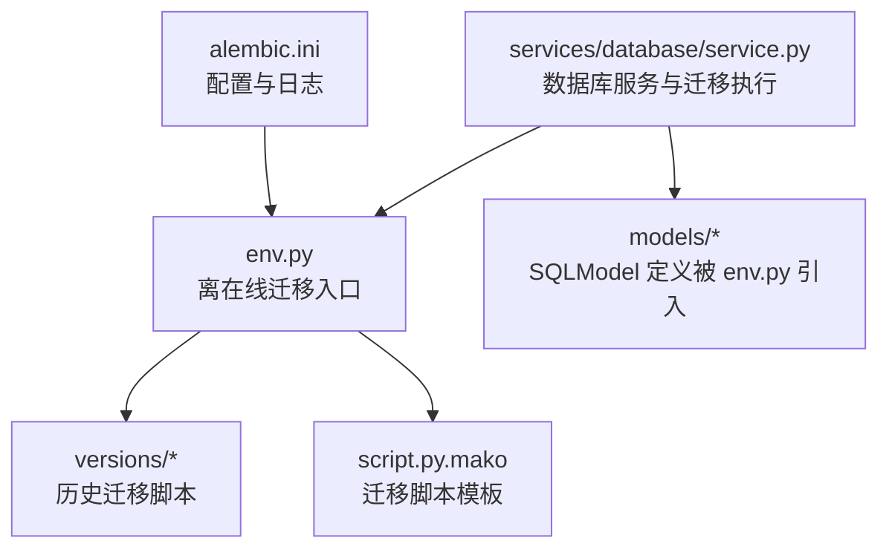
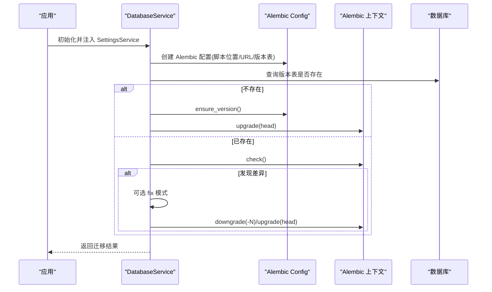
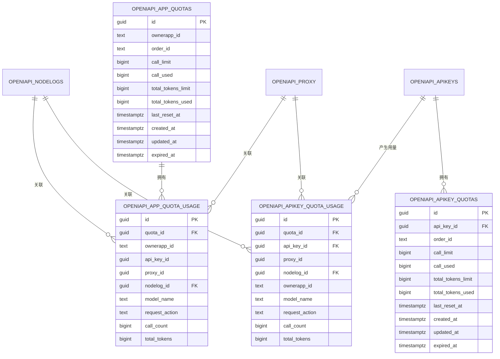
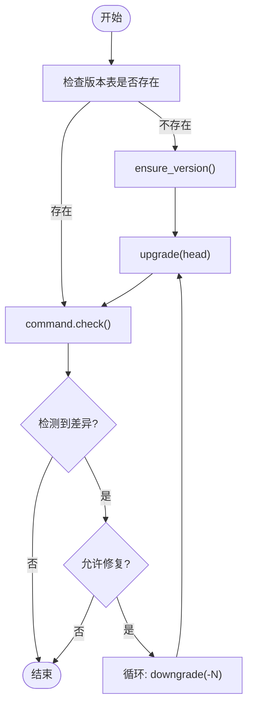
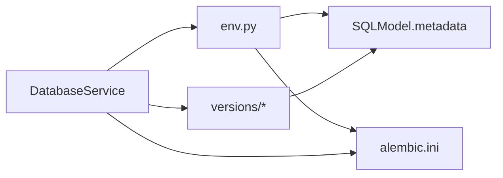

# 数据库迁移管理

<cite>
**本文引用的文件**
- [src/apiproxy/openaiproxy/alembic.ini](file://src/apiproxy/openaiproxy/alembic.ini)
- [src/apiproxy/openaiproxy/alembic/env.py](file://src/apiproxy/openaiproxy/alembic/env.py)
- [src/apiproxy/openaiproxy/alembic/script.py.mako](file://src/apiproxy/openaiproxy/alembic/script.py.mako)
- [src/apiproxy/openaiproxy/alembic/README](file://src/apiproxy/openaiproxy/alembic/README)
- [src/apiproxy/openaiproxy/alembic/versions/289442e9b00c_init.py](file://src/apiproxy/openaiproxy/alembic/versions/289442e9b00c_init.py)
- [src/apiproxy/openaiproxy/alembic/versions/0e4bdcd25316_add_northbound_apikey_and_app_quotas.py](file://src/apiproxy/openaiproxy/alembic/versions/0e4bdcd25316_add_northbound_apikey_and_app_quotas.py)
- [src/apiproxy/openaiproxy/alembic/versions/bafe420807ac_daily_and_weekly_usage_rollup.py](file://src/apiproxy/openaiproxy/alembic/versions/bafe420807ac_daily_and_weekly_usage_rollup.py)
- [src/apiproxy/openaiproxy/alembic/versions/c2a5c7e5f3b1_apikey_security_and_monthly_rollup.py](file://src/apiproxy/openaiproxy/alembic/versions/c2a5c7e5f3b1_apikey_security_and_monthly_rollup.py)
- [src/apiproxy/openaiproxy/services/database/service.py](file://src/apiproxy/openaiproxy/services/database/service.py)
- [src/apiproxy/openaiproxy/services/database/factory.py](file://src/apiproxy/openaiproxy/services/database/factory.py)
- [src/apiproxy/openaiproxy/services/database/models/base.py](file://src/apiproxy/openaiproxy/services/database/models/base.py)
</cite>

## 目录
1. [简介](#简介)
2. [项目结构](#项目结构)
3. [核心组件](#核心组件)
4. [架构总览](#架构总览)
5. [详细组件分析](#详细组件分析)
6. [依赖分析](#依赖分析)
7. [性能考量](#性能考量)
8. [故障排查指南](#故障排查指南)
9. [结论](#结论)
10. [附录](#附录)

## 简介
本文件面向大模型接口代理系统的数据库迁移管理，围绕 Alembic 迁移工具的配置、使用与版本治理进行系统化说明。内容涵盖：
- Alembic 配置与模板生成规则
- 版本管理策略与迁移脚本编写规范
- 历史版本功能变更与数据结构演进
- 执行流程、回滚机制与错误处理
- 最佳实践、性能优化与数据安全
- 生产环境升级/降级与一致性保障
- 迁移前准备、执行步骤与验证方法

## 项目结构
本项目采用“单数据库、多版本脚本”的标准 Alembic 结构，迁移脚本位于 openaiproxy/alembic/versions 下，通过 alembic.ini 统一配置，env.py 提供目标元数据与离在线迁移入口。

图表来源
- [src/apiproxy/openaiproxy/alembic.ini:1-113](file://src/apiproxy/openaiproxy/alembic.ini#L1-L113)
- [src/apiproxy/openaiproxy/alembic/env.py:1-114](file://src/apiproxy/openaiproxy/alembic/env.py#L1-L114)
- [src/apiproxy/openaiproxy/alembic/script.py.mako:1-31](file://src/apiproxy/openaiproxy/alembic/script.py.mako#L1-L31)
- [src/apiproxy/openaiproxy/services/database/service.py:1-403](file://src/apiproxy/openaiproxy/services/database/service.py#L1-L403)

章节来源
- [src/apiproxy/openaiproxy/alembic.ini:1-113](file://src/apiproxy/openaiproxy/alembic.ini#L1-L113)
- [src/apiproxy/openaiproxy/alembic/env.py:1-114](file://src/apiproxy/openaiproxy/alembic/env.py#L1-L114)
- [src/apiproxy/openaiproxy/alembic/script.py.mako:1-31](file://src/apiproxy/openaiproxy/alembic/script.py.mako#L1-L31)
- [src/apiproxy/openaiproxy/alembic/README:1-1](file://src/apiproxy/openaiproxy/alembic/README#L1-L1)

## 核心组件
- Alembic 配置与模板
  - alembic.ini：定义脚本位置、路径前置、日志级别、SQLAlchemy URL 等
  - script.py.mako：迁移脚本模板，提供 revision 标识、上下文导入与空实现
- 迁移环境
  - env.py：注册目标元数据（SQLModel.metadata），支持离线/在线两种迁移模式；统一版本表名
- 数据库服务与迁移执行
  - services/database/service.py：封装 Alembic 配置、初始化、自动迁移、校验与修复、批量降级再升级等能力
  - services/database/factory.py：数据库服务工厂，负责注入 SettingsService 并校验数据库 URL
  - models/base.py：JSON 序列化辅助（与迁移无直接耦合，但影响模型字段）

章节来源
- [src/apiproxy/openaiproxy/alembic.ini:1-113](file://src/apiproxy/openaiproxy/alembic.ini#L1-L113)
- [src/apiproxy/openaiproxy/alembic/script.py.mako:1-31](file://src/apiproxy/openaiproxy/alembic/script.py.mako#L1-L31)
- [src/apiproxy/openaiproxy/alembic/env.py:1-114](file://src/apiproxy/openaiproxy/alembic/env.py#L1-L114)
- [src/apiproxy/openaiproxy/services/database/service.py:1-403](file://src/apiproxy/openaiproxy/services/database/service.py#L1-L403)
- [src/apiproxy/openaiproxy/services/database/factory.py:1-48](file://src/apiproxy/openaiproxy/services/database/factory.py#L1-L48)
- [src/apiproxy/openaiproxy/services/database/models/base.py:1-45](file://src/apiproxy/openaiproxy/services/database/models/base.py#L1-L45)

## 架构总览
下图展示从应用启动到迁移执行的关键交互：数据库服务初始化 Alembic 配置，检测版本表是否存在，必要时确保版本表并执行升级；同时提供“差异检测-降级-再升级”的修复流程。

图表来源
- [src/apiproxy/openaiproxy/services/database/service.py:223-308](file://src/apiproxy/openaiproxy/services/database/service.py#L223-L308)
- [src/apiproxy/openaiproxy/alembic/env.py:56-114](file://src/apiproxy/openaiproxy/alembic/env.py#L56-L114)

## 详细组件分析

### Alembic 配置与模板
- 配置要点
  - 脚本位置与路径前置：script_location、prepend_sys_path
  - 版本表名：version_table，默认 apiproxy_alembic_version
  - 日志级别：root/sqlalchemy/alembic 分层控制
  - SQLAlchemy URL：默认示例地址，实际由服务动态注入
- 模板行为
  - script.py.mako 作为生成器模板，提供 revision 标识、导入段与空的 upgrade/downgrade 占位
  - 迁移脚本中可使用 op.get_bind() 获取连接，执行原生 SQL 或 DDL

章节来源
- [src/apiproxy/openaiproxy/alembic.ini:1-113](file://src/apiproxy/openaiproxy/alembic.ini#L1-L113)
- [src/apiproxy/openaiproxy/alembic/script.py.mako:1-31](file://src/apiproxy/openaiproxy/alembic/script.py.mako#L1-L31)

### 迁移环境与版本表
- env.py
  - 注册 target_metadata 为 SQLModel.metadata
  - 支持离线/在线迁移，统一 render_as_batch 与版本表名
- 版本表
  - 默认表名为 apiproxy_alembic_version
  - 服务侧通过 init_alembic_cfg 动态读取该表状态，决定是否初始化或升级

章节来源
- [src/apiproxy/openaiproxy/alembic/env.py:1-114](file://src/apiproxy/openaiproxy/alembic/env.py#L1-L114)
- [src/apiproxy/openaiproxy/services/database/service.py:223-245](file://src/apiproxy/openaiproxy/services/database/service.py#L223-L245)

### 数据库服务与迁移执行
- 初始化与健康检查
  - init_alembic_cfg：创建 Alembic 配置，判断版本表是否存在，决定是否需要初始化
  - check_schema_health：基于模型字段清单检查表/列是否存在，用于快速判定结构健康
- 自动迁移与修复
  - run_migrations：执行 check，若检测到差异且允许修复，则尝试“降级-再升级”直至一致
  - try_downgrade_upgrade_until_success：按 -1, -2, ... 逐步降级再升级，最多重试 N 次
- 直接创建与回填
  - create_db_and_tables：若表缺失则逐表创建，并回填最新版本号至版本表
- 在线/离线迁移
  - run_migrations_online/offline：分别通过连接或 URL 执行迁移

章节来源
- [src/apiproxy/openaiproxy/services/database/service.py:223-308](file://src/apiproxy/openaiproxy/services/database/service.py#L223-L308)
- [src/apiproxy/openaiproxy/services/database/service.py:340-391](file://src/apiproxy/openaiproxy/services/database/service.py#L340-L391)

### 历史迁移版本与演进
- 初始版本
  - 289442e9b00c：空迁移，作为初始基线
- 月度用量聚合
  - c2a5c7e5f3b1：新增 openaiapi_app_monthly_usage 表；增强 openaiapi_apikeys 的密钥字段与索引/唯一约束
- 日/周用量聚合
  - bafe420807ac：新增 openaiapi_app_daily_usage 与 openaiapi_app_weekly_usage 表
- 额度与用量追踪
  - 0e4bdcd25316：新增 openaiapi_app_quotas、openaiapi_apikey_quotas、openaiapi_apikey_quota_usage、openaiapi_app_quota_usage 表族，配套索引与外键

图表来源
- [src/apiproxy/openaiproxy/alembic/versions/0e4bdcd25316_add_northbound_apikey_and_app_quotas.py:23-120](file://src/apiproxy/openaiproxy/alembic/versions/0e4bdcd25316_add_northbound_apikey_and_app_quotas.py#L23-L120)
- [src/apiproxy/openaiproxy/alembic/versions/bafe420807ac_daily_and_weekly_usage_rollup.py:23-64](file://src/apiproxy/openaiproxy/alembic/versions/bafe420807ac_daily_and_weekly_usage_rollup.py#L23-L64)
- [src/apiproxy/openaiproxy/alembic/versions/c2a5c7e5f3b1_apikey_security_and_monthly_rollup.py:63-87](file://src/apiproxy/openaiproxy/alembic/versions/c2a5c7e5f3b1_apikey_security_and_monthly_rollup.py#L63-L87)

章节来源
- [src/apiproxy/openaiproxy/alembic/versions/289442e9b00c_init.py:1-56](file://src/apiproxy/openaiproxy/alembic/versions/289442e9b00c_init.py#L1-L56)
- [src/apiproxy/openaiproxy/alembic/versions/c2a5c7e5f3b1_apikey_security_and_monthly_rollup.py:1-109](file://src/apiproxy/openaiproxy/alembic/versions/c2a5c7e5f3b1_apikey_security_and_monthly_rollup.py#L1-L109)
- [src/apiproxy/openaiproxy/alembic/versions/bafe420807ac_daily_and_weekly_usage_rollup.py:1-83](file://src/apiproxy/openaiproxy/alembic/versions/bafe420807ac_daily_and_weekly_usage_rollup.py#L1-L83)
- [src/apiproxy/openaiproxy/alembic/versions/0e4bdcd25316_add_northbound_apikey_and_app_quotas.py:1-157](file://src/apiproxy/openaiproxy/alembic/versions/0e4bdcd25316_add_northbound_apikey_and_app_quotas.py#L1-L157)

### 迁移脚本编写规范
- 命名与模板
  - 使用 Alembic 默认模板生成脚本，revision 由 Alembic 自动生成
  - 脚本内保留空的 upgrade/downgrade 占位，便于后续填充
- DDL 与数据迁移
  - 优先使用 op.batch_alter_table 进行批处理，减少锁竞争
  - 对于复杂数据迁移，建议先添加列/索引，再回填数据，最后启用非空约束
- 兼容性与幂等
  - downgrade 应与 upgrade 步骤一一对应，确保可逆
  - 对于新增列，先允许 NULL，回填后再改为 NOT NULL
- 索引与约束
  - 为高频查询字段建立索引；对组合唯一约束明确命名
  - 外键约束需在相关表创建后再添加，避免依赖未就绪

章节来源
- [src/apiproxy/openaiproxy/alembic/script.py.mako:1-31](file://src/apiproxy/openaiproxy/alembic/script.py.mako#L1-L31)
- [src/apiproxy/openaiproxy/alembic/versions/c2a5c7e5f3b1_apikey_security_and_monthly_rollup.py:29-62](file://src/apiproxy/openaiproxy/alembic/versions/c2a5c7e5f3b1_apikey_security_and_monthly_rollup.py#L29-L62)
- [src/apiproxy/openaiproxy/alembic/versions/0e4bdcd25316_add_northbound_apikey_and_app_quotas.py:23-120](file://src/apiproxy/openaiproxy/alembic/versions/0e4bdcd25316_add_northbound_apikey_and_app_quotas.py#L23-L120)

### 执行流程与回滚机制
- 流程概览
  - 初始化：检测版本表 → 不存在则 ensure_version 并 upgrade(head)
  - 校验：执行 check → 若发现差异且允许修复，进入“降级-再升级”循环
  - 回退：try_downgrade_upgrade_until_success 逐步降级再升级，直至差异消失
- 错误处理
  - 捕获 AutogenerateDiffsDetected 与 CommandError，记录警告并继续修复
  - 初始化失败时抛出 RuntimeError 并记录异常

图表来源
- [src/apiproxy/openaiproxy/services/database/service.py:247-308](file://src/apiproxy/openaiproxy/services/database/service.py#L247-L308)

章节来源
- [src/apiproxy/openaiproxy/services/database/service.py:247-308](file://src/apiproxy/openaiproxy/services/database/service.py#L247-L308)

### 生产环境升级/降级与一致性
- 升级
  - 建议在维护窗口执行，先在预生产环境验证
  - 使用 run_migrations(fix=True) 自动修复差异；如仍失败，手动介入
- 降级
  - 使用 try_downgrade_upgrade_until_success 逐步降级，或直接指定目标版本
  - 降级前务必备份数据库
- 一致性保证
  - 使用 batch_alter_table 减少锁时间
  - 为关键表建立索引与唯一约束，避免重复数据
  - 通过 check_schema_health 与测试用例验证表/列存在性

章节来源
- [src/apiproxy/openaiproxy/services/database/service.py:247-308](file://src/apiproxy/openaiproxy/services/database/service.py#L247-L308)
- [src/apiproxy/openaiproxy/services/database/service.py:195-222](file://src/apiproxy/openaiproxy/services/database/service.py#L195-L222)

## 依赖分析
- 组件耦合
  - env.py 依赖 SQLModel 元数据，确保迁移目标与模型定义一致
  - DatabaseService 封装 Alembic 配置与执行，向上提供统一接口
  - versions 下脚本彼此通过 down_revision 关联，形成线性演进链
- 外部依赖
  - SQLAlchemy/SQLModel：模型定义与元数据
  - Alembic：迁移命令与上下文
  - PostgreSQL/SQLite：后端驱动与连接参数

图表来源
- [src/apiproxy/openaiproxy/alembic/env.py:32-48](file://src/apiproxy/openaiproxy/alembic/env.py#L32-L48)
- [src/apiproxy/openaiproxy/services/database/service.py:223-245](file://src/apiproxy/openaiproxy/services/database/service.py#L223-L245)
- [src/apiproxy/openaiproxy/alembic/versions/289442e9b00c_init.py:27-45](file://src/apiproxy/openaiproxy/alembic/versions/289442e9b00c_init.py#L27-L45)

章节来源
- [src/apiproxy/openaiproxy/alembic/env.py:1-114](file://src/apiproxy/openaiproxy/alembic/env.py#L1-L114)
- [src/apiproxy/openaiproxy/services/database/service.py:1-403](file://src/apiproxy/openaiproxy/services/database/service.py#L1-L403)

## 性能考量
- 连接池与超时
  - 通过 SettingsService 注入 pool_size、max_overflow、echo 等参数，提升并发与可观测性
- 批量变更
  - 使用 batch_alter_table 降低 DDL 锁定时间
- 索引设计
  - 为高频过滤/分组字段建立索引，避免全表扫描
- 日志与诊断
  - 合理设置日志级别，避免生产环境过度输出
  - 使用 check_schema_health 与测试用例提前发现结构问题

章节来源
- [src/apiproxy/openaiproxy/services/database/service.py:104-132](file://src/apiproxy/openaiproxy/services/database/service.py#L104-L132)
- [src/apiproxy/openaiproxy/alembic.ini:80-113](file://src/apiproxy/openaiproxy/alembic.ini#L80-L113)

## 故障排查指南
- 常见问题
  - 版本表缺失：init_alembic_cfg 检测不到版本表，需 ensure_version 并 upgrade(head)
  - 结构差异：AutogenerateDiffsDetected，优先使用 fix 模式自动修复
  - 初始化失败：捕获异常并记录详细信息，确认数据库 URL 与权限
- 排查步骤
  - 检查 alembic.ini 中 sqlalchemy.url 与版本表名
  - 使用 run_migrations(fix=True) 触发“降级-再升级”循环
  - 如仍失败，查看服务日志与 Alembic 输出文件路径
- 数据安全
  - 降级前务必备份数据库
  - 对关键表执行一致性检查（表/列存在性、索引完整性）

章节来源
- [src/apiproxy/openaiproxy/services/database/service.py:247-308](file://src/apiproxy/openaiproxy/services/database/service.py#L247-L308)
- [src/apiproxy/openaiproxy/alembic.ini:63-66](file://src/apiproxy/openaiproxy/alembic.ini#L63-L66)

## 结论
本项目以 Alembic 为核心，结合 DatabaseService 的自动化迁移与修复能力，实现了可控、可逆、可验证的数据库版本治理。通过严格的迁移脚本规范、批处理 DDL、索引与约束设计以及完善的错误处理与日志体系，能够在生产环境中安全地完成升级与降级，保障数据结构演进的一致性与稳定性。

## 附录

### 迁移前准备与执行步骤
- 准备
  - 确认数据库 URL 与权限
  - 预生产验证：在隔离环境执行 run_migrations(fix=True)
- 执行
  - 在维护窗口执行：run_migrations(fix=True)
  - 如失败，根据日志定位差异并手动修复
- 验证
  - 使用 check_schema_health 与测试用例验证表/列存在性
  - 核对版本表与最新版本号

章节来源
- [src/apiproxy/openaiproxy/services/database/service.py:247-308](file://src/apiproxy/openaiproxy/services/database/service.py#L247-L308)
- [src/apiproxy/openaiproxy/services/database/service.py:195-222](file://src/apiproxy/openaiproxy/services/database/service.py#L195-L222)