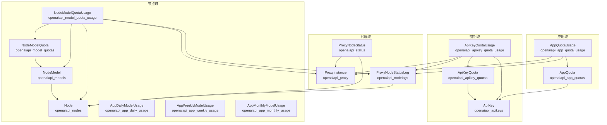
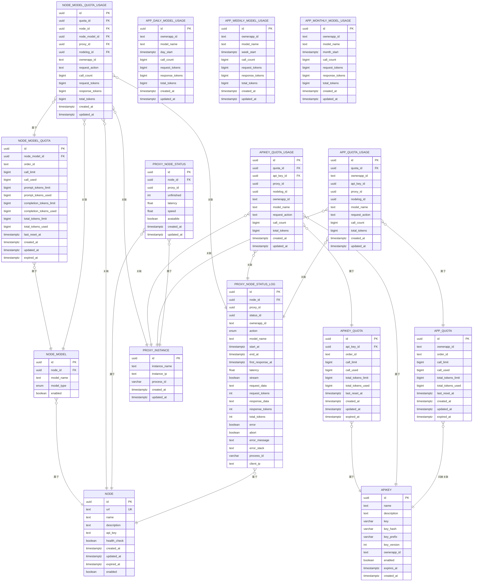
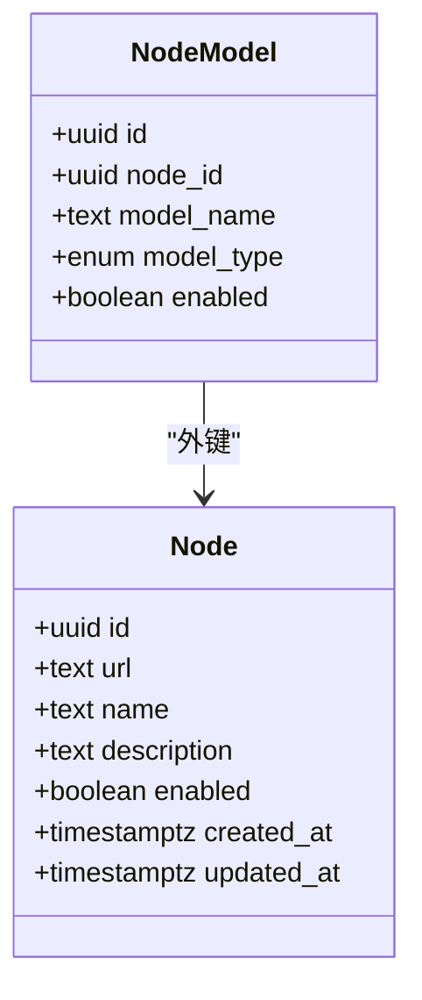
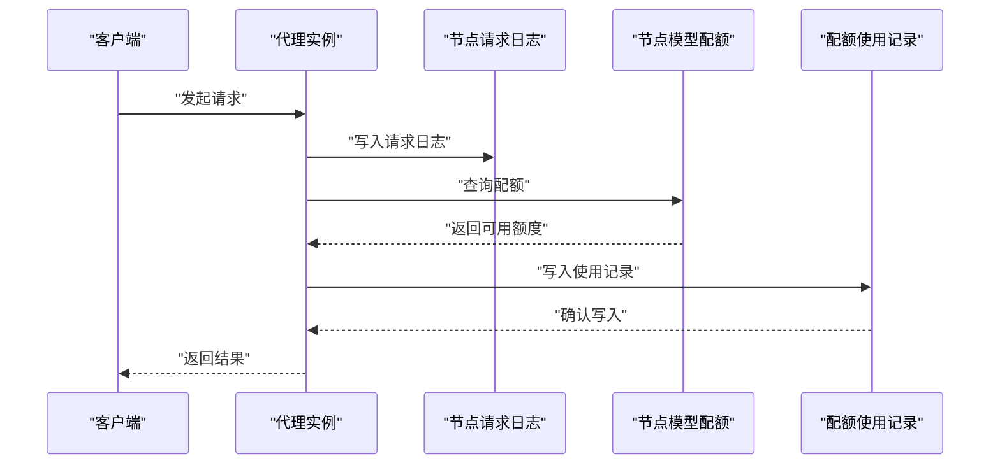
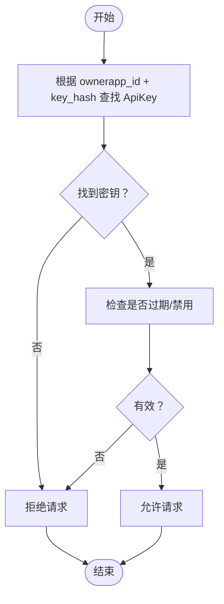
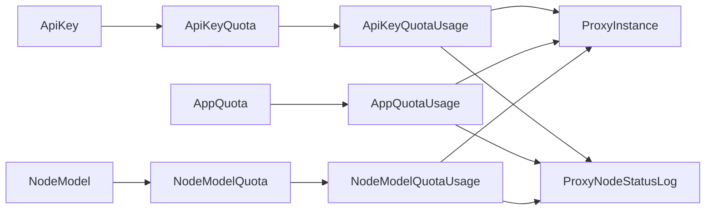
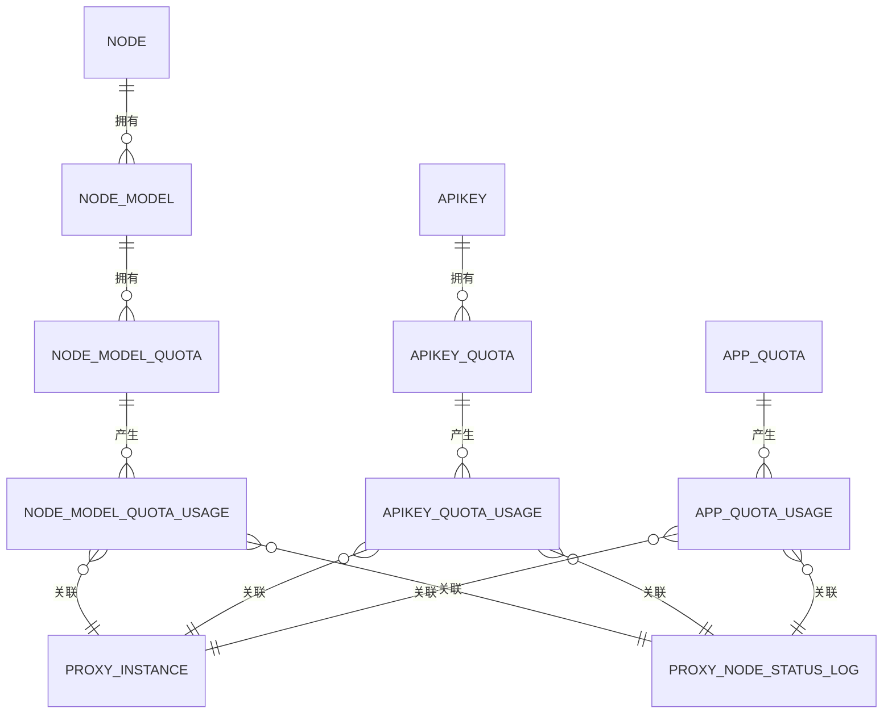

# 数据模型设计

<cite>
**本文引用的文件**
- [src/apiproxy/openaiproxy/services/database/models/node/model.py](file://src/apiproxy/openaiproxy/services/database/models/node/model.py)
- [src/apiproxy/openaiproxy/services/database/models/apikey/model.py](file://src/apiproxy/openaiproxy/services/database/models/apikey/model.py)
- [src/apiproxy/openaiproxy/services/database/models/app/model.py](file://src/apiproxy/openaiproxy/services/database/models/app/model.py)
- [src/apiproxy/openaiproxy/services/database/models/proxy/model.py](file://src/apiproxy/openaiproxy/services/database/models/proxy/model.py)
- [src/apiproxy/openaiproxy/services/database/models/base.py](file://src/apiproxy/openaiproxy/services/database/models/base.py)
- [src/apiproxy/openaiproxy/alembic/versions/289442e9b00c_init.py](file://src/apiproxy/openaiproxy/alembic/versions/289442e9b00c_init.py)
- [src/apiproxy/openaiproxy/alembic/versions/bafe420807ac_daily_and_weekly_usage_rollup.py](file://src/apiproxy/openaiproxy/alembic/versions/bafe420807ac_daily_and_weekly_usage_rollup.py)
- [src/apiproxy/openaiproxy/alembic/versions/c2a5c7e5f3b1_apikey_security_and_monthly_rollup.py](file://src/apiproxy/openaiproxy/alembic/versions/c2a5c7e5f3b1_apikey_security_and_monthly_rollup.py)
- [src/apiproxy/openaiproxy/alembic/versions/0e4bdcd25316_add_northbound_apikey_and_app_quotas.py](file://src/apiproxy/openaiproxy/alembic/versions/0e4bdcd25316_add_northbound_apikey_and_app_quotas.py)
</cite>

## 目录
1. [简介](#简介)
2. [项目结构](#项目结构)
3. [核心组件](#核心组件)
4. [架构总览](#架构总览)
5. [详细组件分析](#详细组件分析)
6. [依赖分析](#依赖分析)
7. [性能考量](#性能考量)
8. [故障排查指南](#故障排查指南)
9. [结论](#结论)
10. [附录](#附录)

## 简介
本文件面向“大模型接口代理”系统，系统通过代理层对接多家后端节点，提供统一的 OpenAI 兼容接口。数据模型围绕以下核心对象展开：节点（Node）、节点模型（NodeModel）、节点模型配额（NodeModelQuota）、配额使用记录（NodeModelQuotaUsage）、应用配额（AppQuota）、应用配额使用记录（AppQuotaUsage）、API 密钥（ApiKey）、API 密钥配额（ApiKeyQuota）、代理实例与节点状态（ProxyInstance、ProxyNodeStatus、ProxyNodeStatusLog），以及按天/周/月的用量聚合表。

本设计强调：
- 实体关系与主外键约束
- 字段定义、索引与唯一性约束
- 验证与业务规则（如配额限制、过期时间、启用状态）
- 数据访问模式与缓存策略建议
- 性能优化与扩展点
- 数据生命周期、保留与归档策略
- 迁移路径与版本管理
- 安全与隐私要求、访问控制

## 项目结构
数据模型位于 openaiproxy 服务下的数据库模型目录，采用按功能域分层组织：
- node：节点、节点模型、配额与用量聚合
- apikey：API 密钥、配额与使用记录
- app：应用配额与使用记录
- proxy：代理实例、节点状态、节点请求日志
- base：通用序列化工具

图表来源
- [src/apiproxy/openaiproxy/services/database/models/node/model.py:57-121](file://src/apiproxy/openaiproxy/services/database/models/node/model.py#L57-L121)
- [src/apiproxy/openaiproxy/services/database/models/apikey/model.py:44-166](file://src/apiproxy/openaiproxy/services/database/models/apikey/model.py#L44-L166)
- [src/apiproxy/openaiproxy/services/database/models/app/model.py:36-107](file://src/apiproxy/openaiproxy/services/database/models/app/model.py#L36-L107)
- [src/apiproxy/openaiproxy/services/database/models/proxy/model.py:38-112](file://src/apiproxy/openaiproxy/services/database/models/proxy/model.py#L38-L112)

章节来源
- [src/apiproxy/openaiproxy/services/database/models/node/model.py:36-502](file://src/apiproxy/openaiproxy/services/database/models/node/model.py#L36-L502)
- [src/apiproxy/openaiproxy/services/database/models/apikey/model.py:35-249](file://src/apiproxy/openaiproxy/services/database/models/apikey/model.py#L35-L249)
- [src/apiproxy/openaiproxy/services/database/models/app/model.py:36-183](file://src/apiproxy/openaiproxy/services/database/models/app/model.py#L36-L183)
- [src/apiproxy/openaiproxy/services/database/models/proxy/model.py:38-231](file://src/apiproxy/openaiproxy/services/database/models/proxy/model.py#L38-L231)

## 核心组件
本节对关键模型进行字段与约束说明，并给出使用场景与注意事项。

- 节点（Node）
  - 主键：id（UUID）
  - 关键字段：url（Text，唯一且带索引）、name、description、api_key、health_check、enabled、expired_at、created_at、updated_at、create_user、modify_user
  - 约束：url 唯一；enabled、health_check 带索引便于筛选
  - 使用场景：注册后端节点，配置访问密钥与健康检查开关，支持过期时间管理

- 节点模型（NodeModel）
  - 主键：id（UUID）
  - 外键：node_id → Node.id
  - 关键字段：node_id、model_name（Text，唯一性与索引）、model_type（枚举：chat/embeddings/rerank）、enabled
  - 约束：(node_id, model_name, model_type) 唯一；外键约束
  - 使用场景：将后端节点能力映射到具体模型名与类型，支持多类型模型并行管理

- 节点模型配额（NodeModelQuota）
  - 主键：id（UUID）
  - 外键：node_model_id → NodeModel.id
  - 关键字段：node_model_id、order_id（来源单据标识）、call_limit/call_used、prompt_tokens_limit/prompt_tokens_used、completion_tokens_limit/completion_tokens_used、total_tokens_limit/total_tokens_used、last_reset_at、created_at、updated_at、expired_at
  - 约束：(node_model_id, order_id) 唯一；外键约束
  - 使用场景：按节点模型维度设置/追踪调用次数与 Token 配额，支持多次充值单据叠加

- 节点模型配额使用记录（NodeModelQuotaUsage）
  - 主键：id（UUID）
  - 外键：quota_id → NodeModelQuota.id；node_id → Node.id；node_model_id → NodeModel.id；proxy_id → ProxyInstance.id；nodelog_id → ProxyNodeStatusLog.id
  - 关键字段：quota_id、node_id、node_model_id、proxy_id、nodelog_id、ownerapp_id、request_action、call_count、request_tokens、response_tokens、total_tokens、created_at、updated_at
  - 使用场景：细粒度记录每次请求对配额的消耗，支持溯源与审计

- 应用配额（AppQuota）
  - 主键：id（UUID）
  - 关键字段：ownerapp_id、order_id、call_limit/call_used、total_tokens_limit/total_tokens_used、last_reset_at、created_at、updated_at、expired_at
  - 约束：(ownerapp_id, order_id) 唯一
  - 使用场景：按应用维度设置/追踪调用次数与 Token 配额，支持多来源充值单据

- 应用配额使用记录（AppQuotaUsage）
  - 主键：id（UUID）
  - 外键：quota_id → AppQuota.id；proxy_id → ProxyInstance.id；nodelog_id → ProxyNodeStatusLog.id
  - 关键字段：quota_id、ownerapp_id、api_key_id、proxy_id、nodelog_id、model_name、request_action、call_count、total_tokens、created_at、updated_at
  - 使用场景：记录应用层面的配额消耗，便于账单与报表生成

- API 密钥（ApiKey）
  - 主键：id（UUID）
  - 关键字段：name、description、key（历史兼容，加密存储）、key_hash（不可逆哈希，认证查找用）、key_prefix（仅审计追踪）、key_version（协议版本）、ownerapp_id、enabled、expires_at、created_at
  - 约束：(ownerapp_id, key)、(ownerapp_id, key_hash) 唯一
  - 使用场景：为应用颁发密钥，支持版本演进与过期管理

- API 密钥配额（ApiKeyQuota）
  - 主键：id（UUID）
  - 外键：api_key_id → ApiKey.id
  - 关键字段：api_key_id、order_id、call_limit/call_used、total_tokens_limit/total_tokens_used、last_reset_at、created_at、updated_at、expired_at
  - 约束：(api_key_id, order_id) 唯一；外键约束
  - 使用场景：按密钥维度设置/追踪调用次数与 Token 配额

- API 密钥配额使用记录（ApiKeyQuotaUsage）
  - 主键：id（UUID）
  - 外键：quota_id → ApiKeyQuota.id；api_key_id → ApiKey.id；proxy_id → ProxyInstance.id；nodelog_id → ProxyNodeStatusLog.id
  - 关键字段：quota_id、api_key_id、proxy_id、nodelog_id、ownerapp_id、model_name、request_action、call_count、total_tokens、created_at、updated_at
  - 使用场景：记录密钥层面的配额消耗，支持计费与审计

- 代理实例（ProxyInstance）
  - 主键：id（UUID）
  - 关键字段：instance_name、instance_ip、process_id（默认后端进程 PID）、created_at、updated_at
  - 使用场景：登记代理实例信息，便于跨实例监控与排障

- 节点状态（ProxyNodeStatus）
  - 主键：id（UUID）
  - 外键：node_id → Node.id；proxy_id → ProxyInstance.id
  - 关键字段：node_id、proxy_id、unfinished、latency、speed、avaiaible、created_at、updated_at
  - 约束：(node_id, proxy_id) 唯一
  - 使用场景：记录节点在各代理实例上的运行状态与性能指标

- 节点请求日志（ProxyNodeStatusLog）
  - 主键：id（UUID）
  - 外键：node_id → Node.id
  - 关键字段：node_id、proxy_id、status_id、ownerapp_id、action（枚举：completions/embeddings/healthcheck/rerankdocs）、model_name、start_at、end_at、first_response_at、latency、stream、request_data、request_tokens、response_data、response_tokens、total_tokens、error、abort、error_message、error_stack、process_id、client_ip
  - 使用场景：完整记录请求生命周期，支持诊断与审计

- 用量聚合（AppDailyModelUsage/AppWeeklyModelUsage/AppMonthlyModelUsage）
  - 主键：id（UUID）
  - 关键字段：ownerapp_id、model_name、day_start/week_start/month_start、call_count、request_tokens、response_tokens、total_tokens、created_at、updated_at
  - 约束：(ownerapp_id, model_name, day_start)、(ownerapp_id, model_name, week_start)、(ownerapp_id, model_name, month_start) 唯一
  - 使用场景：按天/周/月聚合应用对模型的用量，支撑报表与告警

章节来源
- [src/apiproxy/openaiproxy/services/database/models/node/model.py:57-502](file://src/apiproxy/openaiproxy/services/database/models/node/model.py#L57-L502)
- [src/apiproxy/openaiproxy/services/database/models/apikey/model.py:44-249](file://src/apiproxy/openaiproxy/services/database/models/apikey/model.py#L44-L249)
- [src/apiproxy/openaiproxy/services/database/models/app/model.py:36-183](file://src/apiproxy/openaiproxy/services/database/models/app/model.py#L36-L183)
- [src/apiproxy/openaiproxy/services/database/models/proxy/model.py:38-231](file://src/apiproxy/openaiproxy/services/database/models/proxy/model.py#L38-L231)

## 架构总览
下图展示核心模型之间的关系与流向，体现从节点到代理再到密钥/应用配额的完整链路。

图表来源
- [src/apiproxy/openaiproxy/services/database/models/node/model.py:57-502](file://src/apiproxy/openaiproxy/services/database/models/node/model.py#L57-L502)
- [src/apiproxy/openaiproxy/services/database/models/apikey/model.py:44-249](file://src/apiproxy/openaiproxy/services/database/models/apikey/model.py#L44-L249)
- [src/apiproxy/openaiproxy/services/database/models/app/model.py:36-183](file://src/apiproxy/openaiproxy/services/database/models/app/model.py#L36-L183)
- [src/apiproxy/openaiproxy/services/database/models/proxy/model.py:38-231](file://src/apiproxy/openaiproxy/services/database/models/proxy/model.py#L38-L231)

## 详细组件分析

### 节点（Node）与节点模型（NodeModel）
- 设计要点
  - Node.url 唯一且带索引，确保后端节点地址不重复
  - NodeModel.model_name+model_type 在同一节点内唯一，避免同类型模型重复映射
  - NodeModel.enabled 与 Node.enabled 支持灵活启停
- 使用场景
  - 新增后端节点时校验 url 唯一性
  - 为节点绑定多个模型，按类型区分不同能力
- 复杂度与性能
  - 查询与过滤基于索引字段（enabled、health_check、name、url），适合高频筛选
  - 建议在批量导入或扩容时分批写入，避免长事务

图表来源
- [src/apiproxy/openaiproxy/services/database/models/node/model.py:57-121](file://src/apiproxy/openaiproxy/services/database/models/node/model.py#L57-L121)

章节来源
- [src/apiproxy/openaiproxy/services/database/models/node/model.py:57-121](file://src/apiproxy/openaiproxy/services/database/models/node/model.py#L57-L121)

### 节点模型配额与使用记录（NodeModelQuota/NodeModelQuotaUsage）
- 设计要点
  - NodeModelQuota 支持按 order_id 标识来源单据，多次充值可叠加
  - 使用记录表记录每次请求对配额的实际消耗，便于回溯
- 业务规则
  - 当配额不足时拒绝请求；到期后禁止使用
  - 配额重置逻辑由 last_reset_at 驱动
- 性能建议
  - 对 quota_id、node_id、node_model_id 建立复合索引以加速查询
  - 写入使用记录时采用批量提交，降低锁竞争

图表来源
- [src/apiproxy/openaiproxy/services/database/models/proxy/model.py:125-231](file://src/apiproxy/openaiproxy/services/database/models/proxy/model.py#L125-L231)
- [src/apiproxy/openaiproxy/services/database/models/node/model.py:124-303](file://src/apiproxy/openaiproxy/services/database/models/node/model.py#L124-L303)

章节来源
- [src/apiproxy/openaiproxy/services/database/models/node/model.py:124-303](file://src/apiproxy/openaiproxy/services/database/models/node/model.py#L124-L303)
- [src/apiproxy/openaiproxy/services/database/models/proxy/model.py:125-231](file://src/apiproxy/openaiproxy/services/database/models/proxy/model.py#L125-L231)

### API 密钥（ApiKey）与配额（ApiKeyQuota/ApiKeyQuotaUsage）
- 设计要点
  - key_hash 用于认证查找，key 保留历史兼容
  - key_version 区分协议版本，便于平滑升级
  - ApiKeyQuotaUsage 记录 ownerapp_id、model_name、request_action，支持精细化计费
- 安全与合规
  - 不存储明文密钥，仅保存不可逆哈希
  - key_prefix 仅用于审计追踪，不参与鉴权
- 使用场景
  - 为应用颁发密钥并设置有效期
  - 按密钥维度统计用量与费用

图表来源
- [src/apiproxy/openaiproxy/services/database/models/apikey/model.py:44-88](file://src/apiproxy/openaiproxy/services/database/models/apikey/model.py#L44-L88)

章节来源
- [src/apiproxy/openaiproxy/services/database/models/apikey/model.py:44-249](file://src/apiproxy/openaiproxy/services/database/models/apikey/model.py#L44-L249)

### 应用配额（AppQuota/AppQuotaUsage）
- 设计要点
  - AppQuota 以 ownerapp_id 为维度，支持多来源 order_id
  - AppQuotaUsage 记录触发消耗的 api_key_id，便于成本归属
- 使用场景
  - 企业级限额管理与成本中心划分
  - 生成应用维度的用量报表

章节来源
- [src/apiproxy/openaiproxy/services/database/models/app/model.py:36-183](file://src/apiproxy/openaiproxy/services/database/models/app/model.py#L36-L183)

### 代理实例与节点状态（ProxyInstance/ProxyNodeStatus/ProxyNodeStatusLog）
- 设计要点
  - ProxyNodeStatus 记录节点在各代理实例上的可用性与性能
  - ProxyNodeStatusLog 记录请求全生命周期，支持诊断与审计
- 使用场景
  - 实时监控节点健康状况
  - 排查慢请求与异常错误

章节来源
- [src/apiproxy/openaiproxy/services/database/models/proxy/model.py:38-231](file://src/apiproxy/openaiproxy/services/database/models/proxy/model.py#L38-L231)

## 依赖分析
- 组件耦合
  - NodeModelQuotaUsage 与 NodeModelQuota、Node、NodeModel、ProxyInstance、ProxyNodeStatusLog 存在多处外键依赖，形成闭环追踪
  - ApiKeyQuotaUsage 与 ApiKey、ApiKeyQuota、ProxyInstance、ProxyNodeStatusLog 同样建立强关联
  - AppQuotaUsage 与 AppQuota、ProxyInstance、ProxyNodeStatusLog 关联
- 索引与约束
  - 多表存在唯一性约束，防止重复充值与重复聚合
  - 大量字段建立索引，提升查询效率
- 外部依赖
  - 使用 SQLModel 与 SQLAlchemy，结合 Alembic 进行迁移管理

图表来源
- [src/apiproxy/openaiproxy/services/database/models/apikey/model.py:91-249](file://src/apiproxy/openaiproxy/services/database/models/apikey/model.py#L91-L249)
- [src/apiproxy/openaiproxy/services/database/models/app/model.py:36-183](file://src/apiproxy/openaiproxy/services/database/models/app/model.py#L36-L183)
- [src/apiproxy/openaiproxy/services/database/models/node/model.py:124-303](file://src/apiproxy/openaiproxy/services/database/models/node/model.py#L124-L303)
- [src/apiproxy/openaiproxy/services/database/models/proxy/model.py:125-231](file://src/apiproxy/openaiproxy/services/database/models/proxy/model.py#L125-L231)

章节来源
- [src/apiproxy/openaiproxy/services/database/models/apikey/model.py:91-249](file://src/apiproxy/openaiproxy/services/database/models/apikey/model.py#L91-L249)
- [src/apiproxy/openaiproxy/services/database/models/app/model.py:36-183](file://src/apiproxy/openaiproxy/services/database/models/app/model.py#L36-L183)
- [src/apiproxy/openaiproxy/services/database/models/node/model.py:124-303](file://src/apiproxy/openaiproxy/services/database/models/node/model.py#L124-L303)
- [src/apiproxy/openaiproxy/services/database/models/proxy/model.py:125-231](file://src/apiproxy/openaiproxy/services/database/models/proxy/model.py#L125-L231)

## 性能考量
- 索引策略
  - 高频过滤字段（enabled、health_check、avaiaible、url、name、model_name、ownerapp_id、order_id、node_id、node_model_id、proxy_id、nodelog_id）均建立索引
  - 聚合表（日/周/月）以 (ownerapp_id, model_name, period_start) 唯一键保证幂等写入
- 写入优化
  - 批量写入配额使用记录，减少事务开销
  - 使用 server_default 初始化数值字段，降低写入成本
- 读取优化
  - 利用索引快速定位节点、模型、密钥与应用
  - 聚合表定期滚动更新，避免热表扫描
- 缓存策略建议
  - 将热点节点状态与可用模型列表缓存于内存，缩短查询路径
  - 对配额剩余量进行短期缓存，降低数据库压力
- 并发控制
  - 配额扣减采用原子操作或悲观锁，避免超支
  - 日/周/月聚合写入采用幂等唯一键，避免重复计算

## 故障排查指南
- 常见问题
  - 请求被拒：检查 ApiKey 是否启用/未过期；检查 ApiKeyQuota/NodeModelQuota 是否有足够配额；检查 Node.enabled 与 health_check
  - 用量异常：核对 NodeModelQuotaUsage/AppQuotaUsage 的 ownerapp_id、model_name、request_action 是否正确
  - 节点不可用：查看 ProxyNodeStatus 的 avaiaible、latency、speed；核对 ProxyNodeStatusLog 的 error/abort/error_message
- 审计与溯源
  - 通过 ProxyNodeStatusLog 的 process_id、client_ip、nodelog_id 追踪请求来源与处理进程
- 建议流程
  - 发现异常 → 定位日志 → 核对配额 → 检查节点状态 → 复盘与修复

章节来源
- [src/apiproxy/openaiproxy/services/database/models/proxy/model.py:125-231](file://src/apiproxy/openaiproxy/services/database/models/proxy/model.py#L125-L231)
- [src/apiproxy/openaiproxy/services/database/models/apikey/model.py:169-249](file://src/apiproxy/openaiproxy/services/database/models/apikey/model.py#L169-L249)
- [src/apiproxy/openaiproxy/services/database/models/node/model.py:226-303](file://src/apiproxy/openaiproxy/services/database/models/node/model.py#L226-L303)

## 结论
本数据模型围绕“节点—模型—配额—使用—代理—日志—聚合”的完整链路构建，既满足高并发场景下的性能需求，又兼顾审计与合规要求。通过唯一性约束与索引策略，实现高效查询与幂等写入；通过配额与聚合机制，支撑精细化计费与运营分析。建议在生产环境中配合缓存与异步聚合任务，进一步提升吞吐与稳定性。

## 附录

### 数据库模式图（概览）

图表来源
- [src/apiproxy/openaiproxy/services/database/models/node/model.py:57-502](file://src/apiproxy/openaiproxy/services/database/models/node/model.py#L57-L502)
- [src/apiproxy/openaiproxy/services/database/models/apikey/model.py:44-249](file://src/apiproxy/openaiproxy/services/database/models/apikey/model.py#L44-L249)
- [src/apiproxy/openaiproxy/services/database/models/app/model.py:36-183](file://src/apiproxy/openaiproxy/services/database/models/app/model.py#L36-L183)
- [src/apiproxy/openaiproxy/services/database/models/proxy/model.py:38-231](file://src/apiproxy/openaiproxy/services/database/models/proxy/model.py#L38-L231)

### 示例数据（字段示意）
- 节点（Node）
  - id、url（唯一）、name、description、api_key、health_check、enabled、expired_at、created_at、updated_at
- 节点模型（NodeModel）
  - id、node_id、model_name、model_type、enabled
- 节点模型配额（NodeModelQuota）
  - id、node_model_id、order_id、call_limit、call_used、total_tokens_limit、total_tokens_used、last_reset_at、expired_at
- 节点模型配额使用记录（NodeModelQuotaUsage）
  - id、quota_id、node_id、node_model_id、proxy_id、nodelog_id、ownerapp_id、request_action、call_count、total_tokens
- API 密钥（ApiKey）
  - id、name、description、key_hash、key_prefix、key_version、ownerapp_id、enabled、expires_at、created_at
- API 密钥配额（ApiKeyQuota）
  - id、api_key_id、order_id、call_limit、call_used、total_tokens_limit、total_tokens_used、last_reset_at、expired_at
- API 密钥配额使用记录（ApiKeyQuotaUsage）
  - id、quota_id、api_key_id、proxy_id、nodelog_id、ownerapp_id、model_name、request_action、call_count、total_tokens
- 应用配额（AppQuota）
  - id、ownerapp_id、order_id、call_limit、call_used、total_tokens_limit、total_tokens_used、last_reset_at、expired_at
- 应用配额使用记录（AppQuotaUsage）
  - id、quota_id、ownerapp_id、api_key_id、proxy_id、nodelog_id、model_name、request_action、call_count、total_tokens
- 代理实例（ProxyInstance）
  - id、instance_name、instance_ip、process_id、created_at、updated_at
- 节点状态（ProxyNodeStatus）
  - id、node_id、proxy_id、unfinished、latency、speed、avaiaible、created_at、updated_at
- 节点请求日志（ProxyNodeStatusLog）
  - id、node_id、proxy_id、status_id、ownerapp_id、action、model_name、start_at、end_at、latency、stream、error、abort、error_message、process_id、client_ip
- 用量聚合（AppDailyModelUsage/AppWeeklyModelUsage/AppMonthlyModelUsage）
  - id、ownerapp_id、model_name、day_start/week_start/month_start、call_count、total_tokens

### 数据访问模式与缓存策略
- 访问模式
  - 读多写少：节点与模型元数据缓存；配额查询走索引；聚合表定期刷新
  - 写多：配额使用记录批量写入；日志表按天归档
- 缓存策略
  - 热点节点状态与可用模型列表缓存于内存，TTL 控制
  - 配额剩余量短期缓存，写后失效
- 异步处理
  - 日/周/月聚合通过后台任务定时执行，避免请求路径阻塞

### 数据生命周期、保留策略与归档规则
- 生命周期
  - ApiKey/expires_at：过期即禁用，支持软删除标记
  - Node/expired_at：过期即停止使用
  - NodeModelQuota/AppQuota/ApiKeyQuota：按 order_id 来源单据管理，到期后禁止使用
- 保留策略
  - ProxyNodeStatusLog：按月/季度清理旧日志，保留必要字段用于审计
  - 聚合表：保留近一年的按日/周/月聚合数据
- 归档规则
  - 采用分区或独立归档库，按时间切分；保留关键索引字段以便检索

### 数据迁移路径与版本管理
- 初始版本
  - [289442e9b00c_init.py](file://src/apiproxy/openaiproxy/alembic/versions/289442e9b00c_init.py)
- 增量演进
  - [bafe420807ac_daily_and_weekly_usage_rollup.py](file://src/apiproxy/openaiproxy/alembic/versions/bafe420807ac_daily_and_weekly_usage_rollup.py)：新增日/周聚合
  - [c2a5c7e5f3b1_apikey_security_and_monthly_rollup.py](file://src/apiproxy/openaiproxy/alembic/versions/c2a5c7e5f3b1_apikey_security_and_monthly_rollup.py)：增强密钥安全与月聚合
  - [0e4bdcd25316_add_northbound_apikey_and_app_quotas.py](file://src/apiproxy/openaiproxy/alembic/versions/0e4bdcd25316_add_northbound_apikey_and_app_quotas.py)：新增北向密钥与应用配额
- 版本管理
  - 通过 Alembic 迁移脚本管理 schema 变更，确保多环境一致性
  - 迁移前备份关键表，迁移后验证唯一性与索引完整性

### 数据安全、隐私要求与访问控制
- 安全
  - ApiKey 仅存储不可逆哈希，不存储明文密钥
  - key_prefix 仅用于审计追踪，不参与鉴权
  - 代理实例 process_id 默认后端进程 PID，便于定位
- 隐私
  - 日志表包含 client_ip、request_data/response_data 等字段，需遵循最小化原则与脱敏策略
- 访问控制
  - 通过 ownerapp_id 限定资源归属，防止越权访问
  - 配额与使用记录按应用维度隔离，支持多租户