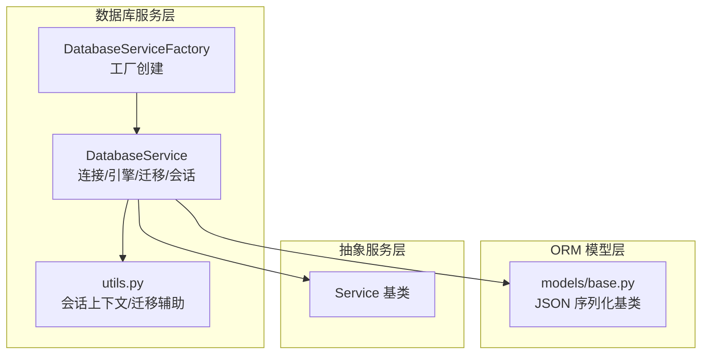
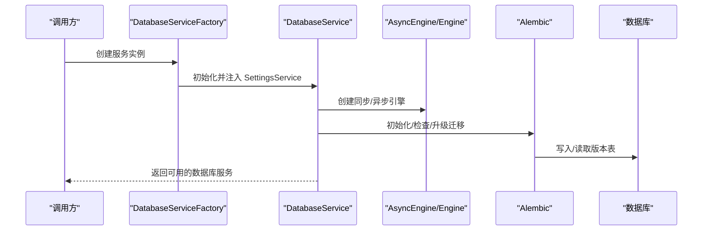
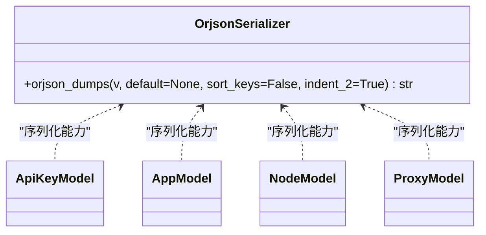
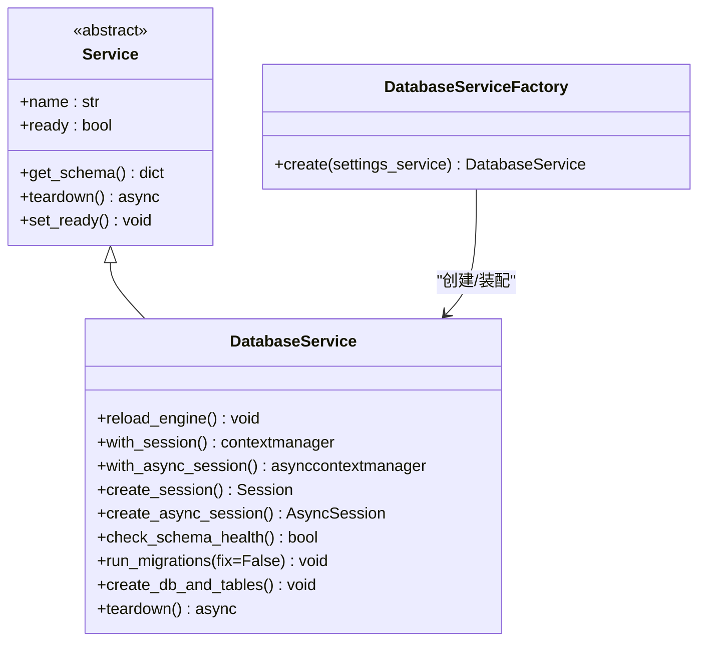
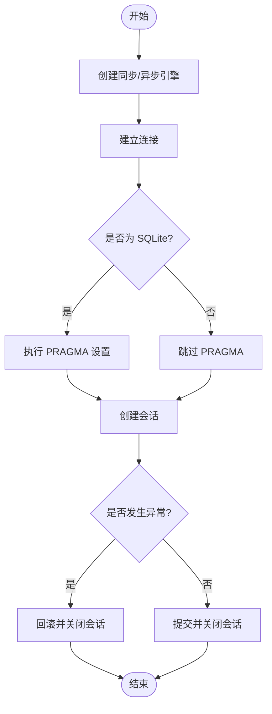
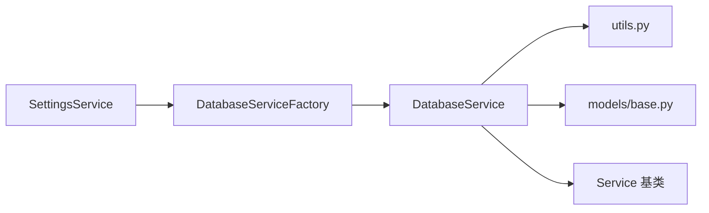

# 数据访问模式

<cite>
**本文引用的文件**
- [src/apiproxy/openaiproxy/services/database/service.py](file://src/apiproxy/openaiproxy/services/database/service.py)
- [src/apiproxy/openaiproxy/services/database/factory.py](file://src/apiproxy/openaiproxy/services/database/factory.py)
- [src/apiproxy/openaiproxy/services/database/models/base.py](file://src/apiproxy/openaiproxy/services/database/models/base.py)
- [src/apiproxy/openaiproxy/services/database/utils.py](file://src/apiproxy/openaiproxy/services/database/utils.py)
- [src/apiproxy/openaiproxy/services/base.py](file://src/apiproxy/openaiproxy/services/base.py)
</cite>

## 目录
1. [简介](#简介)
2. [项目结构](#项目结构)
3. [核心组件](#核心组件)
4. [架构总览](#架构总览)
5. [详细组件分析](#详细组件分析)
6. [依赖分析](#依赖分析)
7. [性能考量](#性能考量)
8. [故障排查指南](#故障排查指南)
9. [结论](#结论)
10. [附录](#附录)

## 简介
本文件聚焦于大模型接口代理项目中的“数据库访问层”，系统性阐述以下主题：
- ORM 模型基类设计与继承关系
- 数据访问服务的实现模式与工厂模式应用
- 数据库连接管理、会话管理与事务处理机制
- CRUD 标准实现与性能优化策略
- 查询过滤、排序、分页与聚合示例
- 缓存策略、连接池配置与并发访问控制
- 最佳实践、错误处理与异常管理
- 数据一致性保证、锁机制与并发冲突解决方案

## 项目结构
数据库访问层位于 openaiproxy 服务子模块下，采用“按功能域分包”的组织方式：
- 数据库服务与工厂：services/database/service.py、services/database/factory.py
- ORM 模型基类：services/database/models/base.py
- 通用工具与会话上下文：services/database/utils.py
- 抽象服务基类：services/base.py

图表来源
- [src/apiproxy/openaiproxy/services/database/service.py:59-403](file://src/apiproxy/openaiproxy/services/database/service.py#L59-L403)
- [src/apiproxy/openaiproxy/services/database/factory.py:38-48](file://src/apiproxy/openaiproxy/services/database/factory.py#L38-L48)
- [src/apiproxy/openaiproxy/services/database/utils.py:43-131](file://src/apiproxy/openaiproxy/services/database/utils.py#L43-L131)
- [src/apiproxy/openaiproxy/services/database/models/base.py:29-45](file://src/apiproxy/openaiproxy/services/database/models/base.py#L29-L45)
- [src/apiproxy/openaiproxy/services/base.py:29-54](file://src/apiproxy/openaiproxy/services/base.py#L29-L54)

章节来源
- [src/apiproxy/openaiproxy/services/database/service.py:59-403](file://src/apiproxy/openaiproxy/services/database/service.py#L59-L403)
- [src/apiproxy/openaiproxy/services/database/factory.py:38-48](file://src/apiproxy/openaiproxy/services/database/factory.py#L38-L48)
- [src/apiproxy/openaiproxy/services/database/utils.py:43-131](file://src/apiproxy/openaiproxy/services/database/utils.py#L43-L131)
- [src/apiproxy/openaiproxy/services/database/models/base.py:29-45](file://src/apiproxy/openaiproxy/services/database/models/base.py#L29-L45)
- [src/apiproxy/openaiproxy/services/base.py:29-54](file://src/apiproxy/openaiproxy/services/base.py#L29-L54)

## 核心组件
- DatabaseService：负责数据库引擎创建、连接参数配置、SQLite PRAGMA 注入、同步/异步会话管理、Schema 健康检查、Alembic 迁移与版本控制、资源清理等。
- DatabaseServiceFactory：遵循工厂模式，基于 SettingsService 提供的配置创建 DatabaseService 实例。
- models/base.py：提供 JSON 序列化工具（基于 orjson），作为 ORM 模型的序列化基类。
- utils.py：封装会话上下文（同步/异步）、迁移初始化流程、结果数据类与数据库进程 ID 查询等。
- Service 基类：定义服务抽象接口与生命周期钩子。

章节来源
- [src/apiproxy/openaiproxy/services/database/service.py:59-403](file://src/apiproxy/openaiproxy/services/database/service.py#L59-L403)
- [src/apiproxy/openaiproxy/services/database/factory.py:38-48](file://src/apiproxy/openaiproxy/services/database/factory.py#L38-L48)
- [src/apiproxy/openaiproxy/services/database/models/base.py:29-45](file://src/apiproxy/openaiproxy/services/database/models/base.py#L29-L45)
- [src/apiproxy/openaiproxy/services/database/utils.py:43-131](file://src/apiproxy/openaiproxy/services/database/utils.py#L43-L131)
- [src/apiproxy/openaiproxy/services/base.py:29-54](file://src/apiproxy/openaiproxy/services/base.py#L29-L54)

## 架构总览
数据库访问层采用“服务 + 工厂 + ORM + 迁移”的分层架构：
- 工厂负责实例化与装配
- 服务负责连接、会话、迁移与健康检查
- ORM 层通过 SQLModel 定义模型，使用 models/base.py 的序列化能力
- 迁移通过 Alembic 管理版本，确保 Schema 一致性

图表来源
- [src/apiproxy/openaiproxy/services/database/factory.py:38-48](file://src/apiproxy/openaiproxy/services/database/factory.py#L38-L48)
- [src/apiproxy/openaiproxy/services/database/service.py:62-132](file://src/apiproxy/openaiproxy/services/database/service.py#L62-L132)
- [src/apiproxy/openaiproxy/services/database/utils.py:43-86](file://src/apiproxy/openaiproxy/services/database/utils.py#L43-L86)

## 详细组件分析

### ORM 模型基类设计与继承关系
- 序列化基类：提供基于 orjson 的高性能序列化工具，支持键排序、缩进等选项，并对异常进行包装与提示。
- 继承关系：ORM 模型通过 SQLModel 定义，序列化能力由 models/base.py 提供；具体模型文件（如 apikey、app、node、proxy）均以相同模式组织，便于统一扩展与维护。

图表来源
- [src/apiproxy/openaiproxy/services/database/models/base.py:29-45](file://src/apiproxy/openaiproxy/services/database/models/base.py#L29-L45)

章节来源
- [src/apiproxy/openaiproxy/services/database/models/base.py:29-45](file://src/apiproxy/openaiproxy/services/database/models/base.py#L29-L45)

### 数据访问服务实现模式与工厂模式
- 服务实现：DatabaseService 继承自 Service 抽象基类，提供数据库引擎创建、连接参数适配、SQLite PRAGMA 注入、同步/异步会话管理、Schema 健康检查、Alembic 迁移与版本控制、资源清理等。
- 工厂模式：DatabaseServiceFactory 依据 SettingsService 配置创建 DatabaseService，集中处理依赖注入与校验，避免在业务层直接耦合配置细节。

图表来源
- [src/apiproxy/openaiproxy/services/base.py:29-54](file://src/apiproxy/openaiproxy/services/base.py#L29-L54)
- [src/apiproxy/openaiproxy/services/database/service.py:59-403](file://src/apiproxy/openaiproxy/services/database/service.py#L59-L403)
- [src/apiproxy/openaiproxy/services/database/factory.py:38-48](file://src/apiproxy/openaiproxy/services/database/factory.py#L38-L48)

章节来源
- [src/apiproxy/openaiproxy/services/base.py:29-54](file://src/apiproxy/openaiproxy/services/base.py#L29-L54)
- [src/apiproxy/openaiproxy/services/database/service.py:59-403](file://src/apiproxy/openaiproxy/services/database/service.py#L59-L403)
- [src/apiproxy/openaiproxy/services/database/factory.py:38-48](file://src/apiproxy/openaiproxy/services/database/factory.py#L38-L48)

### 数据库连接管理、会话管理与事务处理
- 引擎创建：根据数据库 URL 自动选择方言（SQLite/PostgreSQL），并设置连接参数（线程安全、超时、池大小、溢出、日志开关）。
- SQLite PRAGMA 注入：在连接建立时执行 PRAGMA 设置，提升兼容性与性能。
- 会话管理：提供同步 Session 与异步 AsyncSession 的上下文管理器，支持自动过期控制与资源释放。
- 事务处理：在 utils 中提供会话上下文，异常时自动回滚并关闭会话，保障一致性。

图表来源
- [src/apiproxy/openaiproxy/services/database/service.py:104-178](file://src/apiproxy/openaiproxy/services/database/service.py#L104-L178)
- [src/apiproxy/openaiproxy/services/database/service.py:146-163](file://src/apiproxy/openaiproxy/services/database/service.py#L146-L163)
- [src/apiproxy/openaiproxy/services/database/utils.py:88-112](file://src/apiproxy/openaiproxy/services/database/utils.py#L88-L112)

章节来源
- [src/apiproxy/openaiproxy/services/database/service.py:104-178](file://src/apiproxy/openaiproxy/services/database/service.py#L104-L178)
- [src/apiproxy/openaiproxy/services/database/service.py:146-163](file://src/apiproxy/openaiproxy/services/database/service.py#L146-L163)
- [src/apiproxy/openaiproxy/services/database/utils.py:88-112](file://src/apiproxy/openaiproxy/services/database/utils.py#L88-L112)

### CRUD 标准实现与性能优化策略
- 标准 CRUD：通过 SQLModel 的 select、insert、update、delete 语句组合实现；结合 utils 的会话上下文确保事务一致性。
- 性能优化：
  - 连接池：通过 pool_size 与 max_overflow 控制并发连接数。
  - 超时控制：db_connect_timeout 降低慢连接阻塞风险。
  - 日志开关：database_echo 可用于调试但需谨慎开启以避免性能损耗。
  - 异步优先：异步引擎与异步会话减少阻塞，提升高并发场景吞吐。

章节来源
- [src/apiproxy/openaiproxy/services/database/service.py:104-132](file://src/apiproxy/openaiproxy/services/database/service.py#L104-L132)
- [src/apiproxy/openaiproxy/services/database/utils.py:88-112](file://src/apiproxy/openaiproxy/services/database/utils.py#L88-L112)

### 查询过滤、排序、分页与聚合示例
- 过滤与排序：通过 SQLModel 的 select 与 order_by、where 条件组合实现。
- 分页：通过 limit 与 offset 控制结果集范围。
- 聚合：使用 func.*（如 count、sum、avg）与 group_by 实现统计汇总。
- 示例参考：utils 中的 get_db_process_id 使用 func.pg_backend_pid 获取后端进程 ID，体现聚合函数的使用方式。

章节来源
- [src/apiproxy/openaiproxy/services/database/utils.py:126-131](file://src/apiproxy/openaiproxy/services/database/utils.py#L126-L131)

### 缓存策略、连接池配置与并发访问控制
- 缓存策略：当前实现未内置缓存层，建议在服务层或应用层引入 Redis/LRU 缓存以减轻数据库压力（通用建议，非现有实现）。
- 连接池配置：通过 settings 中的 pool_size、max_overflow、db_connect_timeout 等参数控制。
- 并发访问控制：异步会话与上下文管理器确保并发下的会话隔离；异常回滚保障并发写入的一致性。

章节来源
- [src/apiproxy/openaiproxy/services/database/service.py:109-111](file://src/apiproxy/openaiproxy/services/database/service.py#L109-L111)
- [src/apiproxy/openaiproxy/services/database/utils.py:101-111](file://src/apiproxy/openaiproxy/services/database/utils.py#L101-L111)

### 数据一致性保证、锁机制与并发冲突解决方案
- 一致性：通过会话上下文与异常回滚保障单事务内的原子性；Alembic 版本表确保 Schema 一致性。
- 锁机制：未显式使用悲观锁；可结合数据库特性（如 SELECT ... FOR UPDATE）在关键写入路径增加排他锁（通用建议）。
- 冲突解决：重试策略与幂等设计（如唯一索引 + ON CONFLICT）可缓解并发冲突（通用建议）。

章节来源
- [src/apiproxy/openaiproxy/services/database/utils.py:88-112](file://src/apiproxy/openaiproxy/services/database/utils.py#L88-L112)
- [src/apiproxy/openaiproxy/services/database/service.py:223-293](file://src/apiproxy/openaiproxy/services/database/service.py#L223-L293)

## 依赖分析
- DatabaseService 依赖 SettingsService 提供的数据库 URL、连接池参数、SQLite PRAGMA、日志路径等配置。
- DatabaseServiceFactory 依赖 ServiceFactory 与 SettingsService，负责创建与校验。
- utils 提供会话上下文与迁移辅助，被 DatabaseService 调用。
- models/base.py 为各模型提供序列化能力，被具体模型文件复用。

图表来源
- [src/apiproxy/openaiproxy/services/database/factory.py:42-47](file://src/apiproxy/openaiproxy/services/database/factory.py#L42-L47)
- [src/apiproxy/openaiproxy/services/database/service.py:62-78](file://src/apiproxy/openaiproxy/services/database/service.py#L62-L78)
- [src/apiproxy/openaiproxy/services/database/utils.py:43-86](file://src/apiproxy/openaiproxy/services/database/utils.py#L43-L86)
- [src/apiproxy/openaiproxy/services/database/models/base.py:29-45](file://src/apiproxy/openaiproxy/services/database/models/base.py#L29-L45)
- [src/apiproxy/openaiproxy/services/base.py:29-54](file://src/apiproxy/openaiproxy/services/base.py#L29-L54)

章节来源
- [src/apiproxy/openaiproxy/services/database/factory.py:38-48](file://src/apiproxy/openaiproxy/services/database/factory.py#L38-L48)
- [src/apiproxy/openaiproxy/services/database/service.py:62-78](file://src/apiproxy/openaiproxy/services/database/service.py#L62-L78)
- [src/apiproxy/openaiproxy/services/database/utils.py:43-86](file://src/apiproxy/openaiproxy/services/database/utils.py#L43-L86)
- [src/apiproxy/openaiproxy/services/database/models/base.py:29-45](file://src/apiproxy/openaiproxy/services/database/models/base.py#L29-L45)
- [src/apiproxy/openaiproxy/services/base.py:29-54](file://src/apiproxy/openaiproxy/services/base.py#L29-L54)

## 性能考量
- 连接池参数：合理设置 pool_size 与 max_overflow，避免过度占用资源；根据负载峰值调整。
- 异步化：优先使用异步引擎与异步会话，减少阻塞，提高并发处理能力。
- 日志与诊断：仅在调试阶段开启 database_echo，生产环境关闭以降低开销。
- 查询优化：利用索引、限制返回字段、避免 N+1 查询；分页与聚合尽量在数据库侧完成。

## 故障排查指南
- 迁移失败：当 Alembic 版本不一致或修订冲突时，先删除版本表再升级；必要时启用 fix 模式自动降级/升级。
- Schema 不一致：使用 check_schema_health 与 run_migrations 检测并修复；关注缺失表/字段的日志。
- 会话异常：异常时自动回滚并关闭会话；若出现长时间阻塞，检查连接池参数与超时设置。
- SQLite PRAGMA：确认 PRAGMA 设置是否生效，避免因线程/超时导致的连接问题。

章节来源
- [src/apiproxy/openaiproxy/services/database/utils.py:43-86](file://src/apiproxy/openaiproxy/services/database/utils.py#L43-L86)
- [src/apiproxy/openaiproxy/services/database/service.py:195-222](file://src/apiproxy/openaiproxy/services/database/service.py#L195-L222)
- [src/apiproxy/openaiproxy/services/database/service.py:247-293](file://src/apiproxy/openaiproxy/services/database/service.py#L247-L293)
- [src/apiproxy/openaiproxy/services/database/service.py:146-163](file://src/apiproxy/openaiproxy/services/database/service.py#L146-L163)

## 结论
该数据访问层以清晰的分层与工厂模式为基础，结合 SQLModel 与 Alembic，实现了从连接、会话、迁移到资源清理的完整闭环。通过异步化与连接池配置，满足高并发场景需求；借助会话上下文与异常回滚，保障事务一致性。建议在后续迭代中引入缓存与锁机制，进一步提升性能与一致性保障。

## 附录
- 最佳实践清单
  - 使用异步引擎与异步会话处理高并发请求
  - 合理配置连接池参数，监控数据库负载
  - 在迁移前备份数据，启用 fix 模式时谨慎处理版本冲突
  - 对关键写入路径增加幂等设计与唯一约束
  - 在生产环境关闭 database_echo，避免日志开销