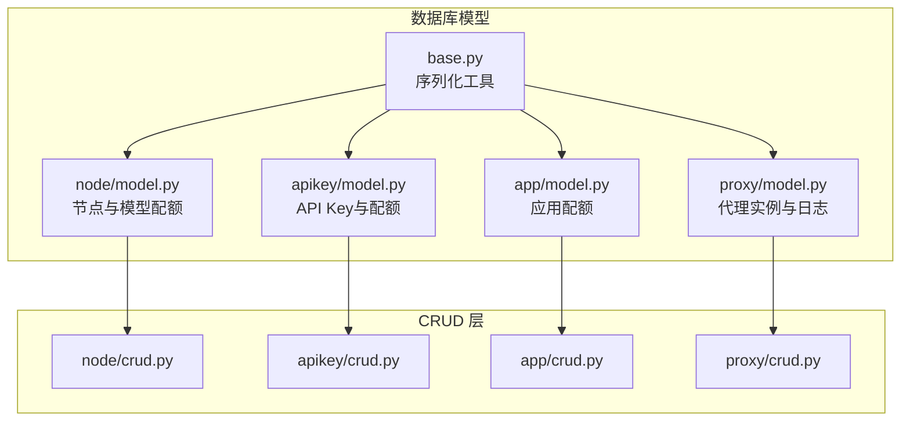
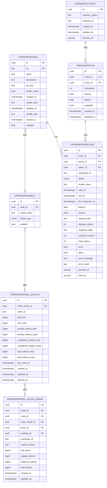
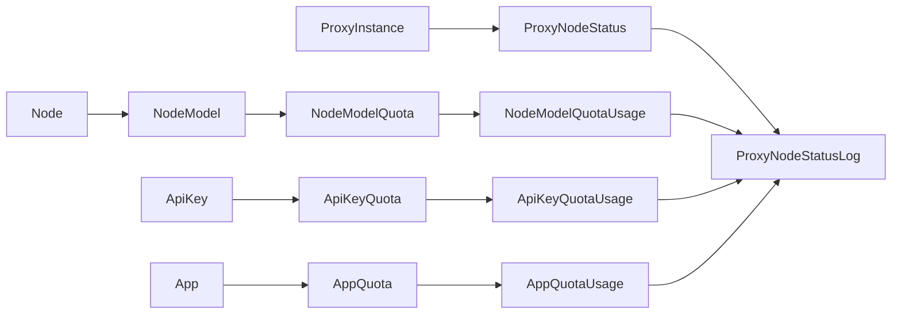
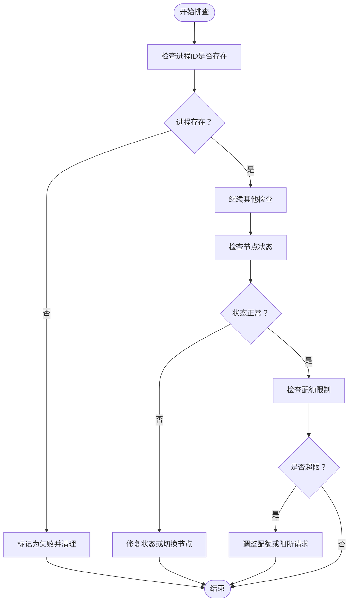

# 核心数据模型

<cite>
**本文档引用的文件**
- [node/model.py](file://src/apiproxy/openaiproxy/services/database/models/node/model.py)
- [apikey/model.py](file://src/apiproxy/openaiproxy/services/database/models/apikey/model.py)
- [app/model.py](file://src/apiproxy/openaiproxy/services/database/models/app/model.py)
- [proxy/model.py](file://src/apiproxy/openaiproxy/services/database/models/proxy/model.py)
- [node/crud.py](file://src/apiproxy/openaiproxy/services/database/models/node/crud.py)
- [apikey/crud.py](file://src/apiproxy/openaiproxy/services/database/models/apikey/crud.py)
- [app/crud.py](file://src/apiproxy/openaiproxy/services/database/models/app/crud.py)
- [proxy/crud.py](file://src/apiproxy/openaiproxy/services/database/models/proxy/crud.py)
- [base.py](file://src/apiproxy/openaiproxy/services/database/models/base.py)
</cite>

## 目录
1. [简介](#简介)
2. [项目结构](#项目结构)
3. [核心组件](#核心组件)
4. [架构概览](#架构概览)
5. [详细组件分析](#详细组件分析)
6. [依赖分析](#依赖分析)
7. [性能考虑](#性能考虑)
8. [故障排除指南](#故障排除指南)
9. [结论](#结论)

## 简介
本文件系统性梳理大模型接口代理的核心数据模型，围绕 Node（节点）、ApiKey（API Key）、App（应用）、Proxy（代理）四大核心实体，详细阐述其字段定义、数据类型、约束条件、业务规则与相互关系。同时给出数据库表结构示例、数据字典、生命周期管理、索引策略、性能优化建议以及数据安全与隐私保护措施。

## 项目结构
核心数据模型位于 openaiproxy 服务层的数据库模型目录下，采用按功能域分层组织：node、apikey、app、proxy 四个子模块分别对应不同业务域的数据模型与 CRUD 操作；base.py 提供通用的序列化工具。

**图表来源**
- [node/model.py:1-502](file://src/apiproxy/openaiproxy/services/database/models/node/model.py#L1-L502)
- [apikey/model.py:1-249](file://src/apiproxy/openaiproxy/services/database/models/apikey/model.py#L1-L249)
- [app/model.py:1-183](file://src/apiproxy/openaiproxy/services/database/models/app/model.py#L1-L183)
- [proxy/model.py:1-231](file://src/apiproxy/openaiproxy/services/database/models/proxy/model.py#L1-L231)
- [base.py:1-45](file://src/apiproxy/openaiproxy/services/database/models/base.py#L1-L45)

**章节来源**
- [node/model.py:1-502](file://src/apiproxy/openaiproxy/services/database/models/node/model.py#L1-L502)
- [apikey/model.py:1-249](file://src/apiproxy/openaiproxy/services/database/models/apikey/model.py#L1-L249)
- [app/model.py:1-183](file://src/apiproxy/openaiproxy/services/database/models/app/model.py#L1-L183)
- [proxy/model.py:1-231](file://src/apiproxy/openaiproxy/services/database/models/proxy/model.py#L1-L231)
- [base.py:1-45](file://src/apiproxy/openaiproxy/services/database/models/base.py#L1-L45)

## 核心组件
本节从数据模型角度概述四大核心实体及其职责边界：
- Node：抽象 OpenAI 兼容服务节点，承载节点地址、健康检查、启用状态、过期时间等元信息，并与模型映射及配额体系强关联。
- ApiKey：面向应用的认证凭据，支持历史加密版本与现代哈希版本并存，提供基于 ownerapp_id 的归属与配额追踪。
- App：应用维度的配额主体，用于聚合应用级调用次数与 Token 消耗，支撑计费与限额控制。
- Proxy：代理实例与运行时状态的载体，负责节点可用性、延迟、吞吐等指标的采集与日志记录。

**章节来源**
- [node/model.py:57-97](file://src/apiproxy/openaiproxy/services/database/models/node/model.py#L57-L97)
- [apikey/model.py:44-88](file://src/apiproxy/openaiproxy/services/database/models/apikey/model.py#L44-L88)
- [app/model.py:36-107](file://src/apiproxy/openaiproxy/services/database/models/app/model.py#L36-L107)
- [proxy/model.py:38-112](file://src/apiproxy/openaiproxy/services/database/models/proxy/model.py#L38-L112)

## 架构概览
四大模型通过外键与唯一约束形成清晰的层次化关系：Proxy 作为运行时枢纽，维护 Node 的状态与日志；Node 下挂载 NodeModel 映射到具体模型；ApiKeys 与 Apps 分别通过配额与使用记录与 Proxy 日志产生关联；NodeModelQuota 与 ApiKeyQuota/AppQuota 提供细粒度的限额与消耗追踪。

**图表来源**
- [node/model.py:57-502](file://src/apiproxy/openaiproxy/services/database/models/node/model.py#L57-L502)
- [proxy/model.py:38-231](file://src/apiproxy/openaiproxy/services/database/models/proxy/model.py#L38-L231)

## 详细组件分析

### 节点模型（Node）
- 表名：openaiapi_nodes
- 字段要点
  - id：主键，UUID，自动生成
  - url：唯一索引，文本，节点访问地址
  - name/description：可选文本，便于识别与描述
  - api_key：可选文本，接口访问密钥
  - health_check/enabled：布尔，控制健康检查与启用状态
  - expired_at：可选时间戳，过期控制
  - created_at/updated_at/create_user/modify_user：审计字段
- 约束与索引
  - 唯一约束：url
  - 多字段索引：url、name、enabled
- 业务规则
  - enabled=true 时才参与路由与调度
  - expired_at 为空或大于当前时间视为有效
- 生命周期
  - 创建后可更新状态与密钥
  - 过期后自动失效，需续期或替换
- 安全与隐私
  - api_key 字段仅用于对接上游，不暴露给应用侧
  - 建议对敏感字段进行最小化可见性与访问控制

**章节来源**
- [node/model.py:57-97](file://src/apiproxy/openaiproxy/services/database/models/node/model.py#L57-L97)

### 节点模型映射（NodeModel）
- 表名：openaiapi_models
- 字段要点
  - node_id：外键关联节点
  - model_name：模型名称
  - model_type：枚举（chat/embeddings/rerank）
  - enabled：启用开关
- 约束与索引
  - 唯一约束：(node_id, model_name, model_type)
  - 索引：node_id、model_name、model_type、enabled
- 业务规则
  - 同一节点下模型名称+类型唯一
  - 仅 enabled=true 的映射参与路由

**章节来源**
- [node/model.py:98-122](file://src/apiproxy/openaiproxy/services/database/models/node/model.py#L98-L122)

### 节点模型配额（NodeModelQuota）
- 表名：openaiapi_model_quotas
- 字段要点
  - node_model_id：外键关联 NodeModel
  - order_id：来源订单标识（可空）
  - 限额字段：call_limit、prompt_tokens_limit、completion_tokens_limit、total_tokens_limit
  - 已用字段：call_used、prompt_tokens_used、completion_tokens_used、total_tokens_used
  - last_reset_at：上次重置时间
  - expired_at：过期时间（软删除标记）
- 约束与索引
  - 唯一约束：(node_model_id, order_id)
  - 索引：node_model_id、order_id
- 业务规则
  - 限额为空表示不限制
  - 支持按订单维度叠加配额
  - 使用时累加已用字段，超过限额则拒绝

**章节来源**
- [node/model.py:124-224](file://src/apiproxy/openaiproxy/services/database/models/node/model.py#L124-L224)

### 节点模型配额使用记录（NodeModelQuotaUsage）
- 表名：openaiapi_model_quota_usage
- 字段要点
  - 关联字段：quota_id、node_id、node_model_id、proxy_id、nodelog_id
  - ownerapp_id、request_action：归属与动作类型
  - 计费字段：call_count、request_tokens、response_tokens、total_tokens
- 约束与索引
  - 外键：quota_id → openaiapi_model_quotas.id
  - 外键：node_id → openaiapi_nodes.id
  - 外键：node_model_id → openaiapi_models.id
  - 外键：proxy_id → openaiapi_proxy.id
  - 外键：nodelog_id → openaiapi_nodelogs.id
- 业务规则
  - 每次请求产生一条使用记录，原子性累加
  - 可按应用与动作类型聚合统计

**章节来源**
- [node/model.py:226-303](file://src/apiproxy/openaiproxy/services/database/models/node/model.py#L226-L303)

### 应用配额（AppQuota）
- 表名：openaiapi_app_quotas
- 字段要点
  - ownerapp_id：应用标识
  - order_id：来源订单标识
  - 限额字段：call_limit、total_tokens_limit
  - 已用字段：call_used、total_tokens_used
  - expired_at：过期时间
- 约束与索引
  - 唯一约束：(ownerapp_id, order_id)
  - 索引：ownerapp_id、order_id
- 业务规则
  - 应用级限额汇总，跨模型统一计量

**章节来源**
- [app/model.py:36-107](file://src/apiproxy/openaiproxy/services/database/models/app/model.py#L36-L107)

### 应用配额使用记录（AppQuotaUsage）
- 表名：openaiapi_app_quota_usage
- 字段要点
  - 关联字段：quota_id、ownerapp_id、api_key_id、proxy_id、nodelog_id
  - 计费字段：call_count、total_tokens
- 约束与索引
  - 外键：quota_id → openaiapi_app_quotas.id
  - 外键：proxy_id → openaiapi_proxy.id
  - 外键：nodelog_id → openaiapi_nodelogs.id
- 业务规则
  - 记录每次请求对应用配额的影响

**章节来源**
- [app/model.py:110-183](file://src/apiproxy/openaiproxy/services/database/models/app/model.py#L110-L183)

### API Key 模型（ApiKey）
- 表名：openaiapi_apikeys
- 字段要点
  - name/description：名称与描述
  - key/key_hash：历史加密 key 与哈希 key（哈希用于鉴权）
  - key_prefix：审计前缀（不可逆）
  - key_version：协议版本（1=历史加密，2=哈希）
  - ownerapp_id：归属应用
  - enabled：启用状态
  - expires_at：过期时间
- 约束与索引
  - 唯一约束：(ownerapp_id, key)、(ownerapp_id, key_hash)
  - 索引：ownerapp_id、key、key_hash、key_prefix、key_version、enabled
- 业务规则
  - 鉴权优先匹配 key_hash
  - 过期或禁用的 key 不允许使用
  - 历史 key 与新 key 并存以保证兼容

**章节来源**
- [apikey/model.py:44-88](file://src/apiproxy/openaiproxy/services/database/models/apikey/model.py#L44-L88)

### API Key 配额（ApiKeyQuota）
- 表名：openaiapi_apikey_quotas
- 字段要点
  - api_key_id：外键关联 ApiKey
  - order_id：来源订单标识
  - 限额字段：call_limit、total_tokens_limit
  - 已用字段：call_used、total_tokens_used
  - expired_at：过期时间
- 约束与索引
  - 唯一约束：(api_key_id, order_id)
  - 索引：api_key_id、order_id
- 业务规则
  - 支持按订单维度叠加配额
  - 使用时累加已用字段

**章节来源**
- [apikey/model.py:91-166](file://src/apiproxy/openaiproxy/services/database/models/apikey/model.py#L91-L166)

### API Key 配额使用记录（ApiKeyQuotaUsage）
- 表名：openaiapi_apikey_quota_usage
- 字段要点
  - 关联字段：quota_id、api_key_id、proxy_id、nodelog_id
  - ownerapp_id、model_name、request_action：归属与动作类型
  - 计费字段：call_count、total_tokens
- 约束与索引
  - 外键：quota_id → openaiapi_apikey_quotas.id
  - 外键：api_key_id → openaiapi_apikeys.id
  - 外键：proxy_id → openaiapi_proxy.id
  - 外键：nodelog_id → openaiapi_nodelogs.id
- 业务规则
  - 记录每次请求对 API Key 配额的影响

**章节来源**
- [apikey/model.py:169-249](file://src/apiproxy/openaiproxy/services/database/models/apikey/model.py#L169-L249)

### 代理实例与状态（ProxyInstance、ProxyNodeStatus）
- 表名：openaiapi_proxy、openaiapi_status
- 字段要点
  - ProxyInstance：实例名称、实例 IP、进程 ID、创建/更新时间
  - ProxyNodeStatus：node_id、proxy_id、未完成请求数、延迟、吞吐、可用状态、创建/更新时间
- 约束与索引
  - 唯一约束：(node_id, proxy_id)
  - 索引：node_id、proxy_id、avaiaible
- 业务规则
  - 通过状态表动态评估节点可用性与负载
  - 支持按代理实例隔离状态

**章节来源**
- [proxy/model.py:38-112](file://src/apiproxy/openaiproxy/services/database/models/proxy/model.py#L38-L112)

### 节点请求日志（ProxyNodeStatusLog）
- 表名：openaiapi_nodelogs
- 字段要点
  - 关联字段：node_id、proxy_id、status_id
  - ownerapp_id、action（completions/embeddings/healthcheck/rerankdocs）、model_name
  - 时间戳：start_at、end_at、first_response_at
  - 性能指标：latency、request_tokens、response_tokens、total_tokens
  - 错误信息：error、abort、error_message、error_stack
  - 客户端信息：client_ip、process_id
- 约束与索引
  - 外键：node_id → openaiapi_nodes.id
  - 索引：node_id、proxy_id、status_id、ownerapp_id、action、model_name、start_at、end_at、error、abort、stream
- 业务规则
  - 所有请求均生成日志，支持错误追踪与性能分析
  - process_id 用于进程异常检测与清理

**章节来源**
- [proxy/model.py:125-231](file://src/apiproxy/openaiproxy/services/database/models/proxy/model.py#L125-L231)

### 应用维度用量聚合（AppDailyModelUsage、AppWeeklyModelUsage、AppMonthlyModelUsage）
- 表名：openaiapi_app_daily_usage、openaiapi_app_weekly_usage、openaiapi_app_monthly_usage
- 字段要点
  - ownerapp_id、model_name、day_start/week_start/month_start
  - 统计字段：call_count、request_tokens、response_tokens、total_tokens
  - created_at/updated_at
- 约束与索引
  - 唯一约束：(ownerapp_id, model_name, day_start/week_start/month_start)
- 业务规则
  - 周/日/月聚合，支持跨模型与按应用聚合
  - 幂等写入，避免重复统计

**章节来源**
- [node/model.py:306-502](file://src/apiproxy/openaiproxy/services/database/models/node/model.py#L306-L502)

## 依赖分析
- 模型间依赖
  - Node → NodeModel → NodeModelQuota → NodeModelQuotaUsage
  - ApiKey → ApiKeyQuota → ApiKeyQuotaUsage
  - App → AppQuota → AppQuotaUsage
  - ProxyInstance → ProxyNodeStatus → ProxyNodeStatusLog
  - NodeModelQuotaUsage/ApiKeyQuotaUsage/AppQuotaUsage → ProxyNodeStatusLog
- CRUD 层依赖
  - 各 CRUD 文件集中于对应模型目录，提供分页、过滤、统计与聚合能力
  - 聚合逻辑集中在 node/crud.py 中（日/周/月用量）

**图表来源**
- [node/model.py:57-502](file://src/apiproxy/openaiproxy/services/database/models/node/model.py#L57-L502)
- [apikey/model.py:44-249](file://src/apiproxy/openaiproxy/services/database/models/apikey/model.py#L44-L249)
- [app/model.py:36-183](file://src/apiproxy/openaiproxy/services/database/models/app/model.py#L36-L183)
- [proxy/model.py:38-231](file://src/apiproxy/openaiproxy/services/database/models/proxy/model.py#L38-L231)

**章节来源**
- [node/crud.py:1-800](file://src/apiproxy/openaiproxy/services/database/models/node/crud.py#L1-L800)
- [apikey/crud.py:1-284](file://src/apiproxy/openaiproxy/services/database/models/apikey/crud.py#L1-L284)
- [app/crud.py:1-182](file://src/apiproxy/openaiproxy/services/database/models/app/crud.py#L1-L182)
- [proxy/crud.py:1-709](file://src/apiproxy/openaiproxy/services/database/models/proxy/crud.py#L1-L709)

## 性能考虑
- 索引策略
  - 高频过滤字段建立索引：url、enabled、ownerapp_id、node_id、proxy_id、status_id、action、model_name、start_at、end_at、error、abort、stream
  - 唯一约束确保幂等写入与快速去重：(node_id, model_name, model_type)、(node_model_id, order_id)、(api_key_id, order_id)、(ownerapp_id, order_id)
- 聚合与统计
  - 日/周/月用量聚合通过 group by 与 coalesce 实现，避免重复扫描
  - 聚合写入采用幂等 upsert，减少并发冲突
- 写入优化
  - 使用 on_conflict_do_update/on_conflict_do_nothing 降低重复插入成本
  - 批量统计使用 func.count 与分页查询，避免一次性加载大量数据
- 读取优化
  - 分页 offset/limit 控制返回规模
  - orderby 使用解析函数，避免动态拼接 SQL

**章节来源**
- [node/crud.py:555-800](file://src/apiproxy/openaiproxy/services/database/models/node/crud.py#L555-L800)
- [proxy/crud.py:144-328](file://src/apiproxy/openaiproxy/services/database/models/proxy/crud.py#L144-L328)

## 故障排除指南
- 常见问题定位
  - 代理进程异常：通过 process_id 与 pg_stat_activity 对比，标记未完成且进程不存在的日志为失败
  - 节点状态异常：检查 ProxyNodeStatus 的 avaiaible、latency、speed 是否异常
  - 配额超限：核对 NodeModelQuota/ApiKeyQuota/AppQuota 的限额与已用字段
- 排查流程
  - 确认 ownerapp_id 与 model_name 是否正确
  - 检查 start_at/end_at 区间内是否有错误日志
  - 核对配额使用记录与实际限额的一致性
- 清理策略
  - 删除过期或陈旧的状态与日志记录，释放空间并保持数据新鲜度

**图表来源**
- [proxy/crud.py:521-543](file://src/apiproxy/openaiproxy/services/database/models/proxy/crud.py#L521-L543)

**章节来源**
- [proxy/crud.py:521-543](file://src/apiproxy/openaiproxy/services/database/models/proxy/crud.py#L521-L543)

## 结论
本数据模型以 Node/ApiKey/App/Proxy 四大实体为核心，通过严格的唯一约束与索引策略保障高并发下的稳定性与一致性；配额与使用记录贯穿请求全链路，实现精细化的资源管控与审计追踪；聚合表支持多粒度用量统计，满足运营与计费需求。配合完善的 CRUD 与故障排查机制，整体具备良好的可维护性与扩展性。