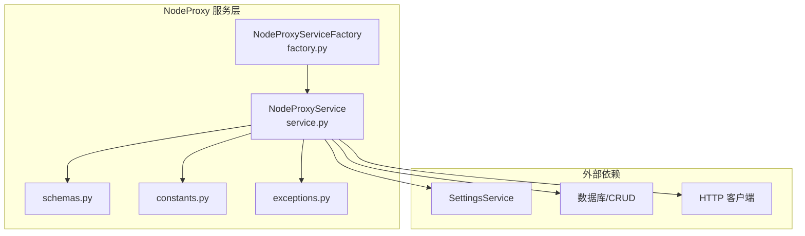
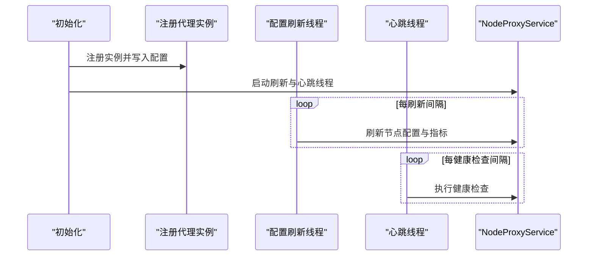
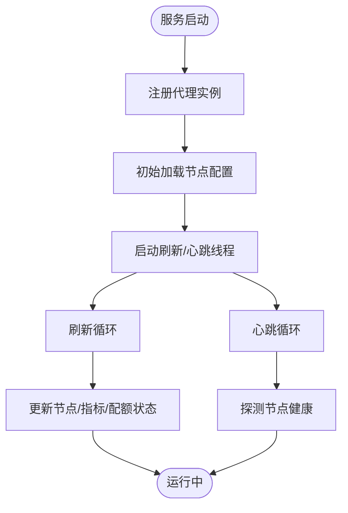
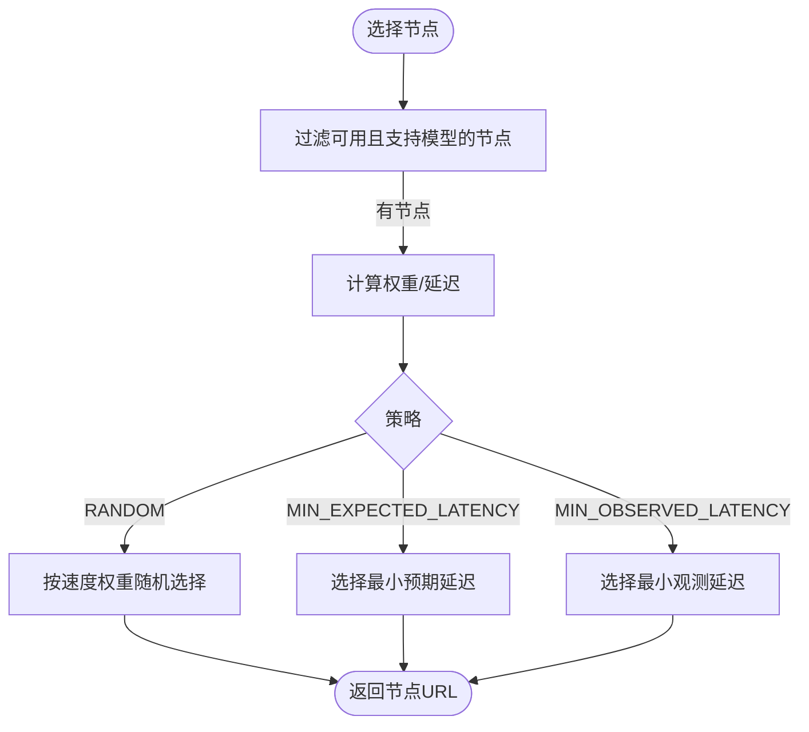
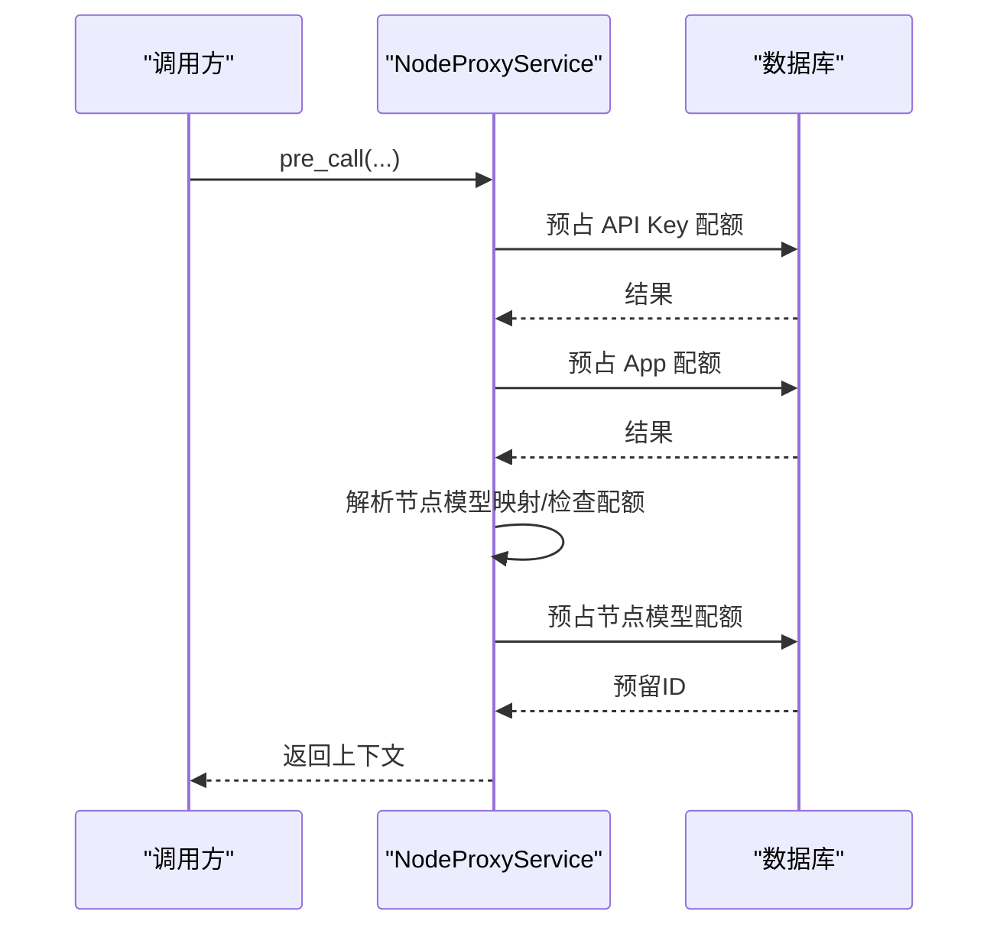
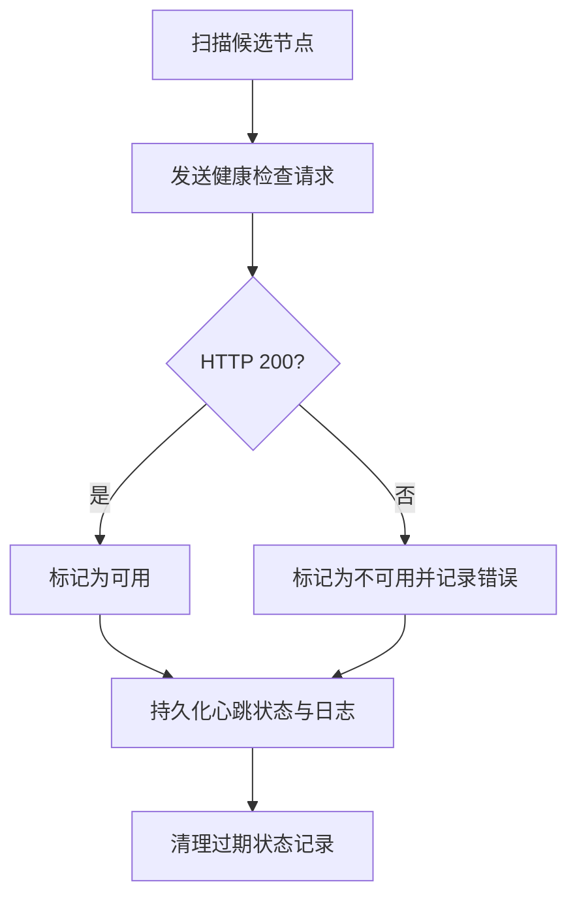
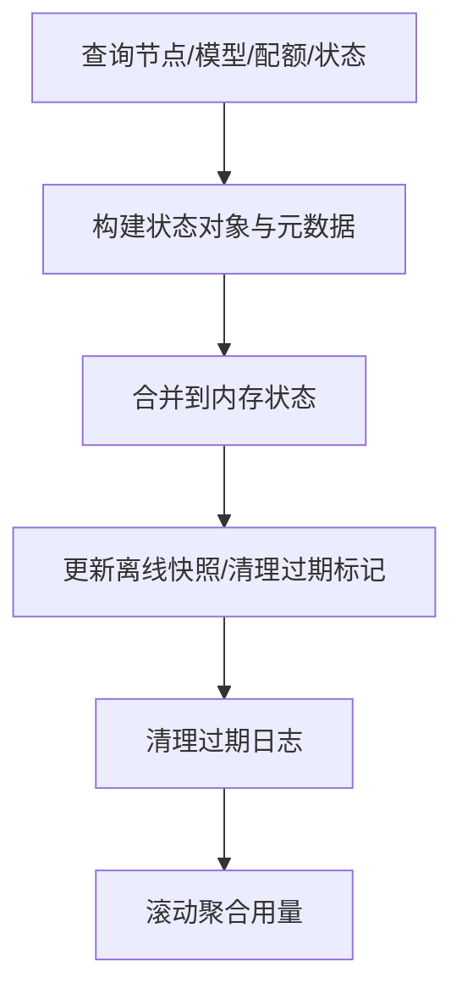
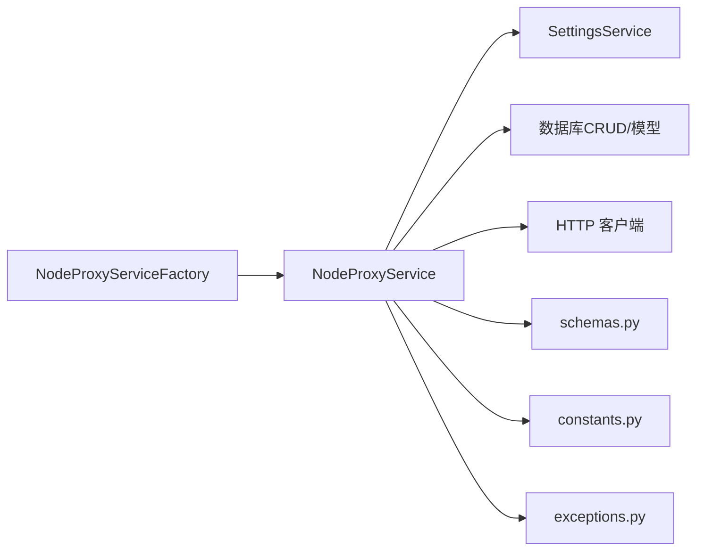

# NodeProxyService核心代理服务

<cite>
**本文引用的文件**
- [src/apiproxy/openaiproxy/services/nodeproxy/service.py](file://src/apiproxy/openaiproxy/services/nodeproxy/service.py)
- [src/apiproxy/openaiproxy/services/nodeproxy/factory.py](file://src/apiproxy/openaiproxy/services/nodeproxy/factory.py)
- [src/apiproxy/openaiproxy/services/nodeproxy/schemas.py](file://src/apiproxy/openaiproxy/services/nodeproxy/schemas.py)
- [src/apiproxy/openaiproxy/services/nodeproxy/constants.py](file://src/apiproxy/openaiproxy/services/nodeproxy/constants.py)
- [src/apiproxy/openaiproxy/services/nodeproxy/exceptions.py](file://src/apiproxy/openaiproxy/services/nodeproxy/exceptions.py)
</cite>

## 目录
1. [简介](#简介)
2. [项目结构](#项目结构)
3. [核心组件](#核心组件)
4. [架构总览](#架构总览)
5. [详细组件分析](#详细组件分析)
6. [依赖分析](#依赖分析)
7. [性能考量](#性能考量)
8. [故障排查指南](#故障排查指南)
9. [结论](#结论)
10. [附录](#附录)

## 简介
NodeProxyService 是一个面向多节点推理服务的代理与调度核心，负责节点发现与配置刷新、健康检查、请求预处理与配额预留、按策略选择节点、异步日志与指标更新、以及资源回收与清理等全生命周期管理。它支持三种负载均衡策略：随机权重、最小预期延迟（基于在途任务与速度）、最小观测延迟（基于历史平均延迟）。服务通过线程与异步协程协同工作，确保高并发下的稳定性与可观测性。

## 项目结构
NodeProxyService 所在模块位于 openaiproxy/services/nodeproxy 下，主要文件职责如下：
- service.py：核心服务实现，包含初始化、心跳、刷新、调度、配额、日志与指标、清理等逻辑
- factory.py：单例工厂，用于创建与注入 SettingsService
- schemas.py：对外暴露的响应模型与内部状态模型
- constants.py：常量与策略枚举
- exceptions.py：自定义异常类型

图表来源
- [src/apiproxy/openaiproxy/services/nodeproxy/service.py](file://src/apiproxy/openaiproxy/services/nodeproxy/service.py)
- [src/apiproxy/openaiproxy/services/nodeproxy/factory.py](file://src/apiproxy/openaiproxy/services/nodeproxy/factory.py)
- [src/apiproxy/openaiproxy/services/nodeproxy/schemas.py](file://src/apiproxy/openaiproxy/services/nodeproxy/schemas.py)
- [src/apiproxy/openaiproxy/services/nodeproxy/constants.py](file://src/apiproxy/openaiproxy/services/nodeproxy/constants.py)
- [src/apiproxy/openaiproxy/services/nodeproxy/exceptions.py](file://src/apiproxy/openaiproxy/services/nodeproxy/exceptions.py)

章节来源
- [src/apiproxy/openaiproxy/services/nodeproxy/service.py](file://src/apiproxy/openaiproxy/services/nodeproxy/service.py)
- [src/apiproxy/openaiproxy/services/nodeproxy/factory.py](file://src/apiproxy/openaiproxy/services/nodeproxy/factory.py)
- [src/apiproxy/openaiproxy/services/nodeproxy/schemas.py](file://src/apiproxy/openaiproxy/services/nodeproxy/schemas.py)
- [src/apiproxy/openaiproxy/services/nodeproxy/constants.py](file://src/apiproxy/openaiproxy/services/nodeproxy/constants.py)
- [src/apiproxy/openaiproxy/services/nodeproxy/exceptions.py](file://src/apiproxy/openaiproxy/services/nodeproxy/exceptions.py)

## 核心组件
- NodeProxyService：核心代理服务，负责节点状态维护、健康检查、调度、配额与日志
- NodeProxyServiceFactory：单例工厂，负责创建服务实例并注入 SettingsService
- Status/ErrorResponse：状态与错误响应模型
- Strategy 枚举：负载均衡策略
- 自定义异常：配额与处理错误分类

章节来源
- [src/apiproxy/openaiproxy/services/nodeproxy/service.py](file://src/apiproxy/openaiproxy/services/nodeproxy/service.py)
- [src/apiproxy/openaiproxy/services/nodeproxy/factory.py](file://src/apiproxy/openaiproxy/services/nodeproxy/factory.py)
- [src/apiproxy/openaiproxy/services/nodeproxy/schemas.py](file://src/apiproxy/openaiproxy/services/nodeproxy/schemas.py)
- [src/apiproxy/openaiproxy/services/nodeproxy/constants.py](file://src/apiproxy/openaiproxy/services/nodeproxy/constants.py)
- [src/apiproxy/openaiproxy/services/nodeproxy/exceptions.py](file://src/apiproxy/openaiproxy/services/nodeproxy/exceptions.py)

## 架构总览
NodeProxyService 采用“配置刷新线程 + 健康检查线程 + 异步数据库操作”的架构：
- 初始化阶段：注册代理实例、拉取初始节点配置、启动刷新与心跳线程
- 运行阶段：周期性刷新节点配置与指标；定时健康检查；按策略选择节点；请求前后进行配额预留/结算与日志记录
- 清理阶段：移除过期节点状态、过期日志归档与滚动聚合

图表来源
- [src/apiproxy/openaiproxy/services/nodeproxy/service.py](file://src/apiproxy/openaiproxy/services/nodeproxy/service.py)

## 详细组件分析

### 初始化与生命周期管理
- 实例注册：服务启动时尝试注册自身实例，写入数据库并同步到 SettingsService
- 初始加载：立即从数据库加载启用且未过期的节点，构建内存状态与元数据
- 后台线程：
  - 配置刷新线程：按设定间隔轮询数据库，合并差异，更新可用节点集合与离线快照
  - 心跳线程：周期性对节点执行健康检查，更新可用性与日志记录

图表来源
- [src/apiproxy/openaiproxy/services/nodeproxy/service.py](file://src/apiproxy/openaiproxy/services/nodeproxy/service.py)

章节来源
- [src/apiproxy/openaiproxy/services/nodeproxy/service.py](file://src/apiproxy/openaiproxy/services/nodeproxy/service.py)

### 负载均衡策略与调度
NodeProxyService 支持三种策略，均在节点可用且支持模型的前提下生效：
- 随机权重（RANDOM）：以节点速度作为权重进行加权随机选择
- 最小预期延迟（MIN_EXPECTED_LATENCY）：计算在途任务/速度的期望延迟，选择最小者
- 最小观测延迟（MIN_OBSERVED_LATENCY）：取历史平均延迟的最小值

图表来源
- [src/apiproxy/openaiproxy/services/nodeproxy/service.py](file://src/apiproxy/openaiproxy/services/nodeproxy/service.py)
- [src/apiproxy/openaiproxy/services/nodeproxy/constants.py](file://src/apiproxy/openaiproxy/services/nodeproxy/constants.py)

章节来源
- [src/apiproxy/openaiproxy/services/nodeproxy/service.py](file://src/apiproxy/openaiproxy/services/nodeproxy/service.py)
- [src/apiproxy/openaiproxy/services/nodeproxy/constants.py](file://src/apiproxy/openaiproxy/services/nodeproxy/constants.py)

### 请求预处理与配额预留
- 预处理阶段（pre_call）：
  - 规范化模型类型
  - 预占北向配额（API Key + App 双层，需同时成功）
  - 解析节点模型映射，检查节点模型配额是否耗尽
  - 预占节点模型配额，记录配额预留上下文
- 回滚与结算：
  - 若后续失败，回滚北向配额
  - 成功后结算北向与节点模型配额，并更新日志

图表来源
- [src/apiproxy/openaiproxy/services/nodeproxy/service.py](file://src/apiproxy/openaiproxy/services/nodeproxy/service.py)

章节来源
- [src/apiproxy/openaiproxy/services/nodeproxy/service.py](file://src/apiproxy/openaiproxy/services/nodeproxy/service.py)

### 节点健康检查机制
- 周期性探测：对启用健康检查的节点发起 GET /v1/models，超时区间固定
- 结果应用：根据可用性更新节点状态、可用集合与离线快照，并持久化心跳日志
- 过期清理：移除超过心跳间隔未更新的状态记录，补充日志与删除

图表来源
- [src/apiproxy/openaiproxy/services/nodeproxy/service.py](file://src/apiproxy/openaiproxy/services/nodeproxy/service.py)

章节来源
- [src/apiproxy/openaiproxy/services/nodeproxy/service.py](file://src/apiproxy/openaiproxy/services/nodeproxy/service.py)

### 配置刷新机制
- 数据来源：节点、模型、配额、代理节点状态与指标
- 冲突处理：基于配置版本判断变更，清空对应节点快照，避免误判
- 状态合并：更新 snode/nodes/_node_metadata，维护离线节点快照，清理过期配额标记
- 日志与保留：按保留天数清理过期日志，支持滚动聚合（日/周/月）

图表来源
- [src/apiproxy/openaiproxy/services/nodeproxy/service.py](file://src/apiproxy/openaiproxy/services/nodeproxy/service.py)

章节来源
- [src/apiproxy/openaiproxy/services/nodeproxy/service.py](file://src/apiproxy/openaiproxy/services/nodeproxy/service.py)

### 线程安全设计
- 全局锁：使用可重入锁保护节点集合、元数据、离线快照与配额标记
- 异步数据库：所有数据库操作封装为异步函数并通过统一入口执行，避免阻塞主线程
- 线程守护：心跳与刷新线程均为守护线程，服务关闭时等待并清理

章节来源
- [src/apiproxy/openaiproxy/services/nodeproxy/service.py](file://src/apiproxy/openaiproxy/services/nodeproxy/service.py)

### 错误处理策略
- 北向配额异常：捕获并抛出特定异常，必要时回滚
- 节点模型配额异常：标记配额耗尽并在 TTL 内屏蔽该模型
- 请求失败：构造统一错误载荷（超时/不可用），并记录日志
- 异常栈：在上下文中记录错误消息与堆栈，便于日志审计

章节来源
- [src/apiproxy/openaiproxy/services/nodeproxy/service.py](file://src/apiproxy/openaiproxy/services/nodeproxy/service.py)
- [src/apiproxy/openaiproxy/services/nodeproxy/exceptions.py](file://src/apiproxy/openaiproxy/services/nodeproxy/exceptions.py)

### 服务间通信与异步处理
- 与数据库服务：通过 CRUD 封装与异步会话进行节点、配额、状态与日志的读写
- 与设置服务：注册实例后写回 instance_id，保持配置一致性
- 与外部节点：HTTP(S) 客户端发起请求，支持流式与非流式两种模式

章节来源
- [src/apiproxy/openaiproxy/services/nodeproxy/service.py](file://src/apiproxy/openaiproxy/services/nodeproxy/service.py)
- [src/apiproxy/openaiproxy/services/nodeproxy/factory.py](file://src/apiproxy/openaiproxy/services/nodeproxy/factory.py)

### 并发控制与资源回收
- 并发控制：全局锁保护共享状态；异步数据库操作避免阻塞；心跳/刷新线程独立运行
- 资源回收：服务关闭时停止线程、刷新指标、清理过期状态与日志；定期滚动聚合用量

章节来源
- [src/apiproxy/openaiproxy/services/nodeproxy/service.py](file://src/apiproxy/openaiproxy/services/nodeproxy/service.py)

## 依赖分析
NodeProxyService 的直接依赖关系如下：

图表来源
- [src/apiproxy/openaiproxy/services/nodeproxy/service.py](file://src/apiproxy/openaiproxy/services/nodeproxy/service.py)
- [src/apiproxy/openaiproxy/services/nodeproxy/factory.py](file://src/apiproxy/openaiproxy/services/nodeproxy/factory.py)
- [src/apiproxy/openaiproxy/services/nodeproxy/schemas.py](file://src/apiproxy/openaiproxy/services/nodeproxy/schemas.py)
- [src/apiproxy/openaiproxy/services/nodeproxy/constants.py](file://src/apiproxy/openaiproxy/services/nodeproxy/constants.py)
- [src/apiproxy/openaiproxy/services/nodeproxy/exceptions.py](file://src/apiproxy/openaiproxy/services/nodeproxy/exceptions.py)

章节来源
- [src/apiproxy/openaiproxy/services/nodeproxy/service.py](file://src/apiproxy/openaiproxy/services/nodeproxy/service.py)
- [src/apiproxy/openaiproxy/services/nodeproxy/factory.py](file://src/apiproxy/openaiproxy/services/nodeproxy/factory.py)

## 性能考量
- 延迟估计：
  - 最小预期延迟：利用在途任务与速度估算，适合动态负载场景
  - 最小观测延迟：使用历史平均延迟，适合稳定负载场景
  - 随机权重：在速度不可靠或需要流量均匀分布时使用
- 指标与缓存：
  - 使用固定长度队列保存延迟样本，降低内存占用
  - 通过配置版本快速识别变更，避免重复快照
- I/O 优化：
  - 异步数据库访问与 HTTP 客户端减少阻塞
  - 流式响应支持大吞吐场景
- 资源回收：
  - 定期清理过期日志与状态，避免无限增长

## 故障排查指南
- 常见问题定位
  - 节点不可用：检查健康检查日志与可用性标记
  - 配额耗尽：查看节点模型配额标记与 TTL，确认结算是否成功
  - 超时/不可用：确认后端节点可达性与超时参数
- 关键日志
  - 节点状态变更、心跳持久化、过期清理、滚动聚合
- 排查步骤
  - 查看服务日志与错误上下文
  - 核对 SettingsService 中的 instance_id 与配置刷新间隔
  - 检查数据库中节点、配额与状态记录

章节来源
- [src/apiproxy/openaiproxy/services/nodeproxy/service.py](file://src/apiproxy/openaiproxy/services/nodeproxy/service.py)
- [src/apiproxy/openaiproxy/services/nodeproxy/exceptions.py](file://src/apiproxy/openaiproxy/services/nodeproxy/exceptions.py)

## 结论
NodeProxyService 提供了完整的节点代理与调度能力，具备高可用、可观测与可扩展特性。通过策略化的负载均衡、严格的配额控制与完善的日志/指标体系，能够在复杂场景下稳定地分发请求并保障资源使用合规。建议在生产环境中结合监控与告警，持续优化刷新与心跳间隔、策略选择与配额阈值。

## 附录

### 使用示例（路径指引）
- 创建服务实例
  - 工厂创建：[NodeProxyServiceFactory.create](file://src/apiproxy/openaiproxy/services/nodeproxy/factory.py)
- 节点管理
  - 获取节点列表：[NodeProxyService.status](file://src/apiproxy/openaiproxy/services/nodeproxy/service.py)
  - 查询模型支持：[NodeProxyService.supports_model](file://src/apiproxy/openaiproxy/services/nodeproxy/service.py)
- 请求分发
  - 选择节点：[NodeProxyService.get_node_url](file://src/apiproxy/openaiproxy/services/nodeproxy/service.py)
  - 预处理与配额：[NodeProxyService.pre_call](file://src/apiproxy/openaiproxy/services/nodeproxy/service.py)
  - 发送请求（流式）：[NodeProxyService.stream_generate](file://src/apiproxy/openaiproxy/services/nodeproxy/service.py)
  - 发送请求（非流式）：[NodeProxyService.generate](file://src/apiproxy/openaiproxy/services/nodeproxy/service.py)
  - 后处理与结算：[NodeProxyService.post_call](file://src/apiproxy/openaiproxy/services/nodeproxy/service.py)
- 监控与清理
  - 刷新指标：[NodeProxyService.refresh_all_node_metrics](file://src/apiproxy/openaiproxy/services/nodeproxy/service.py)
  - 清理过期状态：[NodeProxyService.remove_stale_nodes_by_expiration](file://src/apiproxy/openaiproxy/services/nodeproxy/service.py)
  - 清理过期日志：[NodeProxyService.remove_expired_logs_task](file://src/apiproxy/openaiproxy/services/nodeproxy/service.py)
  - 滚动聚合：[NodeProxyService.daily_usage_rollup_task](file://src/apiproxy/openaiproxy/services/nodeproxy/service.py) 等

章节来源
- [src/apiproxy/openaiproxy/services/nodeproxy/service.py](file://src/apiproxy/openaiproxy/services/nodeproxy/service.py)
- [src/apiproxy/openaiproxy/services/nodeproxy/factory.py](file://src/apiproxy/openaiproxy/services/nodeproxy/factory.py)