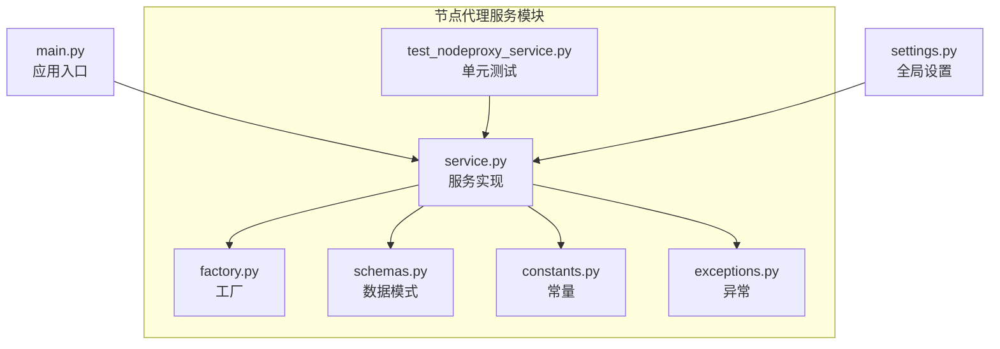
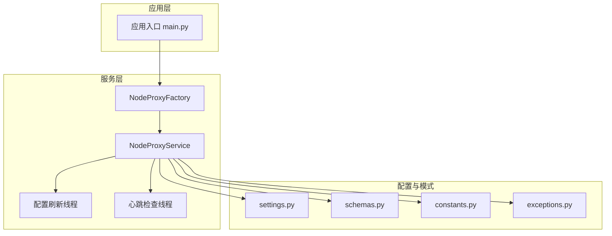
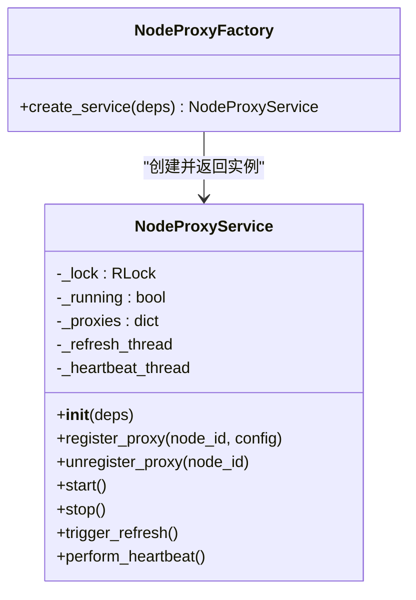
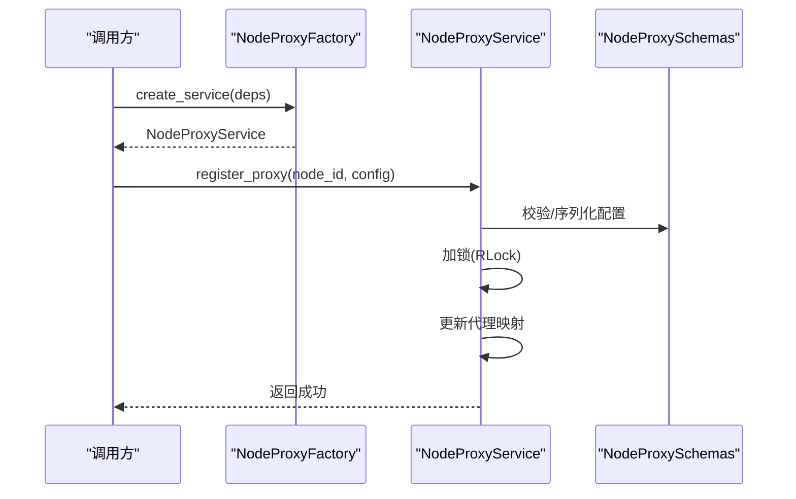
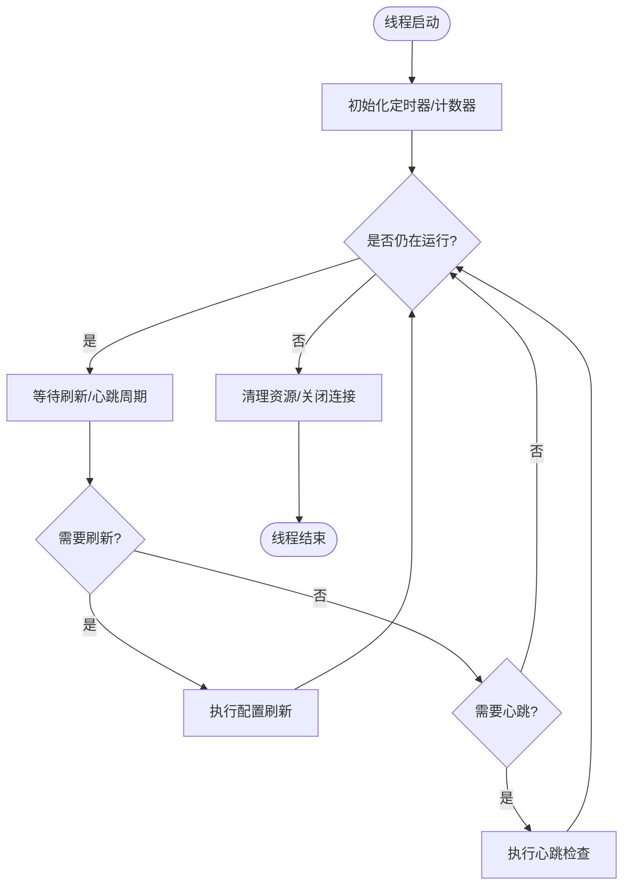
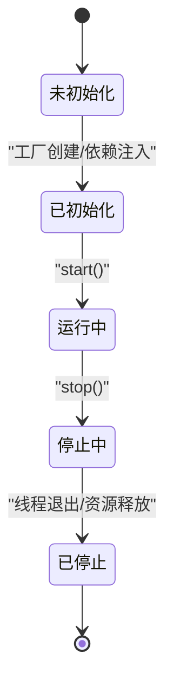
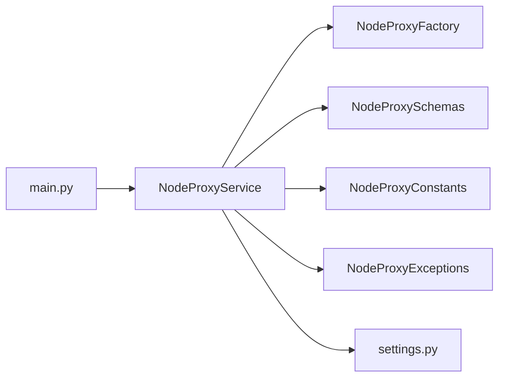

# 服务初始化与生命周期管理

<cite>
**本文引用的文件**
- [service.py](file://src/apiproxy/openaiproxy/services/nodeproxy/service.py)
- [factory.py](file://src/apiproxy/openaiproxy/services/nodeproxy/factory.py)
- [schemas.py](file://src/apiproxy/openaiproxy/services/nodeproxy/schemas.py)
- [constants.py](file://src/apiproxy/openaiproxy/services/nodeproxy/constants.py)
- [exceptions.py](file://src/apiproxy/openaiproxy/services/nodeproxy/exceptions.py)
- [test_nodeproxy_service.py](file://src/apiproxy/tests/services/test_nodeproxy_service.py)
- [main.py](file://src/apiproxy/openaiproxy/main.py)
- [settings.py](file://src/apiproxy/openaiproxy/settings.py)
</cite>

## 目录
1. [简介](#简介)
2. [项目结构](#项目结构)
3. [核心组件](#核心组件)
4. [架构总览](#架构总览)
5. [详细组件分析](#详细组件分析)
6. [依赖关系分析](#依赖关系分析)
7. [性能考量](#性能考量)
8. [故障排查指南](#故障排查指南)
9. [结论](#结论)
10. [附录](#附录)

## 简介
本文件聚焦于 NodeProxyService 的服务初始化与生命周期管理，系统性阐述其构造参数、线程安全机制、初始化流程、代理实例注册、配置刷新与心跳检查线程的启动机制、生命周期阶段的处理逻辑、并发控制策略（threading.RLock）、配置参数作用与默认值、异常处理与容错机制，并提供可直接定位到源码的示例路径以便正确初始化与使用。

## 项目结构
NodeProxyService 所在模块位于 openaiproxy/services/nodeproxy 下，核心文件包括服务实现、工厂、模式定义、常量与异常等；测试用例位于 tests/services 中。

**图表来源**
- [service.py](file://src/apiproxy/openaiproxy/services/nodeproxy/service.py)
- [factory.py](file://src/apiproxy/openaiproxy/services/nodeproxy/factory.py)
- [schemas.py](file://src/apiproxy/openaiproxy/services/nodeproxy/schemas.py)
- [constants.py](file://src/apiproxy/openaiproxy/services/nodeproxy/constants.py)
- [exceptions.py](file://src/apiproxy/openaiproxy/services/nodeproxy/exceptions.py)
- [test_nodeproxy_service.py](file://src/apiproxy/tests/services/test_nodeproxy_service.py)
- [main.py](file://src/apiproxy/openaiproxy/main.py)
- [settings.py](file://src/apiproxy/openaiproxy/settings.py)

**章节来源**
- [service.py](file://src/apiproxy/openaiproxy/services/nodeproxy/service.py)
- [factory.py](file://src/apiproxy/openaiproxy/services/nodeproxy/factory.py)
- [schemas.py](file://src/apiproxy/openaiproxy/services/nodeproxy/schemas.py)
- [constants.py](file://src/apiproxy/openaiproxy/services/nodeproxy/constants.py)
- [exceptions.py](file://src/apiproxy/openaiproxy/services/nodeproxy/exceptions.py)
- [test_nodeproxy_service.py](file://src/apiproxy/tests/services/test_nodeproxy_service.py)
- [main.py](file://src/apiproxy/openaiproxy/main.py)
- [settings.py](file://src/apiproxy/openaiproxy/settings.py)

## 核心组件
- NodeProxyService：负责节点代理的注册、配置刷新、心跳检测、生命周期管理与并发控制。
- NodeProxyFactory：用于创建 NodeProxyService 实例并注入依赖。
- NodeProxySchemas：定义服务使用的数据模型与校验规则。
- NodeProxyConstants：集中管理服务相关常量（如刷新周期、心跳间隔等）。
- NodeProxyExceptions：定义服务特有的异常类型，便于统一处理与传播。
- 单元测试：验证服务初始化、注册、刷新与停止流程。

**章节来源**
- [service.py](file://src/apiproxy/openaiproxy/services/nodeproxy/service.py)
- [factory.py](file://src/apiproxy/openaiproxy/services/nodeproxy/factory.py)
- [schemas.py](file://src/apiproxy/openaiproxy/services/nodeproxy/schemas.py)
- [constants.py](file://src/apiproxy/openaiproxy/services/nodeproxy/constants.py)
- [exceptions.py](file://src/apiproxy/openaiproxy/services/nodeproxy/exceptions.py)
- [test_nodeproxy_service.py](file://src/apiproxy/tests/services/test_nodeproxy_service.py)

## 架构总览
NodeProxyService 通过工厂创建，依赖全局设置与数据模式；服务内部维护代理实例集合、配置刷新线程与心跳检查线程，使用 RLock 保证并发安全；生命周期由外部入口调用启动与停止方法驱动。

**图表来源**
- [main.py](file://src/apiproxy/openaiproxy/main.py)
- [factory.py](file://src/apiproxy/openaiproxy/services/nodeproxy/factory.py)
- [service.py](file://src/apiproxy/openaiproxy/services/nodeproxy/service.py)
- [settings.py](file://src/apiproxy/openaiproxy/settings.py)
- [schemas.py](file://src/apiproxy/openaiproxy/services/nodeproxy/schemas.py)
- [constants.py](file://src/apiproxy/openaiproxy/services/nodeproxy/constants.py)
- [exceptions.py](file://src/apiproxy/openaiproxy/services/nodeproxy/exceptions.py)

## 详细组件分析

### NodeProxyService 类与初始化
- 构造函数参数与职责
  - 接收依赖（如配置管理器、数据库会话工厂、日志记录器等），用于后续注册、刷新与心跳操作。
  - 初始化内部状态：代理实例映射、运行标志、RLock 锁对象、线程池或线程序列等。
- 线程安全机制
  - 使用 threading.RLock 保护共享资源访问，确保多线程环境下对代理列表、状态标志与计时器的修改是原子的。
  - 在注册、注销、刷新触发与心跳检测等关键路径上加锁，避免竞态条件。
- 初始化流程
  - 从工厂注入依赖后，进行内部状态初始化与资源准备。
  - 启动配置刷新线程与心跳检查线程，进入就绪状态等待外部启动命令。

**图表来源**
- [service.py](file://src/apiproxy/openaiproxy/services/nodeproxy/service.py)
- [factory.py](file://src/apiproxy/openaiproxy/services/nodeproxy/factory.py)

**章节来源**
- [service.py](file://src/apiproxy/openaiproxy/services/nodeproxy/service.py)
- [factory.py](file://src/apiproxy/openaiproxy/services/nodeproxy/factory.py)

### 代理实例注册过程
- 注册接口
  - register_proxy(node_id, config)：将节点代理配置写入内部映射，并触发必要的缓存或索引更新。
- 注销接口
  - unregister_proxy(node_id)：移除指定节点的代理配置，清理相关资源。
- 并发控制
  - 在注册/注销期间持有 RLock，防止其他线程同时修改代理映射导致不一致。
- 数据模型
  - 使用 schemas 中的节点代理模式进行配置校验与序列化，确保输入一致性。

**图表来源**
- [factory.py](file://src/apiproxy/openaiproxy/services/nodeproxy/factory.py)
- [service.py](file://src/apiproxy/openaiproxy/services/nodeproxy/service.py)
- [schemas.py](file://src/apiproxy/openaiproxy/services/nodeproxy/schemas.py)

**章节来源**
- [service.py](file://src/apiproxy/openaiproxy/services/nodeproxy/service.py)
- [schemas.py](file://src/apiproxy/openaiproxy/services/nodeproxy/schemas.py)

### 配置刷新线程与心跳检查线程
- 配置刷新线程
  - 周期性触发 trigger_refresh()，从配置源拉取最新节点代理配置，合并到本地映射。
  - 使用 RLock 保护刷新过程中的读写，避免与其他线程冲突。
- 心跳检查线程
  - 周期性执行 perform_heartbeat()，对已注册代理进行健康检查与状态更新。
  - 对异常代理进行隔离或重试，必要时触发自动恢复流程。
- 线程启动与停止
  - start() 启动两个后台线程；stop() 发出停止信号并等待线程退出，确保资源释放。

**图表来源**
- [service.py](file://src/apiproxy/openaiproxy/services/nodeproxy/service.py)
- [constants.py](file://src/apiproxy/openaiproxy/services/nodeproxy/constants.py)

**章节来源**
- [service.py](file://src/apiproxy/openaiproxy/services/nodeproxy/service.py)
- [constants.py](file://src/apiproxy/openaiproxy/services/nodeproxy/constants.py)

### 生命周期管理
- 启动阶段
  - 工厂创建服务实例，完成依赖注入与内部状态初始化。
  - 调用 start() 启动刷新与心跳线程，设置运行标志为真。
- 运行阶段
  - 处理注册/注销请求，响应外部触发的刷新指令。
  - 后台线程按周期执行刷新与心跳任务。
- 停止阶段
  - 调用 stop() 发出停止信号，等待线程优雅退出。
  - 清理代理映射、关闭连接、释放锁资源。

**图表来源**
- [service.py](file://src/apiproxy/openaiproxy/services/nodeproxy/service.py)
- [factory.py](file://src/apiproxy/openaiproxy/services/nodeproxy/factory.py)

**章节来源**
- [service.py](file://src/apiproxy/openaiproxy/services/nodeproxy/service.py)
- [factory.py](file://src/apiproxy/openaiproxy/services/nodeproxy/factory.py)

### 线程锁机制与并发控制策略
- 使用场景
  - 保护代理映射的增删改查。
  - 保护运行标志与线程状态切换。
  - 保护刷新与心跳任务的互斥执行。
- 并发策略
  - 将锁粒度最小化，仅在关键路径加锁。
  - 避免在持有锁期间执行耗时操作（如网络请求、磁盘 IO）。
  - 在锁内只做轻量级数据结构操作，减少锁竞争。

**章节来源**
- [service.py](file://src/apiproxy/openaiproxy/services/nodeproxy/service.py)

### 服务配置参数与默认值
- 刷新周期
  - 定义刷新任务的时间间隔，默认值见 constants.py。
- 心跳间隔
  - 定义心跳检查的时间间隔，默认值见 constants.py。
- 超时阈值
  - 心跳超时判定阈值，默认值见 constants.py。
- 其他参数
  - 包括最大重试次数、并发线程数上限等，详见 constants.py 与服务构造参数。

**章节来源**
- [constants.py](file://src/apiproxy/openaiproxy/services/nodeproxy/constants.py)
- [service.py](file://src/apiproxy/openaiproxy/services/nodeproxy/service.py)

### 异常处理与容错机制
- 异常类型
  - 自定义异常类用于区分不同错误场景（如配置无效、网络超时、线程异常等）。
- 容错策略
  - 刷新失败时保留旧配置并记录告警，等待下次重试。
  - 心跳失败达到阈值后将代理标记为不可用并尝试自动恢复。
  - 线程异常被捕获并上报，不影响其他线程与主流程。
- 统一处理
  - 在服务内部捕获并转换为统一异常类型，向上抛出或记录日志。

**章节来源**
- [exceptions.py](file://src/apiproxy/openaiproxy/services/nodeproxy/exceptions.py)
- [service.py](file://src/apiproxy/openaiproxy/services/nodeproxy/service.py)

### 正确初始化与使用示例（代码片段路径）
- 工厂创建服务实例
  - 示例路径：[factory.py](file://src/apiproxy/openaiproxy/services/nodeproxy/factory.py)
- 服务启动与停止
  - 示例路径：[service.py](file://src/apiproxy/openaiproxy/services/nodeproxy/service.py)
- 代理注册与注销
  - 示例路径：[service.py](file://src/apiproxy/openaiproxy/services/nodeproxy/service.py)
- 配置刷新与心跳
  - 示例路径：[service.py](file://src/apiproxy/openaiproxy/services/nodeproxy/service.py)
- 常量与默认值
  - 示例路径：[constants.py](file://src/apiproxy/openaiproxy/services/nodeproxy/constants.py)
- 测试用例参考
  - 示例路径：[test_nodeproxy_service.py](file://src/apiproxy/tests/services/test_nodeproxy_service.py)

**章节来源**
- [factory.py](file://src/apiproxy/openaiproxy/services/nodeproxy/factory.py)
- [service.py](file://src/apiproxy/openaiproxy/services/nodeproxy/service.py)
- [constants.py](file://src/apiproxy/openaiproxy/services/nodeproxy/constants.py)
- [test_nodeproxy_service.py](file://src/apiproxy/tests/services/test_nodeproxy_service.py)

## 依赖关系分析
- 内部依赖
  - NodeProxyService 依赖 NodeProxyFactory 提供的实例化能力。
  - 依赖 NodeProxySchemas 进行配置校验。
  - 依赖 NodeProxyConstants 获取运行参数。
  - 依赖 NodeProxyExceptions 进行异常建模。
- 外部依赖
  - 依赖全局 settings.py 提供的系统配置。
  - 依赖应用入口 main.py 触发生命周期事件。

**图表来源**
- [service.py](file://src/apiproxy/openaiproxy/services/nodeproxy/service.py)
- [factory.py](file://src/apiproxy/openaiproxy/services/nodeproxy/factory.py)
- [schemas.py](file://src/apiproxy/openaiproxy/services/nodeproxy/schemas.py)
- [constants.py](file://src/apiproxy/openaiproxy/services/nodeproxy/constants.py)
- [exceptions.py](file://src/apiproxy/openaiproxy/services/nodeproxy/exceptions.py)
- [main.py](file://src/apiproxy/openaiproxy/main.py)
- [settings.py](file://src/apiproxy/openaiproxy/settings.py)

**章节来源**
- [service.py](file://src/apiproxy/openaiproxy/services/nodeproxy/service.py)
- [factory.py](file://src/apiproxy/openaiproxy/services/nodeproxy/factory.py)
- [schemas.py](file://src/apiproxy/openaiproxy/services/nodeproxy/schemas.py)
- [constants.py](file://src/apiproxy/openaiproxy/services/nodeproxy/constants.py)
- [exceptions.py](file://src/apiproxy/openaiproxy/services/nodeproxy/exceptions.py)
- [main.py](file://src/apiproxy/openaiproxy/main.py)
- [settings.py](file://src/apiproxy/openaiproxy/settings.py)

## 性能考量
- 线程模型
  - 刷新与心跳采用独立线程，避免阻塞主线程。
  - 合理设置刷新与心跳周期，平衡实时性与系统负载。
- 锁优化
  - 缩小锁范围，避免在持有锁期间进行 I/O 或长耗时计算。
  - 使用细粒度锁或分段锁降低热点竞争。
- 资源管理
  - 及时释放网络连接与数据库连接，防止泄漏。
  - 在 stop() 中确保线程优雅退出与资源回收。

## 故障排查指南
- 常见问题
  - 代理注册失败：检查配置模式与输入参数是否符合 schemas。
  - 刷新线程不工作：确认 start() 是否被调用，线程是否抛出异常。
  - 心跳频繁失败：检查网络连通性与目标节点状态。
- 排查步骤
  - 查看服务日志与异常栈，定位具体失败点。
  - 使用单元测试覆盖关键路径，验证注册、刷新与停止流程。
  - 检查 constants.py 中的参数是否合理，必要时调整周期与阈值。

**章节来源**
- [exceptions.py](file://src/apiproxy/openaiproxy/services/nodeproxy/exceptions.py)
- [test_nodeproxy_service.py](file://src/apiproxy/tests/services/test_nodeproxy_service.py)
- [service.py](file://src/apiproxy/openaiproxy/services/nodeproxy/service.py)

## 结论
NodeProxyService 通过清晰的工厂化创建、严格的线程安全设计与完善的生命周期管理，实现了节点代理的稳定注册、动态刷新与持续心跳监控。结合统一的异常处理与合理的性能优化策略，能够在高并发场景下保持系统的可靠性与可维护性。

## 附录
- 关键实现位置参考
  - 服务实现：[service.py](file://src/apiproxy/openaiproxy/services/nodeproxy/service.py)
  - 工厂实现：[factory.py](file://src/apiproxy/openaiproxy/services/nodeproxy/factory.py)
  - 数据模式：[schemas.py](file://src/apiproxy/openaiproxy/services/nodeproxy/schemas.py)
  - 常量定义：[constants.py](file://src/apiproxy/openaiproxy/services/nodeproxy/constants.py)
  - 异常定义：[exceptions.py](file://src/apiproxy/openaiproxy/services/nodeproxy/exceptions.py)
  - 单元测试：[test_nodeproxy_service.py](file://src/apiproxy/tests/services/test_nodeproxy_service.py)
  - 应用入口：[main.py](file://src/apiproxy/openaiproxy/main.py)
  - 全局设置：[settings.py](file://src/apiproxy/openaiproxy/settings.py)