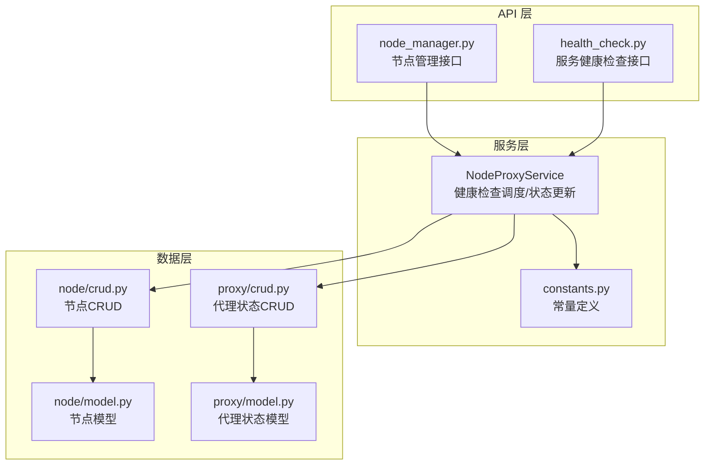
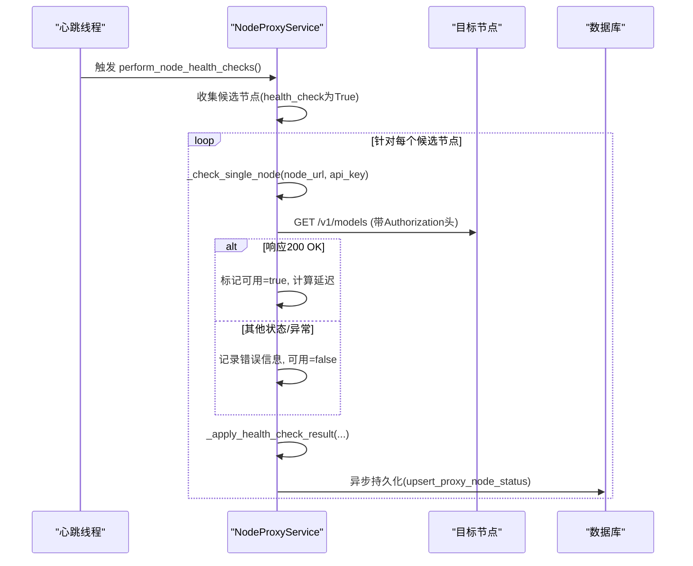
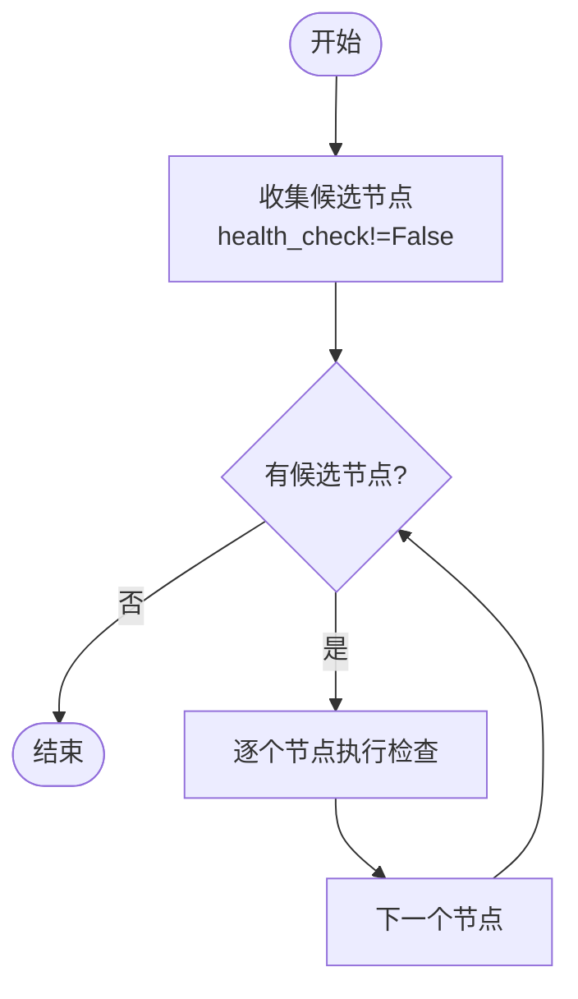
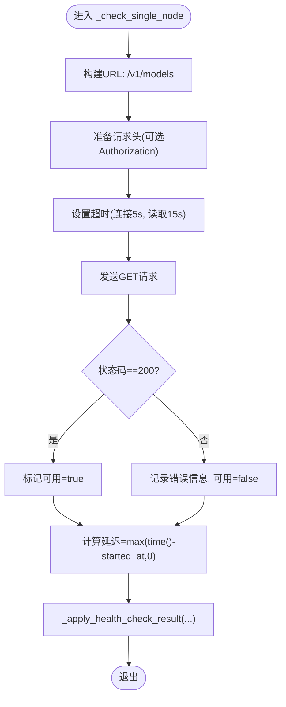
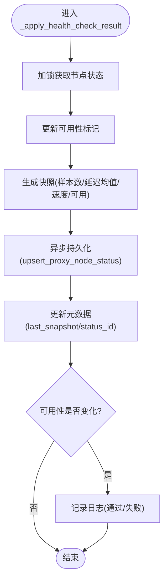
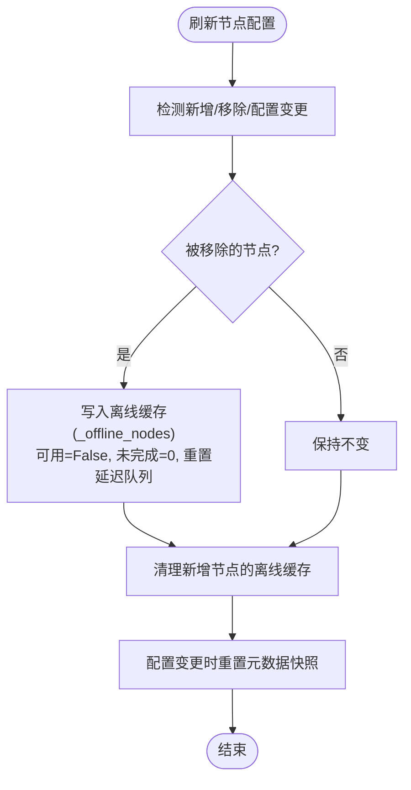
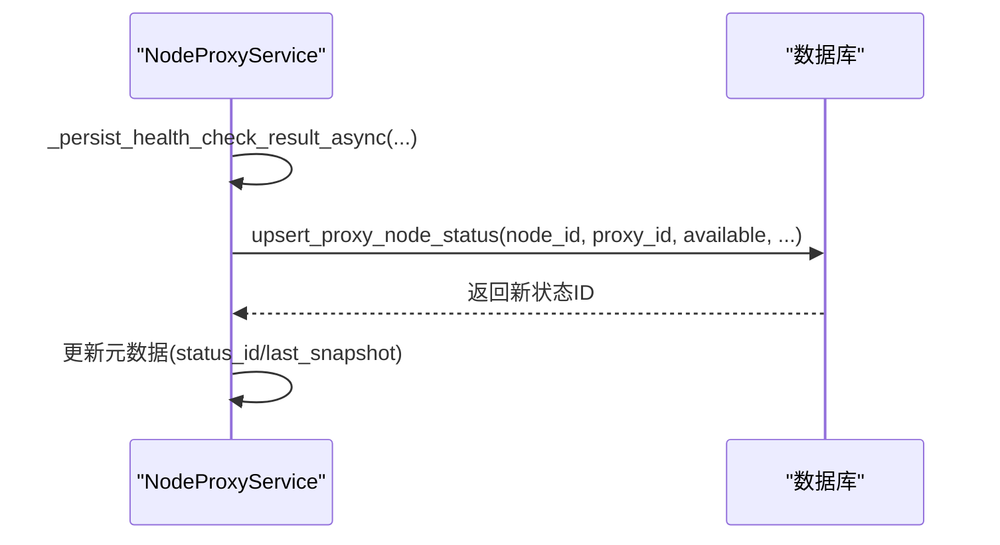
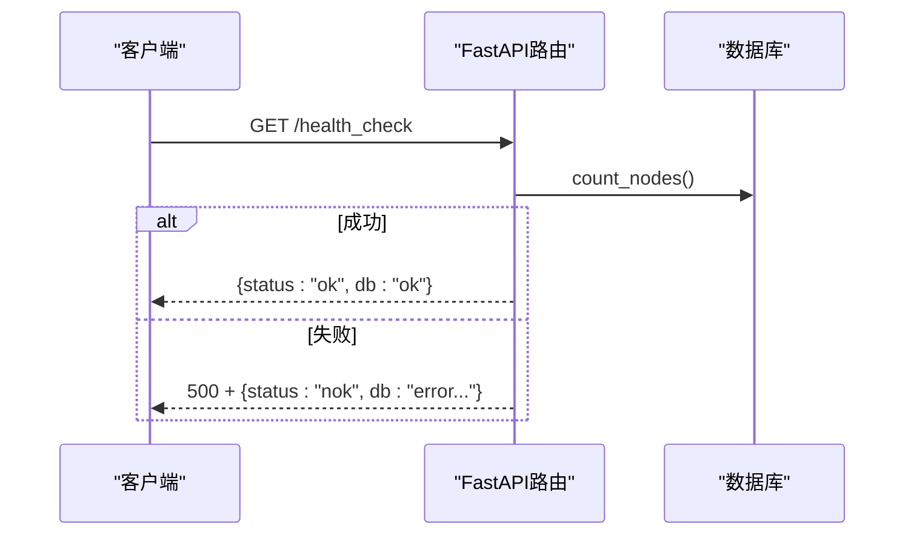
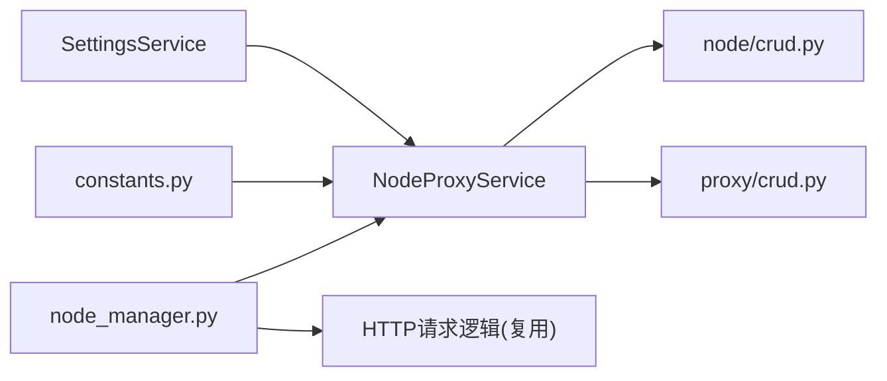

# 节点健康检查与监控

<cite>
**本文引用的文件**
- [service.py](file://src/apiproxy/openaiproxy/services/nodeproxy/service.py)
- [constants.py](file://src/apiproxy/openaiproxy/services/nodeproxy/constants.py)
- [node_manager.py](file://src/apiproxy/openaiproxy/api/node_manager.py)
- [health_check.py](file://src/apiproxy/openaiproxy/api/health_check.py)
- [schemas.py](file://src/apiproxy/openaiproxy/services/nodeproxy/schemas.py)
- [model.py](file://src/apiproxy/openaiproxy/services/database/models/node/model.py)
- [crud.py](file://src/apiproxy/openaiproxy/services/database/models/node/crud.py)
- [proxy_model.py](file://src/apiproxy/openaiproxy/services/database/models/proxy/model.py)
- [proxy_crud.py](file://src/apiproxy/openaiproxy/services/database/models/proxy/crud.py)
</cite>

## 目录
1. [简介](#简介)
2. [项目结构](#项目结构)
3. [核心组件](#核心组件)
4. [架构总览](#架构总览)
5. [详细组件分析](#详细组件分析)
6. [依赖关系分析](#依赖关系分析)
7. [性能考量](#性能考量)
8. [故障排查指南](#故障排查指南)
9. [结论](#结论)
10. [附录：配置与使用示例](#附录配置与使用示例)

## 简介
本文件聚焦于 NodeProxyService 的节点健康检查与监控机制，系统性阐述健康检查的触发条件、检查流程、结果处理与状态持久化策略；详解单节点健康检查的 HTTP 请求构建、超时设置与响应解析；说明健康状态更新逻辑（可用性标记、延迟记录与速度计算）；解释离线节点管理与状态持久化；并提供配置参数说明与调优建议及可直接定位的代码示例路径。

## 项目结构
NodeProxyService 的健康检查能力由服务端线程驱动，结合数据库节点配置与代理实例状态记录，形成“配置拉取 → 健康检查 → 结果应用 → 数据库持久化”的闭环。关键模块分布如下：
- 服务层：NodeProxyService 实现健康检查调度、单节点检查、状态更新与持久化
- 常量层：定义健康检查端点、超时、队列长度等常量
- API 层：节点管理接口负责节点增删改查与模型探测
- 数据层：节点与代理状态的 CRUD 操作与模型定义

图表来源
- [service.py:214-280](file://src/apiproxy/openaiproxy/services/nodeproxy/service.py#L214-L280)
- [constants.py:27-31](file://src/apiproxy/openaiproxy/services/nodeproxy/constants.py#L27-L31)
- [node_manager.py:339-418](file://src/apiproxy/openaiproxy/api/node_manager.py#L339-L418)
- [health_check.py:57-75](file://src/apiproxy/openaiproxy/api/health_check.py#L57-L75)
- [model.py](file://src/apiproxy/openaiproxy/services/database/models/node/model.py)
- [crud.py](file://src/apiproxy/openaiproxy/services/database/models/node/crud.py)
- [proxy_model.py](file://src/apiproxy/openaiproxy/services/database/models/proxy/model.py)
- [proxy_crud.py](file://src/apiproxy/openaiproxy/services/database/models/proxy/crud.py)

章节来源
- [service.py:214-280](file://src/apiproxy/openaiproxy/services/nodeproxy/service.py#L214-L280)
- [constants.py:27-31](file://src/apiproxy/openaiproxy/services/nodeproxy/constants.py#L27-L31)

## 核心组件
- NodeProxyService：负责节点健康检查的调度、单节点检查、状态更新与持久化
- constants：定义健康检查端点、超时、延迟样本队列长度等
- node_manager：提供节点增删改查与模型探测接口，内部复用健康检查的 HTTP 请求逻辑
- health_check：提供服务级健康检查接口，用于整体服务可用性检测
- 数据模型与CRUD：节点与代理状态的持久化存储

章节来源
- [service.py:214-280](file://src/apiproxy/openaiproxy/services/nodeproxy/service.py#L214-L280)
- [constants.py:27-31](file://src/apiproxy/openaiproxy/services/nodeproxy/constants.py#L27-L31)
- [node_manager.py:119-180](file://src/apiproxy/openaiproxy/api/node_manager.py#L119-L180)
- [health_check.py:57-75](file://src/apiproxy/openaiproxy/api/health_check.py#L57-L75)

## 架构总览
NodeProxyService 在启动时创建后台线程，周期性执行健康检查任务。该任务会遍历当前内存中的节点状态，过滤出需要进行健康检查的节点，对每个节点发起 HTTP GET 请求至其 /v1/models 端点，根据响应更新可用性标记、记录延迟，并异步持久化到数据库。

图表来源
- [service.py:122-135](file://src/apiproxy/openaiproxy/services/nodeproxy/service.py#L122-L135)
- [service.py:759-802](file://src/apiproxy/openaiproxy/services/nodeproxy/service.py#L759-L802)
- [service.py:804-886](file://src/apiproxy/openaiproxy/services/nodeproxy/service.py#L804-L886)
- [service.py:887-942](file://src/apiproxy/openaiproxy/services/nodeproxy/service.py#L887-L942)

## 详细组件分析

### 健康检查触发与调度
- 触发机制：心跳线程以固定间隔调用 perform_node_health_checks()
- 候选节点筛选：仅对 status.health_check 不为 False 的节点进行检查
- 并发策略：逐个节点同步检查，避免并发竞争；整体检查过程在锁保护下进行

图表来源
- [service.py:759-768](file://src/apiproxy/openaiproxy/services/nodeproxy/service.py#L759-L768)
- [service.py:750-753](file://src/apiproxy/openaiproxy/services/nodeproxy/service.py#L750-L753)

章节来源
- [service.py:122-135](file://src/apiproxy/openaiproxy/services/nodeproxy/service.py#L122-L135)
- [service.py:759-768](file://src/apiproxy/openaiproxy/services/nodeproxy/service.py#L759-L768)

### 单节点健康检查实现
- HTTP 请求构建：目标端点为 /v1/models，支持携带 Authorization 头（若节点配置了 API Key）
- 超时设置：使用 NODE_HEALTH_CHECK_TIMEOUT = (连接超时5秒, 读取超时15秒)
- 响应解析：仅当状态码为 200 时视为可用；其他情况记录错误信息
- 错误处理：捕获请求异常与通用异常，确保不影响其他节点检查

图表来源
- [service.py:770-802](file://src/apiproxy/openaiproxy/services/nodeproxy/service.py#L770-L802)
- [constants.py:27-31](file://src/apiproxy/openaiproxy/services/nodeproxy/constants.py#L27-L31)

章节来源
- [service.py:770-802](file://src/apiproxy/openaiproxy/services/nodeproxy/service.py#L770-L802)

### 健康状态更新逻辑
- 可用性标记：将节点状态的可用字段更新为检查结果
- 延迟记录：将本次检查的延迟加入节点状态的延迟样本队列（受常量限制）
- 速度计算：当前实现中健康检查阶段不更新速度字段（speed=-1），速度计算在其他路径中完成
- 状态快照：生成包含样本数、延迟均值、速度、可用性的快照，用于后续持久化

图表来源
- [service.py:804-886](file://src/apiproxy/openaiproxy/services/nodeproxy/service.py#L804-L886)
- [service.py:887-942](file://src/apiproxy/openaiproxy/services/nodeproxy/service.py#L887-L942)

章节来源
- [service.py:804-886](file://src/apiproxy/openaiproxy/services/nodeproxy/service.py#L804-L886)

### 离线节点管理机制
- 节点移除：当节点从数据库移除或配置变更时，将其标记为离线状态并缓存到 _offline_nodes
- 离线状态：离线节点的可用性强制设为 False，未完成请求数清零，延迟队列重置
- 清理策略：新增节点时清理对应离线缓存；配置变更时重置元数据快照

图表来源
- [service.py:688-727](file://src/apiproxy/openaiproxy/services/nodeproxy/service.py#L688-L727)

章节来源
- [service.py:688-727](file://src/apiproxy/openaiproxy/services/nodeproxy/service.py#L688-L727)

### 状态持久化策略
- 持久化入口：_persist_health_check_result_async 使用 upsert_proxy_node_status 写入/更新代理节点状态
- 字段映射：包含节点ID、代理实例ID、可用性、时间戳等；延迟与速度在健康检查阶段暂不更新
- 并发安全：在异步会话作用域内执行，避免并发冲突

图表来源
- [service.py:887-942](file://src/apiproxy/openaiproxy/services/nodeproxy/service.py#L887-L942)
- [proxy_crud.py](file://src/apiproxy/openaiproxy/services/database/models/proxy/crud.py)

章节来源
- [service.py:887-942](file://src/apiproxy/openaiproxy/services/nodeproxy/service.py#L887-L942)

### 服务级健康检查接口
- /health：返回基础可用性标识，但不依赖此接口作为服务代理的可靠健康检查
- /health_check：实际评估关键服务（如数据库查询），返回统一格式的健康状态

图表来源
- [health_check.py:57-75](file://src/apiproxy/openaiproxy/api/health_check.py#L57-L75)

章节来源
- [health_check.py:57-75](file://src/apiproxy/openaiproxy/api/health_check.py#L57-L75)

### 节点模型探测与HTTP请求复用
- 节点管理接口在创建/更新节点时，可选择验证节点的 /v1/models 接口
- 该逻辑复用相同的 HTTP 请求构建、超时与响应解析流程，便于统一错误处理

章节来源
- [node_manager.py:119-180](file://src/apiproxy/openaiproxy/api/node_manager.py#L119-L180)
- [node_manager.py:382-418](file://src/apiproxy/openaiproxy/api/node_manager.py#L382-L418)

## 依赖关系分析
- NodeProxyService 依赖 settings 提供的健康检查间隔、刷新间隔、日志保留天数等配置
- 常量层提供健康检查端点与超时配置
- 数据层通过 CRUD 完成节点与代理状态的读写
- API 层通过 node_manager 与健康检查共享 HTTP 请求逻辑

图表来源
- [service.py:232-254](file://src/apiproxy/openaiproxy/services/nodeproxy/service.py#L232-L254)
- [constants.py:27-31](file://src/apiproxy/openaiproxy/services/nodeproxy/constants.py#L27-L31)
- [node_manager.py:119-180](file://src/apiproxy/openaiproxy/api/node_manager.py#L119-L180)

章节来源
- [service.py:232-254](file://src/apiproxy/openaiproxy/services/nodeproxy/service.py#L232-L254)
- [node_manager.py:119-180](file://src/apiproxy/openaiproxy/api/node_manager.py#L119-L180)

## 性能考量
- 检查频率：由心跳线程按健康检查间隔执行，避免过于频繁导致目标节点压力过大
- 超时设置：连接超时与读取超时分离，兼顾快速失败与合理等待
- 并发控制：单次检查为同步串行，避免对目标节点造成突发流量
- 延迟采样：延迟样本队列长度受常量限制，平衡实时性与资源占用
- 异步持久化：健康检查结果异步写入数据库，降低阻塞风险

## 故障排查指南
- 健康检查失败
  - 检查目标节点 /v1/models 是否可达，确认网络连通性与防火墙策略
  - 查看错误信息（HTTP状态码或异常字符串），定位具体问题
  - 关注日志输出，区分“通过”与“失败”两类事件
- 状态未更新
  - 确认节点配置的 health_check 字段未被显式关闭
  - 检查数据库 upsert 是否成功，关注持久化异常日志
- 离线节点仍被调度
  - 确认离线缓存是否正确写入与清理
  - 检查配置刷新逻辑是否正常执行

章节来源
- [service.py:880-886](file://src/apiproxy/openaiproxy/services/nodeproxy/service.py#L880-L886)
- [service.py:887-942](file://src/apiproxy/openaiproxy/services/nodeproxy/service.py#L887-L942)

## 结论
NodeProxyService 的健康检查机制通过定时线程、严格的超时控制与统一的 HTTP 请求逻辑，实现了对节点可用性的可靠监测。检查结果以快照形式更新内存状态并异步持久化，配合离线节点管理与配置刷新，形成闭环的监控体系。通过合理的配置与调优，可在保证稳定性的同时优化性能与资源占用。

## 附录：配置与使用示例
- 健康检查端点与超时
  - 端点：/v1/models
  - 连接超时：5 秒
  - 读取超时：15 秒
  - 参考路径：[constants.py:27-31](file://src/apiproxy/openaiproxy/services/nodeproxy/constants.py#L27-L31)
- 健康检查触发
  - 心跳线程按健康检查间隔调用 perform_node_health_checks()
  - 参考路径：[service.py:122-135](file://src/apiproxy/openaiproxy/services/nodeproxy/service.py#L122-L135)
- 单节点检查流程
  - 构建请求头与URL、设置超时、发送请求、解析响应、计算延迟、应用结果
  - 参考路径：[service.py:770-802](file://src/apiproxy/openaiproxy/services/nodeproxy/service.py#L770-L802)
- 状态更新与持久化
  - 应用结果后异步持久化，upsert_proxy_node_status 写入可用性等字段
  - 参考路径：[service.py:804-942](file://src/apiproxy/openaiproxy/services/nodeproxy/service.py#L804-L942)
- 离线节点管理
  - 节点移除或配置变更时写入离线缓存，可用性强制为 False
  - 参考路径：[service.py:688-727](file://src/apiproxy/openaiproxy/services/nodeproxy/service.py#L688-L727)
- 服务级健康检查接口
  - /health_check 评估数据库等关键服务
  - 参考路径：[health_check.py:57-75](file://src/apiproxy/openaiproxy/api/health_check.py#L57-L75)
- 节点模型探测（API复用）
  - 创建/更新节点时可验证 /v1/models 接口
  - 参考路径：[node_manager.py:382-418](file://src/apiproxy/openaiproxy/api/node_manager.py#L382-L418)