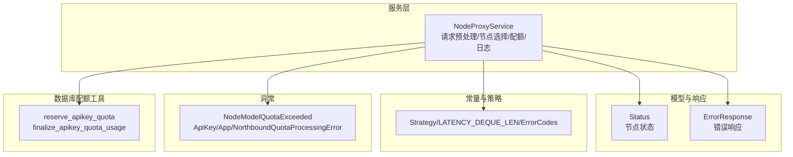
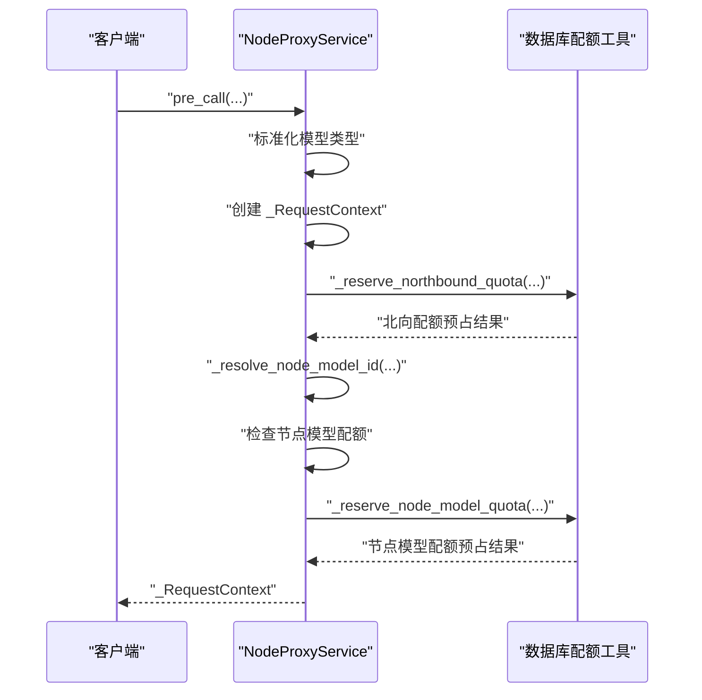
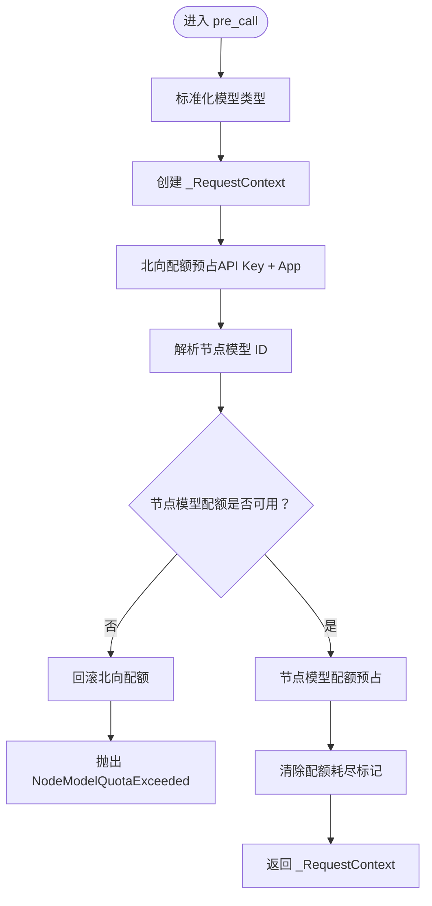
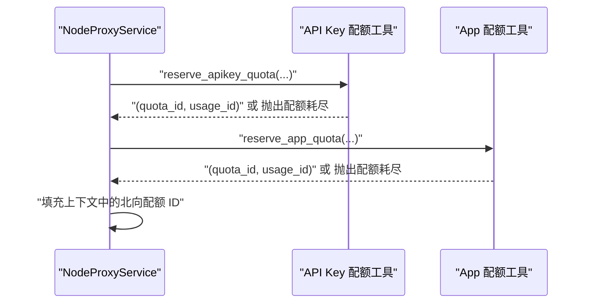
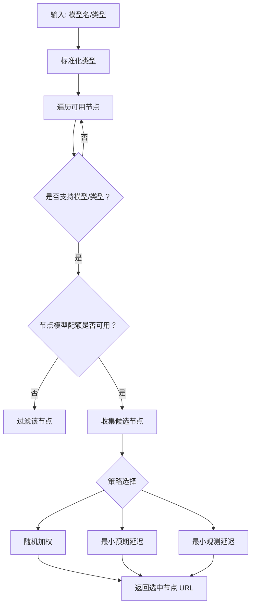
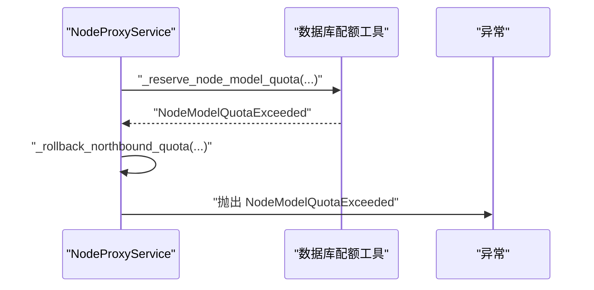
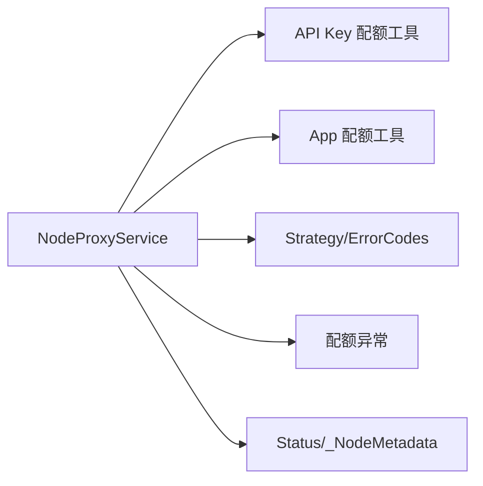

# 请求处理流程

<cite>
**本文引用的文件**
- [src/apiproxy/openaiproxy/services/nodeproxy/service.py](file://src/apiproxy/openaiproxy/services/nodeproxy/service.py)
- [src/apiproxy/openaiproxy/services/nodeproxy/schemas.py](file://src/apiproxy/openaiproxy/services/nodeproxy/schemas.py)
- [src/apiproxy/openaiproxy/services/nodeproxy/constants.py](file://src/apiproxy/openaiproxy/services/nodeproxy/constants.py)
- [src/apiproxy/openaiproxy/services/nodeproxy/exceptions.py](file://src/apiproxy/openaiproxy/services/nodeproxy/exceptions.py)
- [src/apiproxy/openaiproxy/services/database/models/apikey/utils.py](file://src/apiproxy/openaiproxy/services/database/models/apikey/utils.py)
- [src/apiproxy/tests/services/test_nodeproxy_service.py](file://src/apiproxy/tests/services/test_nodeproxy_service.py)
</cite>

## 目录
1. [简介](#简介)
2. [项目结构](#项目结构)
3. [核心组件](#核心组件)
4. [架构总览](#架构总览)
5. [详细组件分析](#详细组件分析)
6. [依赖关系分析](#依赖关系分析)
7. [性能考量](#性能考量)
8. [故障排查指南](#故障排查指南)
9. [结论](#结论)
10. [附录](#附录)

## 简介
本文件聚焦于 NodeProxyService 的请求处理流程，系统性梳理 pre_call 方法的完整执行路径，涵盖请求上下文创建、模型类型标准化、节点模型 ID 解析、北向配额与节点模型配额的预占与检查、节点选择策略、异常处理与错误回滚、以及性能优化与最佳实践。文档以代码级图示与分步说明帮助读者快速掌握实现细节与使用方式。

## 项目结构
NodeProxyService 位于 openaiproxy 服务层，负责节点管理、配额控制、请求路由与日志记录。关键模块包括：
- 服务实现：NodeProxyService（请求预处理、节点选择、配额与日志）
- 数据模型与响应：Status、ErrorResponse 等
- 常量与策略：调度策略、延迟队列长度、错误码
- 自定义异常：配额相关异常类型
- 数据库配额工具：API Key 与应用配额的预占与结算

**图表来源**
- [src/apiproxy/openaiproxy/services/nodeproxy/service.py:214-281](file://src/apiproxy/openaiproxy/services/nodeproxy/service.py#L214-L281)
- [src/apiproxy/openaiproxy/services/nodeproxy/schemas.py:33-64](file://src/apiproxy/openaiproxy/services/nodeproxy/schemas.py#L33-L64)
- [src/apiproxy/openaiproxy/services/nodeproxy/constants.py:33-69](file://src/apiproxy/openaiproxy/services/nodeproxy/constants.py#L33-L69)
- [src/apiproxy/openaiproxy/services/nodeproxy/exceptions.py:32-66](file://src/apiproxy/openaiproxy/services/nodeproxy/exceptions.py#L32-L66)
- [src/apiproxy/openaiproxy/services/database/models/apikey/utils.py:59-154](file://src/apiproxy/openaiproxy/services/database/models/apikey/utils.py#L59-L154)

**章节来源**
- [src/apiproxy/openaiproxy/services/nodeproxy/service.py:214-281](file://src/apiproxy/openaiproxy/services/nodeproxy/service.py#L214-L281)
- [src/apiproxy/openaiproxy/services/nodeproxy/schemas.py:33-64](file://src/apiproxy/openaiproxy/services/nodeproxy/schemas.py#L33-L64)
- [src/apiproxy/openaiproxy/services/nodeproxy/constants.py:29-69](file://src/apiproxy/openaiproxy/services/nodeproxy/constants.py#L29-L69)
- [src/apiproxy/openaiproxy/services/nodeproxy/exceptions.py:32-66](file://src/apiproxy/openaiproxy/services/nodeproxy/exceptions.py#L32-L66)

## 核心组件
- NodeProxyService：请求预处理、节点模型解析、配额预占与检查、节点选择、日志与指标维护
- _RequestContext：请求上下文，承载请求期间的关键状态与配额信息
- Status：节点状态，包含模型列表、类型、延迟样本、速度等
- Strategy：节点调度策略（随机、最小预期延迟、最小观测延迟）
- 自定义异常：节点模型配额耗尽、API Key/App 配额耗尽、北向配额处理失败

**章节来源**
- [src/apiproxy/openaiproxy/services/nodeproxy/service.py:159-212](file://src/apiproxy/openaiproxy/services/nodeproxy/service.py#L159-L212)
- [src/apiproxy/openaiproxy/services/nodeproxy/schemas.py:33-50](file://src/apiproxy/openaiproxy/services/nodeproxy/schemas.py#L33-L50)
- [src/apiproxy/openaiproxy/services/nodeproxy/constants.py:33-53](file://src/apiproxy/openaiproxy/services/nodeproxy/constants.py#L33-L53)
- [src/apiproxy/openaiproxy/services/nodeproxy/exceptions.py:32-66](file://src/apiproxy/openaiproxy/services/nodeproxy/exceptions.py#L32-L66)

## 架构总览
NodeProxyService 在请求进入时进行“预处理”，在节点选择后进行“后处理”。预处理阶段完成：
- 模型类型标准化
- 创建请求上下文
- 北向配额预占（API Key + App 双层）
- 节点模型 ID 解析
- 节点模型配额检查与预占
- 预占成功后的上下文填充

**图表来源**
- [src/apiproxy/openaiproxy/services/nodeproxy/service.py:282-368](file://src/apiproxy/openaiproxy/services/nodeproxy/service.py#L282-L368)
- [src/apiproxy/openaiproxy/services/nodeproxy/service.py:1119-1178](file://src/apiproxy/openaiproxy/services/nodeproxy/service.py#L1119-L1178)
- [src/apiproxy/openaiproxy/services/nodeproxy/service.py:1317-1368](file://src/apiproxy/openaiproxy/services/nodeproxy/service.py#L1317-L1368)

## 详细组件分析

### pre_call 方法执行流程
pre_call 是请求预处理的核心入口，负责：
- 标准化模型类型
- 创建请求上下文
- 北向配额预占（API Key + App）
- 节点模型 ID 解析
- 节点模型配额检查与预占
- 成功后返回上下文，失败则回滚并抛出异常

**图表来源**
- [src/apiproxy/openaiproxy/services/nodeproxy/service.py:282-368](file://src/apiproxy/openaiproxy/services/nodeproxy/service.py#L282-L368)
- [src/apiproxy/openaiproxy/services/nodeproxy/service.py:1119-1178](file://src/apiproxy/openaiproxy/services/nodeproxy/service.py#L1119-L1178)
- [src/apiproxy/openaiproxy/services/nodeproxy/service.py:1317-1368](file://src/apiproxy/openaiproxy/services/nodeproxy/service.py#L1317-L1368)

**章节来源**
- [src/apiproxy/openaiproxy/services/nodeproxy/service.py:282-368](file://src/apiproxy/openaiproxy/services/nodeproxy/service.py#L282-L368)

### 请求上下文数据结构与字段含义
_RequestContext 字段用于贯穿请求生命周期的状态管理与配额追踪：

- 时间与动作
  - start_time：请求开始时间戳
  - first_response_time：首次响应到达时间戳（可空）
  - request_action：请求动作（completions/embeddings/rerank 等）
- 模型与请求计数
  - model_name：请求模型名
  - model_type：标准化后的模型类型
  - request_tokens/response_tokens/total_tokens：请求/响应/token 总量
  - stream：是否流式
- 客户端与鉴权
  - client_ip：客户端 IP
  - api_key_id：API Key 标识
  - ownerapp_id：归属应用标识
- 日志与错误
  - log_id：节点状态日志 ID
  - error/error_message/error_stack：错误标记与堆栈
- 节点与配额
  - node_model_id/node_id：节点模型与节点 ID
  - quota_id/quota_usage_id：节点模型配额主键与使用记录 ID
  - apikey_quota_id/apikey_quota_usage_id/app_quota_id/app_quota_usage_id：北向配额主键与使用记录 ID

**章节来源**
- [src/apiproxy/openaiproxy/services/nodeproxy/service.py:170-198](file://src/apiproxy/openaiproxy/services/nodeproxy/service.py#L170-L198)

### 请求预处理步骤详解

#### 1) 模型类型标准化
- 将传入的模型类型转换为小写字符串，若为空则默认为 chat 类型
- 保证后续模型匹配与配额评估的一致性

**章节来源**
- [src/apiproxy/openaiproxy/services/nodeproxy/service.py:1085-1091](file://src/apiproxy/openaiproxy/services/nodeproxy/service.py#L1085-L1091)

#### 2) 请求上下文创建
- 初始化 _RequestContext，填充时间、模型、请求计数、流式标志、客户端信息、鉴权信息等
- 作为后续配额与日志记录的基础载体

**章节来源**
- [src/apiproxy/openaiproxy/services/nodeproxy/service.py:299-311](file://src/apiproxy/openaiproxy/services/nodeproxy/service.py#L299-L311)

#### 3) 北向配额预占（API Key + App 双层）
- API Key 配额：按到期时间与限额顺序选择可用配额单，增加调用次数并创建使用记录
- 应用配额：同上逻辑，针对应用维度
- 若任一层配额不足，抛出对应异常；若预占失败，抛出北向配额处理失败异常

**图表来源**
- [src/apiproxy/openaiproxy/services/nodeproxy/service.py:1119-1178](file://src/apiproxy/openaiproxy/services/nodeproxy/service.py#L1119-L1178)
- [src/apiproxy/openaiproxy/services/database/models/apikey/utils.py:59-154](file://src/apiproxy/openaiproxy/services/database/models/apikey/utils.py#L59-L154)

**章节来源**
- [src/apiproxy/openaiproxy/services/nodeproxy/service.py:1119-1178](file://src/apiproxy/openaiproxy/services/nodeproxy/service.py#L1119-L1178)
- [src/apiproxy/openaiproxy/services/database/models/apikey/utils.py:59-154](file://src/apiproxy/openaiproxy/services/database/models/apikey/utils.py#L59-L154)

#### 4) 节点模型 ID 解析
- 依据节点 URL、模型名与标准化类型，从本地缓存的模型索引中查找节点模型 ID
- 用于后续节点模型配额预占与日志记录

**章节来源**
- [src/apiproxy/openaiproxy/services/nodeproxy/service.py:1102-1118](file://src/apiproxy/openaiproxy/services/nodeproxy/service.py#L1102-L1118)

#### 5) 节点模型配额检查与预占
- 若节点模型配额已标记为耗尽，则回滚北向配额并抛出节点模型配额耗尽异常
- 否则尝试预占节点模型配额，成功后更新上下文中的节点与配额 ID，并清除配额耗尽标记

**章节来源**
- [src/apiproxy/openaiproxy/services/nodeproxy/service.py:327-368](file://src/apiproxy/openaiproxy/services/nodeproxy/service.py#L327-L368)
- [src/apiproxy/openaiproxy/services/nodeproxy/service.py:1436-1460](file://src/apiproxy/openaiproxy/services/nodeproxy/service.py#L1436-L1460)
- [src/apiproxy/openaiproxy/services/nodeproxy/service.py:1461-1481](file://src/apiproxy/openaiproxy/services/nodeproxy/service.py#L1461-L1481)
- [src/apiproxy/openaiproxy/services/nodeproxy/service.py:1317-1368](file://src/apiproxy/openaiproxy/services/nodeproxy/service.py#L1317-L1368)

### 节点选择与调度
- 支持三种策略：随机、最小预期延迟、最小观测延迟
- 优先筛选支持目标模型与类型的节点，排除配额耗尽的节点
- 根据速度或延迟样本计算权重并选择节点

**图表来源**
- [src/apiproxy/openaiproxy/services/nodeproxy/service.py:988-1077](file://src/apiproxy/openaiproxy/services/nodeproxy/service.py#L988-L1077)

**章节来源**
- [src/apiproxy/openaiproxy/services/nodeproxy/service.py:988-1077](file://src/apiproxy/openaiproxy/services/nodeproxy/service.py#L988-L1077)

### 异常处理与错误回滚
- 北向配额预占失败：捕获配额耗尽与处理失败异常，抛出相应异常类型
- 节点模型配额预占失败：回滚北向配额，标记节点模型配额耗尽，抛出异常
- 北向配额结算失败：在 post_call 中捕获并标记错误，确保日志最终落盘

**图表来源**
- [src/apiproxy/openaiproxy/services/nodeproxy/service.py:348-357](file://src/apiproxy/openaiproxy/services/nodeproxy/service.py#L348-L357)
- [src/apiproxy/openaiproxy/services/nodeproxy/service.py:1179-1242](file://src/apiproxy/openaiproxy/services/nodeproxy/service.py#L1179-L1242)

**章节来源**
- [src/apiproxy/openaiproxy/services/nodeproxy/service.py:348-357](file://src/apiproxy/openaiproxy/services/nodeproxy/service.py#L348-L357)
- [src/apiproxy/openaiproxy/services/nodeproxy/service.py:1179-1242](file://src/apiproxy/openaiproxy/services/nodeproxy/service.py#L1179-L1242)
- [src/apiproxy/openaiproxy/services/nodeproxy/service.py:2018-2034](file://src/apiproxy/openaiproxy/services/nodeproxy/service.py#L2018-L2034)

### 日志与指标
- 请求开始：记录起始时间、请求数据、客户端 IP、流式标志等
- 请求结束：补充结束时间、首次响应时间、延迟、token 统计、错误信息等
- 节点指标：刷新未完成请求数、平均延迟、速度与延迟样本队列

**章节来源**
- [src/apiproxy/openaiproxy/services/nodeproxy/service.py:1581-1637](file://src/apiproxy/openaiproxy/services/nodeproxy/service.py#L1581-L1637)
- [src/apiproxy/openaiproxy/services/nodeproxy/service.py:1639-1726](file://src/apiproxy/openaiproxy/services/nodeproxy/service.py#L1639-L1726)
- [src/apiproxy/openaiproxy/services/nodeproxy/service.py:1727-1796](file://src/apiproxy/openaiproxy/services/nodeproxy/service.py#L1727-L1796)

## 依赖关系分析
- NodeProxyService 依赖数据库配额工具进行 API Key 与应用配额的预占与结算
- 节点状态与模型索引由内部缓存维护，避免频繁查询
- 错误码与调度策略来自常量模块
- 异常类型统一管理，便于上层捕获与处理

**图表来源**
- [src/apiproxy/openaiproxy/services/nodeproxy/service.py:1119-1178](file://src/apiproxy/openaiproxy/services/nodeproxy/service.py#L1119-L1178)
- [src/apiproxy/openaiproxy/services/nodeproxy/constants.py:33-69](file://src/apiproxy/openaiproxy/services/nodeproxy/constants.py#L33-L69)
- [src/apiproxy/openaiproxy/services/nodeproxy/exceptions.py:32-66](file://src/apiproxy/openaiproxy/services/nodeproxy/exceptions.py#L32-L66)

**章节来源**
- [src/apiproxy/openaiproxy/services/nodeproxy/service.py:1119-1178](file://src/apiproxy/openaiproxy/services/nodeproxy/service.py#L1119-L1178)
- [src/apiproxy/openaiproxy/services/nodeproxy/constants.py:33-69](file://src/apiproxy/openaiproxy/services/nodeproxy/constants.py#L33-L69)
- [src/apiproxy/openaiproxy/services/nodeproxy/exceptions.py:32-66](file://src/apiproxy/openaiproxy/services/nodeproxy/exceptions.py#L32-L66)

## 性能考量
- 预占与结算采用异步会话，减少阻塞
- 节点状态与模型索引本地缓存，降低数据库访问频率
- 调度策略基于速度与延迟样本，结合权重随机选择，兼顾公平与吞吐
- 配额耗尽标记带 TTL，避免长期误判
- 流式与非流式请求分别采用不同客户端与超时策略，提升稳定性

[本节为通用性能建议，不直接分析具体文件]

## 故障排查指南
- 北向配额处理失败：检查 API Key 与应用配额是否存在、是否过期、是否已耗尽
- 节点模型配额耗尽：确认节点模型配额记录状态与 TTL 标记，必要时等待回退或调整配额
- 结算失败：post_call 中会捕获并标记错误，确保日志最终落盘；关注错误消息与堆栈
- 单元测试参考：验证 timeout、连接失败、取消等场景下的回退行为

**章节来源**
- [src/apiproxy/tests/services/test_nodeproxy_service.py:179-225](file://src/apiproxy/tests/services/test_nodeproxy_service.py#L179-L225)
- [src/apiproxy/openaiproxy/services/nodeproxy/service.py:2018-2034](file://src/apiproxy/openaiproxy/services/nodeproxy/service.py#L2018-L2034)

## 结论
NodeProxyService 的 pre_call 流程通过“模型类型标准化 + 请求上下文创建 + 北向配额预占 + 节点模型 ID 解析 + 节点模型配额检查与预占”的组合，实现了高可靠、可观测、可扩展的请求预处理。配合清晰的异常回滚与日志记录，能够在复杂场景下保持稳定与可维护性。

## 附录

### 使用示例（代码片段路径）
以下示例展示了如何正确使用请求处理流程的关键步骤（请在实际工程中替换为真实参数与上下文）：
- 创建请求上下文并进行预处理：[pre_call 调用路径:282-368](file://src/apiproxy/openaiproxy/services/nodeproxy/service.py#L282-L368)
- 北向配额预占（API Key + App）：[北向配额预占实现:1119-1178](file://src/apiproxy/openaiproxy/services/nodeproxy/service.py#L1119-L1178)
- 节点模型配额预占与检查：[节点模型配额预占实现:1317-1368](file://src/apiproxy/openaiproxy/services/nodeproxy/service.py#L1317-L1368)
- 节点选择与调度：[节点选择实现:988-1077](file://src/apiproxy/openaiproxy/services/nodeproxy/service.py#L988-L1077)
- 请求后处理与日志结算：[post_call 实现:2018-2034](file://src/apiproxy/openaiproxy/services/nodeproxy/service.py#L2018-L2034)