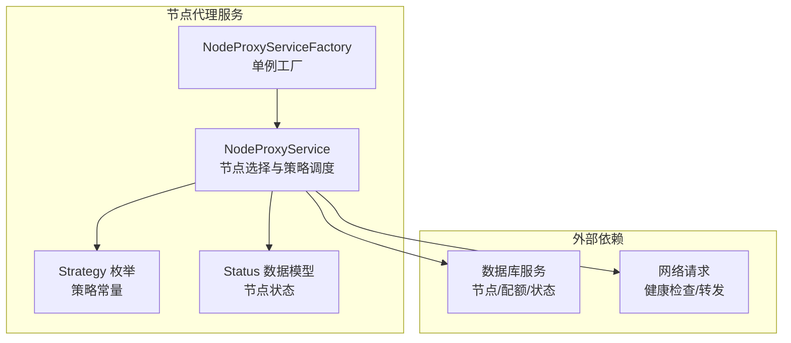
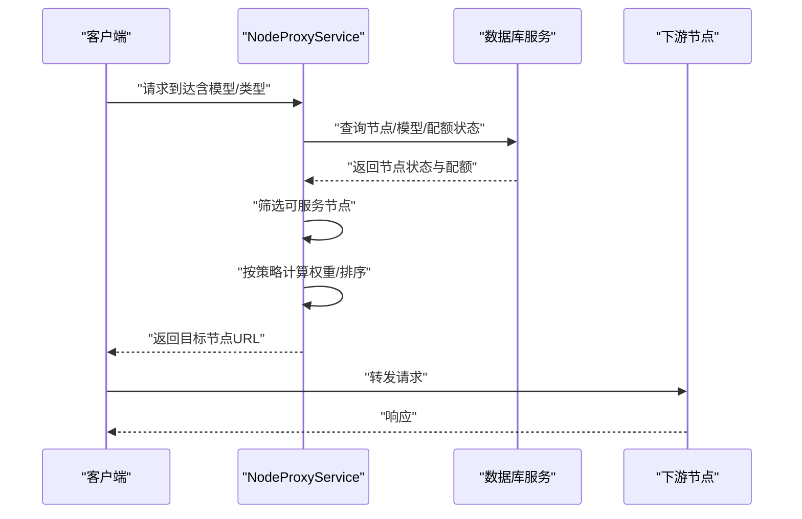
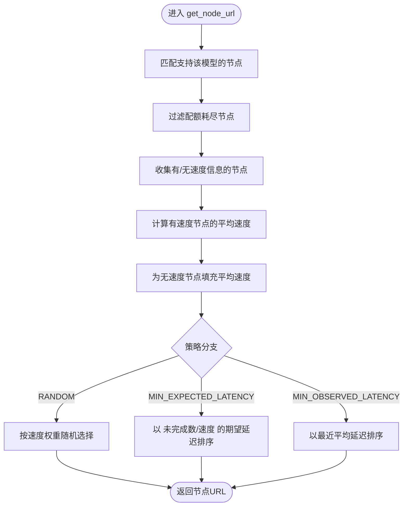
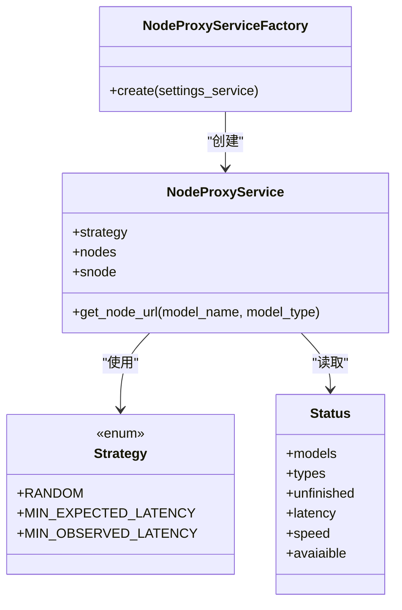

# 负载均衡策略实现

<cite>
**本文引用的文件**
- [src/apiproxy/openaiproxy/services/nodeproxy/service.py](file://src/apiproxy/openaiproxy/services/nodeproxy/service.py)
- [src/apiproxy/openaiproxy/services/nodeproxy/schemas.py](file://src/apiproxy/openaiproxy/services/nodeproxy/schemas.py)
- [src/apiproxy/openaiproxy/services/nodeproxy/constants.py](file://src/apiproxy/openaiproxy/services/nodeproxy/constants.py)
- [src/apiproxy/openaiproxy/services/nodeproxy/factory.py](file://src/apiproxy/openaiproxy/services/nodeproxy/factory.py)
</cite>

## 目录
1. [简介](#简介)
2. [项目结构](#项目结构)
3. [核心组件](#核心组件)
4. [架构总览](#架构总览)
5. [详细组件分析](#详细组件分析)
6. [依赖关系分析](#依赖关系分析)
7. [性能考量](#性能考量)
8. [故障排查指南](#故障排查指南)
9. [结论](#结论)
10. [附录](#附录)

## 简介
本文件聚焦于 NodeProxyService 的负载均衡策略实现，系统性解析三种策略：随机权重算法、最小预期延迟算法与最小观察延迟算法。文档从数学原理、数据结构、参数计算流程、算法切换与动态调整策略入手，结合代码级图示与实操建议，帮助读者在不同业务场景下选择与配置合适的策略。

## 项目结构
NodeProxyService 所在模块位于 openaiproxy 的服务层，负责节点管理、健康检查、配额控制与请求分发。负载均衡策略集中于节点选择逻辑，围绕节点状态对象与策略枚举进行调度。

图表来源
- [src/apiproxy/openaiproxy/services/nodeproxy/service.py:214-280](file://src/apiproxy/openaiproxy/services/nodeproxy/service.py#L214-L280)
- [src/apiproxy/openaiproxy/services/nodeproxy/constants.py:33-52](file://src/apiproxy/openaiproxy/services/nodeproxy/constants.py#L33-L52)
- [src/apiproxy/openaiproxy/services/nodeproxy/schemas.py:33-50](file://src/apiproxy/openaiproxy/services/nodeproxy/schemas.py#L33-L50)
- [src/apiproxy/openaiproxy/services/nodeproxy/factory.py:32-46](file://src/apiproxy/openaiproxy/services/nodeproxy/factory.py#L32-L46)

章节来源
- [src/apiproxy/openaiproxy/services/nodeproxy/service.py:214-280](file://src/apiproxy/openaiproxy/services/nodeproxy/service.py#L214-L280)
- [src/apiproxy/openaiproxy/services/nodeproxy/schemas.py:33-50](file://src/apiproxy/openaiproxy/services/nodeproxy/schemas.py#L33-L50)
- [src/apiproxy/openaiproxy/services/nodeproxy/constants.py:33-52](file://src/apiproxy/openaiproxy/services/nodeproxy/constants.py#L33-L52)
- [src/apiproxy/openaiproxy/services/nodeproxy/factory.py:32-46](file://src/apiproxy/openaiproxy/services/nodeproxy/factory.py#L32-L46)

## 核心组件
- 节点状态模型 Status：封装节点支持的模型列表、类型、未完成请求数、延迟样本队列、速度、可用性、健康检查开关、模型配额状态等。
- 策略枚举 Strategy：定义 RANDOM、MIN_EXPECTED_LATENCY、MIN_OBSERVED_LATENCY 三种策略。
- NodeProxyService：负责节点刷新、健康检查、配额控制与请求分发；其中 get_node_url 是策略入口。
- 工厂 NodeProxyServiceFactory：提供单例化创建与注入 SettingsService 的能力。

章节来源
- [src/apiproxy/openaiproxy/services/nodeproxy/schemas.py:33-50](file://src/apiproxy/openaiproxy/services/nodeproxy/schemas.py#L33-L50)
- [src/apiproxy/openaiproxy/services/nodeproxy/constants.py:33-52](file://src/apiproxy/openaiproxy/services/nodeproxy/constants.py#L33-L52)
- [src/apiproxy/openaiproxy/services/nodeproxy/service.py:988-1077](file://src/apiproxy/openaiproxy/services/nodeproxy/service.py#L988-L1077)
- [src/apiproxy/openaiproxy/services/nodeproxy/factory.py:32-46](file://src/apiproxy/openaiproxy/services/nodeproxy/factory.py#L32-L46)

## 架构总览
NodeProxyService 在每次请求前构建上下文并预占配额，随后根据策略从可用节点中选择目标节点。策略的核心在于对“可服务节点”的筛选与加权/排序，最终返回最优节点 URL。

图表来源
- [src/apiproxy/openaiproxy/services/nodeproxy/service.py:988-1077](file://src/apiproxy/openaiproxy/services/nodeproxy/service.py#L988-L1077)
- [src/apiproxy/openaiproxy/services/nodeproxy/service.py:1119-1177](file://src/apiproxy/openaiproxy/services/nodeproxy/service.py#L1119-L1177)

## 详细组件分析

### 策略入口与节点选择流程
- 入口方法：get_node_url
- 流程要点：
  - 基于模型名与类型匹配节点支持集合；
  - 过滤配额耗尽的节点；
  - 收集具备速度信息与缺失速度信息的节点；
  - 计算平均速度用于缺失速度节点的权重填充；
  - 根据策略分支执行随机权重、最小预期延迟或最小观察延迟选择。

图表来源
- [src/apiproxy/openaiproxy/services/nodeproxy/service.py:988-1077](file://src/apiproxy/openaiproxy/services/nodeproxy/service.py#L988-L1077)

章节来源
- [src/apiproxy/openaiproxy/services/nodeproxy/service.py:988-1077](file://src/apiproxy/openaiproxy/services/nodeproxy/service.py#L988-L1077)

### 随机权重算法（RANDOM）
- 数学原理
  - 将每个可服务节点的速度作为权重，进行加权随机选择。
  - 若所有速度之和非正，则退化为均匀随机。
- 参数计算
  - 速度来自节点状态对象；若缺失则用“有速度节点的平均速度”填充。
  - 权重归一化后用于 random.choices。
- 性能考量
  - 时间复杂度 O(n)，空间复杂度 O(n)（n 为候选节点数）。
  - 适合节点性能差异显著且需要均衡利用的场景。
- 适用场景
  - 吞吐优先、节点性能波动较大但有稳定速度估计时。
- 代码片段路径
  - [src/apiproxy/openaiproxy/services/nodeproxy/service.py:1037-1046](file://src/apiproxy/openaiproxy/services/nodeproxy/service.py#L1037-L1046)

章节来源
- [src/apiproxy/openaiproxy/services/nodeproxy/service.py:1037-1046](file://src/apiproxy/openaiproxy/services/nodeproxy/service.py#L1037-L1046)

### 最小预期延迟算法（MIN_EXPECTED_LATENCY）
- 数学原理
  - 以“未完成请求数 / 速度”作为期望延迟，选择延迟最小者。
  - 该指标反映当前排队等待时间，考虑了节点处理能力与积压情况。
- 参数计算
  - 未完成请求数：节点状态中的 unfinished 字段；
  - 速度：节点状态中的 speed 字段；缺失时使用“有速度节点的平均速度”。
  - 对候选索引做随机打散，避免固定顺序导致的同质化。
- 性能考量
  - 时间复杂度 O(n)，空间复杂度 O(n)。
  - 更贴近实时排队状况，适合高并发、动态变化明显的场景。
- 适用场景
  - 强调低延迟与公平性的在线推理服务。
- 代码片段路径
  - [src/apiproxy/openaiproxy/services/nodeproxy/service.py:1048-1062](file://src/apiproxy/openaiproxy/services/nodeproxy/service.py#L1048-L1062)

章节来源
- [src/apiproxy/openaiproxy/services/nodeproxy/service.py:1048-1062](file://src/apiproxy/openaiproxy/services/nodeproxy/service.py#L1048-L1062)

### 最小观察延迟算法（MIN_OBSERVED_LATENCY）
- 数学原理
  - 以“最近延迟样本的均值”作为观察延迟，选择延迟最小者。
  - 延迟样本来自节点状态中的延迟双端队列，长度由常量控制。
- 参数计算
  - 延迟样本队列：Status.latency（双端队列，最大长度由常量定义）；
  - 平均值：当队列为空时采用无穷大作为占位，确保被后续比较忽略。
- 性能考量
  - 时间复杂度 O(n)，空间复杂度 O(n)。
  - 对历史表现敏感，适合延迟相对稳定的场景。
- 适用场景
  - 延迟波动较小、历史表现可代表未来表现的服务。
- 代码片段路径
  - [src/apiproxy/openaiproxy/services/nodeproxy/service.py:1064-1074](file://src/apiproxy/openaiproxy/services/nodeproxy/service.py#L1064-L1074)

章节来源
- [src/apiproxy/openaiproxy/services/nodeproxy/service.py:1064-1074](file://src/apiproxy/openaiproxy/services/nodeproxy/service.py#L1064-L1074)

### 节点速度与延迟样本队列
- 节点速度（speed）
  - 来源：数据库查询节点指标时计算得到；若缺失则以“平均延迟倒数”推导，或沿用历史值。
- 延迟样本队列（latency）
  - 类型：双端队列，最大长度由常量定义；
  - 更新：健康检查与请求完成时会写入/更新；
  - 计算：平均延迟用于观察延迟策略与速度推导。
- 代码片段路径
  - [src/apiproxy/openaiproxy/services/nodeproxy/service.py:600-630](file://src/apiproxy/openaiproxy/services/nodeproxy/service.py#L600-L630)
  - [src/apiproxy/openaiproxy/services/nodeproxy/constants.py:29-30](file://src/apiproxy/openaiproxy/services/nodeproxy/constants.py#L29-L30)

章节来源
- [src/apiproxy/openaiproxy/services/nodeproxy/service.py:600-630](file://src/apiproxy/openaiproxy/services/nodeproxy/service.py#L600-L630)
- [src/apiproxy/openaiproxy/services/nodeproxy/constants.py:29-30](file://src/apiproxy/openaiproxy/services/nodeproxy/constants.py#L29-L30)

### 权重分配机制与动态调整
- 权重来源
  - 速度权重：直接使用节点 speed；
  - 填充权重：当节点无 speed 时，使用“有 speed 节点的平均速度”作为统一权重。
- 动态调整
  - 节点刷新：周期性从数据库拉取最新状态、速度、延迟与可用性；
  - 健康检查：定时探测节点可用性与延迟，更新状态与日志；
  - 配额标记：节点模型配额耗尽时进行短期标记，避免无效选择。
- 代码片段路径
  - [src/apiproxy/openaiproxy/services/nodeproxy/service.py:464-744](file://src/apiproxy/openaiproxy/services/nodeproxy/service.py#L464-L744)
  - [src/apiproxy/openaiproxy/services/nodeproxy/service.py:759-886](file://src/apiproxy/openaiproxy/services/nodeproxy/service.py#L759-L886)
  - [src/apiproxy/openaiproxy/services/nodeproxy/service.py:1436-1509](file://src/apiproxy/openaiproxy/services/nodeproxy/service.py#L1436-L1509)

章节来源
- [src/apiproxy/openaiproxy/services/nodeproxy/service.py:464-744](file://src/apiproxy/openaiproxy/services/nodeproxy/service.py#L464-L744)
- [src/apiproxy/openaiproxy/services/nodeproxy/service.py:759-886](file://src/apiproxy/openaiproxy/services/nodeproxy/service.py#L759-L886)
- [src/apiproxy/openaiproxy/services/nodeproxy/service.py:1436-1509](file://src/apiproxy/openaiproxy/services/nodeproxy/service.py#L1436-L1509)

### 策略切换机制
- 切换入口：构造函数中根据设置选择策略枚举；
- 切换影响：get_node_url 中的策略分支决定权重/排序逻辑；
- 配置来源：设置服务中的代理策略字段；
- 代码片段路径
  - [src/apiproxy/openaiproxy/services/nodeproxy/service.py:232-241](file://src/apiproxy/openaiproxy/services/nodeproxy/service.py#L232-L241)
  - [src/apiproxy/openaiproxy/services/nodeproxy/constants.py:39-52](file://src/apiproxy/openaiproxy/services/nodeproxy/constants.py#L39-L52)

章节来源
- [src/apiproxy/openaiproxy/services/nodeproxy/service.py:232-241](file://src/apiproxy/openaiproxy/services/nodeproxy/service.py#L232-L241)
- [src/apiproxy/openaiproxy/services/nodeproxy/constants.py:39-52](file://src/apiproxy/openaiproxy/services/nodeproxy/constants.py#L39-L52)

### 算法性能对比与场景建议
- 随机权重（RANDOM）
  - 优点：实现简单、全局均衡；
  - 缺点：对瞬时排队不敏感；
  - 适合：吞吐优先、节点性能差异明显但无需强延迟保障。
- 最小预期延迟（MIN_EXPECTED_LATENCY）
  - 优点：对排队与处理能力敏感，能引导至更空闲节点；
  - 缺点：对速度估计敏感，可能放大误差；
  - 适合：高并发、动态变化明显、追求低延迟与公平性。
- 最小观察延迟（MIN_OBSERVED_LATENCY）
  - 优点：基于历史表现，稳定性好；
  - 缺点：对突发变化反应较慢；
  - 适合：延迟波动小、历史表现稳定的服务。

[本节为通用分析，不直接引用具体代码行]

### 实际应用场景建议
- 在线推理服务：优先考虑最小预期延迟策略，以应对实时排队压力。
- 批处理/离线任务：可采用随机权重策略，提升整体吞吐。
- 稳定服务：可采用最小观察延迟策略，减少抖动。

[本节为通用分析，不直接引用具体代码行]

### 代码示例（使用方法与配置选项）
以下为策略相关的关键路径，便于定位与参考：
- 策略枚举与字符串转换
  - [src/apiproxy/openaiproxy/services/nodeproxy/constants.py:33-52](file://src/apiproxy/openaiproxy/services/nodeproxy/constants.py#L33-L52)
- 节点状态模型（含延迟队列与速度）
  - [src/apiproxy/openaiproxy/services/nodeproxy/schemas.py:33-50](file://src/apiproxy/openaiproxy/services/nodeproxy/schemas.py#L33-L50)
- 节点选择主流程（策略分支）
  - [src/apiproxy/openaiproxy/services/nodeproxy/service.py:988-1077](file://src/apiproxy/openaiproxy/services/nodeproxy/service.py#L988-L1077)
- 节点刷新与速度/延迟更新
  - [src/apiproxy/openaiproxy/services/nodeproxy/service.py:464-744](file://src/apiproxy/openaiproxy/services/nodeproxy/service.py#L464-L744)
- 健康检查与状态持久化
  - [src/apiproxy/openaiproxy/services/nodeproxy/service.py:759-886](file://src/apiproxy/openaiproxy/services/nodeproxy/service.py#L759-L886)
- 工厂与单例创建
  - [src/apiproxy/openaiproxy/services/nodeproxy/factory.py:32-46](file://src/apiproxy/openaiproxy/services/nodeproxy/factory.py#L32-L46)

章节来源
- [src/apiproxy/openaiproxy/services/nodeproxy/constants.py:33-52](file://src/apiproxy/openaiproxy/services/nodeproxy/constants.py#L33-L52)
- [src/apiproxy/openaiproxy/services/nodeproxy/schemas.py:33-50](file://src/apiproxy/openaiproxy/services/nodeproxy/schemas.py#L33-L50)
- [src/apiproxy/openaiproxy/services/nodeproxy/service.py:988-1077](file://src/apiproxy/openaiproxy/services/nodeproxy/service.py#L988-L1077)
- [src/apiproxy/openaiproxy/services/nodeproxy/service.py:464-744](file://src/apiproxy/openaiproxy/services/nodeproxy/service.py#L464-L744)
- [src/apiproxy/openaiproxy/services/nodeproxy/service.py:759-886](file://src/apiproxy/openaiproxy/services/nodeproxy/service.py#L759-L886)
- [src/apiproxy/openaiproxy/services/nodeproxy/factory.py:32-46](file://src/apiproxy/openaiproxy/services/nodeproxy/factory.py#L32-L46)

## 依赖关系分析
- NodeProxyService 依赖：
  - 策略枚举 Strategy（策略分支）；
  - 节点状态模型 Status（延迟队列、速度、可用性）；
  - 设置服务 SettingsService（策略与刷新间隔等配置）；
  - 数据库服务（节点/配额/状态查询与更新）；
  - 网络请求（健康检查）。
- 工厂 NodeProxyServiceFactory 提供单例化创建，确保全局唯一实例。

图表来源
- [src/apiproxy/openaiproxy/services/nodeproxy/service.py:214-280](file://src/apiproxy/openaiproxy/services/nodeproxy/service.py#L214-L280)
- [src/apiproxy/openaiproxy/services/nodeproxy/constants.py:33-52](file://src/apiproxy/openaiproxy/services/nodeproxy/constants.py#L33-L52)
- [src/apiproxy/openaiproxy/services/nodeproxy/schemas.py:33-50](file://src/apiproxy/openaiproxy/services/nodeproxy/schemas.py#L33-L50)
- [src/apiproxy/openaiproxy/services/nodeproxy/factory.py:32-46](file://src/apiproxy/openaiproxy/services/nodeproxy/factory.py#L32-L46)

章节来源
- [src/apiproxy/openaiproxy/services/nodeproxy/service.py:214-280](file://src/apiproxy/openaiproxy/services/nodeproxy/service.py#L214-L280)
- [src/apiproxy/openaiproxy/services/nodeproxy/constants.py:33-52](file://src/apiproxy/openaiproxy/services/nodeproxy/constants.py#L33-L52)
- [src/apiproxy/openaiproxy/services/nodeproxy/schemas.py:33-50](file://src/apiproxy/openaiproxy/services/nodeproxy/schemas.py#L33-L50)
- [src/apiproxy/openaiproxy/services/nodeproxy/factory.py:32-46](file://src/apiproxy/openaiproxy/services/nodeproxy/factory.py#L32-L46)

## 性能考量
- 时间复杂度
  - 三种策略均为 O(n)，n 为候选节点数量；在节点规模较大时，建议限制候选集或引入缓存/索引优化。
- 空间复杂度
  - 主要开销在候选列表与延迟队列；延迟队列长度受常量控制，需平衡历史窗口与内存占用。
- I/O 与锁
  - 节点刷新与健康检查涉及数据库与网络请求，需注意异步与锁竞争；当前实现使用线程与异步会话组合，应避免阻塞。
- 速度估计与延迟队列
  - 速度缺失时的填充策略会影响随机权重的公平性；延迟队列为空时的占位策略会影响观察延迟的选择稳定性。

[本节为通用分析，不直接引用具体代码行]

## 故障排查指南
- 节点不可用
  - 检查健康检查结果与可用性标志位；确认网络连通与鉴权头是否正确。
  - 参考路径：[src/apiproxy/openaiproxy/services/nodeproxy/service.py:759-886](file://src/apiproxy/openaiproxy/services/nodeproxy/service.py#L759-L886)
- 节点无速度或延迟队列为空
  - 观察刷新流程是否成功写入速度与延迟；必要时降低刷新间隔或增加健康检查频率。
  - 参考路径：[src/apiproxy/openaiproxy/services/nodeproxy/service.py:464-744](file://src/apiproxy/openaiproxy/services/nodeproxy/service.py#L464-L744)
- 随机权重不公平
  - 检查速度估计是否合理；若多数节点缺失速度，将退化为均匀随机。
  - 参考路径：[src/apiproxy/openaiproxy/services/nodeproxy/service.py:1037-1046](file://src/apiproxy/openaiproxy/services/nodeproxy/service.py#L1037-L1046)
- 最小预期延迟选择异常
  - 检查未完成请求数与速度是否同步更新；避免速度估计过旧导致误判。
  - 参考路径：[src/apiproxy/openaiproxy/services/nodeproxy/service.py:1048-1062](file://src/apiproxy/openaiproxy/services/nodeproxy/service.py#L1048-L1062)
- 最小观察延迟选择异常
  - 检查延迟队列长度与样本质量；确保样本足够覆盖近期行为。
  - 参考路径：[src/apiproxy/openaiproxy/services/nodeproxy/constants.py:29-30](file://src/apiproxy/openaiproxy/services/nodeproxy/constants.py#L29-L30)

章节来源
- [src/apiproxy/openaiproxy/services/nodeproxy/service.py:759-886](file://src/apiproxy/openaiproxy/services/nodeproxy/service.py#L759-L886)
- [src/apiproxy/openaiproxy/services/nodeproxy/service.py:464-744](file://src/apiproxy/openaiproxy/services/nodeproxy/service.py#L464-L744)
- [src/apiproxy/openaiproxy/services/nodeproxy/service.py:1037-1046](file://src/apiproxy/openaiproxy/services/nodeproxy/service.py#L1037-L1046)
- [src/apiproxy/openaiproxy/services/nodeproxy/service.py:1048-1062](file://src/apiproxy/openaiproxy/services/nodeproxy/service.py#L1048-L1062)
- [src/apiproxy/openaiproxy/services/nodeproxy/constants.py:29-30](file://src/apiproxy/openaiproxy/services/nodeproxy/constants.py#L29-L30)

## 结论
NodeProxyService 的负载均衡策略通过“节点状态 + 策略枚举”的方式实现灵活调度。随机权重强调均衡，最小预期延迟关注排队与处理能力，最小观察延迟关注历史稳定性。结合速度估计、延迟队列与健康检查，可在不同业务场景下取得良好效果。建议根据延迟敏感度与稳定性需求选择合适策略，并持续监控与调优。

[本节为总结性内容，不直接引用具体代码行]

## 附录
- 关键常量
  - 延迟队列长度：[src/apiproxy/openaiproxy/services/nodeproxy/constants.py:29-30](file://src/apiproxy/openaiproxy/services/nodeproxy/constants.py#L29-L30)
- 策略枚举与字符串转换
  - [src/apiproxy/openaiproxy/services/nodeproxy/constants.py:33-52](file://src/apiproxy/openaiproxy/services/nodeproxy/constants.py#L33-L52)
- 节点状态模型
  - [src/apiproxy/openaiproxy/services/nodeproxy/schemas.py:33-50](file://src/apiproxy/openaiproxy/services/nodeproxy/schemas.py#L33-L50)
- 工厂与单例
  - [src/apiproxy/openaiproxy/services/nodeproxy/factory.py:32-46](file://src/apiproxy/openaiproxy/services/nodeproxy/factory.py#L32-L46)

章节来源
- [src/apiproxy/openaiproxy/services/nodeproxy/constants.py:29-30](file://src/apiproxy/openaiproxy/services/nodeproxy/constants.py#L29-L30)
- [src/apiproxy/openaiproxy/services/nodeproxy/constants.py:33-52](file://src/apiproxy/openaiproxy/services/nodeproxy/constants.py#L33-L52)
- [src/apiproxy/openaiproxy/services/nodeproxy/schemas.py:33-50](file://src/apiproxy/openaiproxy/services/nodeproxy/schemas.py#L33-L50)
- [src/apiproxy/openaiproxy/services/nodeproxy/factory.py:32-46](file://src/apiproxy/openaiproxy/services/nodeproxy/factory.py#L32-L46)