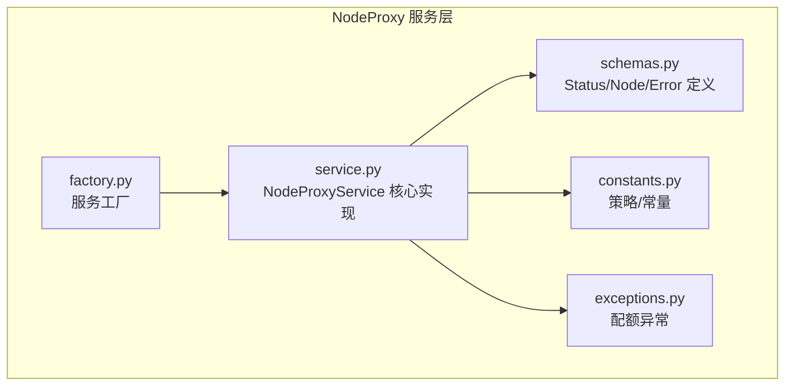
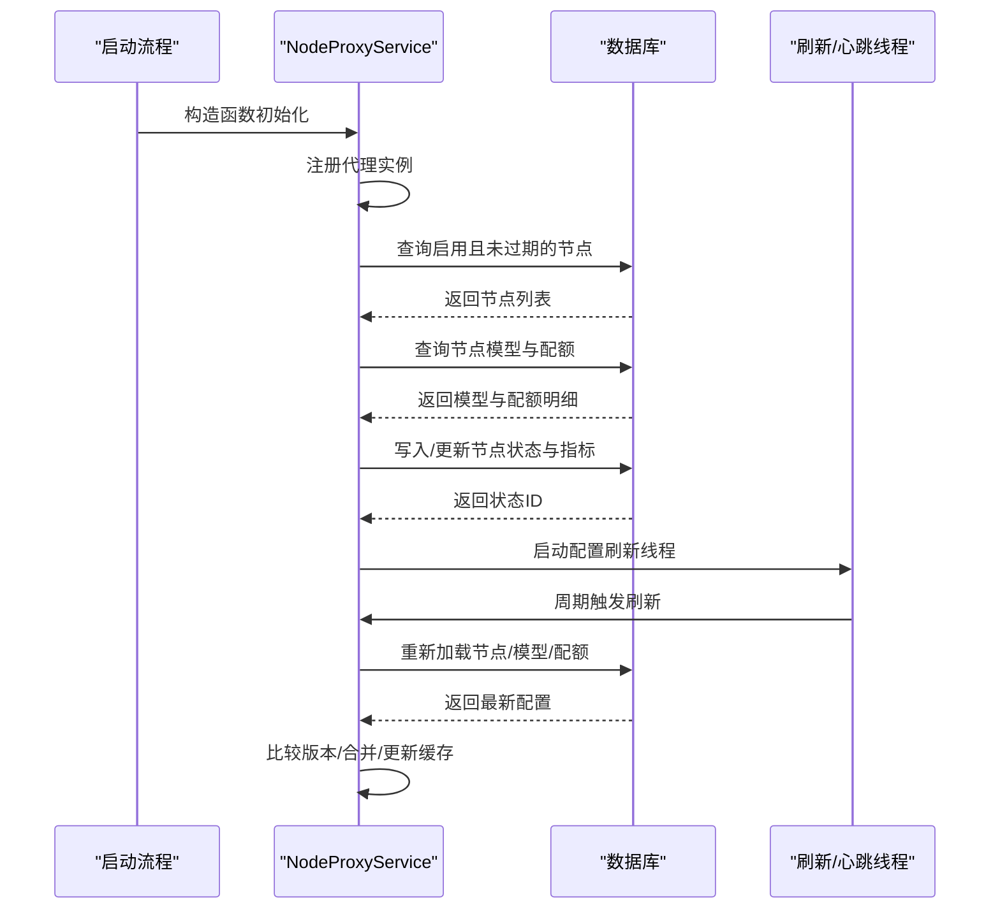
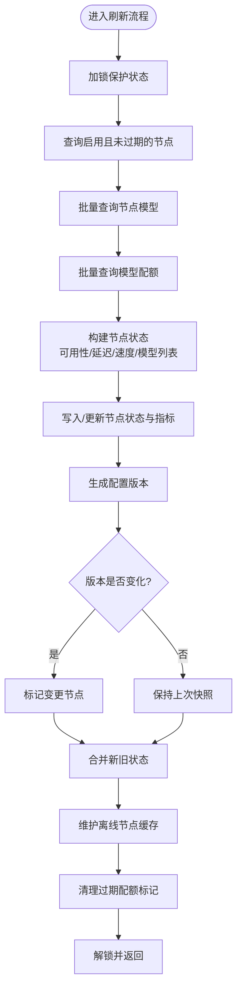
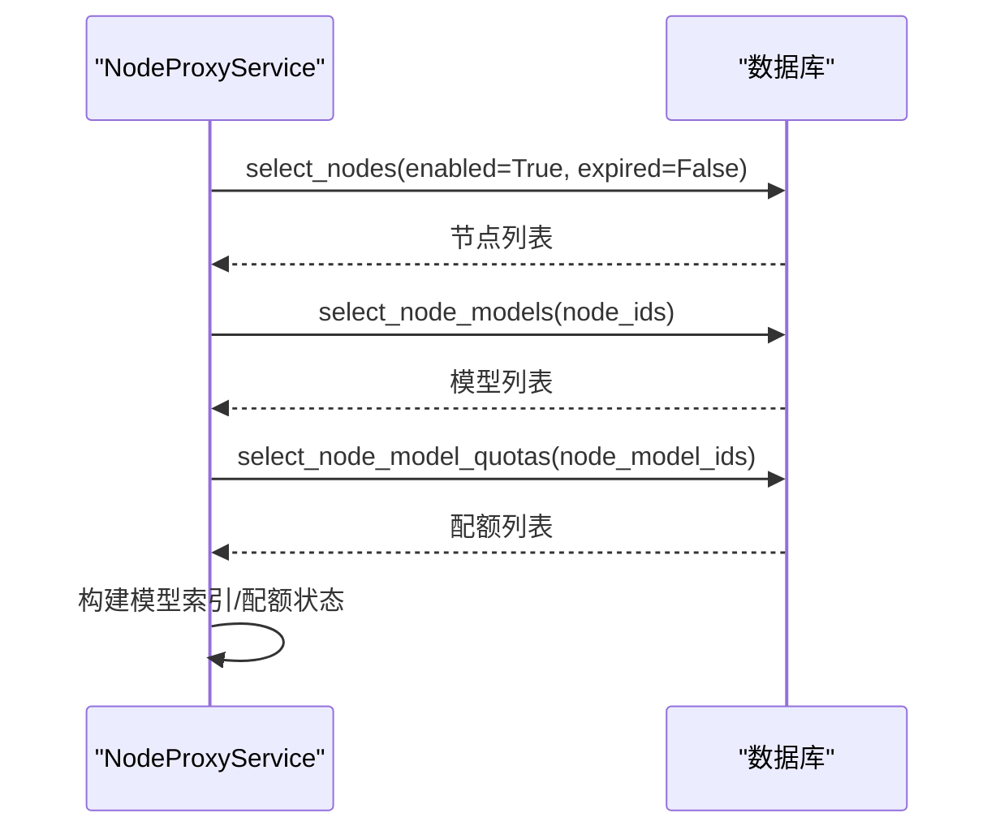
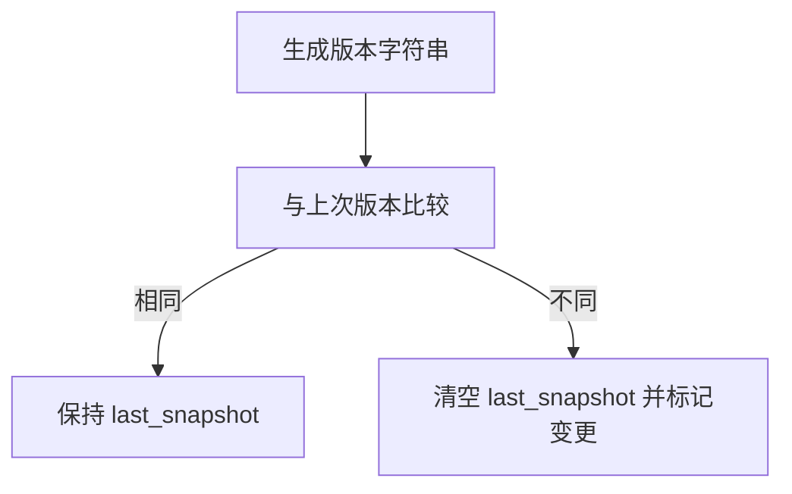
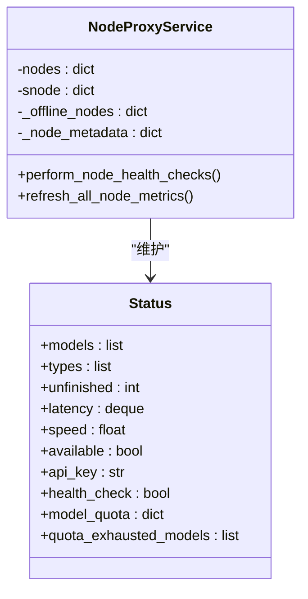
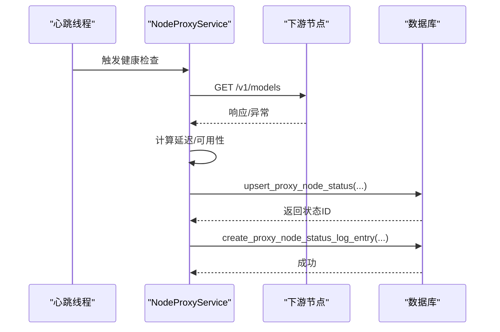
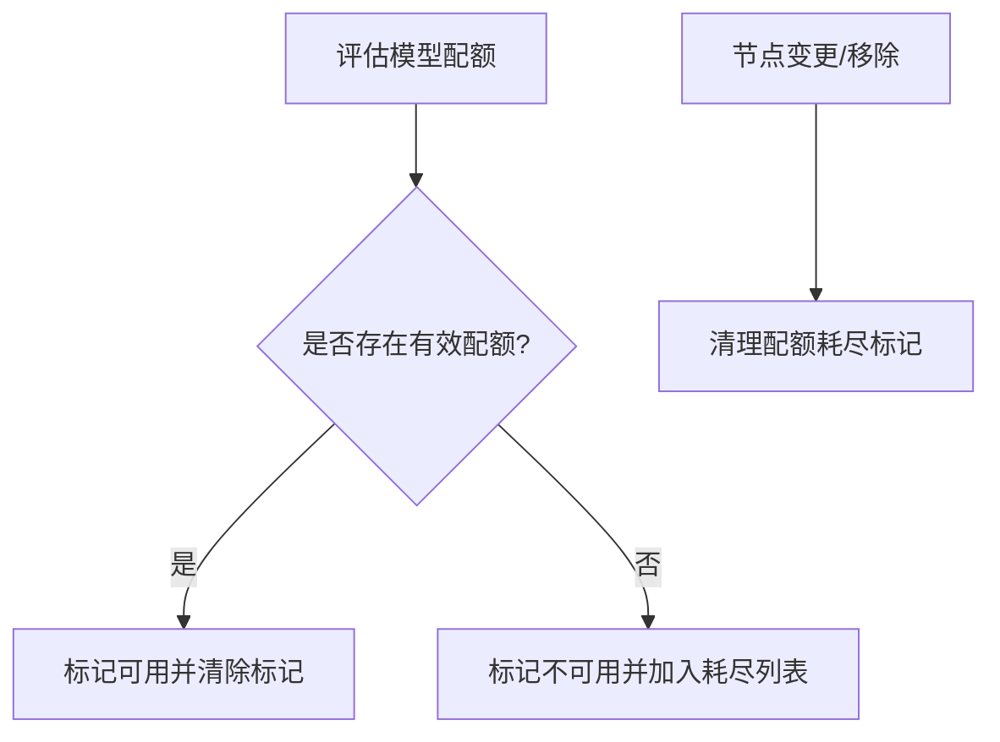
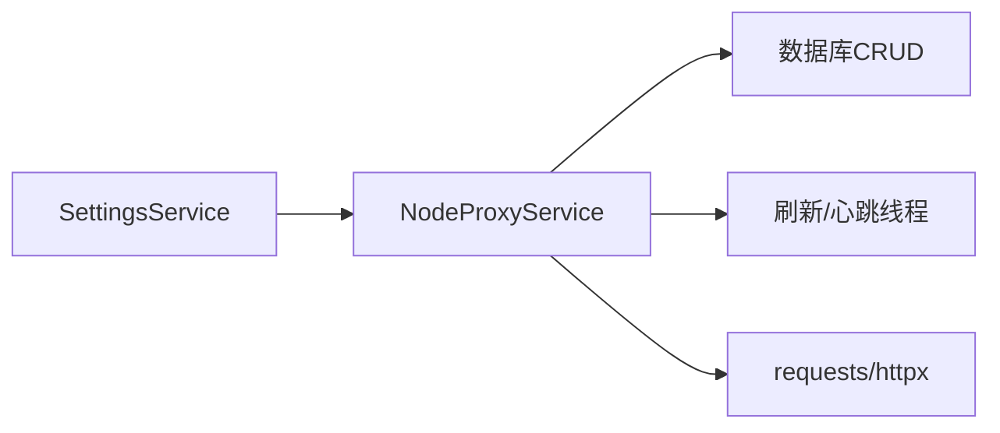

# 配置刷新机制

<cite>
**本文引用的文件**
- [service.py](file://src/apiproxy/openaiproxy/services/nodeproxy/service.py)
- [schemas.py](file://src/apiproxy/openaiproxy/services/nodeproxy/schemas.py)
- [constants.py](file://src/apiproxy/openaiproxy/services/nodeproxy/constants.py)
- [exceptions.py](file://src/apiproxy/openaiproxy/services/nodeproxy/exceptions.py)
- [factory.py](file://src/apiproxy/openaiproxy/services/nodeproxy/factory.py)
</cite>

## 目录
1. [引言](#引言)
2. [项目结构](#项目结构)
3. [核心组件](#核心组件)
4. [架构总览](#架构总览)
5. [详细组件分析](#详细组件分析)
6. [依赖分析](#依赖分析)
7. [性能考虑](#性能考虑)
8. [故障排查指南](#故障排查指南)
9. [结论](#结论)
10. [附录](#附录)

## 引言
本文件聚焦于 NodeProxyService 的“配置刷新机制”，系统性阐述以下内容：
- 刷新触发条件与执行周期
- 从数据库加载节点配置的完整流程（节点信息、模型映射、配额信息）
- 配置版本管理与变更检测
- 节点状态更新与缓存策略
- 性能优化与错误处理
- 使用示例与调试技巧

## 项目结构
NodeProxyService 所在模块位于 openaiproxy/services/nodeproxy 下，关键文件职责如下：
- service.py：实现配置刷新、节点状态维护、健康检查、配额管理等核心逻辑
- schemas.py：定义状态对象与响应模型
- constants.py：调度策略、常量（如延迟队列长度、超时时间）
- exceptions.py：配额相关异常类型
- factory.py：服务工厂，负责单例化创建 NodeProxyService

图表来源
- [service.py:1-2268](file://src/apiproxy/openaiproxy/services/nodeproxy/service.py#L1-L2268)
- [schemas.py:1-64](file://src/apiproxy/openaiproxy/services/nodeproxy/schemas.py#L1-L64)
- [constants.py:1-69](file://src/apiproxy/openaiproxy/services/nodeproxy/constants.py#L1-L69)
- [exceptions.py:1-66](file://src/apiproxy/openaiproxy/services/nodeproxy/exceptions.py#L1-L66)
- [factory.py:1-47](file://src/apiproxy/openaiproxy/services/nodeproxy/factory.py#L1-L47)

章节来源
- [service.py:1-2268](file://src/apiproxy/openaiproxy/services/nodeproxy/service.py#L1-L2268)
- [schemas.py:1-64](file://src/apiproxy/openaiproxy/services/nodeproxy/schemas.py#L1-L64)
- [constants.py:1-69](file://src/apiproxy/openaiproxy/services/nodeproxy/constants.py#L1-L69)
- [exceptions.py:1-66](file://src/apiproxy/openaiproxy/services/nodeproxy/exceptions.py#L1-L66)
- [factory.py:1-47](file://src/apiproxy/openaiproxy/services/nodeproxy/factory.py#L1-L47)

## 核心组件
- NodeProxyService：负责节点配置的周期性刷新、节点可用性健康检查、节点指标更新、配额预占与结算、请求日志记录与清理等
- Status：描述节点当前状态（支持模型列表、类型、未完成请求数、延迟样本、速度、可用性、API Key、健康检查开关、模型配额状态等）
- 策略与常量：支持随机、最小预期延迟、最小观测延迟三种调度策略；定义延迟样本队列长度、读超时等
- 异常体系：针对 API Key 配额、应用配额、节点模型配额、北向配额处理失败进行分类抛错

章节来源
- [service.py:214-281](file://src/apiproxy/openaiproxy/services/nodeproxy/service.py#L214-L281)
- [schemas.py:33-50](file://src/apiproxy/openaiproxy/services/nodeproxy/schemas.py#L33-L50)
- [constants.py:33-52](file://src/apiproxy/openaiproxy/services/nodeproxy/constants.py#L33-L52)
- [exceptions.py:32-66](file://src/apiproxy/openaiproxy/services/nodeproxy/exceptions.py#L32-L66)

## 架构总览
NodeProxyService 在启动时会：
- 注册代理实例（持久化到数据库）
- 初始化从数据库加载节点配置
- 启动配置刷新线程与心跳线程
- 周期性刷新节点配置、健康检查、指标更新与日志清理

图表来源
- [service.py:256-281](file://src/apiproxy/openaiproxy/services/nodeproxy/service.py#L256-L281)
- [service.py:453-462](file://src/apiproxy/openaiproxy/services/nodeproxy/service.py#L453-L462)
- [service.py:464-748](file://src/apiproxy/openaiproxy/services/nodeproxy/service.py#L464-L748)

## 详细组件分析

### 配置刷新触发条件与执行流程
- 触发条件
  - 启动时立即执行一次初始化加载
  - 后续由独立线程按设定间隔循环触发
- 执行流程
  - 加锁保护内部状态
  - 从数据库查询启用且未过期的节点
  - 并行查询节点模型与模型配额
  - 计算每个节点的可用性、延迟样本、速度
  - 写入/更新节点状态与指标
  - 构建配置版本并对比变更
  - 合并新旧状态，更新在线节点集合与离线节点缓存
  - 清理过期配额标记
  - 记录变更日志

图表来源
- [service.py:464-748](file://src/apiproxy/openaiproxy/services/nodeproxy/service.py#L464-L748)
- [service.py:446-452](file://src/apiproxy/openaiproxy/services/nodeproxy/service.py#L446-L452)

章节来源
- [service.py:453-462](file://src/apiproxy/openaiproxy/services/nodeproxy/service.py#L453-L462)
- [service.py:464-748](file://src/apiproxy/openaiproxy/services/nodeproxy/service.py#L464-L748)

### 数据库加载节点配置：节点信息、模型映射与配额信息
- 节点信息
  - 查询 enabled=True 且 expired=False 的节点
  - 获取节点 URL、健康检查开关、API Key（尝试解密）
- 模型映射
  - 依据节点 ID 批量查询启用的模型，构建模型名到模型 ID 的索引
  - 维护模型名与类型的小写规范化映射
- 配额信息
  - 依据模型 ID 批量查询配额条目
  - 对每个模型评估配额状态（是否可用、是否跟踪）
  - 记录配额耗尽模型详情，用于后续过滤

图表来源
- [service.py:471-506](file://src/apiproxy/openaiproxy/services/nodeproxy/service.py#L471-L506)
- [service.py:532-580](file://src/apiproxy/openaiproxy/services/nodeproxy/service.py#L532-L580)
- [service.py:552-579](file://src/apiproxy/openaiproxy/services/nodeproxy/service.py#L552-L579)

章节来源
- [service.py:471-506](file://src/apiproxy/openaiproxy/services/nodeproxy/service.py#L471-L506)
- [service.py:532-580](file://src/apiproxy/openaiproxy/services/nodeproxy/service.py#L532-L580)
- [service.py:552-579](file://src/apiproxy/openaiproxy/services/nodeproxy/service.py#L552-L579)

### 配置版本管理与变更检测机制
- 版本生成规则
  - 基于节点 updated_at 时间戳、enabled 标志、模型名列表拼接生成版本字符串
- 变更检测
  - 将当前版本与上次元数据中的版本比较
  - 若不同则标记该节点为“配置已变更”，清空其上次快照
  - 合并阶段对变更节点强制清空快照，避免使用过期指标

图表来源
- [service.py:446-452](file://src/apiproxy/openaiproxy/services/nodeproxy/service.py#L446-L452)
- [service.py:658-677](file://src/apiproxy/openaiproxy/services/nodeproxy/service.py#L658-L677)
- [service.py:723-726](file://src/apiproxy/openaiproxy/services/nodeproxy/service.py#L723-L726)

章节来源
- [service.py:446-452](file://src/apiproxy/openaiproxy/services/nodeproxy/service.py#L446-L452)
- [service.py:658-677](file://src/apiproxy/openaiproxy/services/nodeproxy/service.py#L658-L677)
- [service.py:723-726](file://src/apiproxy/openaiproxy/services/nodeproxy/service.py#L723-L726)

### 节点状态更新逻辑与缓存策略
- 状态对象
  - Status：包含 models、types、unfinished、latency、speed、available、api_key、health_check、model_quota、quota_exhausted_models
- 缓存结构
  - snode：所有节点的实时状态（含离线）
  - nodes：仅在线且可服务的节点
  - _offline_nodes：离线节点快照，用于健康检查失败或不可用时的临时状态
  - _node_metadata：节点元数据，包含 node_id、config_version、status_id、last_snapshot、removed、model_index
- 更新逻辑
  - 健康检查通过且有模型时加入 nodes；否则从 nodes 移除
  - 离线时保留快照并写入 _offline_nodes
  - 元数据中记录 status_id 与 last_snapshot，用于后续持久化与增量更新

图表来源
- [schemas.py:33-50](file://src/apiproxy/openaiproxy/services/nodeproxy/schemas.py#L33-L50)
- [service.py:817-886](file://src/apiproxy/openaiproxy/services/nodeproxy/service.py#L817-L886)
- [service.py:974-986](file://src/apiproxy/openaiproxy/services/nodeproxy/service.py#L974-L986)

章节来源
- [schemas.py:33-50](file://src/apiproxy/openaiproxy/services/nodeproxy/schemas.py#L33-L50)
- [service.py:817-886](file://src/apiproxy/openaiproxy/services/nodeproxy/service.py#L817-L886)
- [service.py:974-986](file://src/apiproxy/openaiproxy/services/nodeproxy/service.py#L974-L986)

### 健康检查与心跳控制
- 心跳线程
  - 按健康检查间隔周期执行
  - 对需要健康检查的节点发起 GET 请求，计算延迟并更新状态
- 结果持久化
  - 将可用性、延迟、错误信息写入节点状态日志
  - 更新元数据中的 status_id 与 last_snapshot

图表来源
- [service.py:122-135](file://src/apiproxy/openaiproxy/services/nodeproxy/service.py#L122-L135)
- [service.py:759-802](file://src/apiproxy/openaiproxy/services/nodeproxy/service.py#L759-L802)
- [service.py:887-942](file://src/apiproxy/openaiproxy/services/nodeproxy/service.py#L887-L942)

章节来源
- [service.py:122-135](file://src/apiproxy/openaiproxy/services/nodeproxy/service.py#L122-L135)
- [service.py:759-802](file://src/apiproxy/openaiproxy/services/nodeproxy/service.py#L759-L802)
- [service.py:887-942](file://src/apiproxy/openaiproxy/services/nodeproxy/service.py#L887-L942)

### 配额评估与变更清理
- 配额评估
  - 对每个模型的配额条目判断是否过期、是否超出限制
  - 若存在有效配额则标记可用，否则标记为不可用并记录到 quota_exhausted_models
- 变更清理
  - 当节点被移除、不在当前集合或配置发生变更时，清理其配额耗尽标记

图表来源
- [service.py:1412-1435](file://src/apiproxy/openaiproxy/services/nodeproxy/service.py#L1412-L1435)
- [service.py:1436-1481](file://src/apiproxy/openaiproxy/services/nodeproxy/service.py#L1436-L1481)
- [service.py:1510-1521](file://src/apiproxy/openaiproxy/services/nodeproxy/service.py#L1510-L1521)

章节来源
- [service.py:1412-1435](file://src/apiproxy/openaiproxy/services/nodeproxy/service.py#L1412-L1435)
- [service.py:1436-1481](file://src/apiproxy/openaiproxy/services/nodeproxy/service.py#L1436-L1481)
- [service.py:1510-1521](file://src/apiproxy/openaiproxy/services/nodeproxy/service.py#L1510-L1521)

### 调度策略与节点选择
- 支持策略
  - 随机：按速度加权随机
  - 最小预期延迟：基于未完成请求数与速度估算延迟
  - 最小观测延迟：基于历史延迟样本均值
- 过滤逻辑
  - 仅在 nodes 中选择
  - 跳过配额耗尽的节点
  - 优先选择有速度信息的节点，否则回退到平均速度

章节来源
- [constants.py:33-52](file://src/apiproxy/openaiproxy/services/nodeproxy/constants.py#L33-L52)
- [service.py:988-1077](file://src/apiproxy/openaiproxy/services/nodeproxy/service.py#L988-L1077)

### 日志与清理任务
- 请求日志
  - 记录请求开始与结束，包含时间戳、延迟、token 数量、错误信息等
- 指标刷新
  - 周期性刷新节点的未完成请求数、平均延迟、速度与延迟样本
- 过期清理
  - 删除过期节点状态记录
  - 清理过期节点状态日志
  - 重试失败但非处理中的节点状态日志

章节来源
- [service.py:1594-1637](file://src/apiproxy/openaiproxy/services/nodeproxy/service.py#L1594-L1637)
- [service.py:1647-1725](file://src/apiproxy/openaiproxy/services/nodeproxy/service.py#L1647-L1725)
- [service.py:1727-1796](file://src/apiproxy/openaiproxy/services/nodeproxy/service.py#L1727-L1796)
- [service.py:1802-1879](file://src/apiproxy/openaiproxy/services/nodeproxy/service.py#L1802-L1879)
- [service.py:2132-2159](file://src/apiproxy/openaiproxy/services/nodeproxy/service.py#L2132-L2159)
- [service.py:2067-2092](file://src/apiproxy/openaiproxy/services/nodeproxy/service.py#L2067-L2092)

## 依赖分析
- 组件耦合
  - NodeProxyService 依赖 SettingsService 提供配置（刷新间隔、健康检查间隔、实例 ID 等）
  - 通过异步数据库会话访问 CRUD 接口，加载节点、模型、配额与状态
  - 使用线程与事件控制刷新与心跳线程生命周期
- 外部依赖
  - requests/httpx 用于与下游节点通信
  - FastAPI 的 BackgroundTasks 用于后台收尾

图表来源
- [service.py:232-252](file://src/apiproxy/openaiproxy/services/nodeproxy/service.py#L232-L252)
- [service.py:268-281](file://src/apiproxy/openaiproxy/services/nodeproxy/service.py#L268-L281)

章节来源
- [service.py:232-252](file://src/apiproxy/openaiproxy/services/nodeproxy/service.py#L232-L252)
- [service.py:268-281](file://src/apiproxy/openaiproxy/services/nodeproxy/service.py#L268-L281)

## 性能考虑
- 批量查询
  - 节点、模型、配额采用批量查询减少数据库往返
- 延迟样本与速度
  - 使用固定长度队列维护延迟样本，避免内存膨胀
  - 优先使用实时速度，缺失时通过平均延迟反推
- 刷新与心跳
  - 刷新间隔与健康检查间隔可配置，避免过度轮询
- 错误降级
  - 健康检查失败不影响主流程，仅更新可用性标志与日志

[本节为通用性能建议，不直接分析具体文件]

## 故障排查指南
- 刷新失败
  - 现象：日志出现“从数据库刷新节点配置失败”
  - 排查：检查数据库连接、权限、网络；确认刷新线程未退出
- 健康检查异常
  - 现象：节点可用性频繁波动
  - 排查：检查下游节点可达性、超时设置、API Key 是否正确
- 配额问题
  - 现象：节点模型配额耗尽导致请求失败
  - 排查：确认配额评估逻辑、过期时间、北向配额预占/结算是否成功
- 日志清理
  - 现象：节点状态日志积压
  - 排查：确认过期清理任务与失败日志重试任务是否正常执行

章节来源
- [service.py:457-458](file://src/apiproxy/openaiproxy/services/nodeproxy/service.py#L457-L458)
- [service.py:789-792](file://src/apiproxy/openaiproxy/services/nodeproxy/service.py#L789-L792)
- [service.py:1176-1177](file://src/apiproxy/openaiproxy/services/nodeproxy/service.py#L1176-L1177)
- [service.py:2067-2092](file://src/apiproxy/openaiproxy/services/nodeproxy/service.py#L2067-L2092)

## 结论
NodeProxyService 的配置刷新机制通过“版本化配置 + 批量查询 + 线程驱动”的方式，实现了对节点配置、模型映射与配额状态的高效同步与一致性保障。配合健康检查、指标刷新与日志清理，形成闭环的可观测与可恢复能力。实际部署中应关注刷新与健康检查间隔、数据库负载与日志保留策略，确保系统稳定与性能平衡。

[本节为总结性内容，不直接分析具体文件]

## 附录

### 使用示例与调试技巧
- 初始化与启动
  - 通过工厂创建 NodeProxyService 实例，内部自动完成注册与首次加载
  - 刷新线程与心跳线程在构造函数中启动
- 关键参数
  - 刷新间隔：refresh_interval
  - 健康检查间隔：health_internval
  - 日志保留天数：nodelogs_hold_days
- 调试要点
  - 查看刷新日志：新增/移除节点数量
  - 检查配置版本：同一节点配置未变化时不会重建快照
  - 观察离线节点缓存：健康检查失败后的临时状态
  - 核对配额标记：节点模型配额耗尽的 TTL 与清理时机

章节来源
- [factory.py:43-46](file://src/apiproxy/openaiproxy/services/nodeproxy/factory.py#L43-L46)
- [service.py:244-246](file://src/apiproxy/openaiproxy/services/nodeproxy/service.py#L244-L246)
- [service.py:739-743](file://src/apiproxy/openaiproxy/services/nodeproxy/service.py#L739-L743)
- [service.py:661-665](file://src/apiproxy/openaiproxy/services/nodeproxy/service.py#L661-L665)
- [service.py:718-721](file://src/apiproxy/openaiproxy/services/nodeproxy/service.py#L718-L721)
- [service.py:1450-1459](file://src/apiproxy/openaiproxy/services/nodeproxy/service.py#L1450-L1459)