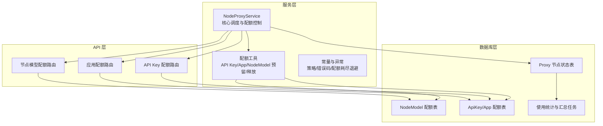
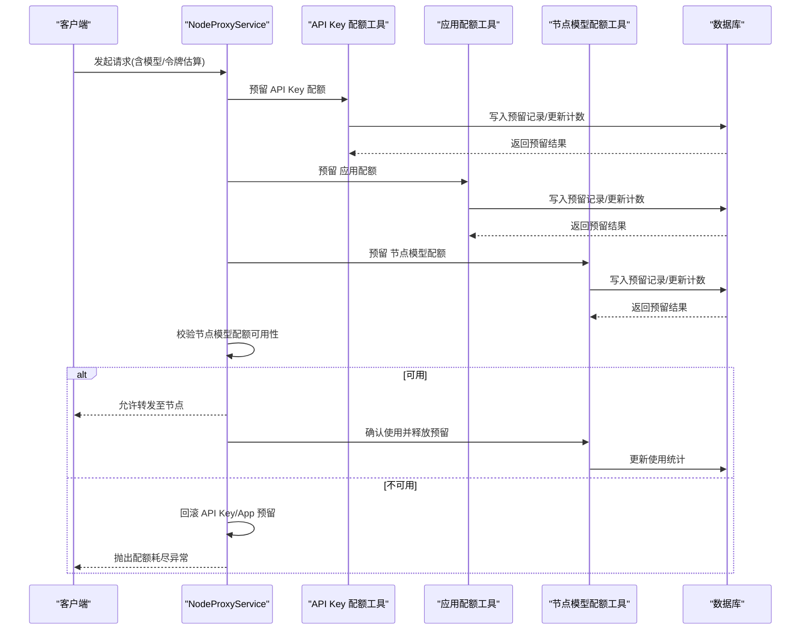
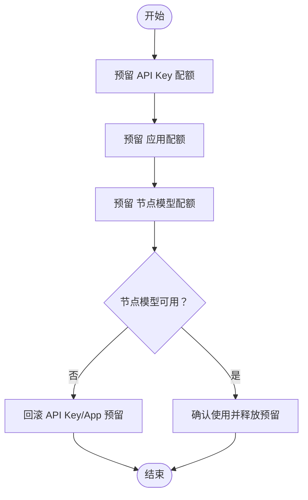
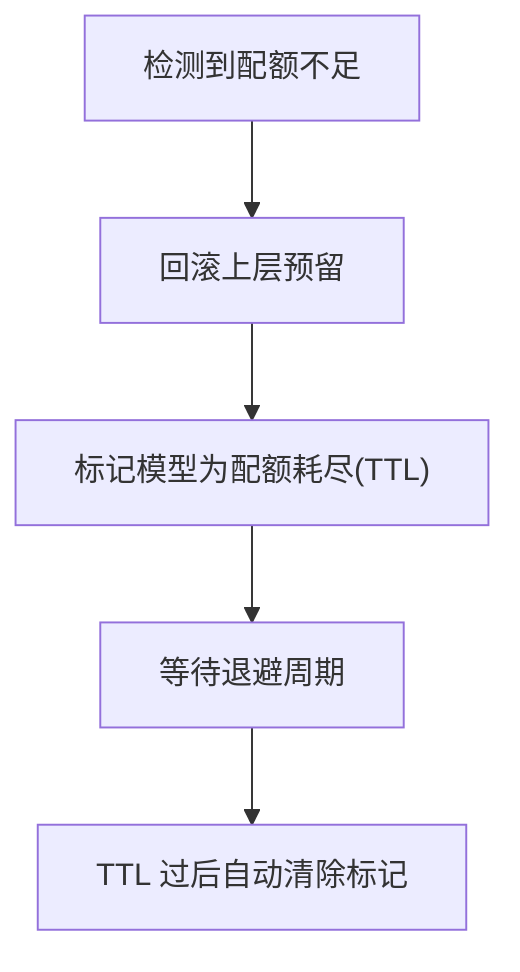
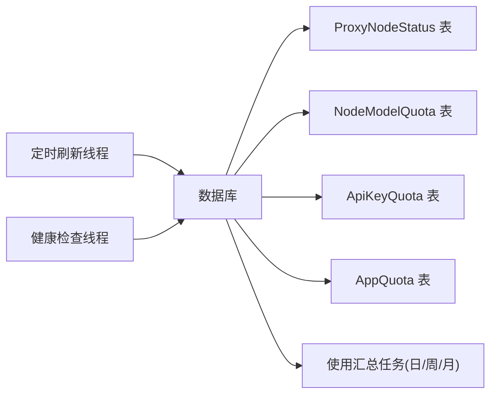
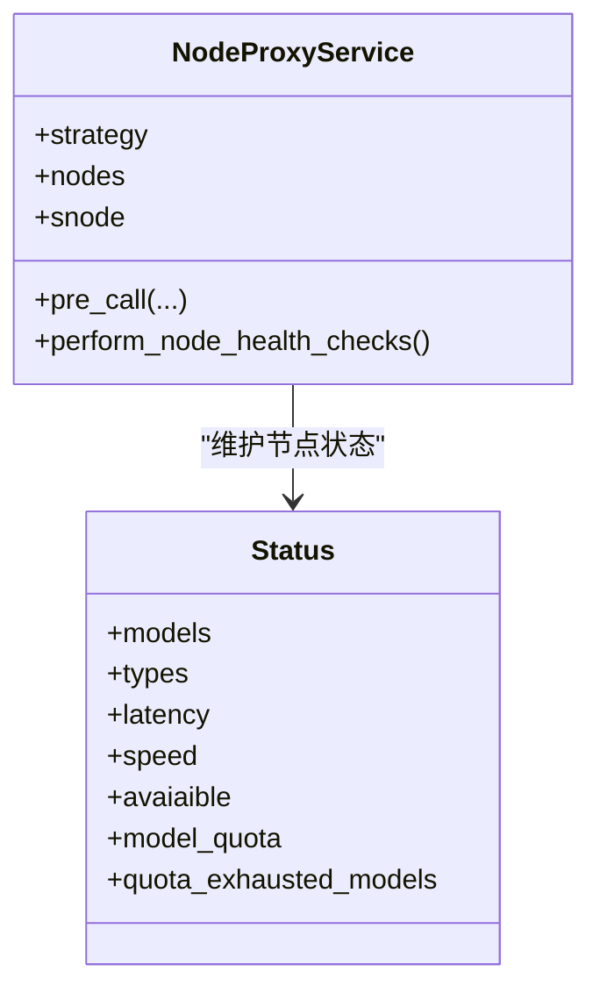
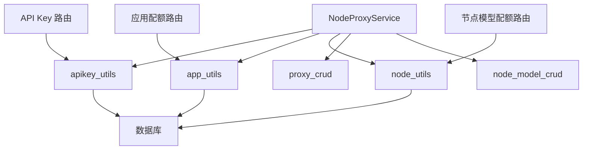
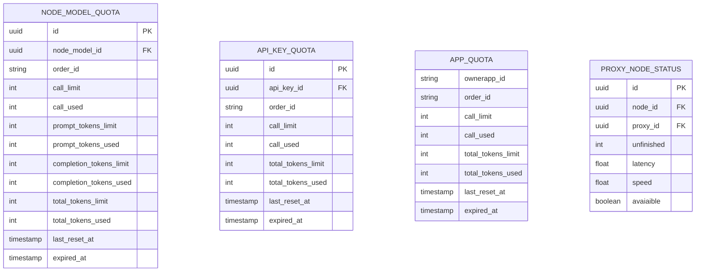

# 配额管理系统

<cite>
**本文引用的文件**
- [service.py](file://src/apiproxy/openaiproxy/services/nodeproxy/service.py)
- [schemas.py](file://src/apiproxy/openaiproxy/services/nodeproxy/schemas.py)
- [constants.py](file://src/apiproxy/openaiproxy/services/nodeproxy/constants.py)
- [exceptions.py](file://src/apiproxy/openaiproxy/services/nodeproxy/exceptions.py)
- [apikey_quotas.py](file://src/apiproxy/openaiproxy/api/apikey_quotas.py)
- [app_quotas.py](file://src/apiproxy/openaiproxy/api/app_quotas.py)
- [node_model_quotas.py](file://src/apiproxy/openaiproxy/api/node_model_quotas.py)
- [apikey_utils.py](file://src/apiproxy/openaiproxy/services/database/models/apikey/utils.py)
- [app_utils.py](file://src/apiproxy/openaiproxy/services/database/models/app/utils.py)
- [node_utils.py](file://src/apiproxy/openaiproxy/services/database/models/node/utils.py)
- [proxy_crud.py](file://src/apiproxy/openaiproxy/services/database/models/proxy/crud.py)
- [proxy_utils.py](file://src/apiproxy/openaiproxy/services/database/models/proxy/utils.py)
- [proxy_model.py](file://src/apiproxy/openaiproxy/services/database/models/proxy/model.py)
- [node_model_crud.py](file://src/apiproxy/openaiproxy/services/database/models/node/crud.py)
- [node_model_model.py](file://src/apiproxy/openaiproxy/services/database/models/node/model.py)
- [apikey_crud.py](file://src/apiproxy/openaiproxy/services/database/models/apikey/crud.py)
- [app_crud.py](file://src/apiproxy/openaiproxy/services/database/models/app/crud.py)
- [daily_usage_rollup.py](file://src/apiproxy/openaiproxy/alembic/versions/bafe420807ac_daily_and_weekly_usage_rollup.py)
- [monthly_usage_rollup.py](file://src/apiproxy/openaiproxy/alembic/versions/c2a5c7e5f3b1_apikey_security_and_monthly_rollup.py)
</cite>

## 目录
1. [简介](#简介)
2. [项目结构](#项目结构)
3. [核心组件](#核心组件)
4. [架构总览](#架构总览)
5. [详细组件分析](#详细组件分析)
6. [依赖关系分析](#依赖关系分析)
7. [性能考虑](#性能考虑)
8. [故障排查指南](#故障排查指南)
9. [结论](#结论)
10. [附录](#附录)

## 简介
本文件针对 NodeProxyService 的三层配额管理体系进行深入技术文档化，涵盖 API Key 配额、应用配额与节点模型配额的实现原理，详细说明配额预留、使用统计与释放机制，以及配额耗尽时的处理策略（回滚与退避）、状态持久化与同步机制、配额计算规则与时间窗口管理，并结合实际代码路径提供使用示例与异常处理建议。同时解释配额与负载均衡策略的协同工作机制。

## 项目结构
NodeProxyService 的配额管理涉及服务层、API 层、数据库模型与 CRUD 工具层，形成“请求前检查 → 三层配额预留 → 节点模型配额校验 → 执行请求 → 使用统计与释放”的完整闭环。

图表来源
- [service.py:214-800](file://src/apiproxy/openaiproxy/services/nodeproxy/service.py#L214-L800)
- [apikey_quotas.py:1-326](file://src/apiproxy/openaiproxy/api/apikey_quotas.py#L1-L326)
- [app_quotas.py:1-309](file://src/apiproxy/openaiproxy/api/app_quotas.py#L1-L309)
- [node_model_quotas.py:1-341](file://src/apiproxy/openaiproxy/api/node_model_quotas.py#L1-L341)

章节来源
- [service.py:214-800](file://src/apiproxy/openaiproxy/services/nodeproxy/service.py#L214-L800)
- [schemas.py:33-64](file://src/apiproxy/openaiproxy/services/nodeproxy/schemas.py#L33-L64)

## 核心组件
- NodeProxyService：负责节点发现、健康检查、负载均衡与三层配额控制的协调器。
- 配额工具模块：封装 API Key、应用与节点模型配额的预留、确认与回滚逻辑。
- API 路由：提供配额的增删改查与使用记录查询接口。
- 数据模型与 CRUD：定义配额实体、使用记录及汇总任务。
- 常量与异常：定义配额策略、错误码与配额耗尽退避策略。

章节来源
- [service.py:214-800](file://src/apiproxy/openaiproxy/services/nodeproxy/service.py#L214-L800)
- [constants.py](file://src/apiproxy/openaiproxy/services/nodeproxy/constants.py)
- [exceptions.py](file://src/apiproxy/openaiproxy/services/nodeproxy/exceptions.py)

## 架构总览
三层配额控制在请求进入节点前完成，确保资源使用的可控性与可审计性。整体流程如下：

图表来源
- [service.py:282-368](file://src/apiproxy/openaiproxy/services/nodeproxy/service.py#L282-L368)
- [apikey_utils.py](file://src/apiproxy/openaiproxy/services/database/models/apikey/utils.py)
- [app_utils.py](file://src/apiproxy/openaiproxy/services/database/models/app/utils.py)
- [node_utils.py](file://src/apiproxy/openaiproxy/services/database/models/node/utils.py)

## 详细组件分析

### 1) 三层配额控制机制
- API Key 配额：面向调用方密钥的全局限额，支持调用次数与总令牌数限制。
- 应用配额：面向业务应用的限额，通常按 ownerapp_id 维度隔离。
- 节点模型配额：面向具体节点上的模型维度限额，支持独立的调用次数与令牌限制。

实现要点：
- 请求前预留：在 pre_call 中依次调用三层预留逻辑。
- 节点模型校验：在确定 node_model_id 后，检查该模型是否仍有配额。
- 失败回滚：任一层失败或节点模型不可用时，回滚已预留的上层配额。
- 成功释放：请求完成后确认使用并释放预留记录。

章节来源
- [service.py:282-368](file://src/apiproxy/openaiproxy/services/nodeproxy/service.py#L282-L368)
- [apikey_utils.py](file://src/apiproxy/openaiproxy/services/database/models/apikey/utils.py)
- [app_utils.py](file://src/apiproxy/openaiproxy/services/database/models/app/utils.py)
- [node_utils.py](file://src/apiproxy/openaiproxy/services/database/models/node/utils.py)

### 2) 配额预留、使用统计与释放机制
- 预留阶段：调用对应 utils 的 reserve_* 方法，写入预留记录并原子性增加使用计数。
- 使用统计：通过定时任务对日/周/月使用情况进行汇总，便于报表与审计。
- 释放阶段：调用 finalize_* 方法，将预留转为正式使用记录并更新计数。

图表来源
- [service.py:314-367](file://src/apiproxy/openaiproxy/services/nodeproxy/service.py#L314-L367)
- [apikey_utils.py](file://src/apiproxy/openaiproxy/services/database/models/apikey/utils.py)
- [app_utils.py](file://src/apiproxy/openaiproxy/services/database/models/app/utils.py)
- [node_utils.py](file://src/apiproxy/openaiproxy/services/database/models/node/utils.py)

### 3) 配额耗尽时的处理策略
- 回滚机制：当节点模型配额不足或抛出异常时，立即回滚上层 API Key 与应用配额的预留。
- 退避策略：将该模型标记为“配额耗尽”，并在固定 TTL 内（默认 300 秒）避免调度到该模型，降低热点争用。
- 异常类型：分别抛出 API Key 配额超限、应用配额超限与节点模型配额超限异常。

图表来源
- [service.py:332-357](file://src/apiproxy/openaiproxy/services/nodeproxy/service.py#L332-L357)
- [constants.py](file://src/apiproxy/openaiproxy/services/nodeproxy/constants.py)

章节来源
- [service.py:119-120](file://src/apiproxy/openaiproxy/services/nodeproxy/service.py#L119-L120)
- [exceptions.py](file://src/apiproxy/openaiproxy/services/nodeproxy/exceptions.py)

### 4) 配额状态的持久化与同步机制
- 状态存储：节点状态与配额信息存储于数据库，包括 ProxyNodeStatus、NodeModelQuota、ApiKeyQuota、AppQuota 等。
- 同步方式：通过定时刷新线程从数据库拉取最新配置与配额状态；健康检查线程定期探测节点可用性并更新状态。
- 汇总任务：通过 Alembic 版本迁移脚本建立日/周/月使用汇总任务，保证统计口径一致。

图表来源
- [service.py:453-744](file://src/apiproxy/openaiproxy/services/nodeproxy/service.py#L453-L744)
- [proxy_crud.py](file://src/apiproxy/openaiproxy/services/database/models/proxy/crud.py)
- [proxy_utils.py](file://src/apiproxy/openaiproxy/services/database/models/proxy/utils.py)
- [daily_usage_rollup.py](file://src/apiproxy/openaiproxy/alembic/versions/bafe420807ac_daily_and_weekly_usage_rollup.py)
- [monthly_usage_rollup.py](file://src/apiproxy/openaiproxy/alembic/versions/c2a5c7e5f3b1_apikey_security_and_monthly_rollup.py)

### 5) 配额计算规则与时间窗口管理
- 计数字段：调用次数（call_used）、提示令牌数（prompt_tokens_used）、补全令牌数（completion_tokens_used）、总令牌数（total_tokens_used）。
- 时间窗口：支持 last_reset_at 控制重置时间，配合每日/每周/每月汇总任务实现周期性清零与统计。
- 模型维度：节点模型配额支持按模型名称与类型组合进行独立配额管理。

章节来源
- [node_model_quotas.py:155-170](file://src/apiproxy/openaiproxy/api/node_model_quotas.py#L155-L170)
- [apikey_quotas.py:153-164](file://src/apiproxy/openaiproxy/api/apikey_quotas.py#L153-L164)
- [app_quotas.py:138-149](file://src/apiproxy/openaiproxy/api/app_quotas.py#L138-L149)

### 6) 配额与负载均衡策略的协同工作机制
- 负载均衡策略：支持随机（基于速度权重）、最小预期延迟、最小观测延迟等策略。
- 协同机制：在选择节点时，优先过滤不可用节点与被标记为配额耗尽的模型，减少无效尝试与失败重试成本。

图表来源
- [service.py:214-800](file://src/apiproxy/openaiproxy/services/nodeproxy/service.py#L214-L800)
- [schemas.py:33-49](file://src/apiproxy/openaiproxy/services/nodeproxy/schemas.py#L33-L49)

## 依赖关系分析
- 服务层依赖数据库 CRUD 与工具模块，以实现配额预留、确认与回滚。
- API 层提供对外配额管理接口，供运营与管理员使用。
- 数据库层通过版本迁移脚本建立使用汇总任务，保障统计准确性与时序一致性。

图表来源
- [service.py:61-98](file://src/apiproxy/openaiproxy/services/nodeproxy/service.py#L61-L98)
- [apikey_quotas.py:42-51](file://src/apiproxy/openaiproxy/api/apikey_quotas.py#L42-L51)
- [app_quotas.py:42-49](file://src/apiproxy/openaiproxy/api/app_quotas.py#L42-L49)
- [node_model_quotas.py:41-49](file://src/apiproxy/openaiproxy/api/node_model_quotas.py#L41-L49)

章节来源
- [service.py:61-98](file://src/apiproxy/openaiproxy/services/nodeproxy/service.py#L61-L98)
- [apikey_crud.py](file://src/apiproxy/openaiproxy/services/database/models/apikey/crud.py)
- [app_crud.py](file://src/apiproxy/openaiproxy/services/database/models/app/crud.py)
- [node_model_crud.py](file://src/apiproxy/openaiproxy/services/database/models/node/crud.py)

## 性能考虑
- 预留与释放采用原子操作，减少并发冲突。
- 节点状态缓存与定时刷新，降低数据库压力。
- 配额耗尽退避避免热点模型的反复重试，提升系统稳定性。
- 使用汇总任务异步化，不影响主请求链路。

## 故障排查指南
- 配额超限异常：根据异常类型定位是 API Key、应用还是节点模型配额超限，检查对应配额表与使用记录。
- 节点不可用：检查健康检查线程与 ProxyNodeStatus 表中的可用性标记。
- 配额未生效：核对 last_reset_at 与汇总任务是否正确执行。
- 回滚失败：确认预留记录与使用记录的一致性，必要时手动清理残留预留。

章节来源
- [exceptions.py](file://src/apiproxy/openaiproxy/services/nodeproxy/exceptions.py)
- [service.py:332-357](file://src/apiproxy/openaiproxy/services/nodeproxy/service.py#L332-L357)

## 结论
NodeProxyService 的三层配额体系通过“请求前预留 + 节点模型校验 + 成功释放/失败回滚”的机制，实现了对 API Key、应用与节点模型的精细化控制。配合健康检查、状态缓存与使用汇总任务，系统在高并发场景下仍能保持稳定与可观测性。合理的退避策略与异常处理进一步提升了用户体验与系统韧性。

## 附录

### A. 使用示例（代码路径）
- API Key 配额管理：[创建配额:132-169](file://src/apiproxy/openaiproxy/api/apikey_quotas.py#L132-L169)、[查询使用记录:177-222](file://src/apiproxy/openaiproxy/api/apikey_quotas.py#L177-L222)
- 应用配额管理：[创建配额:119-154](file://src/apiproxy/openaiproxy/api/app_quotas.py#L119-L154)、[查询使用记录:162-207](file://src/apiproxy/openaiproxy/api/app_quotas.py#L162-L207)
- 节点模型配额管理：[创建配额:134-175](file://src/apiproxy/openaiproxy/api/node_model_quotas.py#L134-L175)、[查询使用记录:183-231](file://src/apiproxy/openaiproxy/api/node_model_quotas.py#L183-L231)

### B. 关键数据模型（简化）

图表来源
- [node_model_model.py](file://src/apiproxy/openaiproxy/services/database/models/node/model.py)
- [apikey_crud.py](file://src/apiproxy/openaiproxy/services/database/models/apikey/crud.py)
- [app_crud.py](file://src/apiproxy/openaiproxy/services/database/models/app/crud.py)
- [proxy_model.py](file://src/apiproxy/openaiproxy/services/database/models/proxy/model.py)