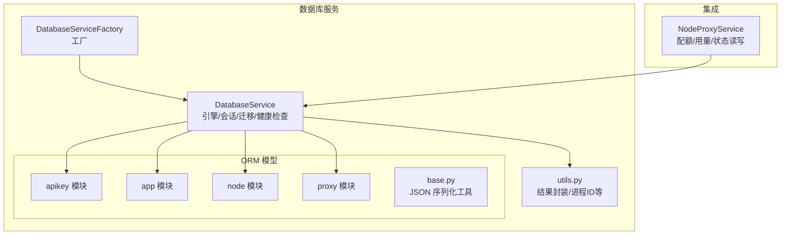
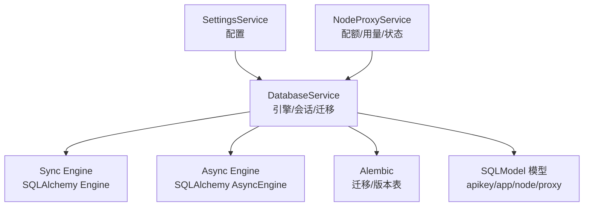
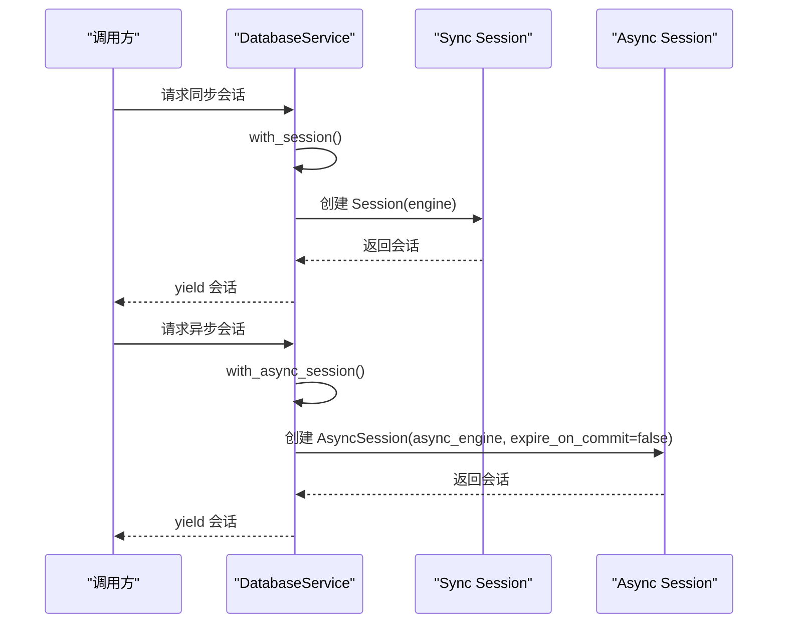
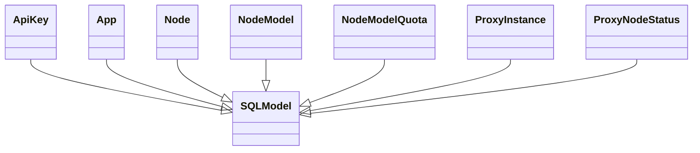
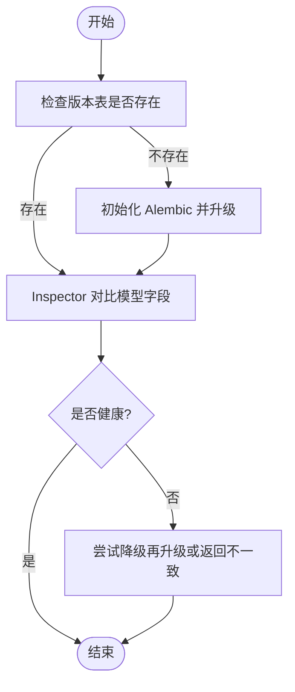
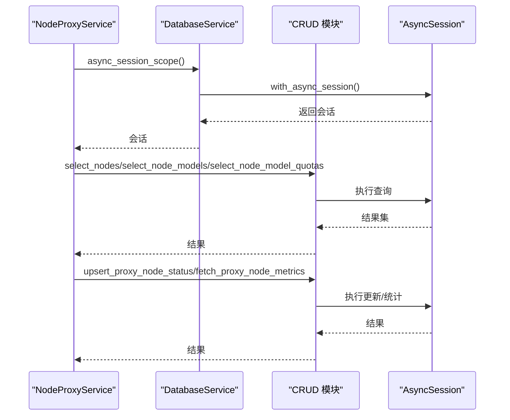
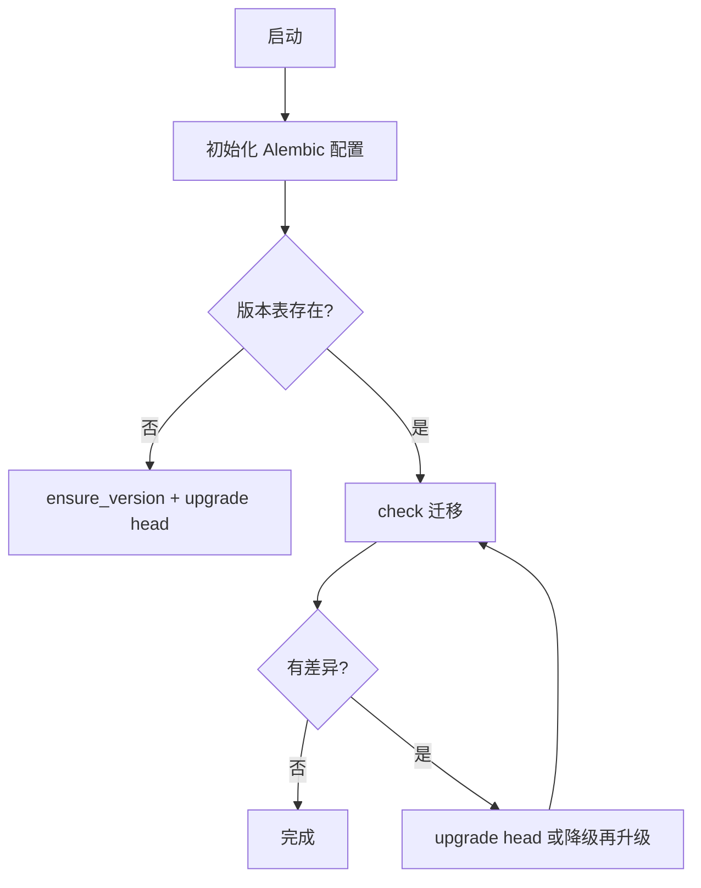
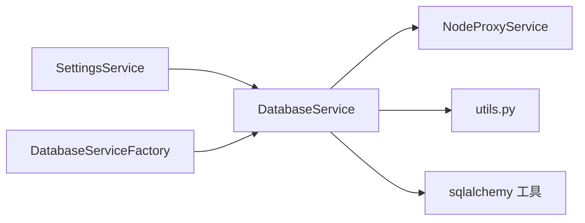

# 数据库服务

<cite>
**本文引用的文件**
- [src/apiproxy/openaiproxy/services/database/service.py](file://src/apiproxy/openaiproxy/services/database/service.py)
- [src/apiproxy/openaiproxy/services/database/factory.py](file://src/apiproxy/openaiproxy/services/database/factory.py)
- [src/apiproxy/openaiproxy/services/database/models/base.py](file://src/apiproxy/openaiproxy/services/database/models/base.py)
- [src/apiproxy/openaiproxy/utils/sqlalchemy.py](file://src/apiproxy/openaiproxy/utils/sqlalchemy.py)
- [src/apiproxy/openaiproxy/services/nodeproxy/service.py](file://src/apiproxy/openaiproxy/services/nodeproxy/service.py)
- [src/apiproxy/openaiproxy/openaiproxy/alembic/env.py](file://src/apiproxy/openaiproxy/alembic/env.py)
- [src/apiproxy/openaiproxy/alembic.ini](file://src/apiproxy/openaiproxy/alembic.ini)
- [src/apiproxy/scripts/init-db.sh](file://src/apiproxy/scripts/init-db.sh)
- [src/apiproxy/scripts/start.sh](file://src/apiproxy/scripts/start.sh)
- [src/apiproxy/openaiproxy/services/database/models/apikey/model.py](file://src/apiproxy/openaiproxy/services/database/models/apikey/model.py)
- [src/apiproxy/openaiproxy/services/database/models/app/model.py](file://src/apiproxy/openaiproxy/services/database/models/app/model.py)
- [src/apiproxy/openaiproxy/services/database/models/node/model.py](file://src/apiproxy/openaiproxy/services/database/models/node/model.py)
- [src/apiproxy/openaiproxy/services/database/models/proxy/model.py](file://src/apiproxy/openaiproxy/services/database/models/proxy/model.py)
- [src/apiproxy/openaiproxy/services/database/models/apikey/crud.py](file://src/apiproxy/openaiproxy/services/database/models/apikey/crud.py)
- [src/apiproxy/openaiproxy/services/database/models/app/crud.py](file://src/apiproxy/openaiproxy/services/database/models/app/crud.py)
- [src/apiproxy/openaiproxy/services/database/models/node/crud.py](file://src/apiproxy/openaiproxy/services/database/models/node/crud.py)
- [src/apiproxy/openaiproxy/services/database/models/proxy/crud.py](file://src/apiproxy/openaiproxy/services/database/models/proxy/crud.py)
- [src/apiproxy/openaiproxy/services/database/utils.py](file://src/apiproxy/openaiproxy/services/database/utils.py)
- [src/apiproxy/openaiproxy/services/deps.py](file://src/apiproxy/openaiproxy/services/deps.py)
- [src/apiproxy/openaiproxy/services/settings/service.py](file://src/apiproxy/openaiproxy/services/settings/service.py)
- [src/apiproxy/openaiproxy/main.py](file://src/apiproxy/openaiproxy/main.py)
</cite>

## 目录
1. [简介](#简介)
2. [项目结构](#项目结构)
3. [核心组件](#核心组件)
4. [架构总览](#架构总览)
5. [详细组件分析](#详细组件分析)
6. [依赖分析](#依赖分析)
7. [性能考虑](#性能考虑)
8. [故障排查指南](#故障排查指南)
9. [结论](#结论)
10. [附录](#附录)

## 简介
本文件为数据库服务的全面技术文档，覆盖连接管理、会话生命周期与连接池配置；ORM 模型设计、数据访问层实现与事务管理；数据库初始化流程、连接验证与故障恢复策略；SQLAlchemy/SQLModel 配置、异步数据库操作与批量处理优化；使用示例（CRUD、查询优化与性能调优）；与 NodeProxyService 的数据交互模式、缓存策略与一致性保证；以及数据库迁移管理、版本控制与备份恢复方案。

## 项目结构
数据库服务位于 openaiproxy/openaiproxy/services/database 目录下，采用分层与按功能域划分的组织方式：
- 服务层：DatabaseService 负责引擎创建、会话管理、迁移与健康检查
- 工厂层：DatabaseServiceFactory 提供服务实例创建与校验
- ORM 层：models 子包按业务域拆分（apikey、app、node、proxy），统一继承自 SQLModel 基类
- 工具层：sqlalchemy 辅助函数、数据库工具与依赖注入
- 集成层：与 NodeProxyService 协作进行配额、用量与状态的读写

**图表来源**
- [src/apiproxy/openaiproxy/services/database/service.py:59-403](file://src/apiproxy/openaiproxy/services/database/service.py#L59-L403)
- [src/apiproxy/openaiproxy/services/database/factory.py:38-48](file://src/apiproxy/openaiproxy/services/database/factory.py#L38-L48)
- [src/apiproxy/openaiproxy/services/database/models/base.py:29-45](file://src/apiproxy/openaiproxy/services/database/models/base.py#L29-L45)
- [src/apiproxy/openaiproxy/services/nodeproxy/service.py:430-444](file://src/apiproxy/openaiproxy/services/nodeproxy/service.py#L430-L444)

**章节来源**
- [src/apiproxy/openaiproxy/services/database/service.py:59-133](file://src/apiproxy/openaiproxy/services/database/service.py#L59-L133)
- [src/apiproxy/openaiproxy/services/database/factory.py:38-48](file://src/apiproxy/openaiproxy/services/database/factory.py#L38-L48)

## 核心组件
- DatabaseService：负责引擎创建（同步/异步）、SQLite PRAGMA 注入、会话上下文管理、Schema 健康检查、Alembic 迁移与版本控制、服务关闭清理
- DatabaseServiceFactory：基于 SettingsService 创建 DatabaseService 实例，并进行 URL 校验
- ORM 模型：按业务域划分，统一继承 SQLModel，字段映射数据库表结构
- 工具与辅助：SQLAlchemy 辅助排序、JSON 序列化工具、数据库工具与依赖注入

**章节来源**
- [src/apiproxy/openaiproxy/services/database/service.py:59-133](file://src/apiproxy/openaiproxy/services/database/service.py#L59-L133)
- [src/apiproxy/openaiproxy/services/database/factory.py:38-48](file://src/apiproxy/openaiproxy/services/database/factory.py#L38-L48)
- [src/apiproxy/openaiproxy/utils/sqlalchemy.py:27-40](file://src/apiproxy/openaiproxy/utils/sqlalchemy.py#L27-L40)
- [src/apiproxy/openaiproxy/services/database/models/base.py:29-45](file://src/apiproxy/openaiproxy/services/database/models/base.py#L29-L45)

## 架构总览
数据库服务通过 SettingsService 获取配置，创建同步与异步引擎，注册 SQLite 连接事件以应用 PRAGMA；对外提供 Session/AsyncSession 上下文；通过 Alembic 管理迁移；与 NodeProxyService 协作完成配额预留/结算与用量聚合。

**图表来源**
- [src/apiproxy/openaiproxy/services/database/service.py:104-132](file://src/apiproxy/openaiproxy/services/database/service.py#L104-L132)
- [src/apiproxy/openaiproxy/openaiproxy/alembic/env.py](file://src/apiproxy/openaiproxy/alembic/env.py)
- [src/apiproxy/openaiproxy/services/nodeproxy/service.py:430-444](file://src/apiproxy/openaiproxy/services/nodeproxy/service.py#L430-L444)

## 详细组件分析

### 数据库连接与会话管理
- 同步引擎与异步引擎分别创建，支持 PostgreSQL/SQLite 等多种后端
- SQLite 连接事件中应用 PRAGMA，确保线程安全与超时设置
- 提供 with_session 与 with_async_session 上下文管理器，自动处理会话生命周期
- 异步会话关闭时禁用过期对象，避免后续读取脏数据

**图表来源**
- [src/apiproxy/openaiproxy/services/database/service.py:164-178](file://src/apiproxy/openaiproxy/services/database/service.py#L164-L178)

**章节来源**
- [src/apiproxy/openaiproxy/services/database/service.py:104-144](file://src/apiproxy/openaiproxy/services/database/service.py#L104-L144)
- [src/apiproxy/openaiproxy/services/database/service.py:164-178](file://src/apiproxy/openaiproxy/services/database/service.py#L164-L178)

### 连接池配置
- 通过 SettingsService 读取 pool_size、max_overflow、echo 等参数
- SQLite 使用连接参数控制线程与超时
- 异步引擎对 PostgreSQL/SQLite 分别设置连接池参数

**章节来源**
- [src/apiproxy/openaiproxy/services/database/service.py:104-132](file://src/apiproxy/openaiproxy/services/database/service.py#L104-L132)
- [src/apiproxy/openaiproxy/services/database/service.py:134-144](file://src/apiproxy/openaiproxy/services/database/service.py#L134-L144)

### ORM 模型设计与数据访问层
- 模型统一继承 SQLModel，字段名与数据库列名映射
- 按业务域拆分模型与 CRUD，便于维护与扩展
- JSON 序列化使用 orjson 工具，支持键排序与缩进选项

**图表来源**
- [src/apiproxy/openaiproxy/services/database/models/apikey/model.py](file://src/apiproxy/openaiproxy/services/database/models/apikey/model.py)
- [src/apiproxy/openaiproxy/services/database/models/app/model.py](file://src/apiproxy/openaiproxy/services/database/models/app/model.py)
- [src/apiproxy/openaiproxy/services/database/models/node/model.py](file://src/apiproxy/openaiproxy/services/database/models/node/model.py)
- [src/apiproxy/openaiproxy/services/database/models/proxy/model.py](file://src/apiproxy/openaiproxy/services/database/models/proxy/model.py)

**章节来源**
- [src/apiproxy/openaiproxy/services/database/models/base.py:29-45](file://src/apiproxy/openaiproxy/services/database/models/base.py#L29-L45)

### 事务管理机制
- 同步/异步会话均在上下文内执行事务性操作
- 异步会话关闭时禁用过期对象，避免后续读取脏数据
- 通过 with_async_session/with_session 确保资源释放与异常处理

**章节来源**
- [src/apiproxy/openaiproxy/services/database/service.py:164-178](file://src/apiproxy/openaiproxy/services/database/service.py#L164-L178)

### 数据库初始化流程与 Schema 健康检查
- 初始化时检查 apiproxy_alembic_version 表是否存在，决定是否需要初始化
- 若缺失则执行 ensure_version 并升级至 head
- 通过 Inspector 对比模型字段与实际表结构，发现缺失即返回不健康
- 支持遗留表检测与告警

**图表来源**
- [src/apiproxy/openaiproxy/services/database/service.py:223-293](file://src/apiproxy/openaiproxy/services/database/service.py#L223-L293)
- [src/apiproxy/openaiproxy/services/database/service.py:195-221](file://src/apiproxy/openaiproxy/services/database/service.py#L195-L221)

**章节来源**
- [src/apiproxy/openaiproxy/services/database/service.py:195-221](file://src/apiproxy/openaiproxy/services/database/service.py#L195-L221)
- [src/apiproxy/openaiproxy/services/database/service.py:223-293](file://src/apiproxy/openaiproxy/services/database/service.py#L223-L293)

### 连接验证与故障恢复策略
- SQLite 连接事件中应用 PRAGMA，确保 WAL、外键约束等行为符合预期
- 迁移过程中若检测到差异，可尝试多次降级再升级以恢复一致性
- 服务关闭时先执行 teardown 清理超级用户相关操作，再 dispose 引擎

**章节来源**
- [src/apiproxy/openaiproxy/services/database/service.py:146-163](file://src/apiproxy/openaiproxy/services/database/service.py#L146-L163)
- [src/apiproxy/openaiproxy/services/database/service.py:294-308](file://src/apiproxy/openaiproxy/services/database/service.py#L294-L308)
- [src/apiproxy/openaiproxy/services/database/service.py:392-403](file://src/apiproxy/openaiproxy/services/database/service.py#L392-L403)

### SQLAlchemy 配置与异步数据库操作
- 异步引擎根据数据库类型选择连接参数，PostgreSQL/SQLite 分支处理
- 提供 async_session_scope 依赖注入，简化异步会话使用
- 排序辅助函数支持动态列与方向解析

**章节来源**
- [src/apiproxy/openaiproxy/services/database/service.py:114-132](file://src/apiproxy/openaiproxy/services/database/service.py#L114-L132)
- [src/apiproxy/openaiproxy/services/deps.py](file://src/apiproxy/openaiproxy/services/deps.py)
- [src/apiproxy/openaiproxy/utils/sqlalchemy.py:27-40](file://src/apiproxy/openaiproxy/utils/sqlalchemy.py#L27-L40)

### 批量处理优化
- 迁移阶段对表逐个创建，结合异常处理与日志记录
- NodeProxyService 在刷新节点配置时批量查询节点、模型与配额，减少往返次数
- 使用队列与延迟采样计算平均延迟与速度，降低 IO 压力

**章节来源**
- [src/apiproxy/openaiproxy/services/database/service.py:360-369](file://src/apiproxy/openaiproxy/services/database/service.py#L360-L369)
- [src/apiproxy/openaiproxy/services/nodeproxy/service.py:486-505](file://src/apiproxy/openaiproxy/services/nodeproxy/service.py#L486-L505)

### 使用示例与最佳实践
- CRUD 操作：通过各业务域的 CRUD 模块进行增删改查，结合 with_async_session/with_session 管理事务
- 查询优化：使用排序辅助函数构建有序查询；按需选择字段与过滤条件；避免 N+1 查询
- 性能调优：合理设置连接池大小与溢出；启用 echo 仅限调试；对热点数据使用只读会话或缓存

**章节来源**
- [src/apiproxy/openaiproxy/services/database/models/apikey/crud.py](file://src/apiproxy/openaiproxy/services/database/models/apikey/crud.py)
- [src/apiproxy/openaiproxy/services/database/models/app/crud.py](file://src/apiproxy/openaiproxy/services/database/models/app/crud.py)
- [src/apiproxy/openaiproxy/services/database/models/node/crud.py](file://src/apiproxy/openaiproxy/services/database/models/node/crud.py)
- [src/apiproxy/openaiproxy/services/database/models/proxy/crud.py](file://src/apiproxy/openaiproxy/services/database/models/proxy/crud.py)
- [src/apiproxy/openaiproxy/utils/sqlalchemy.py:27-40](file://src/apiproxy/openaiproxy/utils/sqlalchemy.py#L27-L40)

### 与 NodeProxyService 的数据交互模式
- NodeProxyService 在注册代理实例、刷新节点配置、健康检查、配额预留/结算与用量聚合等场景中频繁读写数据库
- 使用 async_session_scope 统一会话生命周期，确保跨模块的一致性
- 通过 fetch_proxy_node_metrics 计算节点指标，更新 ProxyNodeStatus

**图表来源**
- [src/apiproxy/openaiproxy/services/nodeproxy/service.py:471-630](file://src/apiproxy/openaiproxy/services/nodeproxy/service.py#L471-L630)
- [src/apiproxy/openaiproxy/services/database/service.py:169-178](file://src/apiproxy/openaiproxy/services/database/service.py#L169-L178)

**章节来源**
- [src/apiproxy/openaiproxy/services/nodeproxy/service.py:430-444](file://src/apiproxy/openaiproxy/services/nodeproxy/service.py#L430-L444)
- [src/apiproxy/openaiproxy/services/nodeproxy/service.py:464-748](file://src/apiproxy/openaiproxy/services/nodeproxy/service.py#L464-L748)

### 缓存策略与一致性保证
- NodeProxyService 内部维护节点元数据与离线节点映射，通过配置版本判断变更，避免重复加载
- 使用队列保存延迟样本，计算滑动窗口指标，降低实时查询压力
- 通过异步会话与上下文管理器确保事务边界，避免并发写入导致的数据不一致

**章节来源**
- [src/apiproxy/openaiproxy/services/nodeproxy/service.py:658-677](file://src/apiproxy/openaiproxy/services/nodeproxy/service.py#L658-L677)
- [src/apiproxy/openaiproxy/services/nodeproxy/service.py:600-605](file://src/apiproxy/openaiproxy/services/nodeproxy/service.py#L600-L605)

### 数据库迁移管理、版本控制与备份恢复
- 使用 Alembic 管理迁移脚本与版本表（apiproxy_alembic_version）
- 初始化时检查版本表，缺失则初始化并升级至 head
- 运行前执行 check，若检测到差异则自动升级；必要时尝试降级再升级恢复
- 提供测试方法检查所有模型与表结构一致性

**图表来源**
- [src/apiproxy/openaiproxy/services/database/service.py:223-293](file://src/apiproxy/openaiproxy/services/database/service.py#L223-L293)
- [src/apiproxy/openaiproxy/alembic.ini](file://src/apiproxy/openaiproxy/alembic.ini)

**章节来源**
- [src/apiproxy/openaiproxy/services/database/service.py:247-293](file://src/apiproxy/openaiproxy/services/database/service.py#L247-L293)

## 依赖分析
- DatabaseService 依赖 SettingsService 获取数据库 URL、连接池参数、PRAGMA 与 Alembic 日志路径
- DatabaseServiceFactory 依赖 ServiceFactory，负责创建 DatabaseService 实例
- NodeProxyService 依赖 DatabaseService 进行配额与用量读写
- 工具模块提供排序与 JSON 序列化辅助

**图表来源**
- [src/apiproxy/openaiproxy/services/database/factory.py:38-48](file://src/apiproxy/openaiproxy/services/database/factory.py#L38-L48)
- [src/apiproxy/openaiproxy/services/database/service.py:59-95](file://src/apiproxy/openaiproxy/services/database/service.py#L59-L95)
- [src/apiproxy/openaiproxy/services/nodeproxy/service.py:430-444](file://src/apiproxy/openaiproxy/services/nodeproxy/service.py#L430-L444)

**章节来源**
- [src/apiproxy/openaiproxy/services/database/factory.py:38-48](file://src/apiproxy/openaiproxy/services/database/factory.py#L38-L48)
- [src/apiproxy/openaiproxy/services/database/service.py:59-95](file://src/apiproxy/openaiproxy/services/database/service.py#L59-L95)

## 性能考虑
- 连接池：根据并发请求量调整 pool_size 与 max_overflow，避免阻塞与资源耗尽
- 异步：优先使用异步会话处理高并发场景，减少阻塞等待
- 查询：使用排序辅助函数与精确过滤条件，避免全表扫描
- 批量：在 NodeProxyService 中合并查询，减少网络往返
- 序列化：使用 orjson 提升 JSON 序列化性能

[本节为通用建议，无需特定文件来源]

## 故障排查指南
- 迁移失败：查看 Alembic 日志路径与版本表，确认 ensure_version 与 upgrade 流程
- Schema 不一致：使用 check_table 与 check_schema_health 定位缺失表/字段
- 连接问题：检查数据库 URL、PRAGMA 设置与连接超时参数
- 关闭异常：确认 teardown 清理流程与引擎 dispose 顺序

**章节来源**
- [src/apiproxy/openaiproxy/services/database/service.py:223-293](file://src/apiproxy/openaiproxy/services/database/service.py#L223-L293)
- [src/apiproxy/openaiproxy/services/database/service.py:195-221](file://src/apiproxy/openaiproxy/services/database/service.py#L195-L221)
- [src/apiproxy/openaiproxy/services/database/service.py:392-403](file://src/apiproxy/openaiproxy/services/database/service.py#L392-L403)

## 结论
数据库服务通过清晰的分层设计与完善的生命周期管理，提供了稳定可靠的 ORM 能力与迁移机制。配合 NodeProxyService 的高效数据交互模式，实现了高并发下的配额与用量管理。建议在生产环境中合理配置连接池、启用异步操作、定期执行迁移检查与备份策略，以确保系统稳定性与可维护性。

## 附录
- 初始化脚本：init-db.sh 与 start.sh 提供数据库初始化与服务启动流程参考
- 配置入口：SettingsService 提供数据库 URL、连接池与 Alembic 参数的集中管理

**章节来源**
- [src/apiproxy/scripts/init-db.sh](file://src/apiproxy/scripts/init-db.sh)
- [src/apiproxy/scripts/start.sh](file://src/apiproxy/scripts/start.sh)
- [src/apiproxy/openaiproxy/services/settings/service.py](file://src/apiproxy/openaiproxy/services/settings/service.py)
- [src/apiproxy/openaiproxy/main.py](file://src/apiproxy/openaiproxy/main.py)