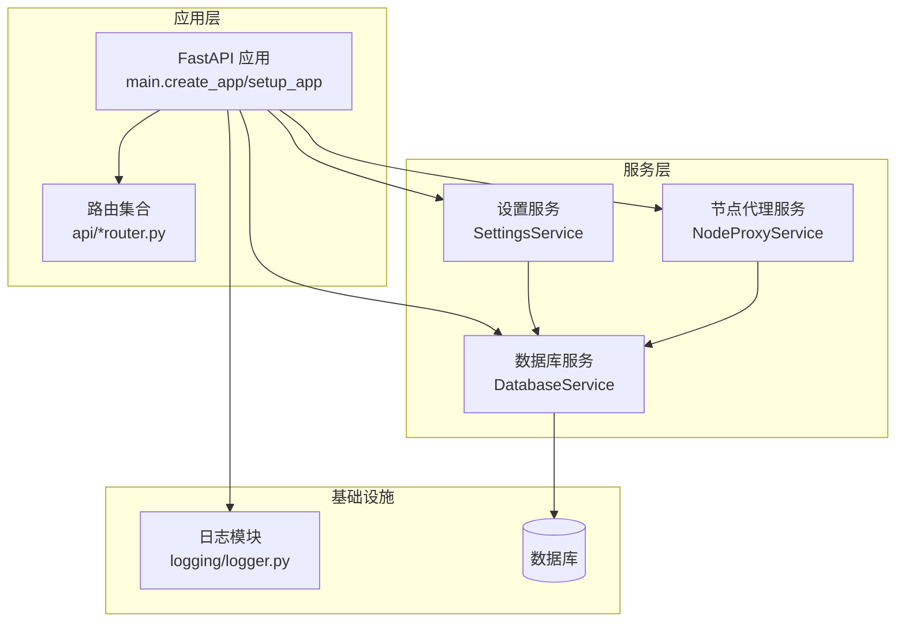
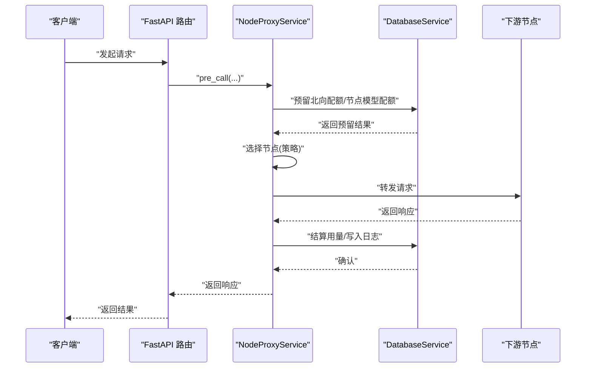
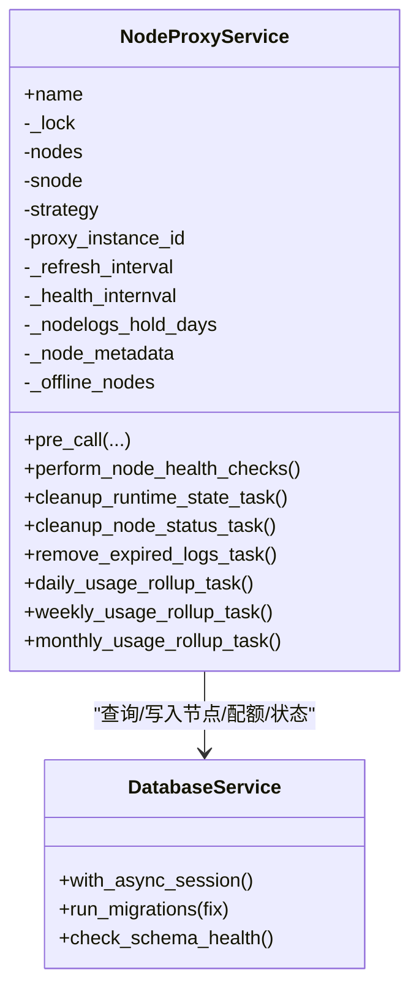
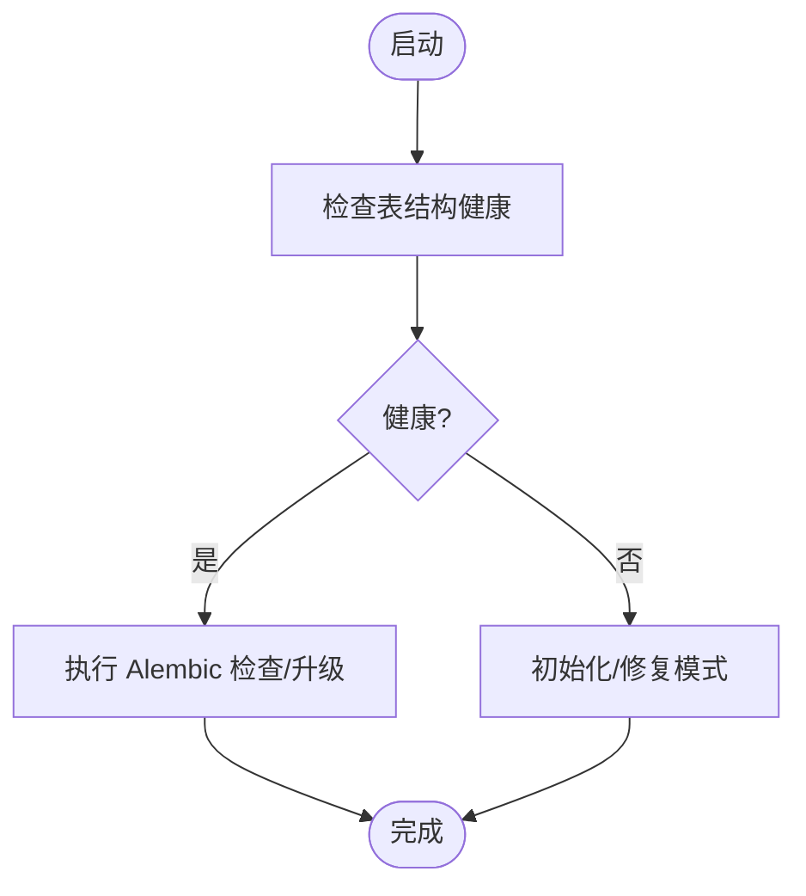
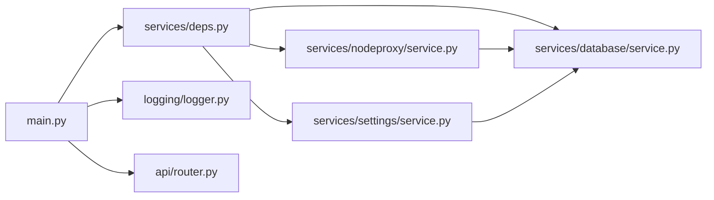

# 核心服务架构

<cite>
**本文引用的文件**
- [src/apiproxy/openaiproxy/main.py](file://src/apiproxy/openaiproxy/main.py)
- [src/apiproxy/openaiproxy/settings.py](file://src/apiproxy/openaiproxy/settings.py)
- [src/apiproxy/openaiproxy/services/nodeproxy/service.py](file://src/apiproxy/openaiproxy/services/nodeproxy/service.py)
- [src/apiproxy/openaiproxy/services/settings/service.py](file://src/apiproxy/openaiproxy/services/settings/service.py)
- [src/apiproxy/openaiproxy/services/database/service.py](file://src/apiproxy/openaiproxy/services/database/service.py)
- [src/apiproxy/openaiproxy/services/deps.py](file://src/apiproxy/openaiproxy/services/deps.py)
- [src/apiproxy/openaiproxy/services/utils.py](file://src/apiproxy/openaiproxy/services/utils.py)
- [src/apiproxy/openaiproxy/api/router.py](file://src/apiproxy/openaiproxy/api/router.py)
- [src/apiproxy/openaiproxy/api/schemas.py](file://src/apiproxy/openaiproxy/api/schemas.py)
- [src/apiproxy/openaiproxy/logging/logger.py](file://src/apiproxy/openaiproxy/logging/logger.py)
- [src/apiproxy/pyproject.toml](file://src/apiproxy/pyproject.toml)
- [Dockerfile](file://Dockerfile)
- [BUILD.yaml](file://BUILD.yaml)
- [Makefile](file://Makefile)
</cite>

## 目录
1. [引言](#引言)
2. [项目结构](#项目结构)
3. [核心组件](#核心组件)
4. [架构总览](#架构总览)
5. [组件详解](#组件详解)
6. [依赖关系分析](#依赖关系分析)
7. [性能考量](#性能考量)
8. [故障排查指南](#故障排查指南)
9. [结论](#结论)
10. [附录](#附录)

## 引言
本架构文档面向“大模型接口代理”的核心服务，聚焦于系统高层设计、架构模式与系统边界，重点阐述 NodeProxyService、数据库服务、设置服务等核心组件的设计理念与实现细节；同时解释组件间交互关系、数据流向与集成模式，给出技术决策、权衡与约束条件，并覆盖基础设施要求、可扩展性与部署拓扑，以及安全性、监控与灾难恢复等横切关注点。

## 项目结构
项目采用“按功能域分层 + 模块化服务”的组织方式：
- 应用入口与生命周期管理：FastAPI 应用、CORS 中间件、静态资源挂载、APScheduler 调度器与服务生命周期钩子
- API 层：OpenAI 兼容接口路由集合，包括模型列表、补全、嵌入、重排序、节点管理、配额与日志等
- 服务层：设置服务、数据库服务、节点代理服务（NodeProxyService）、通用依赖注入与工具
- 日志与配置：统一日志模块与配置加载
- 工程构建与部署：Dockerfile、BUILD.yaml、Makefile、pyproject.toml

图表来源
- [src/apiproxy/openaiproxy/main.py:128-187](file://src/apiproxy/openaiproxy/main.py#L128-L187)
- [src/apiproxy/openaiproxy/services/settings/service.py:33-53](file://src/apiproxy/openaiproxy/services/settings/service.py#L33-L53)
- [src/apiproxy/openaiproxy/services/database/service.py:59-133](file://src/apiproxy/openaiproxy/services/database/service.py#L59-L133)
- [src/apiproxy/openaiproxy/services/nodeproxy/service.py:214-281](file://src/apiproxy/openaiproxy/services/nodeproxy/service.py#L214-L281)

章节来源
- [src/apiproxy/openaiproxy/main.py:128-187](file://src/apiproxy/openaiproxy/main.py#L128-L187)
- [src/apiproxy/openaiproxy/services/deps.py](file://src/apiproxy/openaiproxy/services/deps.py)
- [src/apiproxy/openaiproxy/services/utils.py](file://src/apiproxy/openaiproxy/services/utils.py)

## 核心组件
- NodeProxyService：负责节点发现、健康检查、负载均衡策略（随机/最小预期延迟/最小观测延迟）、配额预留与回滚、运行时状态清理与用量汇总等
- DatabaseService：封装异步/同步 SQLAlchemy 引擎、Alembic 迁移、连接参数与 SQLite PRAGMA 注入、会话管理与表结构健康检查
- SettingsService：集中式配置读取与动态写入（如代理实例 ID），并与数据库服务协同完成初始化与迁移
- API 路由与视图：提供 OpenAI 兼容接口与管理接口，通过依赖注入获取服务实例
- 日志模块：统一异步/同步日志配置与输出

章节来源
- [src/apiproxy/openaiproxy/services/nodeproxy/service.py:214-281](file://src/apiproxy/openaiproxy/services/nodeproxy/service.py#L214-L281)
- [src/apiproxy/openaiproxy/services/database/service.py:59-133](file://src/apiproxy/openaiproxy/services/database/service.py#L59-L133)
- [src/apiproxy/openaiproxy/services/settings/service.py:33-53](file://src/apiproxy/openaiproxy/services/settings/service.py#L33-L53)
- [src/apiproxy/openaiproxy/logging/logger.py](file://src/apiproxy/openaiproxy/logging/logger.py)

## 架构总览
系统采用“事件驱动 + 轮询健康检查 + 配额与用量聚合”的混合模式：
- 生命周期：应用启动时初始化服务、注册代理实例、建立调度任务；优雅关闭时释放资源
- 节点管理：周期性从数据库拉取节点与模型配额，维护本地内存状态，按策略选择最优节点
- 请求处理：前置配额预留与校验，命中后转发至下游节点，记录请求/响应与用量
- 数据持久化：通过 Alembic 管理数据库结构，支持自动检查与修复；用量按日/周/月聚合

图表来源
- [src/apiproxy/openaiproxy/main.py:57-126](file://src/apiproxy/openaiproxy/main.py#L57-L126)
- [src/apiproxy/openaiproxy/services/nodeproxy/service.py:282-368](file://src/apiproxy/openaiproxy/services/nodeproxy/service.py#L282-L368)
- [src/apiproxy/openaiproxy/services/database/service.py:247-293](file://src/apiproxy/openaiproxy/services/database/service.py#L247-L293)

## 组件详解

### NodeProxyService 设计与实现
- 角色定位：代理核心，负责节点生命周期、健康检查、配额与用量、调度策略、运行时清理与汇总
- 关键机制
  - 节点刷新：周期性从数据库加载启用且未过期节点，合并模型与配额信息，计算配置版本，维护在线/离线映射
  - 健康检查：轮询调用下游节点健康端点，更新本地延迟样本与速度指标
  - 配额管理：北向双层（API Key + App）与节点模型级配额预留与回滚，超限保护与退避
  - 调度策略：随机加权（基于速度）、最小预期延迟、最小观测延迟
  - 运行时清理：定期清理非进行中失败状态日志、过期节点状态日志、用量汇总定时任务
- 并发与线程：内部使用锁保护共享状态；心跳与刷新分别在独立守护线程中运行
- 错误处理：对健康检查与刷新失败进行日志记录与容错；配额相关异常向上抛出并回滚

图表来源
- [src/apiproxy/openaiproxy/services/nodeproxy/service.py:214-281](file://src/apiproxy/openaiproxy/services/nodeproxy/service.py#L214-L281)
- [src/apiproxy/openaiproxy/services/database/service.py:59-133](file://src/apiproxy/openaiproxy/services/database/service.py#L59-L133)

章节来源
- [src/apiproxy/openaiproxy/services/nodeproxy/service.py:214-281](file://src/apiproxy/openaiproxy/services/nodeproxy/service.py#L214-L281)
- [src/apiproxy/openaiproxy/services/nodeproxy/service.py:464-748](file://src/apiproxy/openaiproxy/services/nodeproxy/service.py#L464-L748)
- [src/apiproxy/openaiproxy/services/nodeproxy/service.py:759-800](file://src/apiproxy/openaiproxy/services/nodeproxy/service.py#L759-L800)

### DatabaseService 设计与实现
- 角色定位：统一数据库访问与迁移管理，提供同步/异步会话，注入 SQLite PRAGMA，执行 Alembic 升降级
- 关键机制
  - 引擎创建：根据数据库类型选择连接参数，支持 SQLite/PostgreSQL/MySQL 等方言
  - Alembic 集成：初始化版本表、检查/升级/降级，支持“修复模式”
  - 表结构健康检查：比对模型字段与实际表结构，识别缺失列或遗留表
  - 会话管理：上下文管理器封装，确保资源正确释放
- 运维特性：支持“修复模式”自动降级再升级以消除差异；提供测试辅助方法

图表来源
- [src/apiproxy/openaiproxy/services/database/service.py:195-221](file://src/apiproxy/openaiproxy/services/database/service.py#L195-L221)
- [src/apiproxy/openaiproxy/services/database/service.py:247-293](file://src/apiproxy/openaiproxy/services/database/service.py#L247-L293)

章节来源
- [src/apiproxy/openaiproxy/services/database/service.py:59-133](file://src/apiproxy/openaiproxy/services/database/service.py#L59-L133)
- [src/apiproxy/openaiproxy/services/database/service.py:247-293](file://src/apiproxy/openaiproxy/services/database/service.py#L247-L293)
- [src/apiproxy/openaiproxy/services/database/service.py:340-391](file://src/apiproxy/openaiproxy/services/database/service.py#L340-L391)

### SettingsService 设计与实现
- 角色定位：集中式配置服务，提供配置读取与动态写入能力（如写入代理实例 ID）
- 初始化：从 Settings 基类构造配置对象，校验必要配置项（如配置目录）
- 动态写入：允许运行时修改配置并写回 Settings 实例

章节来源
- [src/apiproxy/openaiproxy/services/settings/service.py:33-53](file://src/apiproxy/openaiproxy/services/settings/service.py#L33-L53)

### 应用生命周期与调度
- 生命周期：应用启动时配置日志、初始化服务、注册代理实例、启动调度器并注册多项定时任务
- 调度任务：运行时状态清理、节点状态清理、过期日志清理、用量按日/周/月汇总
- 关闭流程：优雅关闭，释放服务与日志资源

章节来源
- [src/apiproxy/openaiproxy/main.py:57-126](file://src/apiproxy/openaiproxy/main.py#L57-L126)
- [src/apiproxy/openaiproxy/main.py:128-187](file://src/apiproxy/openaiproxy/main.py#L128-L187)

### API 层与路由
- 路由集合：包含 v1 接口（补全、嵌入、模型列表、重排序）、节点管理、节点模型配额、API Key 配额、应用配额、请求日志、健康检查、自定义文档等
- 依赖注入：通过依赖工厂函数获取服务实例（设置服务、节点代理服务）

章节来源
- [src/apiproxy/openaiproxy/main.py:43-53](file://src/apiproxy/openaiproxy/main.py#L43-L53)
- [src/apiproxy/openaiproxy/services/deps.py](file://src/apiproxy/openaiproxy/services/deps.py)

## 依赖关系分析
- 组件耦合
  - NodeProxyService 依赖 SettingsService 获取运行参数，依赖 DatabaseService 进行节点/配额/状态读写
  - DatabaseService 依赖 SettingsService 提供数据库连接参数与 Alembic 配置
  - 应用层通过依赖注入获取服务实例，避免直接耦合具体实现
- 外部依赖
  - FastAPI、SQLAlchemy/SQLModel、Alembic、apscheduler、requests、numpy、orjson、rich 等
- 循环依赖
  - 通过依赖工厂与延迟导入避免循环依赖

图表来源
- [src/apiproxy/openaiproxy/main.py:34-53](file://src/apiproxy/openaiproxy/main.py#L34-L53)
- [src/apiproxy/openaiproxy/services/deps.py](file://src/apiproxy/openaiproxy/services/deps.py)
- [src/apiproxy/openaiproxy/services/nodeproxy/service.py:214-281](file://src/apiproxy/openaiproxy/services/nodeproxy/service.py#L214-L281)
- [src/apiproxy/openaiproxy/services/database/service.py:59-133](file://src/apiproxy/openaiproxy/services/database/service.py#L59-L133)
- [src/apiproxy/openaiproxy/services/settings/service.py:33-53](file://src/apiproxy/openaiproxy/services/settings/service.py#L33-L53)

章节来源
- [src/apiproxy/openaiproxy/main.py:34-53](file://src/apiproxy/openaiproxy/main.py#L34-L53)
- [src/apiproxy/openaiproxy/services/deps.py](file://src/apiproxy/openaiproxy/services/deps.py)

## 性能考量
- 连接池与并发
  - 数据库连接池大小与溢出配置由设置服务提供，异步引擎按数据库类型优化参数
  - NodeProxyService 使用线程守护与锁保护共享状态，避免竞争条件
- 负载均衡策略
  - 支持基于速度的加权选择，结合延迟样本队列平滑抖动
- IO 与网络
  - 健康检查与用量汇总采用定时任务，避免阻塞主请求链路
- 存储与索引
  - 用量按日/周/月聚合，减少高频统计开销；建议在数据库侧为热点字段建立索引

[本节为通用性能讨论，无需列出章节来源]

## 故障排查指南
- 启动阶段
  - 数据库迁移失败：查看 Alembic 输出与异常日志；必要时使用修复模式自动降级再升级
  - 代理实例注册失败：检查设置服务与数据库连接；确认实例 ID 写回逻辑
- 运行阶段
  - 节点不可用：查看健康检查日志与延迟样本；确认下游节点 API Key 与健康端点
  - 配额超限：核对北向与节点模型配额预留与回滚流程；检查配额标记与 TTL 退避
  - 定时任务异常：检查调度器状态与任务日志；确认时间配置（小时/分钟）
- 关闭阶段
  - 资源释放：确认数据库与日志服务优雅关闭流程执行

章节来源
- [src/apiproxy/openaiproxy/services/database/service.py:247-293](file://src/apiproxy/openaiproxy/services/database/service.py#L247-L293)
- [src/apiproxy/openaiproxy/services/nodeproxy/service.py:393-444](file://src/apiproxy/openaiproxy/services/nodeproxy/service.py#L393-L444)
- [src/apiproxy/openaiproxy/main.py:57-126](file://src/apiproxy/openaiproxy/main.py#L57-L126)

## 结论
该系统通过清晰的服务边界与依赖注入，实现了高内聚、低耦合的代理核心架构。NodeProxyService 作为调度与治理中心，结合 DatabaseService 的结构化存储与 SettingsService 的集中配置，形成稳定可靠的运行时环境。配合定时任务与健康检查机制，系统具备良好的可观测性与可维护性。建议在生产环境中进一步完善监控告警、备份与灾备方案，并持续评估数据库索引与缓存策略以提升吞吐与延迟表现。

[本节为总结性内容，无需列出章节来源]

## 附录

### 技术栈与版本兼容性
- Python 与包管理：基于 pyproject.toml 管理依赖，建议使用与项目锁定文件一致的 Python 版本
- Web 框架：FastAPI + Uvicorn
- 数据库：SQLAlchemy/SQLModel + Alembic；支持 SQLite 与 PostgreSQL/MySQL 方言
- 调度：APScheduler
- 其他：requests、numpy、orjson、rich、apscheduler

章节来源
- [src/apiproxy/pyproject.toml](file://src/apiproxy/pyproject.toml)

### 基础设施与部署拓扑
- 单机部署：应用进程 + 数据库进程（SQLite 或外部数据库）
- 容器化：使用 Dockerfile 构建镜像，可通过编排工具多副本部署
- 构建与打包：BUILD.yaml、Makefile 提供构建与打包流程
- 环境变量：主机、端口、工作进程数、日志级别等

章节来源
- [Dockerfile](file://Dockerfile)
- [BUILD.yaml](file://BUILD.yaml)
- [Makefile](file://Makefile)
- [src/apiproxy/openaiproxy/main.py:222-242](file://src/apiproxy/openaiproxy/main.py#L222-L242)

### 安全性、监控与灾难恢复
- 安全性
  - API Key 加解密与存储（节点侧 API Key 解密失败时保留密文）
  - CORS 允许跨域访问，建议在网关层限制来源
- 监控
  - 统一日志模块，支持异步日志输出
  - 健康检查与用量汇总定时任务用于运行状态观测
- 灾难恢复
  - 数据库结构健康检查与 Alembic 自动修复
  - 代理实例注册与状态持久化，便于故障后快速恢复

章节来源
- [src/apiproxy/openaiproxy/services/nodeproxy/service.py:633-640](file://src/apiproxy/openaiproxy/services/nodeproxy/service.py#L633-L640)
- [src/apiproxy/openaiproxy/logging/logger.py](file://src/apiproxy/openaiproxy/logging/logger.py)
- [src/apiproxy/openaiproxy/services/database/service.py:195-221](file://src/apiproxy/openaiproxy/services/database/service.py#L195-L221)