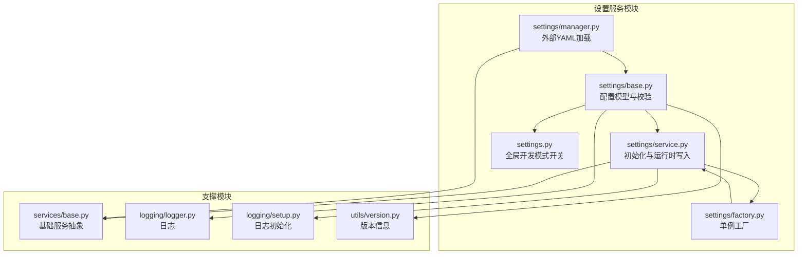
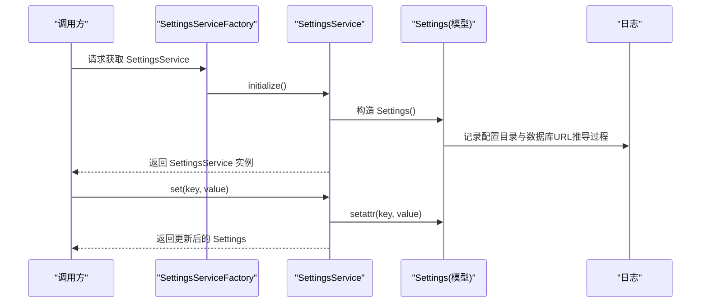
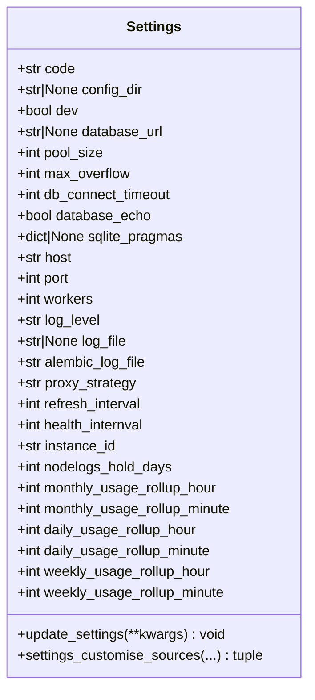
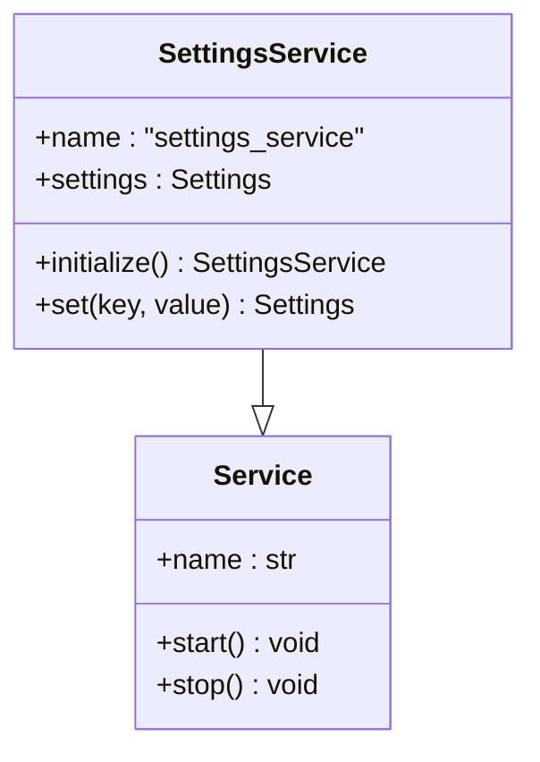
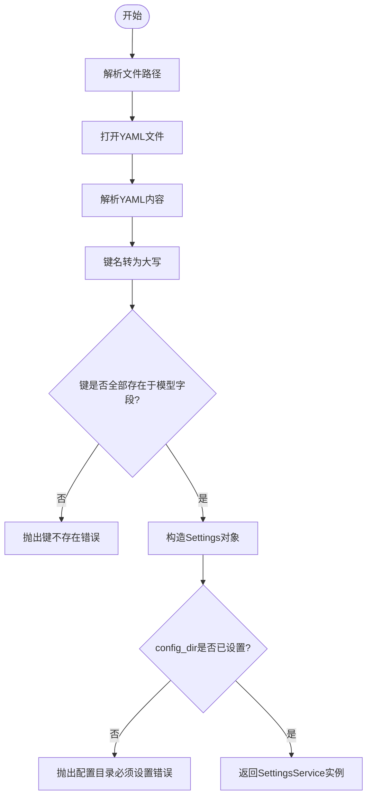
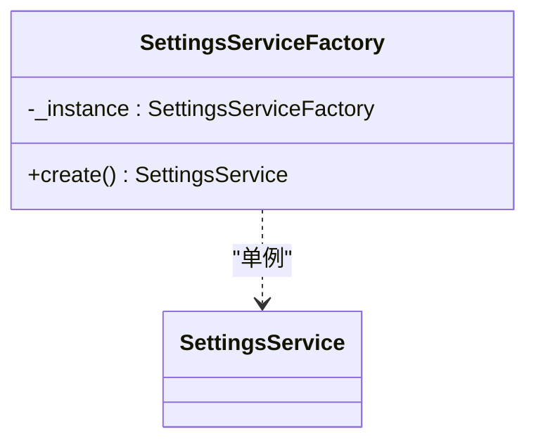
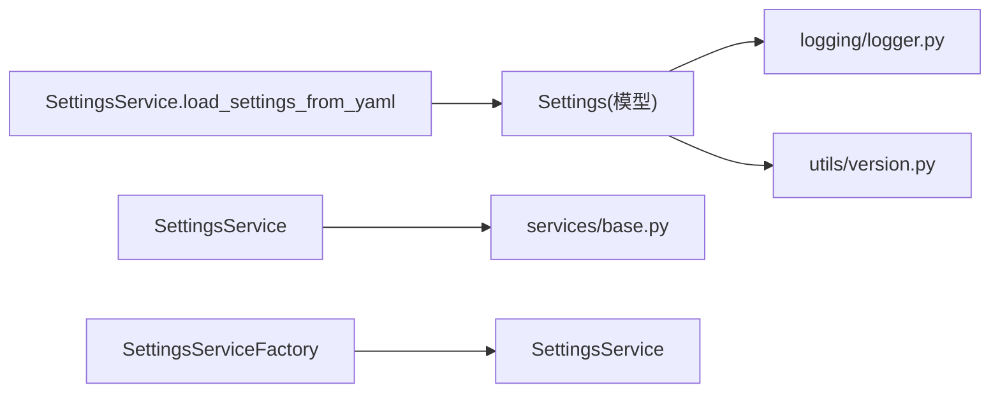

# 设置服务

<cite>
**本文引用的文件**
- [src/apiproxy/openaiproxy/settings.py](file://src/apiproxy/openaiproxy/settings.py)
- [src/apiproxy/openaiproxy/services/settings/base.py](file://src/apiproxy/openaiproxy/services/settings/base.py)
- [src/apiproxy/openaiproxy/services/settings/manager.py](file://src/apiproxy/openaiproxy/services/settings/manager.py)
- [src/apiproxy/openaiproxy/services/settings/service.py](file://src/apiproxy/openaiproxy/services/settings/service.py)
- [src/apiproxy/openaiproxy/services/settings/factory.py](file://src/apiproxy/openaiproxy/services/settings/factory.py)
- [src/apiproxy/openaiproxy/services/base.py](file://src/apiproxy/openaiproxy/services/base.py)
- [src/apiproxy/openaiproxy/utils/version.py](file://src/apiproxy/openaiproxy/utils/version.py)
- [src/apiproxy/openaiproxy/logging/logger.py](file://src/apiproxy/openaiproxy/logging/logger.py)
- [src/apiproxy/openaiproxy/logging/setup.py](file://src/apiproxy/openaiproxy/logging/setup.py)
</cite>

## 目录
1. [简介](#简介)
2. [项目结构](#项目结构)
3. [核心组件](#核心组件)
4. [架构总览](#架构总览)
5. [详细组件分析](#详细组件分析)
6. [依赖分析](#依赖分析)
7. [性能考虑](#性能考虑)
8. [故障排查指南](#故障排查指南)
9. [结论](#结论)
10. [附录](#附录)

## 简介
本文件系统性梳理设置服务的配置管理能力，覆盖以下主题：
- 配置加载机制与来源优先级
- 环境变量处理与自定义解析
- 运行时配置更新与热重载思路
- 配置验证流程与字段校验
- 存储策略、持久化与安全实践
- 配置模板管理、默认值与继承机制
- 最佳实践：敏感信息保护、配置审计与变更管理
- 与其他组件的集成模式、配置传播与同步机制
- 配置文件格式、支持的配置项与示例路径

## 项目结构
设置服务位于 openaiproxy/services/settings 下，围绕 Pydantic Settings 的模型层、服务层、工厂层与管理器层构建，形成“模型定义 → 服务初始化 → 工厂单例 → 外部YAML加载”的完整链路。

图表来源
- [src/apiproxy/openaiproxy/services/settings/base.py:79-292](file://src/apiproxy/openaiproxy/services/settings/base.py#L79-L292)
- [src/apiproxy/openaiproxy/services/settings/service.py:33-53](file://src/apiproxy/openaiproxy/services/settings/service.py#L33-L53)
- [src/apiproxy/openaiproxy/services/settings/manager.py:38-71](file://src/apiproxy/openaiproxy/services/settings/manager.py#L38-L71)
- [src/apiproxy/openaiproxy/services/settings/factory.py:31-46](file://src/apiproxy/openaiproxy/services/settings/factory.py#L31-L46)
- [src/apiproxy/openaiproxy/settings.py:27-37](file://src/apiproxy/openaiproxy/settings.py#L27-L37)
- [src/apiproxy/openaiproxy/services/base.py](file://src/apiproxy/openaiproxy/services/base.py)
- [src/apiproxy/openaiproxy/utils/version.py](file://src/apiproxy/openaiproxy/utils/version.py)
- [src/apiproxy/openaiproxy/logging/logger.py](file://src/apiproxy/openaiproxy/logging/logger.py)
- [src/apiproxy/openaiproxy/logging/setup.py](file://src/apiproxy/openaiproxy/logging/setup.py)

章节来源
- [src/apiproxy/openaiproxy/services/settings/base.py:79-292](file://src/apiproxy/openaiproxy/services/settings/base.py#L79-L292)
- [src/apiproxy/openaiproxy/services/settings/service.py:33-53](file://src/apiproxy/openaiproxy/services/settings/service.py#L33-L53)
- [src/apiproxy/openaiproxy/services/settings/manager.py:38-71](file://src/apiproxy/openaiproxy/services/settings/manager.py#L38-L71)
- [src/apiproxy/openaiproxy/services/settings/factory.py:31-46](file://src/apiproxy/openaiproxy/services/settings/factory.py#L31-L46)
- [src/apiproxy/openaiproxy/settings.py:27-37](file://src/apiproxy/openaiproxy/settings.py#L27-L37)

## 核心组件
- 配置模型 Settings：集中定义所有配置项、默认值、环境变量前缀、字段校验器与自定义来源。
- 设置服务 SettingsService：负责初始化、运行时写入与对外暴露配置对象。
- 设置管理器 SettingsService.load_settings_from_yaml：支持从外部 YAML 加载配置并进行键名校验。
- 设置工厂 SettingsServiceFactory：提供单例化的 SettingsService 创建入口。
- 全局开发模式开关：通过全局变量与模型校验联动，影响运行态行为。

章节来源
- [src/apiproxy/openaiproxy/services/settings/base.py:79-292](file://src/apiproxy/openaiproxy/services/settings/base.py#L79-L292)
- [src/apiproxy/openaiproxy/services/settings/service.py:33-53](file://src/apiproxy/openaiproxy/services/settings/service.py#L33-L53)
- [src/apiproxy/openaiproxy/services/settings/manager.py:38-71](file://src/apiproxy/openaiproxy/services/settings/manager.py#L38-L71)
- [src/apiproxy/openaiproxy/services/settings/factory.py:31-46](file://src/apiproxy/openaiproxy/services/settings/factory.py#L31-L46)
- [src/apiproxy/openaiproxy/settings.py:27-37](file://src/apiproxy/openaiproxy/settings.py#L27-L37)

## 架构总览
设置服务采用“模型驱动 + 自定义来源 + 服务封装 + 工厂单例”的分层架构，确保配置加载、校验与传播的一致性与可扩展性。

图表来源
- [src/apiproxy/openaiproxy/services/settings/factory.py:42-46](file://src/apiproxy/openaiproxy/services/settings/factory.py#L42-L46)
- [src/apiproxy/openaiproxy/services/settings/service.py:40-53](file://src/apiproxy/openaiproxy/services/settings/service.py#L40-L53)
- [src/apiproxy/openaiproxy/services/settings/base.py:255-292](file://src/apiproxy/openaiproxy/services/settings/base.py#L255-L292)

## 详细组件分析

### 配置模型 Settings（字段、默认值与校验）
- 环境变量前缀：通过模型配置指定，统一以 APIPROXY_ 前缀读取。
- 关键字段与默认值：
  - 开发模式 dev：布尔，默认关闭；字段校验器会联动全局开发模式开关。
  - 数据库相关：database_url、pool_size、max_overflow、db_connect_timeout、database_echo、sqlite_pragmas。
  - 服务运行：host、port、workers、log_level、log_file、alembic_log_file。
  - 调度与定时：proxy_strategy、refresh_interval、health_internval、monthly_usage_rollup_*、daily_usage_rollup_*、weekly_usage_rollup_*。
  - 实例与日志：instance_id、nodelogs_hold_days。
  - 配置目录与数据库路径：config_dir、save_db_in_config_dir（在数据库URL推导逻辑中使用）。
- 字段校验器：
  - dev：触发全局开发模式开关。
  - log_file：确保路径类型正确。
  - config_dir：若未显式提供，自动创建用户缓存目录下的应用配置目录，并保证存在。
  - database_url：若未提供，优先读取环境变量 APIPROXY_DATABASE_URL；否则根据版本与配置目录策略生成 SQLite 路径，必要时迁移旧数据库文件。
- 自定义来源：
  - MyCustomSource：支持逗号分隔字符串解析为列表，增强环境变量对列表型配置的支持。
- 运行时更新：
  - update_settings：支持对列表与标量字段进行增量更新，避免重复项；对敏感字段不打印日志。

图表来源
- [src/apiproxy/openaiproxy/services/settings/base.py:79-292](file://src/apiproxy/openaiproxy/services/settings/base.py#L79-L292)

章节来源
- [src/apiproxy/openaiproxy/services/settings/base.py:79-292](file://src/apiproxy/openaiproxy/services/settings/base.py#L79-L292)

### 设置服务 SettingsService（初始化与运行时写入）
- 初始化 initialize：构造 Settings 并校验 config_dir 是否存在。
- 运行时写入 set：直接对内部 Settings 对象赋值，返回更新后的 Settings。
- 与基础服务抽象 Service 继承，便于统一生命周期管理。

图表来源
- [src/apiproxy/openaiproxy/services/settings/service.py:33-53](file://src/apiproxy/openaiproxy/services/settings/service.py#L33-L53)
- [src/apiproxy/openaiproxy/services/base.py](file://src/apiproxy/openaiproxy/services/base.py)

章节来源
- [src/apiproxy/openaiproxy/services/settings/service.py:33-53](file://src/apiproxy/openaiproxy/services/settings/service.py#L33-L53)
- [src/apiproxy/openaiproxy/services/base.py](file://src/apiproxy/openaiproxy/services/base.py)

### 设置管理器 SettingsService.load_settings_from_yaml（外部YAML加载）
- 支持传入相对或绝对路径的 YAML 文件名，自动定位真实文件路径。
- 将 YAML 键转换为大写后与 Settings.model_fields 对比，缺失键将抛出异常。
- 校验 config_dir 必填，确保后续数据库与日志路径可用。

图表来源
- [src/apiproxy/openaiproxy/services/settings/manager.py:46-71](file://src/apiproxy/openaiproxy/services/settings/manager.py#L46-L71)

章节来源
- [src/apiproxy/openaiproxy/services/settings/manager.py:38-71](file://src/apiproxy/openaiproxy/services/settings/manager.py#L38-L71)

### 设置工厂 SettingsServiceFactory（单例）
- 单例模式：确保全局仅有一个 SettingsService 实例。
- create：委托 SettingsService.initialize 完成初始化。

图表来源
- [src/apiproxy/openaiproxy/services/settings/factory.py:31-46](file://src/apiproxy/openaiproxy/services/settings/factory.py#L31-L46)

章节来源
- [src/apiproxy/openaiproxy/services/settings/factory.py:31-46](file://src/apiproxy/openaiproxy/services/settings/factory.py#L31-L46)

### 全局开发模式开关
- 通过模型字段校验器将 dev 值传递到全局模块，实现运行态行为切换。

章节来源
- [src/apiproxy/openaiproxy/settings.py:27-37](file://src/apiproxy/openaiproxy/settings.py#L27-L37)
- [src/apiproxy/openaiproxy/services/settings/base.py:151-157](file://src/apiproxy/openaiproxy/services/settings/base.py#L151-L157)

## 依赖分析
- 内部依赖：
  - Settings 依赖 logging 日志模块进行调试输出。
  - Settings 在数据库 URL 推导中依赖版本工具获取版本信息，以决定数据库文件命名策略。
  - SettingsService 继承基础 Service 抽象，便于统一生命周期管理。
- 外部依赖：
  - Pydantic Settings：提供模型定义、字段校验、环境变量来源与自定义来源。
  - platformdirs：用于生成用户缓存目录作为默认配置目录。
  - yaml/json：用于外部 YAML 解析与运行时更新中的 JSON 解码。

图表来源
- [src/apiproxy/openaiproxy/services/settings/base.py:37-41](file://src/apiproxy/openaiproxy/services/settings/base.py#L37-L41)
- [src/apiproxy/openaiproxy/services/settings/service.py:29-31](file://src/apiproxy/openaiproxy/services/settings/service.py#L29-L31)
- [src/apiproxy/openaiproxy/services/settings/manager.py:32-35](file://src/apiproxy/openaiproxy/services/settings/manager.py#L32-L35)
- [src/apiproxy/openaiproxy/services/settings/factory.py:27-29](file://src/apiproxy/openaiproxy/services/settings/factory.py#L27-L29)
- [src/apiproxy/openaiproxy/utils/version.py](file://src/apiproxy/openaiproxy/utils/version.py)
- [src/apiproxy/openaiproxy/logging/logger.py](file://src/apiproxy/openaiproxy/logging/logger.py)

章节来源
- [src/apiproxy/openaiproxy/services/settings/base.py:37-41](file://src/apiproxy/openaiproxy/services/settings/base.py#L37-L41)
- [src/apiproxy/openaiproxy/services/settings/service.py:29-31](file://src/apiproxy/openaiproxy/services/settings/service.py#L29-L31)
- [src/apiproxy/openaiproxy/services/settings/manager.py:32-35](file://src/apiproxy/openaiproxy/services/settings/manager.py#L32-L35)
- [src/apiproxy/openaiproxy/services/settings/factory.py:27-29](file://src/apiproxy/openaiproxy/services/settings/factory.py#L27-L29)
- [src/apiproxy/openaiproxy/utils/version.py](file://src/apiproxy/openaiproxy/utils/version.py)
- [src/apiproxy/openaiproxy/logging/logger.py](file://src/apiproxy/openaiproxy/logging/logger.py)

## 性能考虑
- 列表型配置的逗号分隔解析在自定义来源中完成，减少运行时解析成本。
- 数据库 URL 推导与文件迁移仅在首次初始化或环境变化时发生，避免频繁 IO。
- 日志级别默认为“critical”，有助于生产环境降低日志开销；可通过配置调整。

## 故障排查指南
- “CONFIG_DIR 必须设置”：当 config_dir 未提供且无法从环境变量或默认策略推导时，初始化会失败。请确保显式设置或提供数据库 URL 环境变量。
- “键不在设置中”：使用外部 YAML 加载时，若存在未知键将抛错。请核对键名大小写与模型字段一致（大写）。
- 数据库迁移失败：若旧版数据库复制到新位置失败，将回退到默认数据目录。请检查磁盘权限与目标路径可用性。
- 开发模式未生效：确认 dev 字段已正确设置并通过字段校验器传递到全局模块。

章节来源
- [src/apiproxy/openaiproxy/services/settings/manager.py:65-70](file://src/apiproxy/openaiproxy/services/settings/manager.py#L65-L70)
- [src/apiproxy/openaiproxy/services/settings/service.py:44-48](file://src/apiproxy/openaiproxy/services/settings/service.py#L44-L48)
- [src/apiproxy/openaiproxy/services/settings/base.py:190-253](file://src/apiproxy/openaiproxy/services/settings/base.py#L190-L253)

## 结论
设置服务通过“模型 + 自定义来源 + 服务封装 + 工厂单例”的架构，实现了强约束、可扩展、可审计的配置管理体系。其特性包括：
- 明确的环境变量前缀与列表解析增强
- 严格的字段校验与默认策略
- 外部 YAML 加载与键名校验
- 运行时增量更新与日志控制
- 版本感知的数据库迁移与路径策略

## 附录

### 配置加载机制与优先级
- 优先级（由高到低）：
  1) 环境变量（APIPROXY_ 前缀）
  2) 外部 YAML（键名需大写）
  3) 模型默认值
- 自定义来源：
  - MyCustomSource：支持逗号分隔字符串解析为列表，提升环境变量对列表型配置的表达力。

章节来源
- [src/apiproxy/openaiproxy/services/settings/base.py:255-292](file://src/apiproxy/openaiproxy/services/settings/base.py#L255-L292)
- [src/apiproxy/openaiproxy/services/settings/manager.py:55-65](file://src/apiproxy/openaiproxy/services/settings/manager.py#L55-L65)

### 环境变量处理与配置项映射
- 环境变量前缀：APIPROXY_
- 列表型配置：支持逗号分隔字符串自动解析为列表
- 数据库 URL：优先使用 APIPROXY_DATABASE_URL，否则按版本与配置目录策略生成 SQLite 路径

章节来源
- [src/apiproxy/openaiproxy/services/settings/base.py:64-77](file://src/apiproxy/openaiproxy/services/settings/base.py#L64-L77)
- [src/apiproxy/openaiproxy/services/settings/base.py:190-253](file://src/apiproxy/openaiproxy/services/settings/base.py#L190-L253)

### 运行时配置更新与热重载机制
- 运行时更新：
  - 通过 SettingsService.set 或 Settings.update_settings 实现字段赋值与列表增量更新
  - 对敏感字段不打印日志，避免泄露
- 热重载建议：
  - 当前实现未内置文件监控与自动重载。可在业务侧引入文件监控，在检测到配置变更后调用更新接口并触发相关组件重新初始化。

章节来源
- [src/apiproxy/openaiproxy/services/settings/service.py:50-52](file://src/apiproxy/openaiproxy/services/settings/service.py#L50-L52)
- [src/apiproxy/openaiproxy/services/settings/base.py:257-280](file://src/apiproxy/openaiproxy/services/settings/base.py#L257-L280)

### 配置验证流程
- 字段校验器：
  - dev：联动全局开发模式
  - log_file：确保路径类型
  - config_dir：自动创建并保证存在
  - database_url：环境变量优先，否则生成 SQLite 路径并迁移旧数据库
- 额外校验：
  - 外部 YAML 加载时进行键名校验
  - 初始化阶段强制要求 config_dir

章节来源
- [src/apiproxy/openaiproxy/services/settings/base.py:151-189](file://src/apiproxy/openaiproxy/services/settings/base.py#L151-L189)
- [src/apiproxy/openaiproxy/services/settings/base.py:190-253](file://src/apiproxy/openaiproxy/services/settings/base.py#L190-L253)
- [src/apiproxy/openaiproxy/services/settings/manager.py:59-65](file://src/apiproxy/openaiproxy/services/settings/manager.py#L59-L65)
- [src/apiproxy/openaiproxy/services/settings/service.py:44-48](file://src/apiproxy/openaiproxy/services/settings/service.py#L44-L48)

### 配置存储策略与持久化
- 默认配置目录：用户缓存目录下创建应用专属目录，保证跨版本一致性
- 数据库存储：SQLite，支持按版本选择文件名；迁移旧数据库文件到新位置
- 日志文件：默认位于配置目录或服务目录，可通过配置调整

章节来源
- [src/apiproxy/openaiproxy/services/settings/base.py:166-189](file://src/apiproxy/openaiproxy/services/settings/base.py#L166-L189)
- [src/apiproxy/openaiproxy/services/settings/base.py:214-251](file://src/apiproxy/openaiproxy/services/settings/base.py#L214-L251)

### 安全存储实践
- 敏感字段不记录日志，避免泄露
- 外部 YAML 加载前进行键名校验，防止注入未知配置
- 建议将数据库与日志文件置于受控目录，限制访问权限

章节来源
- [src/apiproxy/openaiproxy/services/settings/base.py:257-280](file://src/apiproxy/openaiproxy/services/settings/base.py#L257-L280)
- [src/apiproxy/openaiproxy/services/settings/manager.py:59-65](file://src/apiproxy/openaiproxy/services/settings/manager.py#L59-L65)

### 配置模板管理、默认值与继承机制
- 默认值：集中定义于模型字段，确保最小可用配置
- 模板建议：提供标准 YAML 模板，键名使用大写，包含常用配置项
- 继承机制：当前未实现多层级继承；可通过外部模板与环境变量组合实现差异化配置

章节来源
- [src/apiproxy/openaiproxy/services/settings/base.py:82-150](file://src/apiproxy/openaiproxy/services/settings/base.py#L82-L150)
- [src/apiproxy/openaiproxy/services/settings/manager.py:55-65](file://src/apiproxy/openaiproxy/services/settings/manager.py#L55-L65)

### 配置使用的最佳实践
- 敏感信息保护：避免在日志中输出敏感字段；使用环境变量而非明文配置
- 配置审计：记录配置变更来源（环境变量、YAML、运行时），并在初始化阶段输出关键路径
- 变更管理：通过版本工具识别预发布与正式版本，确保数据库迁移策略一致

章节来源
- [src/apiproxy/openaiproxy/services/settings/base.py:151-157](file://src/apiproxy/openaiproxy/services/settings/base.py#L151-L157)
- [src/apiproxy/openaiproxy/services/settings/base.py:214-251](file://src/apiproxy/openaiproxy/services/settings/base.py#L214-L251)

### 与其他组件的集成模式
- 服务抽象：SettingsService 继承基础 Service，便于统一启动/停止与生命周期管理
- 日志集成：初始化阶段输出调试信息，便于问题定位
- 版本集成：数据库迁移策略依赖版本工具，确保升级一致性

章节来源
- [src/apiproxy/openaiproxy/services/base.py](file://src/apiproxy/openaiproxy/services/base.py)
- [src/apiproxy/openaiproxy/logging/logger.py](file://src/apiproxy/openaiproxy/logging/logger.py)
- [src/apiproxy/openaiproxy/utils/version.py](file://src/apiproxy/openaiproxy/utils/version.py)

### 配置文件格式、支持的配置项与示例路径
- 配置文件格式：YAML
- 键名规范：大写（如 CONFIG_DIR、DATABASE_URL）
- 示例路径：外部 YAML 加载示例可参考管理器方法的调用方式
- 支持的配置项：参见模型字段定义与默认值

章节来源
- [src/apiproxy/openaiproxy/services/settings/manager.py:46-71](file://src/apiproxy/openaiproxy/services/settings/manager.py#L46-L71)
- [src/apiproxy/openaiproxy/services/settings/base.py:82-150](file://src/apiproxy/openaiproxy/services/settings/base.py#L82-L150)