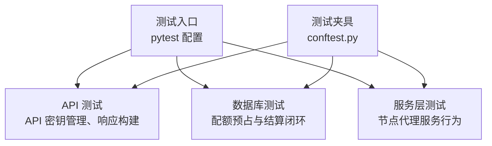
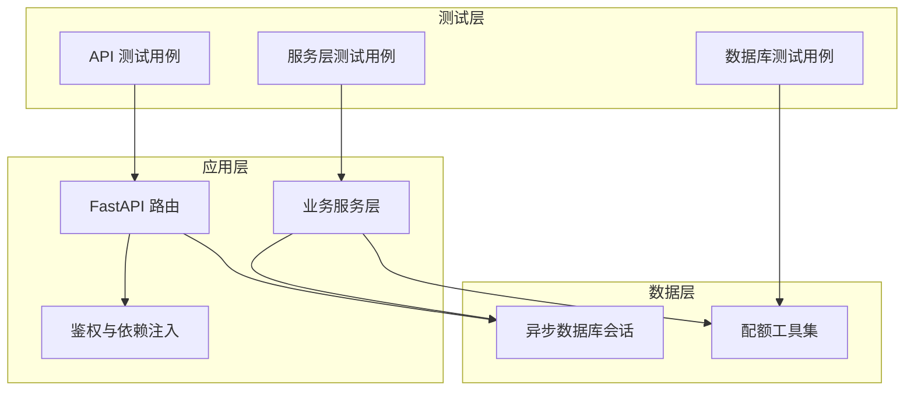
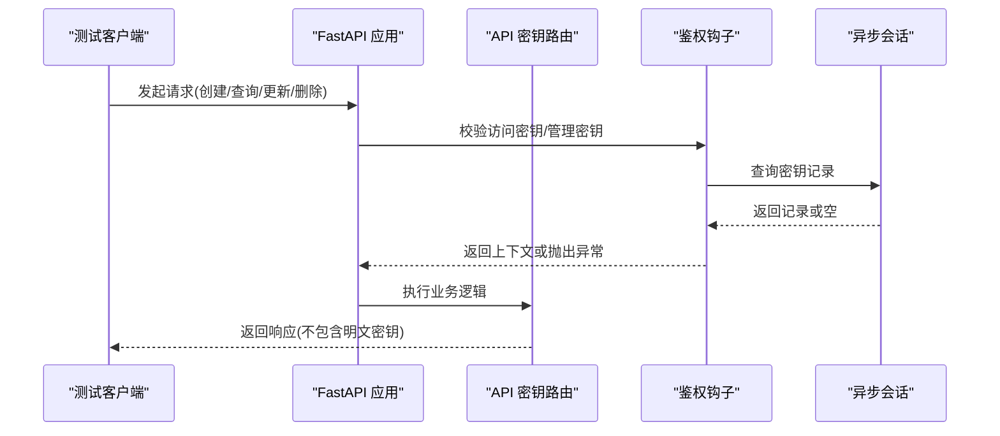
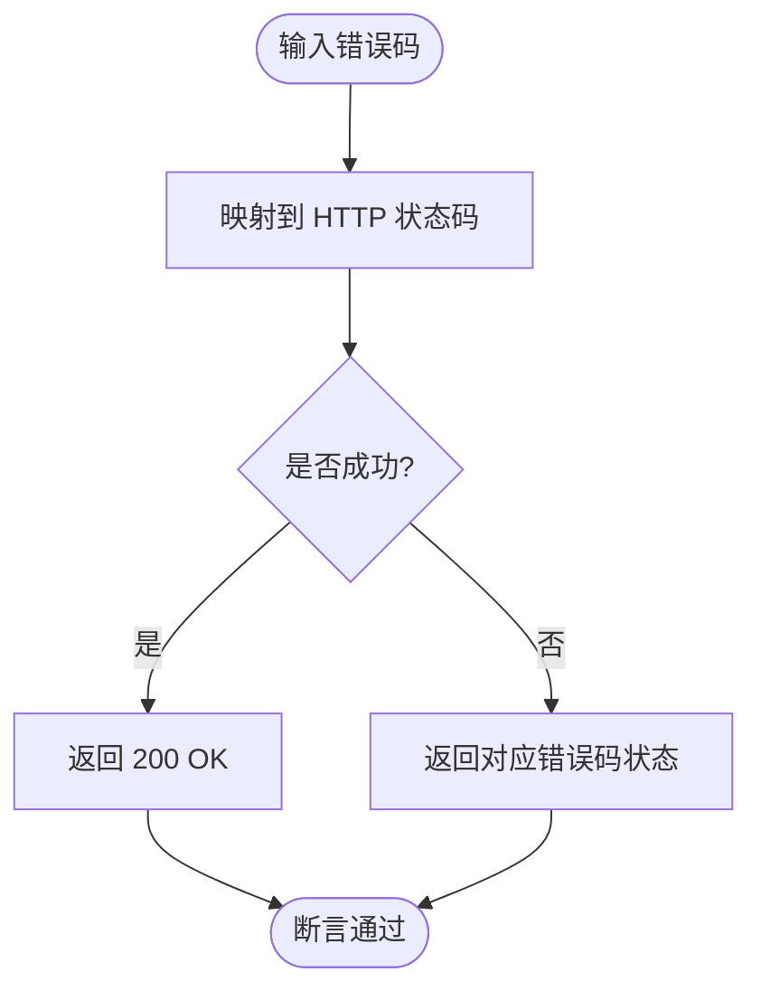
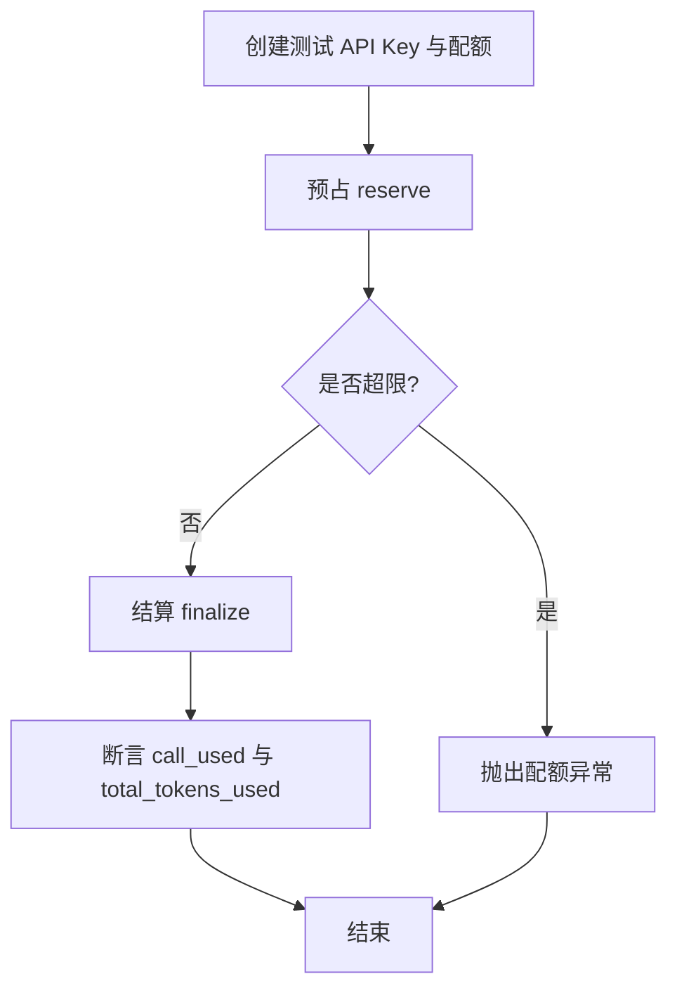
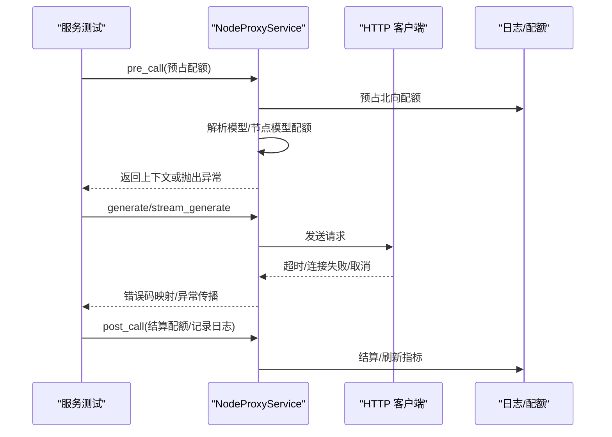
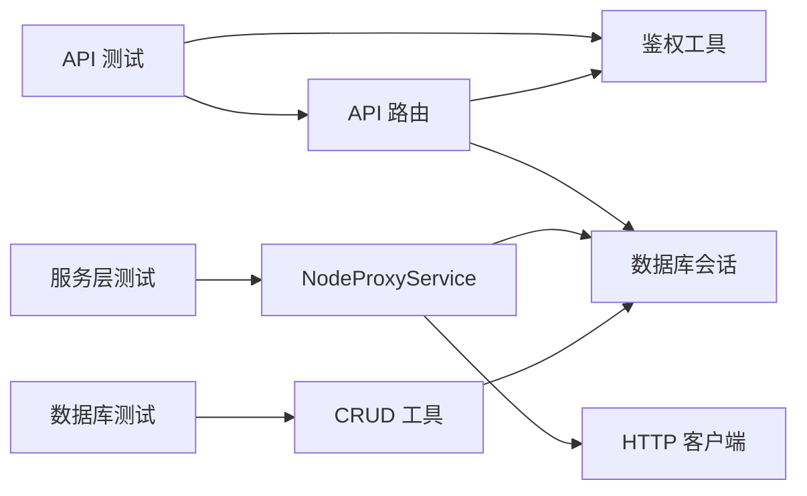

# 测试指南

<cite>
**本文引用的文件**   
- [pyproject.toml](file://src/apiproxy/pyproject.toml)
- [conftest.py](file://src/apiproxy/tests/conftest.py)
- [test_apikey_manager.py](file://src/apiproxy/tests/api/test_apikey_manager.py)
- [test_completions_responses.py](file://src/apiproxy/tests/api/test_completions_responses.py)
- [test_apikey_quota.py](file://src/apiproxy/tests/database/test_apikey_quota.py)
- [test_app_quota.py](file://src/apiproxy/tests/database/test_app_quota.py)
- [test_nodeproxy_service.py](file://src/apiproxy/tests/services/test_nodeproxy_service.py)
- [apikey_manager.py](file://src/apiproxy/openaiproxy/api/apikey_manager.py)
- [utils.py](file://src/apiproxy/openaiproxy/api/utils.py)
- [service.py](file://src/apiproxy/openaiproxy/services/nodeproxy/service.py)
</cite>

## 目录
1. [引言](#引言)
2. [项目结构](#项目结构)
3. [核心组件](#核心组件)
4. [架构总览](#架构总览)
5. [详细组件分析](#详细组件分析)
6. [依赖分析](#依赖分析)
7. [性能考虑](#性能考虑)
8. [故障排查指南](#故障排查指南)
9. [结论](#结论)
10. [附录](#附录)

## 引言
本测试指南面向“大模型接口代理”项目的测试体系，覆盖单元测试、集成测试与端到端测试的设计与实施要点，明确测试覆盖率要求与测量方式，给出测试环境搭建与测试数据准备建议，说明自动化测试与持续集成配置思路，并总结性能测试与压力测试的实践方法及回归测试策略。

## 项目结构
测试目录按功能域划分：API 接口测试、数据库配额闭环测试、服务层行为测试等。pytest 配置集中于工程根部配置文件，统一了日志、标记、并发与覆盖率参数；测试夹具通过会话注入确保数据库一致性与隔离性。

图表来源
- [pyproject.toml:102-119](file://src/apiproxy/pyproject.toml#L102-L119)
- [conftest.py:35-44](file://src/apiproxy/tests/conftest.py#L35-L44)

章节来源
- [pyproject.toml:102-119](file://src/apiproxy/pyproject.toml#L102-L119)
- [conftest.py:35-44](file://src/apiproxy/tests/conftest.py#L35-L44)

## 核心组件
- 测试运行与覆盖率
  - 使用 pytest 运行测试，支持并发与异步模式；通过覆盖率命令行参数启用覆盖率统计与 HTML 报告输出。
  - 覆盖率源范围与忽略规则在配置中集中定义，避免污染报告。
- 测试夹具
  - 初始化服务与数据库会话，确保每个测试函数在独立事务中运行，测试结束后回滚清理。
- 标记与日志
  - 自定义标记用于区分异步测试与需要管理密钥的接口；开启控制台日志便于调试。

章节来源
- [pyproject.toml:102-119](file://src/apiproxy/pyproject.toml#L102-L119)
- [conftest.py:35-44](file://src/apiproxy/tests/conftest.py#L35-L44)

## 架构总览
测试架构围绕“请求-验证-清理”的闭环展开：API 层通过 ASGI 客户端发起请求，经依赖注入替换数据库会话与鉴权钩子，直达业务路由；服务层通过模拟外部依赖（如 HTTP 客户端）验证错误处理与配额逻辑；数据库层通过 CRUD 与配额工具验证预占与结算的正确性。

图表来源
- [test_apikey_manager.py:64-86](file://src/apiproxy/tests/api/test_apikey_manager.py#L64-L86)
- [apikey_manager.py:65-108](file://src/apiproxy/openaiproxy/api/apikey_manager.py#L65-L108)
- [utils.py:85-115](file://src/apiproxy/openaiproxy/api/utils.py#L85-L115)
- [service.py:282-368](file://src/apiproxy/openaiproxy/services/nodeproxy/service.py#L282-L368)

## 详细组件分析

### API 密钥管理测试
- 测试目标
  - 覆盖 API 密钥的增删改查、安全字段不泄露、访问密钥解析与过期校验、兼容旧版令牌、管理密钥配置缺失时的保护行为。
- 关键点
  - 使用 ASGI 传输与依赖覆盖，绕过真实数据库连接，聚焦路由与鉴权逻辑。
  - 对响应体字段进行断言，确保敏感信息不外泄。
  - 通过环境变量模拟管理密钥配置状态，验证受保护接口的行为。
- 用例示例路径
  - [test_apikey_manager.py:88-151](file://src/apiproxy/tests/api/test_apikey_manager.py#L88-L151)
  - [test_apikey_manager.py:154-182](file://src/apiproxy/tests/api/test_apikey_manager.py#L154-L182)
  - [test_apikey_manager.py:184-235](file://src/apiproxy/tests/api/test_apikey_manager.py#L184-L235)
  - [test_apikey_manager.py:265-296](file://src/apiproxy/tests/api/test_apikey_manager.py#L265-L296)
  - [test_apikey_manager.py:299-322](file://src/apiproxy/tests/api/test_apikey_manager.py#L299-L322)

图表来源
- [test_apikey_manager.py:64-86](file://src/apiproxy/tests/api/test_apikey_manager.py#L64-L86)
- [apikey_manager.py:65-108](file://src/apiproxy/openaiproxy/api/apikey_manager.py#L65-L108)
- [utils.py:85-115](file://src/apiproxy/openaiproxy/api/utils.py#L85-L115)

章节来源
- [test_apikey_manager.py:64-151](file://src/apiproxy/tests/api/test_apikey_manager.py#L64-L151)
- [test_apikey_manager.py:154-235](file://src/apiproxy/tests/api/test_apikey_manager.py#L154-L235)
- [test_apikey_manager.py:265-322](file://src/apiproxy/tests/api/test_apikey_manager.py#L265-L322)
- [apikey_manager.py:65-108](file://src/apiproxy/openaiproxy/api/apikey_manager.py#L65-L108)
- [utils.py:85-115](file://src/apiproxy/openaiproxy/api/utils.py#L85-L115)

### 响应构建与错误码映射测试
- 测试目标
  - 验证后端 JSON 响应根据错误码映射到正确的 HTTP 状态码，保证对外一致的错误语义。
- 关键点
  - 输入不同错误码，断言输出状态码与期望一致。
- 用例示例路径
  - [test_completions_responses.py:7-37](file://src/apiproxy/tests/api/test_completions_responses.py#L7-L37)

图表来源
- [test_completions_responses.py:7-37](file://src/apiproxy/tests/api/test_completions_responses.py#L7-L37)

章节来源
- [test_completions_responses.py:7-37](file://src/apiproxy/tests/api/test_completions_responses.py#L7-L37)

### API 密钥配额闭环测试
- 测试目标
  - 验证 API 密钥配额的预占与结算闭环：无配额时放行、超出次数或额度时拒绝、多配额时 FIFO 分摊、最终用量统计准确。
- 关键点
  - 通过 CRUD 与配额工具函数驱动测试，断言调用计数与 token 使用量。
  - 模拟估算 token 超限与最终结算超限的边界条件。
- 用例示例路径
  - [test_apikey_quota.py:82-150](file://src/apiproxy/tests/database/test_apikey_quota.py#L82-L150)
  - [test_apikey_quota.py:151-204](file://src/apiproxy/tests/database/test_apikey_quota.py#L151-L204)
  - [test_apikey_quota.py:206-294](file://src/apiproxy/tests/database/test_apikey_quota.py#L206-L294)

图表来源
- [test_apikey_quota.py:82-150](file://src/apiproxy/tests/database/test_apikey_quota.py#L82-L150)
- [test_apikey_quota.py:151-204](file://src/apiproxy/tests/database/test_apikey_quota.py#L151-L204)
- [test_apikey_quota.py:206-294](file://src/apiproxy/tests/database/test_apikey_quota.py#L206-L294)

章节来源
- [test_apikey_quota.py:82-294](file://src/apiproxy/tests/database/test_apikey_quota.py#L82-L294)

### 应用配额闭环测试
- 测试目标
  - 验证应用维度配额的预占与结算闭环，包括次数与 token 的 FIFO 分配与超限保护。
- 关键点
  - 与 API 密钥配额测试类似，但作用域为应用级别。
- 用例示例路径
  - [test_app_quota.py:63-130](file://src/apiproxy/tests/database/test_app_quota.py#L63-L130)
  - [test_app_quota.py:131-184](file://src/apiproxy/tests/database/test_app_quota.py#L131-L184)
  - [test_app_quota.py:186-274](file://src/apiproxy/tests/database/test_app_quota.py#L186-L274)

章节来源
- [test_app_quota.py:63-274](file://src/apiproxy/tests/database/test_app_quota.py#L63-L274)

### 节点代理服务测试
- 测试目标
  - 验证服务层在请求前后的配额处理、流式与非流式生成、超时与连接失败的错误映射、取消传播与日志落盘。
- 关键点
  - 使用猴子补丁替换底层 HTTP 客户端，构造超时、取消、连接失败等场景。
  - 断言错误码映射与异常传播，验证日志记录与配额结算。
- 用例示例路径
  - [test_nodeproxy_service.py:68-110](file://src/apiproxy/tests/services/test_nodeproxy_service.py#L68-L110)
  - [test_nodeproxy_service.py:111-177](file://src/apiproxy/tests/services/test_nodeproxy_service.py#L111-L177)
  - [test_nodeproxy_service.py:179-225](file://src/apiproxy/tests/services/test_nodeproxy_service.py#L179-L225)

图表来源
- [test_nodeproxy_service.py:68-177](file://src/apiproxy/tests/services/test_nodeproxy_service.py#L68-L177)
- [service.py:282-368](file://src/apiproxy/openaiproxy/services/nodeproxy/service.py#L282-L368)

章节来源
- [test_nodeproxy_service.py:68-225](file://src/apiproxy/tests/services/test_nodeproxy_service.py#L68-L225)
- [service.py:282-368](file://src/apiproxy/openaiproxy/services/nodeproxy/service.py#L282-L368)

## 依赖分析
- 测试与被测模块的耦合
  - API 测试通过依赖覆盖与 ASGI 传输与路由直接交互，耦合度低，便于维护。
  - 服务层测试通过猴子补丁隔离外部依赖，关注内部行为与异常路径。
  - 数据库测试通过异步会话与 CRUD 工具验证数据一致性与边界条件。
- 外部依赖与集成点
  - HTTP 客户端、数据库驱动、时间与时区工具等均通过测试替身或环境变量控制，降低外部环境影响。

图表来源
- [test_apikey_manager.py:64-86](file://src/apiproxy/tests/api/test_apikey_manager.py#L64-L86)
- [utils.py:85-115](file://src/apiproxy/openaiproxy/api/utils.py#L85-L115)
- [test_nodeproxy_service.py:68-177](file://src/apiproxy/tests/services/test_nodeproxy_service.py#L68-L177)
- [service.py:282-368](file://src/apiproxy/openaiproxy/services/nodeproxy/service.py#L282-L368)
- [test_apikey_quota.py:82-150](file://src/apiproxy/tests/database/test_apikey_quota.py#L82-L150)

章节来源
- [test_apikey_manager.py:64-86](file://src/apiproxy/tests/api/test_apikey_manager.py#L64-L86)
- [test_nodeproxy_service.py:68-177](file://src/apiproxy/tests/services/test_nodeproxy_service.py#L68-L177)
- [test_apikey_quota.py:82-150](file://src/apiproxy/tests/database/test_apikey_quota.py#L82-L150)

## 性能考虑
- 并发与异步
  - pytest 配置启用异步模式与并发执行，提升测试吞吐；注意数据库会话与共享资源的线程安全。
- 超时与重试
  - 服务层对超时与连接失败有明确的错误映射与回退策略，测试中应覆盖这些路径以保障稳定性。
- 资源隔离
  - 使用独立会话与回滚机制，避免测试间相互干扰；对高开销场景（如网络请求）采用替身对象。

## 故障排查指南
- 常见问题
  - 管理密钥未配置导致受保护接口返回服务不可用：检查环境变量设置与测试中的依赖覆盖。
  - API 密钥过期或无效：确认鉴权钩子与数据库记录状态。
  - 配额超限：核对预占与结算逻辑，检查估算 token 与最终 token 的边界。
- 排查步骤
  - 启用控制台日志，定位异常发生阶段。
  - 缩小用例范围，逐步排除依赖与数据问题。
  - 使用最小化替身复现问题，验证边界条件。

章节来源
- [pyproject.toml:102-119](file://src/apiproxy/pyproject.toml#L102-L119)
- [test_apikey_manager.py:265-296](file://src/apiproxy/tests/api/test_apikey_manager.py#L265-L296)
- [test_nodeproxy_service.py:111-177](file://src/apiproxy/tests/services/test_nodeproxy_service.py#L111-L177)

## 结论
本测试指南提供了从单元到服务再到数据库的完整测试策略，结合覆盖率配置与并发执行，能够有效保障接口代理在安全性、稳定性与可扩展性方面的质量。建议在持续集成中固定覆盖率阈值与日志级别，配合回归测试与性能压测，持续提升系统可靠性。

## 附录

### 单元测试编写方法与用例设计原则
- 针对性
  - 每个用例聚焦单一行为或边界条件，避免“一揽子”断言。
- 可重复性
  - 使用测试夹具与依赖覆盖，确保每次运行环境一致。
- 可维护性
  - 将公共逻辑抽取为辅助函数或夹具，减少重复代码。

### 集成测试策略与端到端测试实施
- 集成测试
  - 通过 ASGI 传输与依赖覆盖，验证路由、鉴权与数据库交互的整体行为。
- 端到端测试
  - 在本地启动应用并使用真实客户端发起请求，覆盖完整链路；建议在 CI 中使用轻量级数据库与网络替身。

### 测试覆盖率要求与测量方法
- 覆盖率要求
  - 建议关键模块覆盖率不低于 80%，核心路径不低于 90%。
- 测量方法
  - 使用覆盖率命令行参数生成终端与 HTML 报告，定期审查未覆盖分支与异常路径。

章节来源
- [pyproject.toml:114-133](file://src/apiproxy/pyproject.toml#L114-L133)

### 测试环境搭建与测试数据准备
- 环境搭建
  - 安装开发依赖与数据库驱动，配置测试专用数据库与环境变量。
- 测试数据
  - 使用测试夹具创建最小化数据集，确保用例独立且可预测。

章节来源
- [conftest.py:35-44](file://src/apiproxy/tests/conftest.py#L35-L44)
- [pyproject.toml:66-95](file://src/apiproxy/pyproject.toml#L66-L95)

### 自动化测试流程与持续集成配置
- 自动化测试
  - 在本地与 CI 中统一执行 pytest，开启并发与异步模式。
- 持续集成
  - 固定覆盖率阈值，失败即阻断；对关键分支单独触发回归测试。

章节来源
- [pyproject.toml:102-119](file://src/apiproxy/pyproject.toml#L102-L119)

### 性能测试与压力测试指导
- 性能测试
  - 使用替身对象与本地数据库，评估关键路径延迟与吞吐。
- 压力测试
  - 逐步增加并发与请求速率，观察错误映射与回退策略表现。

章节来源
- [test_nodeproxy_service.py:111-177](file://src/apiproxy/tests/services/test_nodeproxy_service.py#L111-L177)
- [service.py:282-368](file://src/apiproxy/openaiproxy/services/nodeproxy/service.py#L282-L368)

### 测试结果分析与回归测试执行
- 结果分析
  - 定期审查覆盖率报告与失败用例，识别热点问题与薄弱环节。
- 回归测试
  - 对修复缺陷的分支执行全量或抽样回归，确保变更不引入新问题。