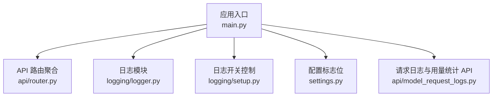
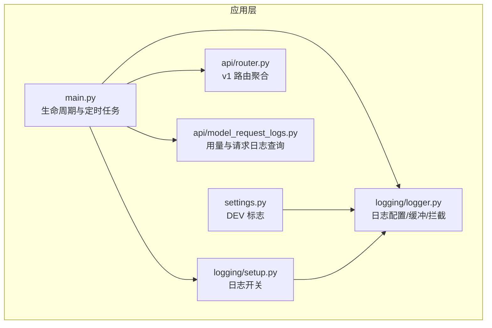
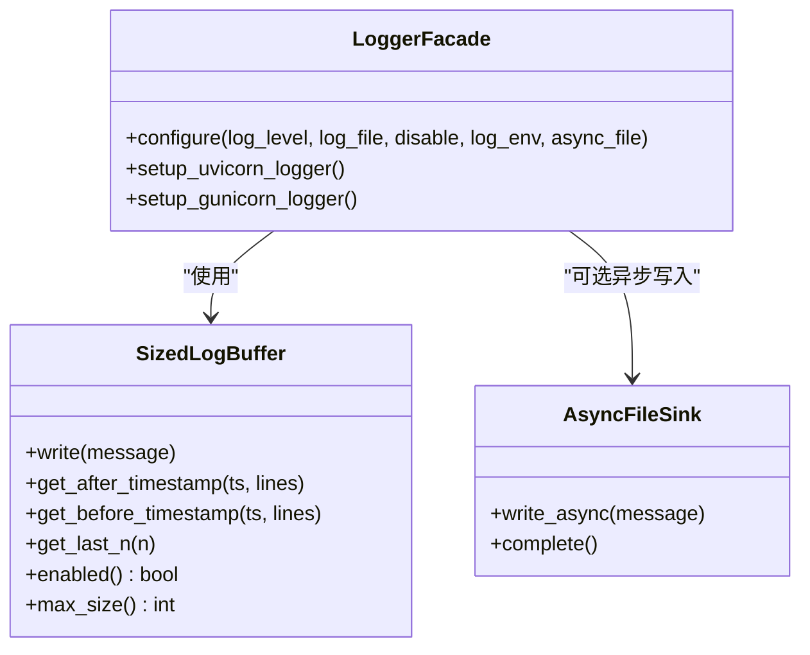
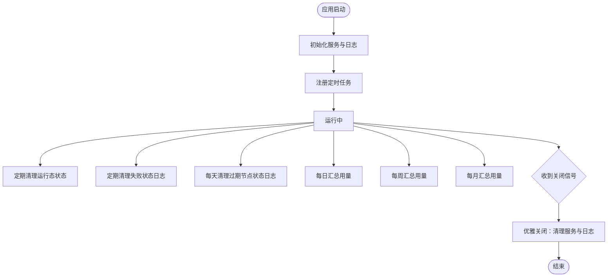
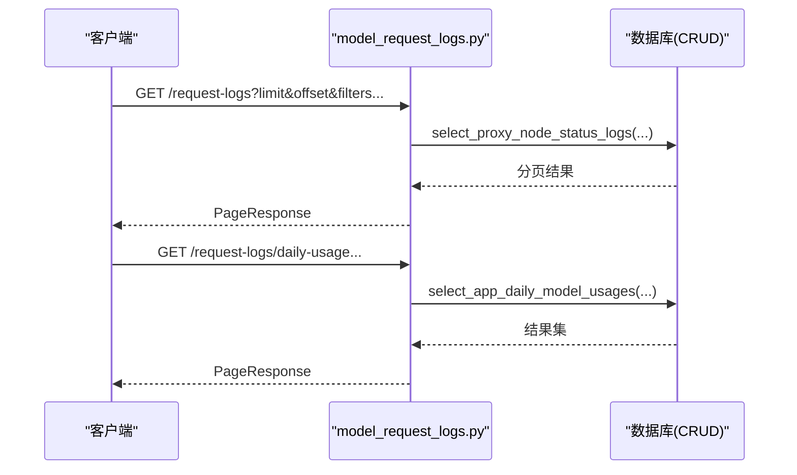
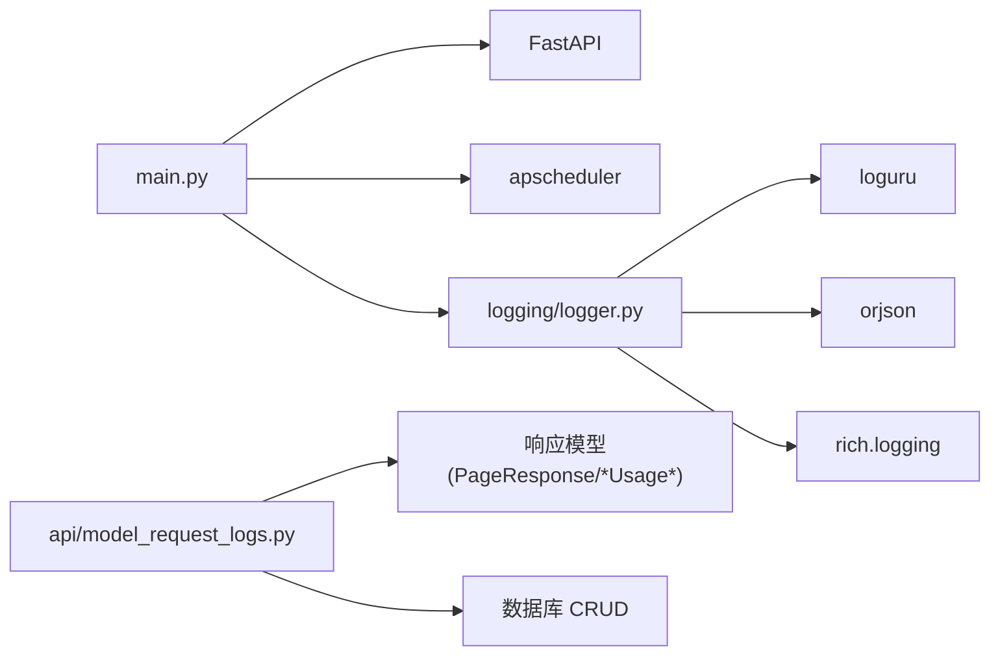

# 监控和日志

<cite>
**本文引用的文件**
- [src/apiproxy/openaiproxy/main.py](file://src/apiproxy/openaiproxy/main.py)
- [src/apiproxy/openaiproxy/logging/logger.py](file://src/apiproxy/openaiproxy/logging/logger.py)
- [src/apiproxy/openaiproxy/logging/setup.py](file://src/apiproxy/openaiproxy/logging/setup.py)
- [src/apiproxy/openaiproxy/settings.py](file://src/apiproxy/openaiproxy/settings.py)
- [src/apiproxy/openaiproxy/api/model_request_logs.py](file://src/apiproxy/openaiproxy/api/model_request_logs.py)
- [src/apiproxy/openaiproxy/api/router.py](file://src/apiproxy/openaiproxy/api/router.py)
</cite>

## 目录
1. [简介](#简介)
2. [项目结构](#项目结构)
3. [核心组件](#核心组件)
4. [架构总览](#架构总览)
5. [详细组件分析](#详细组件分析)
6. [依赖分析](#依赖分析)
7. [性能考虑](#性能考虑)
8. [故障排查指南](#故障排查指南)
9. [结论](#结论)
10. [附录](#附录)

## 简介
本文件面向大模型接口代理系统的监控与日志体系，聚焦以下目标：
- Prometheus 指标采集机制与性能指标定义
- 健康检查与关键告警阈值建议
- OpenTelemetry 集成与分布式追踪思路
- Sentry 错误监控与日志管理策略
- 日志检索与分析方法、仪表板使用与自定义
- 性能优化与容量规划建议
- 监控数据可视化与报告生成方法

当前代码库未直接实现 Prometheus 指标导出、OpenTelemetry 追踪或 Sentry 集成。本文在不虚构现有实现的前提下，基于现有日志与调度能力，给出可落地的监控与日志方案设计与最佳实践。

## 项目结构
本项目采用 FastAPI 应用入口与模块化 API 路由组织方式，日志通过独立模块集中管理，定时任务用于运行态清理与用量汇总，便于扩展监控与告警。

图表来源
- [src/apiproxy/openaiproxy/main.py:128-187](file://src/apiproxy/openaiproxy/main.py#L128-L187)
- [src/apiproxy/openaiproxy/api/router.py:30-45](file://src/apiproxy/openaiproxy/api/router.py#L30-L45)
- [src/apiproxy/openaiproxy/logging/logger.py:194-268](file://src/apiproxy/openaiproxy/logging/logger.py#L194-L268)
- [src/apiproxy/openaiproxy/logging/setup.py:32-43](file://src/apiproxy/openaiproxy/logging/setup.py#L32-L43)
- [src/apiproxy/openaiproxy/settings.py:27-37](file://src/apiproxy/openaiproxy/settings.py#L27-L37)
- [src/apiproxy/openaiproxy/api/model_request_logs.py:128-209](file://src/apiproxy/openaiproxy/api/model_request_logs.py#L128-L209)

章节来源
- [src/apiproxy/openaiproxy/main.py:128-187](file://src/apiproxy/openaiproxy/main.py#L128-L187)
- [src/apiproxy/openaiproxy/api/router.py:30-45](file://src/apiproxy/openaiproxy/api/router.py#L30-L45)
- [src/apiproxy/openaiproxy/logging/logger.py:194-268](file://src/apiproxy/openaiproxy/logging/logger.py#L194-L268)
- [src/apiproxy/openaiproxy/logging/setup.py:32-43](file://src/apiproxy/openaiproxy/logging/setup.py#L32-L43)
- [src/apiproxy/openaiproxy/settings.py:27-37](file://src/apiproxy/openaiproxy/settings.py#L27-L37)
- [src/apiproxy/openaiproxy/api/model_request_logs.py:128-209](file://src/apiproxy/openaiproxy/api/model_request_logs.py#L128-L209)

## 核心组件
- 应用生命周期与定时任务：应用启动时初始化服务与日志，注册周期性任务（运行态清理、节点状态清理、用量汇总等），支持优雅关闭与资源回收。
- 日志系统：统一使用 loguru 管理输出，支持容器环境 JSON/CSV 输出、异步文件写入、缓冲区回放、拦截标准 logging。
- 请求日志与用量统计 API：提供按天/周/月/年维度的用量查询接口，支持分页与过滤，便于监控与审计。
- API 路由聚合：将 v1 的补全、嵌入、重排序、模型列表等路由统一挂载。

章节来源
- [src/apiproxy/openaiproxy/main.py:57-126](file://src/apiproxy/openaiproxy/main.py#L57-L126)
- [src/apiproxy/openaiproxy/logging/logger.py:177-268](file://src/apiproxy/openaiproxy/logging/logger.py#L177-L268)
- [src/apiproxy/openaiproxy/api/model_request_logs.py:128-209](file://src/apiproxy/openaiproxy/api/model_request_logs.py#L128-L209)
- [src/apiproxy/openaiproxy/api/router.py:30-45](file://src/apiproxy/openaiproxy/api/router.py#L30-L45)

## 架构总览
下图展示监控与日志相关的关键交互：应用入口负责日志初始化与定时任务注册；日志模块负责输出与缓冲；请求日志 API 提供查询能力；配置模块提供运行态标志位。

图表来源
- [src/apiproxy/openaiproxy/main.py:57-126](file://src/apiproxy/openaiproxy/main.py#L57-L126)
- [src/apiproxy/openaiproxy/logging/logger.py:194-268](file://src/apiproxy/openaiproxy/logging/logger.py#L194-L268)
- [src/apiproxy/openaiproxy/logging/setup.py:32-43](file://src/apiproxy/openaiproxy/logging/setup.py#L32-L43)
- [src/apiproxy/openaiproxy/settings.py:27-37](file://src/apiproxy/openaiproxy/settings.py#L27-L37)
- [src/apiproxy/openaiproxy/api/model_request_logs.py:128-209](file://src/apiproxy/openaiproxy/api/model_request_logs.py#L128-L209)
- [src/apiproxy/openaiproxy/api/router.py:30-45](file://src/apiproxy/openaiproxy/api/router.py#L30-L45)

## 详细组件分析

### 日志系统（loguru + 缓冲 + 拦截）
- 统一日志格式与输出：支持人类可读、容器 JSON/CSV 输出；默认异步文件写入，避免阻塞主事件循环。
- 缓冲区回放：内置环形缓冲，支持按时间戳前后检索最近日志条目，便于实时监控面板与告警联动。
- 标准库拦截：拦截 uvicorn/gunicorn 日志，统一到 loguru，保证日志一致性。
- 开关控制：提供启用/禁用日志的全局开关，便于在不同环境快速调整。

图表来源
- [src/apiproxy/openaiproxy/logging/logger.py:50-148](file://src/apiproxy/openaiproxy/logging/logger.py#L50-L148)
- [src/apiproxy/openaiproxy/logging/logger.py:177-192](file://src/apiproxy/openaiproxy/logging/logger.py#L177-L192)
- [src/apiproxy/openaiproxy/logging/logger.py:194-268](file://src/apiproxy/openaiproxy/logging/logger.py#L194-L268)

章节来源
- [src/apiproxy/openaiproxy/logging/logger.py:50-148](file://src/apiproxy/openaiproxy/logging/logger.py#L50-L148)
- [src/apiproxy/openaiproxy/logging/logger.py:177-192](file://src/apiproxy/openaiproxy/logging/logger.py#L177-L192)
- [src/apiproxy/openaiproxy/logging/logger.py:194-268](file://src/apiproxy/openaiproxy/logging/logger.py#L194-L268)

### 应用生命周期与定时任务
- 生命周期钩子：启动时初始化服务、注册定时任务；关闭时执行资源清理与日志完成。
- 定时任务：运行态清理、节点状态清理、过期日志清理、每日/每周/每月用量汇总。
- 任务调度器：后台调度器，支持间隔与 Cron 触发。

图表来源
- [src/apiproxy/openaiproxy/main.py:57-126](file://src/apiproxy/openaiproxy/main.py#L57-L126)

章节来源
- [src/apiproxy/openaiproxy/main.py:57-126](file://src/apiproxy/openaiproxy/main.py#L57-L126)

### 请求日志与用量统计 API
- 查询接口：支持按节点、代理、动作、模型名、错误/中断/流式/处理中等条件过滤，支持时间范围与分页。
- 统计接口：按日/周/月/年维度查询应用模型用量，支持按模型筛选与排序。
- 数据校验：对日期/周起始/年份等输入进行严格解析与校验，返回标准化响应。

图表来源
- [src/apiproxy/openaiproxy/api/model_request_logs.py:128-209](file://src/apiproxy/openaiproxy/api/model_request_logs.py#L128-L209)
- [src/apiproxy/openaiproxy/api/model_request_logs.py:216-261](file://src/apiproxy/openaiproxy/api/model_request_logs.py#L216-L261)
- [src/apiproxy/openaiproxy/api/model_request_logs.py:269-314](file://src/apiproxy/openaiproxy/api/model_request_logs.py#L269-L314)
- [src/apiproxy/openaiproxy/api/model_request_logs.py:322-367](file://src/apiproxy/openaiproxy/api/model_request_logs.py#L322-L367)
- [src/apiproxy/openaiproxy/api/model_request_logs.py:376-430](file://src/apiproxy/openaiproxy/api/model_request_logs.py#L376-L430)

章节来源
- [src/apiproxy/openaiproxy/api/model_request_logs.py:128-209](file://src/apiproxy/openaiproxy/api/model_request_logs.py#L128-L209)
- [src/apiproxy/openaiproxy/api/model_request_logs.py:216-261](file://src/apiproxy/openaiproxy/api/model_request_logs.py#L216-L261)
- [src/apiproxy/openaiproxy/api/model_request_logs.py:269-314](file://src/apiproxy/openaiproxy/api/model_request_logs.py#L269-L314)
- [src/apiproxy/openaiproxy/api/model_request_logs.py:322-367](file://src/apiproxy/openaiproxy/api/model_request_logs.py#L322-L367)
- [src/apiproxy/openaiproxy/api/model_request_logs.py:376-430](file://src/apiproxy/openaiproxy/api/model_request_logs.py#L376-L430)

### API 路由聚合
- v1 路由：将补全、嵌入、重排序、模型列表等路由统一挂载到 /v1 前缀，便于后续扩展监控与限流策略。

章节来源
- [src/apiproxy/openaiproxy/api/router.py:30-45](file://src/apiproxy/openaiproxy/api/router.py#L30-L45)

## 依赖分析
- 日志模块依赖：loguru、orjson、rich.logging、platformdirs、asyncio 等，提供高性能异步写入与结构化输出。
- 应用入口依赖：FastAPI、apscheduler、环境变量与版本信息，负责应用生命周期与定时任务。
- 请求日志 API 依赖：分页响应模型、时区工具、数据库 CRUD 接口，确保查询与统计逻辑清晰。

图表来源
- [src/apiproxy/openaiproxy/main.py:39-53](file://src/apiproxy/openaiproxy/main.py#L39-L53)
- [src/apiproxy/openaiproxy/logging/logger.py:27-43](file://src/apiproxy/openaiproxy/logging/logger.py#L27-L43)
- [src/apiproxy/openaiproxy/api/model_request_logs.py:7-36](file://src/apiproxy/openaiproxy/api/model_request_logs.py#L7-L36)

章节来源
- [src/apiproxy/openaiproxy/main.py:39-53](file://src/apiproxy/openaiproxy/main.py#L39-L53)
- [src/apiproxy/openaiproxy/logging/logger.py:27-43](file://src/apiproxy/openaiproxy/logging/logger.py#L27-L43)
- [src/apiproxy/openaiproxy/api/model_request_logs.py:7-36](file://src/apiproxy/openaiproxy/api/model_request_logs.py#L7-L36)

## 性能考虑
- 异步日志写入：使用异步文件 Sink，降低 I/O 对主事件循环的影响，适合高并发场景。
- 缓冲区回放：环形缓冲支持低开销的日志检索，适合实时监控面板与告警触发。
- 定时任务批处理：将清理与汇总任务安排在低峰时段，避免与业务高峰冲突。
- 日志级别与输出：生产环境建议使用容器 JSON 输出，便于日志收集与分析；开发环境使用人类可读输出提升可观测性。

章节来源
- [src/apiproxy/openaiproxy/logging/logger.py:177-192](file://src/apiproxy/openaiproxy/logging/logger.py#L177-L192)
- [src/apiproxy/openaiproxy/logging/logger.py:218-238](file://src/apiproxy/openaiproxy/logging/logger.py#L218-L238)
- [src/apiproxy/openaiproxy/main.py:69-111](file://src/apiproxy/openaiproxy/main.py#L69-L111)

## 故障排查指南
- 启动异常：应用生命周期钩子会捕获异常并记录日志，可通过日志缓冲回放定位问题。
- 日志缺失：检查日志配置是否被禁用、容器环境变量是否正确、异步写入是否完成。
- 定时任务未执行：确认调度器已启动、Cron/间隔配置是否合理、服务初始化是否成功。
- 请求日志查询异常：核对时间格式、周起始日是否为周一、年份格式是否正确；检查分页参数与过滤条件。

章节来源
- [src/apiproxy/openaiproxy/main.py:114-122](file://src/apiproxy/openaiproxy/main.py#L114-L122)
- [src/apiproxy/openaiproxy/logging/setup.py:32-43](file://src/apiproxy/openaiproxy/logging/setup.py#L32-L43)
- [src/apiproxy/openaiproxy/logging/logger.py:218-238](file://src/apiproxy/openaiproxy/logging/logger.py#L218-L238)
- [src/apiproxy/openaiproxy/api/model_request_logs.py:50-93](file://src/apiproxy/openaiproxy/api/model_request_logs.py#L50-L93)

## 结论
当前系统具备完善的日志与调度基础，可作为监控与告警体系的观测面。建议在此基础上引入 Prometheus 指标导出、OpenTelemetry 追踪与 Sentry 错误上报，以形成端到端的可观测性闭环。

## 附录

### Prometheus 指标与告警建议（基于现有能力扩展）
- 指标建议
  - 应用级
    - up：应用健康状态（1 表示健康）
    - process_start_time_seconds：进程启动时间
    - http_requests_total{method, endpoint, status}：HTTP 请求总量
    - http_request_duration_seconds{method, endpoint}：请求耗时直方图
    - log_buffer_size{source="buffer"}：日志缓冲区大小
    - log_buffer_entries{source="buffer"}：缓冲区条目数
  - 业务级
    - model_request_count_total{action, model_name, ownerapp_id}：模型调用次数
    - model_token_usage_total{action, model_name, ownerapp_id, type="prompt|completion"}：令牌用量
    - node_status_count{status, node_id}：节点状态分布
    - quota_exceeded_total{type="daily|monthly|app"}：配额超限次数
- 告警规则示例（阈值为示例，请结合实际压测与SLA调整）
  - 严重：up != 1 或 5m 内 http_request_duration_seconds{quantile="0.99"} > X 秒
  - 一般：1h 内 model_token_usage_total 增长率 > Y 条件触发容量预警
  - 轻微：log_buffer_entries 持续接近 log_buffer_size

### OpenTelemetry 集成与分布式追踪
- 在应用入口与 API 路由中注入 Trace 上下文，记录请求 ID、父 Span、标签（如模型名、动作、应用 ID）。
- 将日志与追踪 ID 关联，便于跨系统串联定位问题。
- 导出到 Jaeger/Zipkin 或云厂商 OTEL 平台，统一采集与检索。

### Sentry 错误监控与日志管理
- 在应用入口与关键服务处捕获异常并上报 Sentry，保留上下文（请求头、用户标识、模型参数摘要）。
- 使用日志缓冲回放能力，将最近日志片段随错误一起上报，辅助复现。
- 配置采样率与敏感信息脱敏，避免泄露。

### 日志分析与仪表板
- 日志检索：利用日志缓冲的按时间戳检索能力，构建实时仪表板（如最近 N 条日志、错误趋势）。
- 用量分析：通过请求日志 API 获取日/周/月/年用量，结合可视化工具生成趋势图与排行。
- 仪表板自定义：按应用、模型、动作维度切片，支持下钻与导出。

### 性能优化与容量规划
- I/O 优化：保持异步文件写入；根据磁盘吞吐调整日志轮转与缓冲大小。
- 调度优化：将高成本任务（用量汇总）安排在业务低峰；监控任务执行时延。
- 容量规划：基于历史用量与增长趋势，预留 20%-50% 缓冲；结合告警阈值设定扩容策略。

### 可视化与报告
- 实时看板：展示请求量、错误率、耗时、令牌用量、配额使用率。
- 周报/月报：自动化导出用量统计与趋势图表，支持邮件或消息推送。