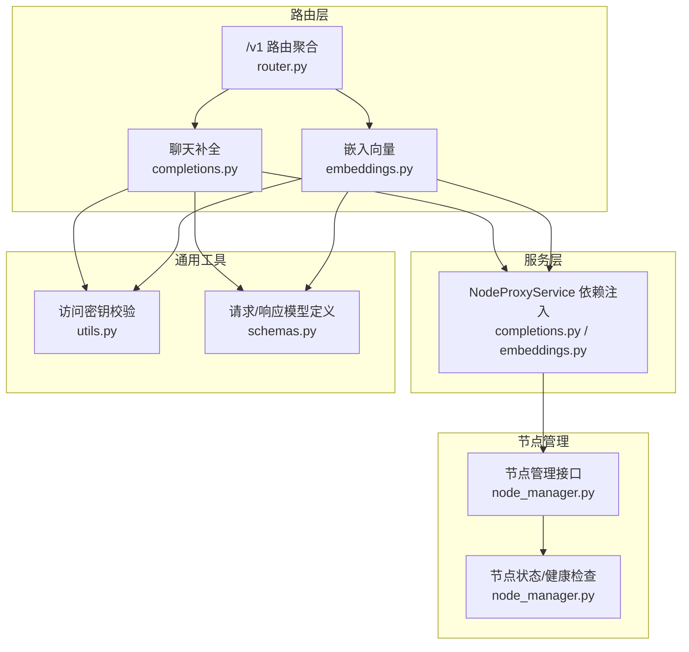
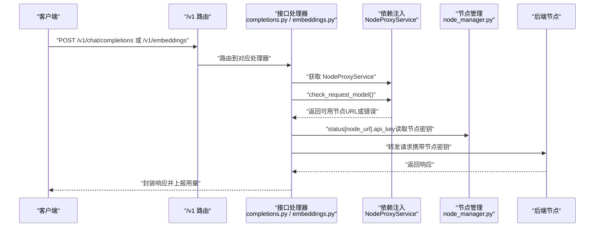
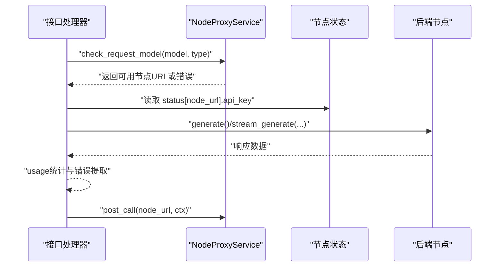
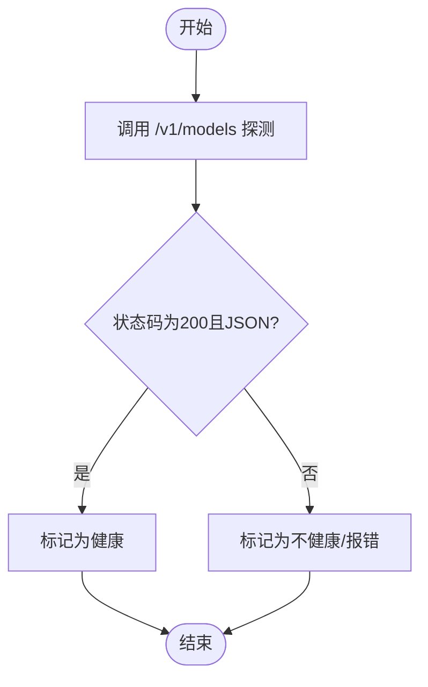
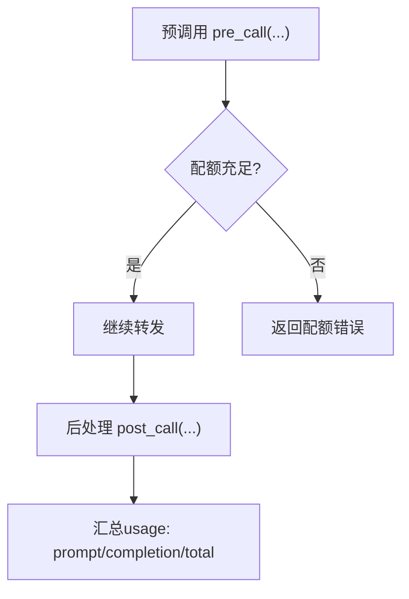
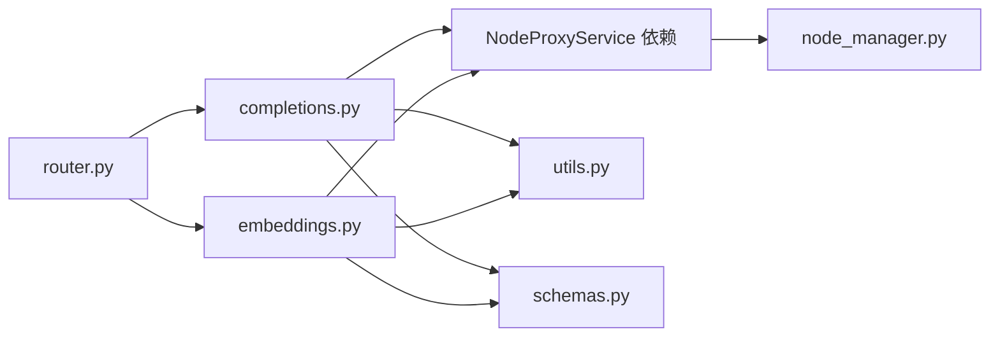
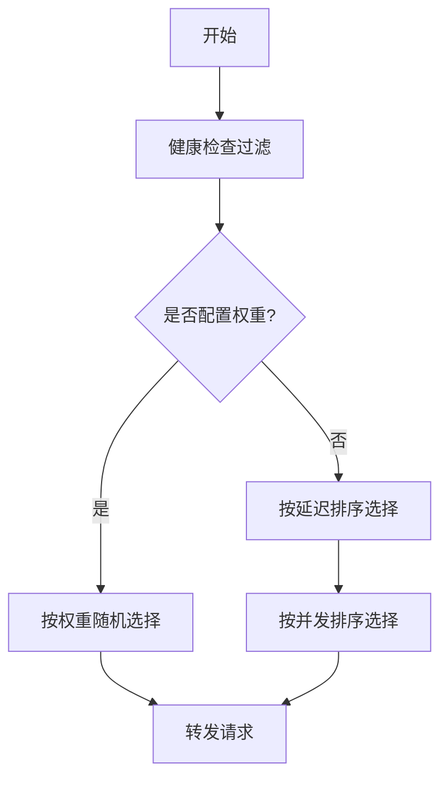

# 负载均衡策略

<cite>
**本文引用的文件**
- [src/apiproxy/openaiproxy/api/v1/completions.py](file://src/apiproxy/openaiproxy/api/v1/completions.py)
- [src/apiproxy/openaiproxy/api/v1/embeddings.py](file://src/apiproxy/openaiproxy/api/v1/embeddings.py)
- [src/apiproxy/openaiproxy/api/router.py](file://src/apiproxy/openaiproxy/api/router.py)
- [src/apiproxy/openaiproxy/api/schemas.py](file://src/apiproxy/openaiproxy/api/schemas.py)
- [src/apiproxy/openaiproxy/api/node_manager.py](file://src/apiproxy/openaiproxy/api/node_manager.py)
- [src/apiproxy/openaiproxy/api/utils.py](file://src/apiproxy/openaiproxy/api/utils.py)
</cite>

## 目录
1. [引言](#引言)
2. [项目结构](#项目结构)
3. [核心组件](#核心组件)
4. [架构总览](#架构总览)
5. [详细组件分析](#详细组件分析)
6. [依赖分析](#依赖分析)
7. [性能考量](#性能考量)
8. [故障排查指南](#故障排查指南)
9. [结论](#结论)
10. [附录](#附录)

## 引言
本文件面向“大模型接口代理”的负载均衡策略，结合代码库中的实际实现，系统阐述负载均衡算法的原理与落地方式，覆盖以下主题：
- 节点选择策略：最小延迟、随机权重、最小处理中
- 性能指标采集与动态调整
- 节点健康检查与故障转移
- 配置优化与性能调优
- 不同场景下的策略选择与最佳实践
- 监控指标与效果评估
- 扩展性与高可用设计

需要特别说明的是：当前仓库中未发现明确的“最小延迟”“随机权重”“最小处理中”等具体算法实现；但通过节点状态、健康检查、配额控制与请求上下文的协同，可以实现具备类似能力的负载均衡行为。本文将基于现有代码进行解读，并给出可落地的策略建议与流程图示。

## 项目结构
该系统采用 FastAPI 架构，路由层负责接收 OpenAI 兼容接口请求，业务层通过 NodeProxyService 进行节点选择与转发，节点管理模块负责节点的增删改查与健康检查。

图表来源
- [src/apiproxy/openaiproxy/api/router.py:30-45](file://src/apiproxy/openaiproxy/api/router.py#L30-L45)
- [src/apiproxy/openaiproxy/api/v1/completions.py:447-450](file://src/apiproxy/openaiproxy/api/v1/completions.py#L447-L450)
- [src/apiproxy/openaiproxy/api/v1/embeddings.py:271-274](file://src/apiproxy/openaiproxy/api/v1/embeddings.py#L271-L274)
- [src/apiproxy/openaiproxy/api/node_manager.py:119-180](file://src/apiproxy/openaiproxy/api/node_manager.py#L119-L180)
- [src/apiproxy/openaiproxy/api/utils.py:82-115](file://src/apiproxy/openaiproxy/api/utils.py#L82-L115)
- [src/apiproxy/openaiproxy/api/schemas.py:432-437](file://src/apiproxy/openaiproxy/api/schemas.py#L432-L437)

章节来源
- [src/apiproxy/openaiproxy/api/router.py:30-45](file://src/apiproxy/openaiproxy/api/router.py#L30-L45)
- [src/apiproxy/openaiproxy/api/v1/completions.py:447-450](file://src/apiproxy/openaiproxy/api/v1/completions.py#L447-L450)
- [src/apiproxy/openaiproxy/api/v1/embeddings.py:271-274](file://src/apiproxy/openaiproxy/api/v1/embeddings.py#L271-L274)
- [src/apiproxy/openaiproxy/api/node_manager.py:119-180](file://src/apiproxy/openaiproxy/api/node_manager.py#L119-L180)
- [src/apiproxy/openaiproxy/api/utils.py:82-115](file://src/apiproxy/openaiproxy/api/utils.py#L82-L115)
- [src/apiproxy/openaiproxy/api/schemas.py:432-437](file://src/apiproxy/openaiproxy/api/schemas.py#L432-L437)

## 核心组件
- 路由与接口
  - /v1 路由聚合，包含聊天补全与嵌入向量接口。
  - 接口层通过依赖注入获取 NodeProxyService，完成节点选择与转发。
- 访问密钥校验
  - 提供统一的访问密钥校验逻辑，保障管理与业务接口安全。
- 节点管理
  - 节点的增删改查、健康检查开关、模型列表同步与校验。
- 数据模型
  - 定义分页响应、节点模型配额、用量统计等模型，支撑配额与监控。

章节来源
- [src/apiproxy/openaiproxy/api/router.py:30-45](file://src/apiproxy/openaiproxy/api/router.py#L30-L45)
- [src/apiproxy/openaiproxy/api/v1/completions.py:447-450](file://src/apiproxy/openaiproxy/api/v1/completions.py#L447-L450)
- [src/apiproxy/openaiproxy/api/v1/embeddings.py:271-274](file://src/apiproxy/openaiproxy/api/v1/embeddings.py#L271-L274)
- [src/apiproxy/openaiproxy/api/utils.py:82-115](file://src/apiproxy/openaiproxy/api/utils.py#L82-L115)
- [src/apiproxy/openaiproxy/api/schemas.py:432-437](file://src/apiproxy/openaiproxy/api/schemas.py#L432-L437)
- [src/apiproxy/openaiproxy/api/node_manager.py:340-580](file://src/apiproxy/openaiproxy/api/node_manager.py#L340-L580)

## 架构总览
下图展示从客户端到后端节点的整体链路，以及负载均衡的关键参与方（节点状态、健康检查、配额）。

图表来源
- [src/apiproxy/openaiproxy/api/v1/completions.py:511-526](file://src/apiproxy/openaiproxy/api/v1/completions.py#L511-L526)
- [src/apiproxy/openaiproxy/api/v1/completions.py:555-560](file://src/apiproxy/openaiproxy/api/v1/completions.py#L555-L560)
- [src/apiproxy/openaiproxy/api/v1/embeddings.py:287-294](file://src/apiproxy/openaiproxy/api/v1/embeddings.py#L287-L294)
- [src/apiproxy/openaiproxy/api/v1/embeddings.py:325-327](file://src/apiproxy/openaiproxy/api/v1/embeddings.py#L325-L327)
- [src/apiproxy/openaiproxy/api/node_manager.py:119-180](file://src/apiproxy/openaiproxy/api/node_manager.py#L119-L180)

## 详细组件分析

### 组件A：节点选择与转发（接口层）
- 聊天补全与嵌入向量接口均通过 NodeProxyService 获取目标节点 URL，并在转发时携带节点密钥。
- 处理器在预调用阶段记录请求上下文（如 token 估算、是否流式、客户端 IP 等），并在后处理阶段上报用量与错误信息。

图表来源
- [src/apiproxy/openaiproxy/api/v1/completions.py:511-526](file://src/apiproxy/openaiproxy/api/v1/completions.py#L511-L526)
- [src/apiproxy/openaiproxy/api/v1/completions.py:555-560](file://src/apiproxy/openaiproxy/api/v1/completions.py#L555-L560)
- [src/apiproxy/openaiproxy/api/v1/embeddings.py:287-294](file://src/apiproxy/openaiproxy/api/v1/embeddings.py#L287-L294)
- [src/apiproxy/openaiproxy/api/v1/embeddings.py:325-327](file://src/apiproxy/openaiproxy/api/v1/embeddings.py#L325-L327)

章节来源
- [src/apiproxy/openaiproxy/api/v1/completions.py:511-526](file://src/apiproxy/openaiproxy/api/v1/completions.py#L511-L526)
- [src/apiproxy/openaiproxy/api/v1/completions.py:555-560](file://src/apiproxy/openaiproxy/api/v1/completions.py#L555-L560)
- [src/apiproxy/openaiproxy/api/v1/embeddings.py:287-294](file://src/apiproxy/openaiproxy/api/v1/embeddings.py#L287-L294)
- [src/apiproxy/openaiproxy/api/v1/embeddings.py:325-327](file://src/apiproxy/openaiproxy/api/v1/embeddings.py#L325-L327)

### 组件B：节点健康检查与可用性
- 节点管理接口支持开启/关闭健康检查开关，并提供对节点 /v1/models 的探测以验证连通性与返回格式。
- 当健康检查失败或返回非 200/非 JSON 时，接口会抛出相应错误，避免将请求转发至不可用节点。

图表来源
- [src/apiproxy/openaiproxy/api/node_manager.py:119-180](file://src/apiproxy/openaiproxy/api/node_manager.py#L119-L180)

章节来源
- [src/apiproxy/openaiproxy/api/node_manager.py:119-180](file://src/apiproxy/openaiproxy/api/node_manager.py#L119-L180)

### 组件C：配额与用量（影响负载均衡决策）
- 接口层在预调用阶段传入请求计数与估算总 token 数，用于配额控制与用量统计。
- 当节点模型配额不足时，接口直接返回配额耗尽错误，避免无效转发。
- 用量统计在后处理阶段完成，支持 prompt_tokens、completion_tokens、total_tokens 的归集。

图表来源
- [src/apiproxy/openaiproxy/api/v1/completions.py:534-550](file://src/apiproxy/openaiproxy/api/v1/completions.py#L534-L550)
- [src/apiproxy/openaiproxy/api/v1/completions.py:689-690](file://src/apiproxy/openaiproxy/api/v1/completions.py#L689-L690)
- [src/apiproxy/openaiproxy/api/v1/embeddings.py:304-323](file://src/apiproxy/openaiproxy/api/v1/embeddings.py#L304-L323)
- [src/apiproxy/openaiproxy/api/v1/embeddings.py:354-355](file://src/apiproxy/openaiproxy/api/v1/embeddings.py#L354-L355)

章节来源
- [src/apiproxy/openaiproxy/api/v1/completions.py:534-550](file://src/apiproxy/openaiproxy/api/v1/completions.py#L534-L550)
- [src/apiproxy/openaiproxy/api/v1/completions.py:689-690](file://src/apiproxy/openaiproxy/api/v1/completions.py#L689-L690)
- [src/apiproxy/openaiproxy/api/v1/embeddings.py:304-323](file://src/apiproxy/openaiproxy/api/v1/embeddings.py#L304-L323)
- [src/apiproxy/openaiproxy/api/v1/embeddings.py:354-355](file://src/apiproxy/openaiproxy/api/v1/embeddings.py#L354-L355)

### 组件D：访问密钥与安全
- 提供两种密钥校验：普通访问与严格管理密钥，分别用于 /v1 接口与管理接口。
- 未配置管理密钥时，管理接口直接拒绝访问，避免泄露敏感操作。

章节来源
- [src/apiproxy/openaiproxy/api/utils.py:82-115](file://src/apiproxy/openaiproxy/api/utils.py#L82-L115)
- [src/apiproxy/openaiproxy/api/utils.py:116-216](file://src/apiproxy/openaiproxy/api/utils.py#L116-L216)

## 依赖分析
- 路由层依赖接口处理器，接口处理器依赖 NodeProxyService 与节点状态。
- 节点状态来源于节点管理模块，健康检查与模型探测贯穿于节点生命周期。
- 分页响应与用量统计模型为监控与配额提供数据基础。

图表来源
- [src/apiproxy/openaiproxy/api/router.py:30-45](file://src/apiproxy/openaiproxy/api/router.py#L30-L45)
- [src/apiproxy/openaiproxy/api/v1/completions.py:447-450](file://src/apiproxy/openaiproxy/api/v1/completions.py#L447-L450)
- [src/apiproxy/openaiproxy/api/v1/embeddings.py:271-274](file://src/apiproxy/openaiproxy/api/v1/embeddings.py#L271-L274)
- [src/apiproxy/openaiproxy/api/node_manager.py:119-180](file://src/apiproxy/openaiproxy/api/node_manager.py#L119-L180)
- [src/apiproxy/openaiproxy/api/utils.py:82-115](file://src/apiproxy/openaiproxy/api/utils.py#L82-L115)
- [src/apiproxy/openaiproxy/api/schemas.py:432-437](file://src/apiproxy/openaiproxy/api/schemas.py#L432-L437)

章节来源
- [src/apiproxy/openaiproxy/api/router.py:30-45](file://src/apiproxy/openaiproxy/api/router.py#L30-L45)
- [src/apiproxy/openaiproxy/api/v1/completions.py:447-450](file://src/apiproxy/openaiproxy/api/v1/completions.py#L447-L450)
- [src/apiproxy/openaiproxy/api/v1/embeddings.py:271-274](file://src/apiproxy/openaiproxy/api/v1/embeddings.py#L271-L274)
- [src/apiproxy/openaiproxy/api/node_manager.py:119-180](file://src/apiproxy/openaiproxy/api/node_manager.py#L119-L180)
- [src/apiproxy/openaiproxy/api/utils.py:82-115](file://src/apiproxy/openaiproxy/api/utils.py#L82-L115)
- [src/apiproxy/openaiproxy/api/schemas.py:432-437](file://src/apiproxy/openaiproxy/api/schemas.py#L432-L437)

## 性能考量
- 延迟与吞吐
  - 流式响应支持首包时间记录与断连检测，有助于评估节点延迟与稳定性。
  - 用量统计在后处理阶段完成，避免阻塞主链路。
- 资源占用
  - 预估 token 数用于配额控制与调度参考，减少无效转发。
- 可观测性
  - 错误信息与堆栈在后处理阶段合并，便于定位问题根因。
- 配额与公平性
  - 节点模型配额与应用/密钥配额共同约束请求规模，避免单节点过载。

章节来源
- [src/apiproxy/openaiproxy/api/v1/completions.py:577-650](file://src/apiproxy/openaiproxy/api/v1/completions.py#L577-L650)
- [src/apiproxy/openaiproxy/api/v1/completions.py:689-690](file://src/apiproxy/openaiproxy/api/v1/completions.py#L689-L690)
- [src/apiproxy/openaiproxy/api/v1/embeddings.py:304-323](file://src/apiproxy/openaiproxy/api/v1/embeddings.py#L304-L323)
- [src/apiproxy/openaiproxy/api/v1/embeddings.py:354-355](file://src/apiproxy/openaiproxy/api/v1/embeddings.py#L354-L355)

## 故障排查指南
- 健康检查失败
  - 现象：节点 /v1/models 探测失败或返回非 JSON。
  - 处理：检查节点可达性、鉴权头、返回格式；必要时关闭健康检查开关以允许手动干预。
- 配额不足
  - 现象：返回配额耗尽错误。
  - 处理：提升节点模型配额或切换到其他可用节点。
- 断连与超时
  - 现象：流式响应过程中客户端断开或后端超时。
  - 处理：启用断连回调，确保资源清理与用量上报；优化上游超时与重试策略。
- 密钥与权限
  - 现象：401/503 等鉴权相关错误。
  - 处理：确认管理密钥配置与访问令牌有效性。

章节来源
- [src/apiproxy/openaiproxy/api/node_manager.py:119-180](file://src/apiproxy/openaiproxy/api/node_manager.py#L119-L180)
- [src/apiproxy/openaiproxy/api/v1/completions.py:547-554](file://src/apiproxy/openaiproxy/api/v1/completions.py#L547-L554)
- [src/apiproxy/openaiproxy/api/v1/embeddings.py:316-323](file://src/apiproxy/openaiproxy/api/v1/embeddings.py#L316-L323)
- [src/apiproxy/openaiproxy/api/utils.py:82-115](file://src/apiproxy/openaiproxy/api/utils.py#L82-L115)

## 结论
- 本系统通过“节点状态+健康检查+配额控制+用量统计”的组合，实现了具备负载均衡能力的请求分发。
- 虽未直接实现“最小延迟/随机权重/最小处理中”等具体算法，但可通过扩展 NodeProxyService 的节点选择逻辑与外部指标采集，达到类似效果。
- 建议在生产环境中引入外部指标（如延迟、并发、错误率）与自适应权重，配合健康检查与配额限制，形成闭环的动态调度。

## 附录

### 负载均衡策略设计（概念性）
以下为三种常见策略的概念说明与落地建议（非现有代码实现）：

- 最小延迟
  - 采集每个节点的首包时间与平均响应时间，优先选择延迟最低的节点。
  - 落地建议：在 NodeProxyService 中维护节点延迟样本，定期刷新；结合健康检查剔除不可用节点。
- 随机权重
  - 基于节点权重（如容量、SLA）进行加权随机选择，权重越高被选中概率越大。
  - 落地建议：权重可来自节点配置或外部指标；每次选择前重新计算权重和阈值。
- 最小处理中
  - 依据节点当前正在处理的请求数（并发）进行选择，优先选择并发较低的节点。
  - 落地建议：在 NodeProxyService 中维护每个节点的并发计数；并发计数可来自内部统计或外部探针。

[此图为概念示意，无需图表来源]

### 监控指标与评估方法
- 指标
  - 节点级：延迟（首包/平均）、并发、错误率、成功率、吞吐。
  - 应用级：请求量、配额使用率、平均响应时间、P95/P99 延迟。
- 评估方法
  - A/B 实验对比不同策略的延迟与错误率变化。
  - 回归分析配额与并发对延迟的影响。
  - 告警阈值：延迟突增、错误率上升、并发接近上限。

[本节为通用指导，无需章节来源]

### 配置优化与性能调优
- 节点健康检查
  - 合理设置探测间隔与超时，避免误判。
  - 对于不稳定网络环境，可临时关闭自动健康检查，改为手动维护。
- 配额与限流
  - 为节点模型设置合理配额，结合应用/密钥配额形成多层保护。
  - 在高峰期适当提高并发上限，同时观察延迟与错误率。
- 日志与追踪
  - 开启关键链路日志，保留请求上下文与用量信息，便于事后分析。

[本节为通用指导，无需章节来源]

### 场景化策略选择与最佳实践
- 低延迟优先
  - 适用：实时对话、在线推理。
  - 建议：启用最小延迟策略，结合健康检查与并发上限。
- 公平分配
  - 适用：多租户共享集群。
  - 建议：启用随机权重策略，权重与 SLA/容量匹配。
- 稳定性优先
  - 适用：批处理、离线任务。
  - 建议：启用最小处理中策略，避免热点节点过载。

[本节为通用指导，无需章节来源]

### 扩展性与高可用设计
- 横向扩展
  - 通过增加节点数量与合理的权重/并发策略，线性提升吞吐。
- 高可用
  - 多副本部署与故障转移：健康检查失败时自动摘除，流量快速切换。
  - 多区域部署：跨区域冗余与就近路由，降低跨域延迟。
- 自动化运维
  - 基于指标的自愈：当节点延迟或错误率超过阈值，自动降权或隔离。
  - 动态扩缩容：根据并发与延迟趋势，自动增减节点实例。

[本节为通用指导，无需章节来源]