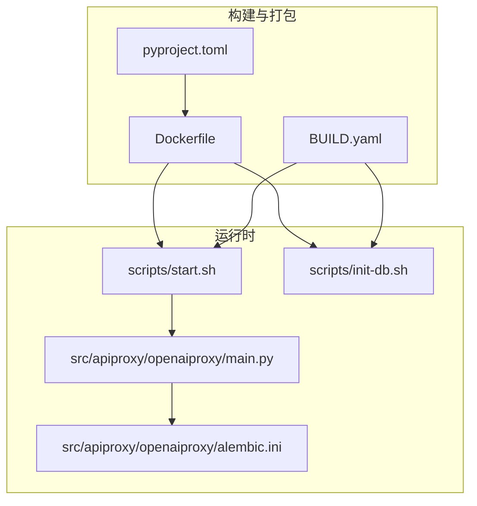
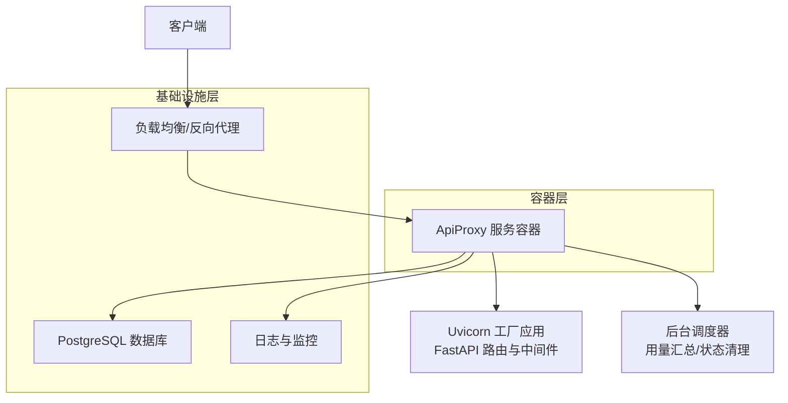
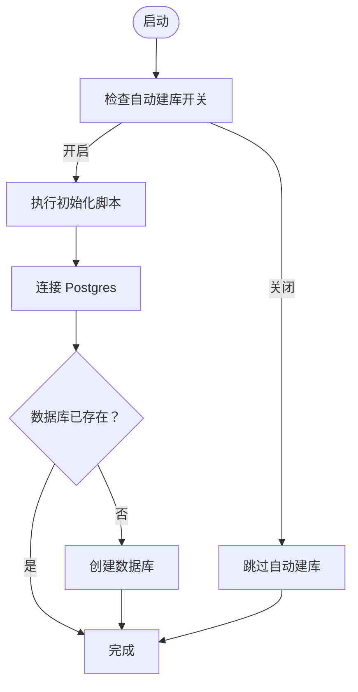
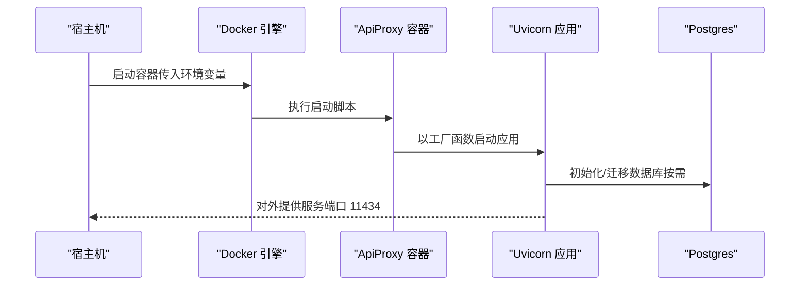
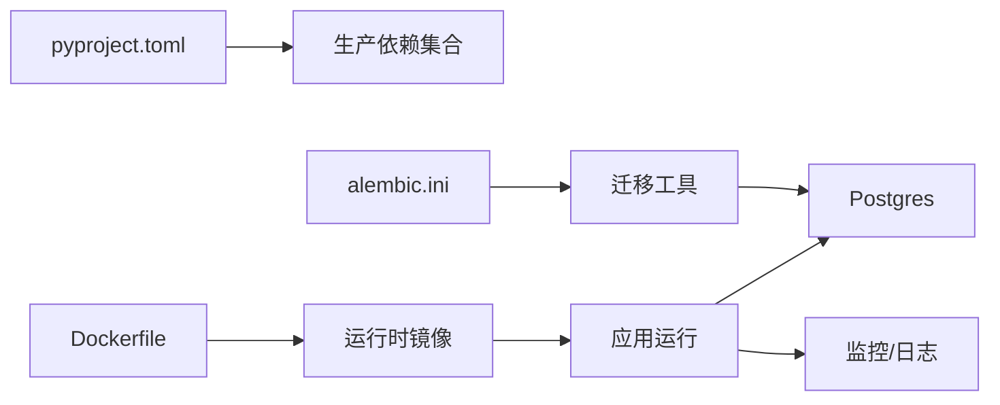

# 部署指南

<cite>
**本文引用的文件**
- [Dockerfile](file://Dockerfile)
- [BUILD.yaml](file://BUILD.yaml)
- [scripts/start.sh](file://scripts/start.sh)
- [scripts/init-db.sh](file://scripts/init-db.sh)
- [src/apiproxy/openaiproxy/main.py](file://src/apiproxy/openaiproxy/main.py)
- [src/apiproxy/openaiproxy/settings.py](file://src/apiproxy/openaiproxy/settings.py)
- [src/apiproxy/openaiproxy/alembic.ini](file://src/apiproxy/openaiproxy/alembic.ini)
- [src/apiproxy/pyproject.toml](file://src/apiproxy/pyproject.toml)
</cite>

## 目录
1. [简介](#简介)
2. [项目结构](#项目结构)
3. [核心组件](#核心组件)
4. [架构总览](#架构总览)
5. [详细组件分析](#详细组件分析)
6. [依赖分析](#依赖分析)
7. [性能考虑](#性能考虑)
8. [故障排查指南](#故障排查指南)
9. [结论](#结论)
10. [附录](#附录)

## 简介
本指南面向生产环境部署“大模型接口代理”系统，覆盖服务器准备、依赖安装、数据库配置、Docker 容器化部署、Kubernetes 集群管理、负载均衡与反向代理、SSL 与网络安全、监控与日志、备份与恢复、滚动更新与蓝绿部署、以及部署验证与故障排查。内容基于仓库中的构建与运行脚本、配置文件与主程序入口进行梳理与落地。

## 项目结构
该工程采用“单体后端 + 内置静态资源”的结构，核心运行入口通过 Uvicorn 工厂函数启动 FastAPI 应用；数据库迁移工具 Alembic 位于项目内；Dockerfile 提供多阶段构建与运行时镜像；BUILD.yaml 描述了镜像构建参数、服务端口映射、环境变量、前置初始化与健康检查。

图示来源
- [Dockerfile:1-66](file://Dockerfile#L1-L66)
- [BUILD.yaml:1-55](file://BUILD.yaml#L1-L55)
- [scripts/start.sh:1-11](file://scripts/start.sh#L1-L11)
- [scripts/init-db.sh:1-34](file://scripts/init-db.sh#L1-L34)
- [src/apiproxy/openaiproxy/main.py:128-187](file://src/apiproxy/openaiproxy/main.py#L128-L187)
- [src/apiproxy/openaiproxy/alembic.ini:63-66](file://src/apiproxy/openaiproxy/alembic.ini#L63-L66)

章节来源
- [Dockerfile:1-66](file://Dockerfile#L1-L66)
- [BUILD.yaml:1-55](file://BUILD.yaml#L1-L55)
- [scripts/start.sh:1-11](file://scripts/start.sh#L1-L11)
- [scripts/init-db.sh:1-34](file://scripts/init-db.sh#L1-L34)
- [src/apiproxy/openaiproxy/main.py:128-187](file://src/apiproxy/openaiproxy/main.py#L128-L187)
- [src/apiproxy/openaiproxy/alembic.ini:63-66](file://src/apiproxy/openaiproxy/alembic.ini#L63-L66)

## 核心组件
- 应用入口与生命周期管理
  - 通过工厂函数创建 FastAPI 应用，注册路由与中间件，并在应用生命周期内启动定时任务（用量汇总、状态清理等）。
- 运行时启动脚本
  - 读取环境变量控制监听地址、端口与工作进程数，调用 Uvicorn 的工厂模式启动服务。
- 数据库初始化脚本
  - 在启用自动建库时，根据环境变量连接 Postgres 并确保目标数据库存在。
- 构建与打包
  - Docker 多阶段构建，运行时镜像内置 PostgreSQL 客户端，便于数据库初始化；BUILD.yaml 定义镜像名、端口映射、环境变量、健康检查与前置初始化。

章节来源
- [src/apiproxy/openaiproxy/main.py:57-126](file://src/apiproxy/openaiproxy/main.py#L57-L126)
- [src/apiproxy/openaiproxy/main.py:128-187](file://src/apiproxy/openaiproxy/main.py#L128-L187)
- [scripts/start.sh:5-8](file://scripts/start.sh#L5-L8)
- [scripts/init-db.sh:3-33](file://scripts/init-db.sh#L3-33)
- [Dockerfile:35-65](file://Dockerfile#L35-L65)
- [BUILD.yaml:6-37](file://BUILD.yaml#L6-L37)

## 架构总览
下图展示从客户端到应用、数据库与外部服务的整体交互路径，以及容器化与健康检查的关键节点。

图示来源
- [scripts/start.sh:8](file://scripts/start.sh#L8)
- [src/apiproxy/openaiproxy/main.py:147-187](file://src/apiproxy/openaiproxy/main.py#L147-L187)
- [src/apiproxy/openaiproxy/alembic.ini:63-66](file://src/apiproxy/openaiproxy/alembic.ini#L63-L66)
- [BUILD.yaml:49-54](file://BUILD.yaml#L49-L54)

## 详细组件分析

### 1) 服务器准备与依赖安装
- 操作系统与硬件
  - 推荐 Linux 发行版（如 Ubuntu/CentOS），具备稳定网络与足够 CPU/内存以支撑并发请求与模型推理。
- 容器与运行时
  - 使用 Docker 运行时镜像，镜像内已安装 PostgreSQL 客户端，便于数据库初始化脚本使用。
- Python 与包管理
  - 项目使用 uv 作为包管理器，Dockerfile 中通过缓存优化安装流程；pyproject.toml 定义了生产依赖清单。
- 外部依赖
  - PostgreSQL 数据库；可选：Prometheus/OpenTelemetry/Sentry 等监控与日志导出能力已在依赖中声明。

章节来源
- [Dockerfile:7-25](file://Dockerfile#L7-L25)
- [Dockerfile:52-54](file://Dockerfile#L52-L54)
- [src/apiproxy/pyproject.toml:20-56](file://src/apiproxy/pyproject.toml#L20-L56)

### 2) 数据库配置与迁移
- 连接字符串
  - 通过环境变量动态拼接数据库连接 URL；Alembic 默认配置指向本地示例数据库 URL，实际运行时应由环境变量覆盖。
- 初始化脚本
  - 自动建库逻辑会根据主机、端口、用户名、密码与数据库名判断是否存在，若不存在则创建。
- 迁移工具
  - Alembic 配置位于项目内，支持版本化迁移；应用启动时可触发迁移初始化流程。

图示来源
- [scripts/init-db.sh:3-33](file://scripts/init-db.sh#L3-L33)
- [src/apiproxy/openaiproxy/alembic.ini:63-66](file://src/apiproxy/openaiproxy/alembic.ini#L63-L66)
- [BUILD.yaml:32-32](file://BUILD.yaml#L32-L32)

章节来源
- [scripts/init-db.sh:3-33](file://scripts/init-db.sh#L3-L33)
- [src/apiproxy/openaiproxy/alembic.ini:63-66](file://src/apiproxy/openaiproxy/alembic.ini#L63-L66)
- [BUILD.yaml:27-32](file://BUILD.yaml#L27-L32)

### 3) Docker 容器化部署与最佳实践
- 多阶段构建
  - 构建阶段使用 uv 同步依赖并安装项目；运行阶段复制虚拟环境并设置非 root 用户运行，降低权限风险。
- 运行时参数
  - 通过环境变量控制工作进程数与监听端口；默认监听 0.0.0.0:11434。
- 健康检查
  - BUILD.yaml 中定义了对 /health_check 的轮询检查，建议在容器编排中启用。

图示来源
- [Dockerfile:35-65](file://Dockerfile#L35-L65)
- [scripts/start.sh:5-8](file://scripts/start.sh#L5-L8)
- [BUILD.yaml:49-54](file://BUILD.yaml#L49-L54)

章节来源
- [Dockerfile:7-31](file://Dockerfile#L7-L31)
- [Dockerfile:35-65](file://Dockerfile#L35-L65)
- [scripts/start.sh:5-8](file://scripts/start.sh#L5-L8)
- [BUILD.yaml:49-54](file://BUILD.yaml#L49-L54)

### 4) Kubernetes 部署配置与集群管理策略
- 镜像与端口
  - 镜像名与平台在 BUILD.yaml 中定义；服务暴露端口为 11434。
- 环境变量注入
  - 通过 ConfigMap/Secret 注入时区、API 密钥、数据库连接信息、AES 密钥与哈希密钥等。
- 健康检查
  - 使用 liveness/readiness 探针指向 /health_check，结合重试次数与超时参数。
- 资源限制与扩缩容
  - 建议为 Pod 设置 CPU/内存请求与限制，并结合 HPA 实现水平扩展。
- 存储与持久化
  - 若需要持久化日志或临时文件，挂载 PVC；数据库建议使用托管服务或 StatefulSet。

章节来源
- [BUILD.yaml:6-14](file://BUILD.yaml#L6-L14)
- [BUILD.yaml:19-37](file://BUILD.yaml#L19-L37)
- [BUILD.yaml:49-54](file://BUILD.yaml#L49-L54)

### 5) 负载均衡器与反向代理
- 入口网关
  - 在 Kubernetes 中可通过 Ingress/NLB 暴露服务；在裸机环境中可使用 Nginx/Traefik 等。
- 转发规则
  - 将流量转发至 ApiProxy 服务的 11434 端口；建议开启 HTTP/2 与 WebSocket 支持（如适用）。
- 健康检查
  - 反向代理定期探测 /health_check，剔除不健康实例。
- 限流与安全
  - 结合 WAF/限流策略，防止突发流量与恶意请求。

章节来源
- [BUILD.yaml:20-21](file://BUILD.yaml#L20-L21)
- [BUILD.yaml:49-54](file://BUILD.yaml#L49-L54)

### 6) SSL 证书与网络安全
- 证书管理
  - 通过 Ingress TLS 或反向代理证书模块加载证书与私钥；建议使用自动化证书签发（如 ACME）。
- 网络策略
  - 仅开放必要端口；Pod/容器间通信建议使用网络策略限制访问范围。
- API 安全
  - 通过 API 密钥与配额管理实现访问控制；建议启用 HTTPS 与请求签名校验。

章节来源
- [BUILD.yaml:26-37](file://BUILD.yaml#L26-L37)

### 7) 监控与日志收集
- 指标导出
  - 依赖中包含 Prometheus 与 OpenTelemetry 组件，可用于指标采集与链路追踪。
- 日志
  - 应用启动时可配置异步日志；建议集中化日志收集（如 Fluentd/Elasticsearch/Logstash）。
- 告警
  - 结合 Prometheus/Grafana/Alertmanager 设置阈值告警与可视化面板。

章节来源
- [src/apiproxy/pyproject.toml:32-36](file://src/apiproxy/pyproject.toml#L32-L36)
- [src/apiproxy/openaiproxy/main.py:63](file://src/apiproxy/openaiproxy/main.py#L63)

### 8) 备份与恢复策略
- 数据库备份
  - 使用数据库自带备份工具（如 pg_dump）定期导出；建议异地存储与周期性校验。
- 配置备份
  - 备份 ConfigMap/Secret、Kubernetes 清单与 Helm Values（如使用 Helm）。
- 恢复演练
  - 定期进行恢复演练，验证备份数据完整性与恢复时间目标。

章节来源
- [scripts/init-db.sh:12-23](file://scripts/init-db.sh#L12-L23)

### 9) 滚动更新与蓝绿部署
- 滚动更新
  - 通过变更副本集的镜像版本实现平滑升级；建议设置最大不可用与最大额外副本，保证可用性。
- 蓝绿/金丝雀
  - 通过两套服务并行运行，逐步切换流量；结合 Ingress 规则与探针状态进行切换。

章节来源
- [BUILD.yaml:6-14](file://BUILD.yaml#L6-L14)

### 10) 部署验证与故障排查
- 健康检查
  - 访问 /health_check 确认服务就绪；查看容器日志与应用日志定位异常。
- 性能测试
  - 使用压测工具模拟并发请求，观察延迟与错误率。
- 常见问题
  - 数据库连接失败：核对连接串与凭据；确认网络连通与防火墙策略。
  - 迁移异常：检查迁移脚本与数据库权限；必要时手动修复后重启。

章节来源
- [BUILD.yaml:49-54](file://BUILD.yaml#L49-L54)
- [src/apiproxy/openaiproxy/main.py:114-124](file://src/apiproxy/openaiproxy/main.py#L114-L124)

## 依赖分析
- 运行时依赖
  - FastAPI、Uvicorn、SQLModel、Alembic、APScheduler、Prometheus/OpenTelemetry、Sentry 等。
- 构建与打包
  - Dockerfile 使用 uv 进行依赖同步与安装；pyproject.toml 定义了生产依赖与开发依赖分层。
- 数据库与迁移
  - Alembic 配置与初始化脚本共同保障数据库一致性。

图示来源
- [src/apiproxy/pyproject.toml:20-56](file://src/apiproxy/pyproject.toml#L20-L56)
- [Dockerfile:35-65](file://Dockerfile#L35-L65)
- [src/apiproxy/openaiproxy/alembic.ini:63-66](file://src/apiproxy/openaiproxy/alembic.ini#L63-L66)

章节来源
- [src/apiproxy/pyproject.toml:20-56](file://src/apiproxy/pyproject.toml#L20-L56)
- [Dockerfile:35-65](file://Dockerfile#L35-L65)
- [src/apiproxy/openaiproxy/alembic.ini:63-66](file://src/apiproxy/openaiproxy/alembic.ini#L63-L66)

## 性能考虑
- 并发与工作进程
  - 通过环境变量控制工作进程数；建议结合 CPU 核心数与内存上限进行调优。
- 定时任务
  - 应用内置多种定时任务（用量汇总、状态清理），建议在低峰时段执行，避免与业务高峰冲突。
- 数据库连接
  - 合理设置连接池大小与超时参数，避免连接争用导致延迟上升。

章节来源
- [scripts/start.sh:5-8](file://scripts/start.sh#L5-L8)
- [src/apiproxy/openaiproxy/main.py:68-111](file://src/apiproxy/openaiproxy/main.py#L68-L111)

## 故障排查指南
- 启动失败
  - 查看容器日志与应用日志；确认环境变量是否正确注入；检查端口占用与权限。
- 数据库问题
  - 使用初始化脚本验证数据库存在性；核对连接串与凭据；确认网络连通。
- 健康检查失败
  - 检查 /health_check 返回状态；确认探针配置与重试参数；排查依赖服务可用性。
- 升级回滚
  - 回退镜像版本；核对配置与数据库迁移状态；必要时执行降级迁移。

章节来源
- [scripts/init-db.sh:12-23](file://scripts/init-db.sh#L12-L23)
- [BUILD.yaml:49-54](file://BUILD.yaml#L49-L54)

## 结论
本指南基于仓库现有配置与脚本，给出了生产环境部署的完整流程与最佳实践。建议在正式上线前完成安全加固、容量评估与演练测试，并建立完善的监控与告警体系，确保系统的高可用与可维护性。

## 附录
- 关键环境变量参考
  - 时区、API 密钥、数据库主机/端口/名称/用户/密码、数据库连接 URL、日志级别、自动建库开关、节点日志保存天数、API Key 加解密密钥等。
- 端口与健康检查
  - 服务端口 11434；健康检查路径 /health_check。

章节来源
- [BUILD.yaml:24-37](file://BUILD.yaml#L24-L37)
- [BUILD.yaml:49-54](file://BUILD.yaml#L49-L54)