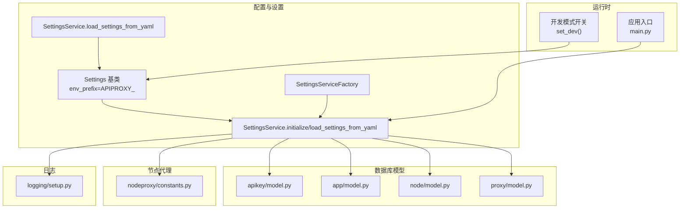
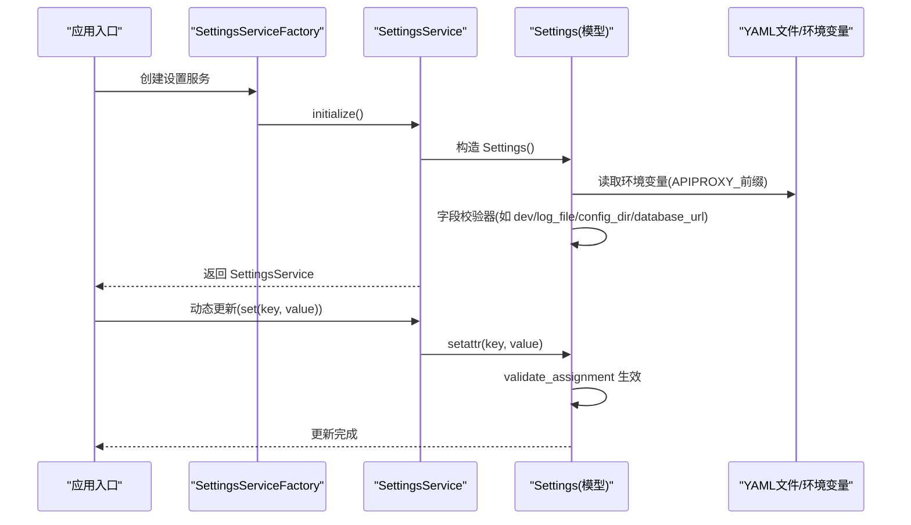
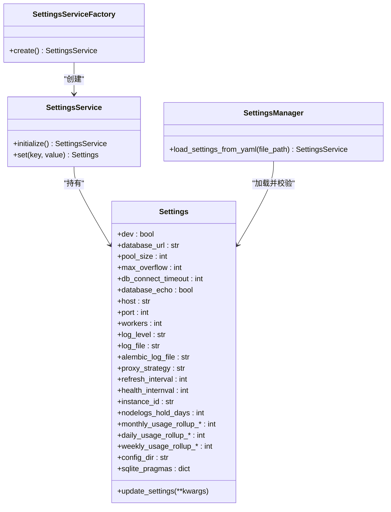

# 配置管理

<cite>
**本文引用的文件**
- [src/apiproxy/openaiproxy/settings.py](file://src/apiproxy/openaiproxy/settings.py)
- [src/apiproxy/openaiproxy/services/settings/base.py](file://src/apiproxy/openaiproxy/services/settings/base.py)
- [src/apiproxy/openaiproxy/services/settings/factory.py](file://src/apiproxy/openaiproxy/services/settings/factory.py)
- [src/apiproxy/openaiproxy/services/settings/manager.py](file://src/apiproxy/openaiproxy/services/settings/manager.py)
- [src/apiproxy/openaiproxy/services/settings/service.py](file://src/apiproxy/openaiproxy/services/settings/service.py)
- [src/apiproxy/openaiproxy/services/database/models/apikey/model.py](file://src/apiproxy/openaiproxy/services/database/models/apikey/model.py)
- [src/apiproxy/openaiproxy/services/database/models/app/model.py](file://src/apiproxy/openaiproxy/services/database/models/app/model.py)
- [src/apiproxy/openaiproxy/services/database/models/node/model.py](file://src/apiproxy/openaiproxy/services/database/models/node/model.py)
- [src/apiproxy/openaiproxy/services/database/models/proxy/model.py](file://src/apiproxy/openaiproxy/services/database/models/proxy/model.py)
- [src/apiproxy/openaiproxy/services/nodeproxy/constants.py](file://src/apiproxy/openaiproxy/services/nodeproxy/constants.py)
- [src/apiproxy/openaiproxy/logging/setup.py](file://src/apiproxy/openaiproxy/logging/setup.py)
- [src/apiproxy/openaiproxy/utils/version.py](file://src/apiproxy/openaiproxy/utils/version.py)
- [src/apiproxy/openaiproxy/main.py](file://src/apiproxy/openaiproxy/main.py)
</cite>

## 目录
1. [简介](#简介)
2. [项目结构](#项目结构)
3. [核心组件](#核心组件)
4. [架构总览](#架构总览)
5. [详细组件分析](#详细组件分析)
6. [依赖分析](#依赖分析)
7. [性能考虑](#性能考虑)
8. [故障排查指南](#故障排查指南)
9. [结论](#结论)
10. [附录](#附录)

## 简介
本文件面向大模型接口代理的配置管理系统，系统基于 Python 的 pydantic-settings 实现配置模型与加载机制，支持环境变量、YAML 文件与运行时动态更新。配置覆盖数据库连接、API 密钥与配额、节点与代理策略、日志与监控、定时任务与实例标识等关键领域。本文将系统性阐述配置项、默认值、优先级、动态更新机制、安全最佳实践、部署示例、验证与错误处理、以及变更影响与回滚策略。

## 项目结构
配置相关模块主要分布在以下位置：
- 运行时配置模型与加载：openaiproxy/services/settings/*
- 开发模式开关：openaiproxy/settings.py
- 数据库模型（含密钥、应用、节点、代理）：openaiproxy/services/database/models/*
- 节点代理常量：openaiproxy/services/nodeproxy/constants.py
- 日志初始化：openaiproxy/logging/setup.py
- 版本信息：openaiproxy/utils/version.py
- 应用入口：openaiproxy/main.py

图表来源
- [src/apiproxy/openaiproxy/services/settings/base.py:79-292](file://src/apiproxy/openaiproxy/services/settings/base.py#L79-L292)
- [src/apiproxy/openaiproxy/services/settings/service.py:40-53](file://src/apiproxy/openaiproxy/services/settings/service.py#L40-L53)
- [src/apiproxy/openaiproxy/services/settings/manager.py:45-71](file://src/apiproxy/openaiproxy/services/settings/manager.py#L45-L71)
- [src/apiproxy/openaiproxy/services/settings/factory.py:31-46](file://src/apiproxy/openaiproxy/services/settings/factory.py#L31-L46)
- [src/apiproxy/openaiproxy/settings.py:27-37](file://src/apiproxy/openaiproxy/settings.py#L27-L37)
- [src/apiproxy/openaiproxy/services/database/models/apikey/model.py](file://src/apiproxy/openaiproxy/services/database/models/apikey/model.py)
- [src/apiproxy/openaiproxy/services/database/models/app/model.py](file://src/apiproxy/openaiproxy/services/database/models/app/model.py)
- [src/apiproxy/openaiproxy/services/database/models/node/model.py](file://src/apiproxy/openaiproxy/services/database/models/node/model.py)
- [src/apiproxy/openaiproxy/services/database/models/proxy/model.py](file://src/apiproxy/openaiproxy/services/database/models/proxy/model.py)
- [src/apiproxy/openaiproxy/services/nodeproxy/constants.py](file://src/apiproxy/openaiproxy/services/nodeproxy/constants.py)
- [src/apiproxy/openaiproxy/logging/setup.py](file://src/apiproxy/openaiproxy/logging/setup.py)
- [src/apiproxy/openaiproxy/main.py](file://src/apiproxy/openaiproxy/main.py)

章节来源
- [src/apiproxy/openaiproxy/services/settings/base.py:79-292](file://src/apiproxy/openaiproxy/services/settings/base.py#L79-L292)
- [src/apiproxy/openaiproxy/services/settings/service.py:40-53](file://src/apiproxy/openaiproxy/services/settings/service.py#L40-L53)
- [src/apiproxy/openaiproxy/services/settings/manager.py:45-71](file://src/apiproxy/openaiproxy/services/settings/manager.py#L45-L71)
- [src/apiproxy/openaiproxy/services/settings/factory.py:31-46](file://src/apiproxy/openaiproxy/services/settings/factory.py#L31-L46)
- [src/apiproxy/openaiproxy/settings.py:27-37](file://src/apiproxy/openaiproxy/settings.py#L27-L37)

## 核心组件
- 配置模型 Settings：集中定义所有可配置项及其默认值、校验器与来源定制。
- 设置服务 SettingsService：负责初始化与从 YAML 加载配置。
- 设置工厂 SettingsServiceFactory：单例工厂，确保全局唯一设置实例。
- 设置管理器 SettingsService.load_settings_from_yaml：从 YAML 文件加载并校验键名。
- 开发模式开关：通过字段校验器联动全局开发模式标记。
- 数据库模型：承载 API 密钥、应用、节点、代理等实体，受配置驱动。

章节来源
- [src/apiproxy/openaiproxy/services/settings/base.py:79-292](file://src/apiproxy/openaiproxy/services/settings/base.py#L79-L292)
- [src/apiproxy/openaiproxy/services/settings/service.py:33-53](file://src/apiproxy/openaiproxy/services/settings/service.py#L33-L53)
- [src/apiproxy/openaiproxy/services/settings/manager.py:38-71](file://src/apiproxy/openaiproxy/services/settings/manager.py#L38-L71)
- [src/apiproxy/openaiproxy/services/settings/factory.py:31-46](file://src/apiproxy/openaiproxy/services/settings/factory.py#L31-L46)
- [src/apiproxy/openaiproxy/settings.py:27-37](file://src/apiproxy/openaiproxy/settings.py#L27-L37)

## 架构总览
配置加载与更新的关键流程如下：

图表来源
- [src/apiproxy/openaiproxy/services/settings/factory.py:42-46](file://src/apiproxy/openaiproxy/services/settings/factory.py#L42-L46)
- [src/apiproxy/openaiproxy/services/settings/service.py:40-53](file://src/apiproxy/openaiproxy/services/settings/service.py#L40-L53)
- [src/apiproxy/openaiproxy/services/settings/base.py:255-292](file://src/apiproxy/openaiproxy/services/settings/base.py#L255-L292)

## 详细组件分析

### 配置模型 Settings（核心）
- 环境变量前缀：APIPROXY_，自动映射到字段。
- 关键配置项与默认值（节选）：
  - dev: bool，默认 False；通过字段校验器联动全局开发模式。
  - database_url: str，默认由校验器解析；若未提供则根据 config_dir 与版本信息选择 SQLite 路径。
  - pool_size: int，默认 10；max_overflow: int，默认 20；db_connect_timeout: int，默认 20；database_echo: bool，默认 False。
  - host: str，默认 127.0.0.1；port: int，默认 11434；workers: int，默认 1。
  - log_level: str，默认 "critical"；log_file: str，默认 "logs/apiproxy.log"；alembic_log_file: str，默认 "alembic/alembic.log"。
  - proxy_strategy: str，默认 "min_expected_latency"，支持 min_expected_latency、random_choice、round_robin。
  - refresh_interval: int，默认 10 秒；health_internval: int，默认 30 秒。
  - instance_id: str，默认随机 UUID。
  - nodelogs_hold_days: int，默认 90 天。
  - monthly/daily/weekly_usage_rollup_*：用量汇总任务执行时间。
  - config_dir: str，默认由校验器生成用户缓存目录并确保存在。
  - sqlite_pragmas: dict，默认 {"synchronous": "NORMAL", "journal_mode": "WAL"}。
- 自定义来源：
  - MyCustomSource：支持逗号分隔字符串转为列表。
- 动态更新：
  - update_settings：对列表字段追加元素，非列表直接赋值；记录调试日志但避免泄露敏感值。
- 校验与来源定制：
  - validate_assignment=True；extra="ignore"；自定义 settings_customise_sources 使用 MyCustomSource。

章节来源
- [src/apiproxy/openaiproxy/services/settings/base.py:79-292](file://src/apiproxy/openaiproxy/services/settings/base.py#L79-L292)

### 设置服务 SettingsService
- initialize：构造 Settings 并校验 config_dir 必填。
- set：在运行时设置任意键值（受模型校验约束）。

章节来源
- [src/apiproxy/openaiproxy/services/settings/service.py:40-53](file://src/apiproxy/openaiproxy/services/settings/service.py#L40-L53)

### 设置工厂 SettingsServiceFactory
- 单例工厂，确保全局仅有一个 SettingsService 实例。

章节来源
- [src/apiproxy/openaiproxy/services/settings/factory.py:31-46](file://src/apiproxy/openaiproxy/services/settings/factory.py#L31-L46)

### YAML 加载与校验 SettingsService.load_settings_from_yaml
- 支持相对路径或文件名；自动转为大写键名后与 Settings.model_fields 对比。
- 若发现未知键，抛出 KeyError。
- 校验 config_dir 必填。

章节来源
- [src/apiproxy/openaiproxy/services/settings/manager.py:45-71](file://src/apiproxy/openaiproxy/services/settings/manager.py#L45-L71)

### 开发模式开关
- dev 字段校验器调用全局 set_dev(value)，实现与运行时开发模式的联动。

章节来源
- [src/apiproxy/openaiproxy/services/settings/base.py:151-157](file://src/apiproxy/openaiproxy/services/settings/base.py#L151-L157)
- [src/apiproxy/openaiproxy/settings.py:35-37](file://src/apiproxy/openaiproxy/settings.py#L35-L37)

### 数据库模型与配置的关系
- API 密钥、应用、节点、代理模型受配置驱动（如数据库连接、配额策略、节点健康检查等），具体字段与业务逻辑在各模型文件中定义。

章节来源
- [src/apiproxy/openaiproxy/services/database/models/apikey/model.py](file://src/apiproxy/openaiproxy/services/database/models/apikey/model.py)
- [src/apiproxy/openaiproxy/services/database/models/app/model.py](file://src/apiproxy/openaiproxy/services/database/models/app/model.py)
- [src/apiproxy/openaiproxy/services/database/models/node/model.py](file://src/apiproxy/openaiproxy/services/database/models/node/model.py)
- [src/apiproxy/openaiproxy/services/database/models/proxy/model.py](file://src/apiproxy/openaiproxy/services/database/models/proxy/model.py)

### 节点代理常量
- 定义节点代理相关常量，与代理策略、负载均衡等配置协同。

章节来源
- [src/apiproxy/openaiproxy/services/nodeproxy/constants.py](file://src/apiproxy/openaiproxy/services/nodeproxy/constants.py)

### 日志初始化
- 提供日志初始化能力，与 log_level、log_file 等配置配合。

章节来源
- [src/apiproxy/openaiproxy/logging/setup.py](file://src/apiproxy/openaiproxy/logging/setup.py)

## 依赖分析
- 配置模型依赖 pydantic-settings 与自定义 EnvSettingsSource 子类，实现 APIPROXY_ 前缀的环境变量映射与列表解析。
- 设置服务依赖配置模型与 YAML 解析，提供运行时 set 接口。
- 工厂与管理器分别承担实例化与文件加载职责，耦合度低、扩展性强。
- 开发模式开关通过字段校验器与全局状态联动，保证一致性。

图表来源
- [src/apiproxy/openaiproxy/services/settings/base.py:79-292](file://src/apiproxy/openaiproxy/services/settings/base.py#L79-L292)
- [src/apiproxy/openaiproxy/services/settings/service.py:33-53](file://src/apiproxy/openaiproxy/services/settings/service.py#L33-L53)
- [src/apiproxy/openaiproxy/services/settings/manager.py:38-71](file://src/apiproxy/openaiproxy/services/settings/manager.py#L38-L71)
- [src/apiproxy/openaiproxy/services/settings/factory.py:31-46](file://src/apiproxy/openaiproxy/services/settings/factory.py#L31-L46)

## 性能考虑
- 数据库连接池：pool_size 与 max_overflow 控制并发连接上限，建议结合请求峰值与后端资源评估。
- 连接超时：db_connect_timeout 影响数据库连接建立与锁等待的容忍度，需平衡稳定性与响应时间。
- 日志级别与文件：log_level 与 log_file 决定 IO 压力，生产环境建议提升到更合适的级别并启用轮转。
- 代理策略：proxy_strategy 在高并发下影响节点负载分布与延迟表现，建议按场景选择 min_expected_latency 或 round_robin。
- 刷新与健康检查：refresh_interval 与 health_internval 控制配置热更新与节点健康探测频率，应避免过短导致额外开销。

## 故障排查指南
- 环境变量未生效：
  - 确认使用 APIPROXY_ 前缀；列表型字段使用逗号分隔字符串。
- database_url 未设置：
  - 若未提供且未设置 APIPROXY_DATABASE_URL，则会尝试在 config_dir 或服务目录下定位/迁移 SQLite 文件；若 config_dir 未设置将报错。
- YAML 键名错误：
  - load_settings_from_yaml 会对未知键抛出 KeyError；请核对 Settings.model_fields。
- 运行时更新失败：
  - update_settings 仅对已存在的字段生效；列表字段会尝试 JSON 解析并去重追加；非列表直接赋值。
- 开发模式不生效：
  - dev 字段校验器会调用 set_dev(value)，请确认字段值正确传递。

章节来源
- [src/apiproxy/openaiproxy/services/settings/base.py:190-253](file://src/apiproxy/openaiproxy/services/settings/base.py#L190-L253)
- [src/apiproxy/openaiproxy/services/settings/manager.py:59-62](file://src/apiproxy/openaiproxy/services/settings/manager.py#L59-L62)
- [src/apiproxy/openaiproxy/services/settings/base.py:257-278](file://src/apiproxy/openaiproxy/services/settings/base.py#L257-L278)
- [src/apiproxy/openaiproxy/services/settings/base.py:151-157](file://src/apiproxy/openaiproxy/services/settings/base.py#L151-L157)

## 结论
本配置体系以 pydantic-settings 为核心，结合自定义环境源与 YAML 加载，实现了灵活、可验证、可动态更新的配置管理。通过明确的优先级（环境变量 > YAML > 默认值）、严格的字段校验与来源定制，确保了在不同部署环境下的稳定运行。建议在生产环境中严格遵循安全最佳实践，并结合性能指标持续优化连接池与日志策略。

## 附录

### 配置项清单与默认值
- 基础运行
  - dev: bool，默认 False
  - host: str，默认 127.0.0.1
  - port: int，默认 11434
  - workers: int，默认 1
  - log_level: str，默认 "critical"
  - log_file: str，默认 "logs/apiproxy.log"
  - alembic_log_file: str，默认 "alembic/alembic.log"
- 数据库
  - database_url: str，默认由校验器解析；若未提供则使用 SQLite
  - pool_size: int，默认 10
  - max_overflow: int，默认 20
  - db_connect_timeout: int，默认 20
  - database_echo: bool，默认 False
  - sqlite_pragmas: dict，默认 {"synchronous": "NORMAL", "journal_mode": "WAL"}
- 代理与负载均衡
  - proxy_strategy: str，默认 "min_expected_latency"
  - refresh_interval: int，默认 10 秒
  - health_internval: int，默认 30 秒
- 实例与日志保留
  - instance_id: str，默认随机 UUID
  - nodelogs_hold_days: int，默认 90 天
- 定时任务
  - monthly_usage_rollup_hour/minute: int，默认 0/10
  - daily_usage_rollup_hour/minute: int，默认 1/5
  - weekly_usage_rollup_hour/minute: int，默认 1/15
- 目录与缓存
  - config_dir: str，默认由校验器生成用户缓存目录并确保存在

章节来源
- [src/apiproxy/openaiproxy/services/settings/base.py:86-149](file://src/apiproxy/openaiproxy/services/settings/base.py#L86-L149)
- [src/apiproxy/openaiproxy/services/settings/base.py:166-188](file://src/apiproxy/openaiproxy/services/settings/base.py#L166-L188)

### 配置优先级与来源
- 来源顺序（自定义源定制）：APIPROXY_ 环境变量（带前缀） > YAML 文件（键名大写映射） > 默认值
- 列表字段：支持逗号分隔字符串自动解析为列表
- 额外键忽略：extra="ignore"，未知键不会导致加载失败但 YAML 加载阶段会校验

章节来源
- [src/apiproxy/openaiproxy/services/settings/base.py:255-292](file://src/apiproxy/openaiproxy/services/settings/base.py#L255-L292)

### 动态更新机制与限制
- 运行时更新：通过 SettingsService.set 或 Settings.update_settings
- 限制：
  - 仅对已存在字段生效
  - 列表字段会尝试 JSON 解析并去重追加
  - 非列表直接赋值
  - 不记录敏感值的日志

章节来源
- [src/apiproxy/openaiproxy/services/settings/service.py:50-52](file://src/apiproxy/openaiproxy/services/settings/service.py#L50-L52)
- [src/apiproxy/openaiproxy/services/settings/base.py:257-278](file://src/apiproxy/openaiproxy/services/settings/base.py#L257-L278)

### 安全配置最佳实践
- 敏感信息保护
  - 避免在日志中输出敏感值；更新时不会记录敏感字段
  - 将 API 密钥与数据库密码置于环境变量中，使用 APIPROXY_ 前缀
- 访问控制
  - 限制 YAML 配置文件权限，仅允许运行用户读取
  - 通过只读挂载与最小权限原则管理配置目录
- 网络与代理
  - 代理策略选择与健康检查间隔应结合网络质量与节点数量进行调优
  - 仅在可信网络内暴露管理端口

章节来源
- [src/apiproxy/openaiproxy/services/settings/base.py:257-278](file://src/apiproxy/openaiproxy/services/settings/base.py#L257-L278)

### 部署环境示例
- 开发环境
  - dev: true
  - log_level: "debug"
  - database_url: 可使用 SQLite（由校验器解析）
  - workers: 1
- 测试环境
  - dev: false
  - log_level: "info"
  - database_url: 连接测试数据库
  - workers: 1~2
- 生产环境
  - dev: false
  - log_level: "warning"
  - database_url: 连接生产数据库（建议使用外部托管）
  - workers: 根据 CPU 与负载评估
  - proxy_strategy: "min_expected_latency" 或 "round_robin"
  - refresh_interval/health_internval: 依据 SLA 调整

章节来源
- [src/apiproxy/openaiproxy/services/settings/base.py:86-149](file://src/apiproxy/openaiproxy/services/settings/base.py#L86-L149)

### 配置验证与错误处理
- 字段校验器
  - dev：联动全局开发模式
  - log_file/config_dir：标准化路径与目录创建
  - database_url：解析环境变量与默认 SQLite 路径，必要时报错
- YAML 加载
  - 键名校验：未知键抛出 KeyError
  - config_dir 必填：否则抛出 ValueError
- 动态更新
  - validate_assignment 生效，非法值将触发校验异常

章节来源
- [src/apiproxy/openaiproxy/services/settings/base.py:151-157](file://src/apiproxy/openaiproxy/services/settings/base.py#L151-L157)
- [src/apiproxy/openaiproxy/services/settings/base.py:190-253](file://src/apiproxy/openaiproxy/services/settings/base.py#L190-L253)
- [src/apiproxy/openaiproxy/services/settings/manager.py:59-68](file://src/apiproxy/openaiproxy/services/settings/manager.py#L59-L68)
- [src/apiproxy/openaiproxy/services/settings/base.py:255-256](file://src/apiproxy/openaiproxy/services/settings/base.py#L255-L256)

### 配置变更的影响分析与回滚策略
- 影响分析
  - 数据库连接：pool_size/max_overflow/db_connect_timeout 变更直接影响连接池行为与并发能力
  - 日志：log_level/log_file 变更影响 IO 与磁盘占用
  - 代理策略：proxy_strategy 变更影响节点负载与延迟
  - 定时任务：rollup 时间配置变更影响用量统计准确性与时序
- 回滚策略
  - 采用版本化的 YAML 配置文件，变更前保留备份
  - 通过运行时 set 接口逐项回退，避免一次性大规模变更
  - 在测试环境先行验证，再逐步推广到预生产与生产

[本节为通用指导，无需特定文件引用]