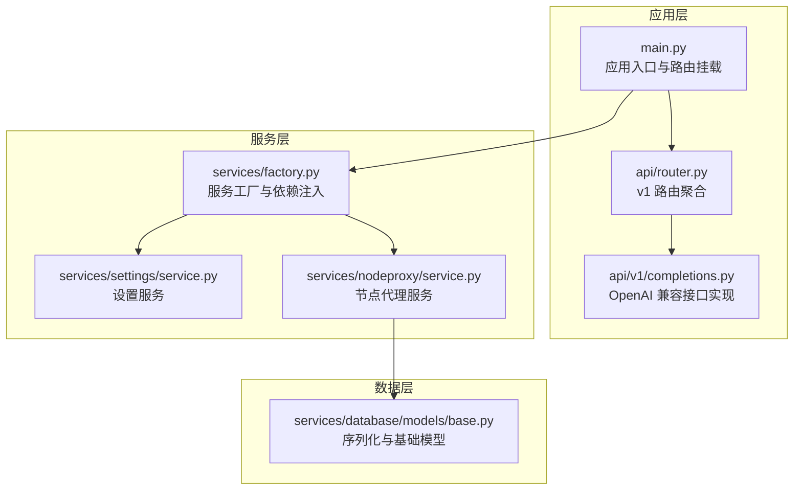
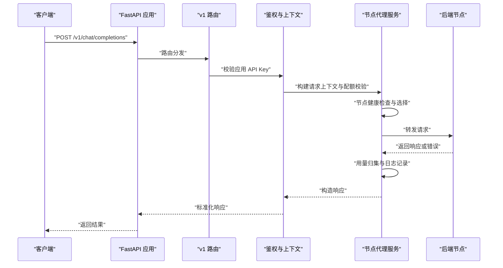
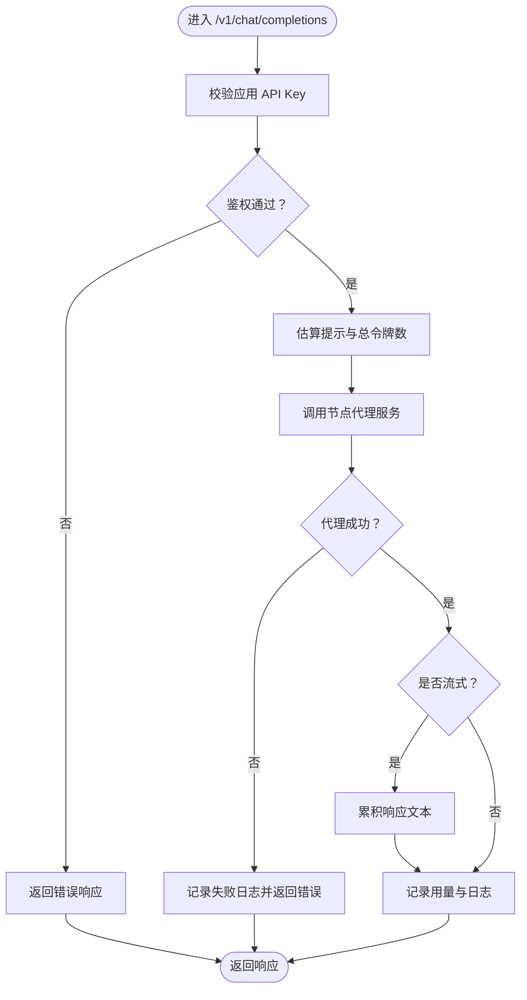
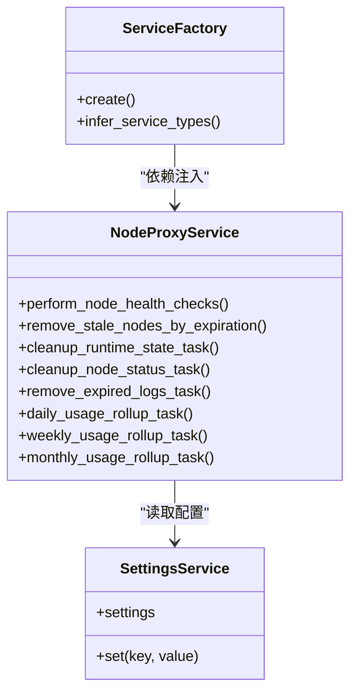
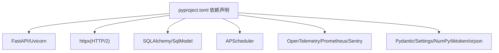

# 项目概述

<cite>
**本文引用的文件**
- [src/apiproxy/openaiproxy/main.py](file://src/apiproxy/openaiproxy/main.py)
- [src/apiproxy/openaiproxy/api/router.py](file://src/apiproxy/openaiproxy/api/router.py)
- [src/apiproxy/openaiproxy/api/v1/completions.py](file://src/apiproxy/openaiproxy/api/v1/completions.py)
- [src/apiproxy/openaiproxy/services/nodeproxy/service.py](file://src/apiproxy/openaiproxy/services/nodeproxy/service.py)
- [src/apiproxy/openaiproxy/services/factory.py](file://src/apiproxy/openaiproxy/services/factory.py)
- [src/apiproxy/openaiproxy/services/settings/service.py](file://src/apiproxy/openaiproxy/services/settings/service.py)
- [src/apiproxy/openaiproxy/services/database/models/base.py](file://src/apiproxy/openaiproxy/services/database/models/base.py)
- [src/apiproxy/openaiproxy/constants.py](file://src/apiproxy/openaiproxy/constants.py)
- [src/apiproxy/pyproject.toml](file://src/apiproxy/pyproject.toml)
- [docs/api.md](file://docs/api.md)
</cite>

## 目录
1. [引言](#引言)
2. [项目结构](#项目结构)
3. [核心组件](#核心组件)
4. [架构总览](#架构总览)
5. [详细组件分析](#详细组件分析)
6. [依赖分析](#依赖分析)
7. [性能考虑](#性能考虑)
8. [故障排查指南](#故障排查指南)
9. [结论](#结论)
10. [附录](#附录)

## 引言
本项目是一个面向大模型服务的接口代理系统，旨在为上层应用提供统一、可扩展、可观测、可治理的 OpenAI 兼容接口能力。项目通过 FastAPI 构建高性能 Web 服务，结合多节点负载均衡、配额管理、请求日志与用量统计、健康检查与文档化接口等能力，帮助企业在复杂的大模型生态中实现安全、可控、高可用的服务代理。

项目定位与价值：
- 统一入口：以 OpenAI 兼容接口对外暴露，降低迁移成本与集成复杂度。
- 多节点代理：支持多后端节点接入与动态调度，提升吞吐与可用性。
- 配额与计费：提供应用级、API Key 级、节点模型级三层配额控制与用量汇总。
- 运维可观测：内置健康检查、请求日志、用量统计、定时任务等运维能力。
- 易部署：支持容器化与本地开发，提供脚手架与启动脚本。

## 项目结构
项目采用模块化分层组织，核心目录与职责如下：
- openaiproxy：主应用包，包含入口、路由、API 实现、服务层、数据库模型与工具。
- services：服务层抽象与工厂，负责服务生命周期、依赖注入与类型推断。
- api：API 层，按版本划分路由，封装鉴权、请求处理与响应。
- services/database：数据库模型与 CRUD，支撑配额、节点、应用、代理状态等数据。
- services/nodeproxy：节点代理核心逻辑，负责负载均衡、配额校验、用量归集与错误处理。
- utils：通用工具，如异步并发、编码、版本、viagateway 等。
- html：前端静态页面（仪表盘与首页），可选挂载到后端。
- tests：单元测试与数据库相关测试。
- docs：接口文档与模式说明。
- scripts：初始化数据库与启动脚本。

图表来源
- [src/apiproxy/openaiproxy/main.py:128-187](file://src/apiproxy/openaiproxy/main.py#L128-L187)
- [src/apiproxy/openaiproxy/api/router.py:37-45](file://src/apiproxy/openaiproxy/api/router.py#L37-L45)
- [src/apiproxy/openaiproxy/api/v1/completions.py:35-55](file://src/apiproxy/openaiproxy/api/v1/completions.py#L35-L55)
- [src/apiproxy/openaiproxy/services/factory.py:40-86](file://src/apiproxy/openaiproxy/services/factory.py#L40-L86)
- [src/apiproxy/openaiproxy/services/settings/service.py:33-53](file://src/apiproxy/openaiproxy/services/settings/service.py#L33-L53)
- [src/apiproxy/openaiproxy/services/nodeproxy/service.py:1-120](file://src/apiproxy/openaiproxy/services/nodeproxy/service.py#L1-L120)
- [src/apiproxy/openaiproxy/services/database/models/base.py:29-45](file://src/apiproxy/openaiproxy/services/database/models/base.py#L29-L45)

章节来源
- [src/apiproxy/openaiproxy/main.py:128-187](file://src/apiproxy/openaiproxy/main.py#L128-L187)
- [src/apiproxy/openaiproxy/api/router.py:37-45](file://src/apiproxy/openaiproxy/api/router.py#L37-L45)
- [src/apiproxy/openaiproxy/services/factory.py:40-86](file://src/apiproxy/openaiproxy/services/factory.py#L40-L86)

## 核心组件
- 应用入口与生命周期
  - 应用通过 FastAPI 构建，启用 CORS，挂载多套路由（v1、节点管理、配额、日志、健康检查、自定义文档）。
  - 生命周期内初始化服务、注册定时任务（运行时状态清理、节点状态清理、用量汇总）、优雅关闭与资源回收。
- 路由与鉴权
  - v1 路由聚合 Chat Completions、Completions、Embeddings、Rerank、Models 等接口。
  - 鉴权策略：管理接口使用管理密钥；OpenAI 兼容接口使用应用 API Key。
- 节点代理服务
  - 负责节点健康检查、节点选择与转发、配额预留与结算、用量归集、错误映射与响应。
  - 支持流式与非流式响应，具备令牌估算、错误码与回退策略。
- 服务工厂与依赖注入
  - 基于类型提示自动推断依赖，集中导入与缓存服务类，确保服务实例化一致性。
- 设置服务
  - 提供配置读取与动态设置能力，作为全局配置中心。
- 数据模型与序列化
  - 使用 orjson 进行高性能序列化，统一输出格式与异常处理。

章节来源
- [src/apiproxy/openaiproxy/main.py:147-187](file://src/apiproxy/openaiproxy/main.py#L147-L187)
- [src/apiproxy/openaiproxy/api/router.py:37-45](file://src/apiproxy/openaiproxy/api/router.py#L37-L45)
- [src/apiproxy/openaiproxy/api/v1/completions.py:35-55](file://src/apiproxy/openaiproxy/api/v1/completions.py#L35-L55)
- [src/apiproxy/openaiproxy/services/nodeproxy/service.py:1-120](file://src/apiproxy/openaiproxy/services/nodeproxy/service.py#L1-L120)
- [src/apiproxy/openaiproxy/services/factory.py:40-86](file://src/apiproxy/openaiproxy/services/factory.py#L40-L86)
- [src/apiproxy/openaiproxy/services/settings/service.py:33-53](file://src/apiproxy/openaiproxy/services/settings/service.py#L33-L53)
- [src/apiproxy/openaiproxy/services/database/models/base.py:29-45](file://src/apiproxy/openaiproxy/services/database/models/base.py#L29-L45)

## 架构总览
下图展示了从客户端请求到后端节点的完整链路，以及配额与用量统计的关键环节。

图表来源
- [src/apiproxy/openaiproxy/main.py:166-182](file://src/apiproxy/openaiproxy/main.py#L166-L182)
- [src/apiproxy/openaiproxy/api/router.py:37-45](file://src/apiproxy/openaiproxy/api/router.py#L37-L45)
- [src/apiproxy/openaiproxy/api/v1/completions.py:35-55](file://src/apiproxy/openaiproxy/api/v1/completions.py#L35-L55)
- [src/apiproxy/openaiproxy/services/nodeproxy/service.py:1-120](file://src/apiproxy/openaiproxy/services/nodeproxy/service.py#L1-L120)

## 详细组件分析

### 组件A：OpenAI 兼容接口（Chat Completions）
- 功能要点
  - 支持流式与非流式响应，内置令牌估算与内容规范化。
  - 鉴权通过应用 API Key 校验，失败时返回标准错误响应。
  - 将请求交由节点代理服务处理，完成后进行用量统计与日志记录。
- 关键流程
  - 参数校验与令牌估算。
  - 调用节点代理服务执行转发与配额处理。
  - 流式场景下累积响应文本用于最终统计。

图表来源
- [src/apiproxy/openaiproxy/api/v1/completions.py:35-55](file://src/apiproxy/openaiproxy/api/v1/completions.py#L35-L55)
- [src/apiproxy/openaiproxy/api/v1/completions.py:126-200](file://src/apiproxy/openaiproxy/api/v1/completions.py#L126-L200)
- [src/apiproxy/openaiproxy/services/nodeproxy/service.py:1-120](file://src/apiproxy/openaiproxy/services/nodeproxy/service.py#L1-L120)

章节来源
- [src/apiproxy/openaiproxy/api/v1/completions.py:35-55](file://src/apiproxy/openaiproxy/api/v1/completions.py#L35-L55)
- [src/apiproxy/openaiproxy/api/v1/completions.py:126-200](file://src/apiproxy/openaiproxy/api/v1/completions.py#L126-L200)

### 组件B：节点代理服务（NodeProxyService）
- 角色与职责
  - 节点健康检查与剔除过期节点。
  - 节点选择与转发，支持超时与错误码映射。
  - 配额预留与结算（应用级、API Key 级、节点模型级）。
  - 用量按日/周/月汇总与历史清理。
- 设计要点
  - 使用线程与后台任务协调健康检查与清理。
  - 通过数据模型与 CRUD 完成状态与用量持久化。
  - 错误处理统一返回 JSONResponse，便于前端与 SDK 解析。

图表来源
- [src/apiproxy/openaiproxy/services/nodeproxy/service.py:1-120](file://src/apiproxy/openaiproxy/services/nodeproxy/service.py#L1-L120)
- [src/apiproxy/openaiproxy/services/settings/service.py:33-53](file://src/apiproxy/openaiproxy/services/settings/service.py#L33-L53)
- [src/apiproxy/openaiproxy/services/factory.py:40-86](file://src/apiproxy/openaiproxy/services/factory.py#L40-L86)

章节来源
- [src/apiproxy/openaiproxy/services/nodeproxy/service.py:1-120](file://src/apiproxy/openaiproxy/services/nodeproxy/service.py#L1-L120)
- [src/apiproxy/openaiproxy/services/settings/service.py:33-53](file://src/apiproxy/openaiproxy/services/settings/service.py#L33-L53)
- [src/apiproxy/openaiproxy/services/factory.py:40-86](file://src/apiproxy/openaiproxy/services/factory.py#L40-L86)

### 组件C：服务工厂与依赖注入
- 机制
  - 基于类型提示推断服务依赖，导入所有服务类并缓存，避免重复扫描。
  - 通过工厂方法创建服务实例，保证依赖解析与实例化的一致性。
- 优势
  - 降低耦合，便于扩展新服务。
  - 类型安全与可维护性提升。

章节来源
- [src/apiproxy/openaiproxy/services/factory.py:40-86](file://src/apiproxy/openaiproxy/services/factory.py#L40-L86)

### 组件D：设置服务
- 职责
  - 读取配置目录并加载 Settings，提供动态设置能力。
- 与代理服务协作
  - 代理服务通过设置服务读取定时任务时间、刷新间隔等配置项。

章节来源
- [src/apiproxy/openaiproxy/services/settings/service.py:33-53](file://src/apiproxy/openaiproxy/services/settings/service.py#L33-L53)

### 组件E：数据模型与序列化
- 特性
  - 使用 orjson 进行高性能序列化，支持排序与缩进选项。
  - 统一异常处理，保障输出稳定性。
- 用途
  - 为日志、响应体、用量统计等场景提供一致的数据序列化方案。

章节来源
- [src/apiproxy/openaiproxy/services/database/models/base.py:29-45](file://src/apiproxy/openaiproxy/services/database/models/base.py#L29-L45)

## 依赖分析
- 外部依赖
  - Web 框架与服务器：FastAPI、Uvicorn。
  - HTTP 客户端：httpx（支持 HTTP/2）。
  - 数据库与 ORM：SQLAlchemy、SqlModel。
  - 异步与并发：APScheduler、asyncio、cachetools。
  - 监控与可观测：OpenTelemetry、Prometheus、Sentry。
  - 工具库：Pydantic、Pydantic Settings、NumPy、tiktoken、orjson、rich、bcrypt、shortuuid、requests、fire。
- 内部模块耦合
  - API 层依赖服务层与数据库模型。
  - 服务层通过工厂与设置服务解耦。
  - 节点代理服务贯穿配额、日志与用量统计。

图表来源
- [src/apiproxy/pyproject.toml:20-56](file://src/apiproxy/pyproject.toml#L20-L56)

章节来源
- [src/apiproxy/pyproject.toml:20-56](file://src/apiproxy/pyproject.toml#L20-L56)

## 性能考虑
- 响应序列化
  - 使用 orjson 替代标准库，减少序列化开销，提高吞吐。
- 并发与调度
  - 使用 APScheduler 执行周期性任务，避免阻塞主请求路径。
- 缓存与类型推断
  - 服务工厂对类型推断与服务导入结果进行缓存，降低重复扫描成本。
- 令牌估算
  - 在流式场景下累积响应文本，结合 tiktoken 或启发式估算，提升用量统计准确性。
- 日志与监控
  - 结合 OpenTelemetry 与 Prometheus，对关键指标进行采集与可视化。

## 故障排查指南
- 常见问题
  - 鉴权失败：确认管理密钥与应用 API Key 是否正确配置，检查接口文档中的鉴权说明。
  - 节点不可用：查看节点健康检查与状态日志，确认节点 URL 与模型信息是否正确。
  - 配额不足：检查应用级、API Key 级、节点模型级配额使用情况与限额。
  - 定时任务未执行：确认设置服务中的刷新间隔与汇总时间配置。
- 排查步骤
  - 查看健康检查接口与自定义文档接口，确认服务可用性与接口清单。
  - 通过请求日志接口筛选过滤条件，定位具体错误与耗时。
  - 检查用量统计接口，核对日/周/月维度的用量趋势。

章节来源
- [docs/api.md:3-112](file://docs/api.md#L3-L112)
- [src/apiproxy/openaiproxy/constants.py:4-6](file://src/apiproxy/openaiproxy/constants.py#L4-L6)

## 结论
本项目以 FastAPI 为基础，构建了面向大模型服务的统一代理层，具备多节点负载均衡、配额管理、用量统计与健康检查等核心能力。通过清晰的模块划分与服务化设计，项目在易用性、可扩展性与可观测性方面形成闭环，适合在企业级 AI 服务场景中落地与演进。

## 附录
- 使用场景与价值主张
  - 企业内部统一接入多家大模型供应商，屏蔽差异，统一计费与审计。
  - 为多租户应用提供细粒度配额控制与用量报表，支撑成本核算。
  - 通过健康检查与自动清理机制，保障服务长期稳定运行。
- 快速上手建议
  - 部署后先访问健康检查与文档接口，确认服务可用。
  - 创建应用与 API Key，配置节点与模型信息，开启配额与用量统计。
  - 结合监控与日志，持续优化节点选择策略与配额阈值。